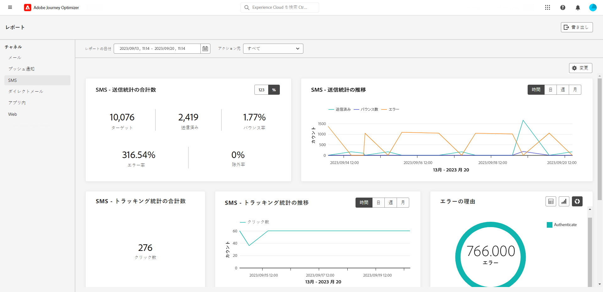
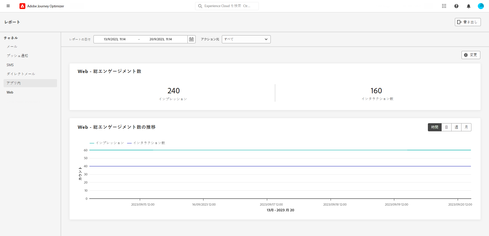
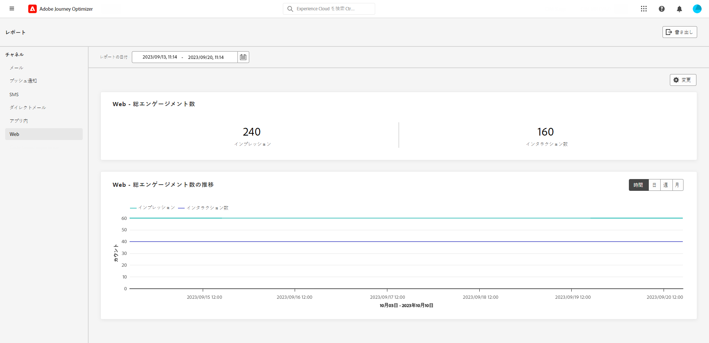
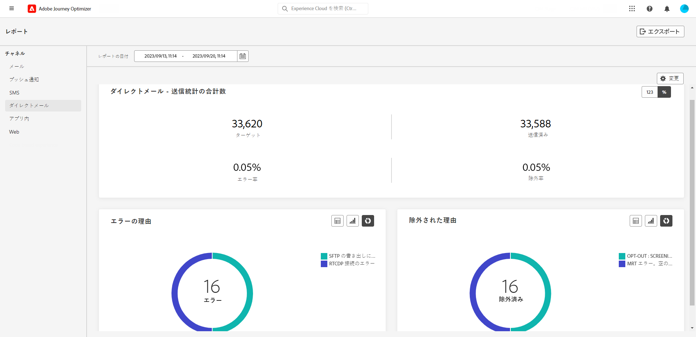

# チャネルレポート {#channel-report}

>[!CONTEXTUALHELP]
>id="ajo_channel_level_report"
>title="チャネルレベルのレポート"
>abstract="チャネルレポートでは、すべてのチャネルにわたるトラフィックとエンゲージメント指標の包括的な概要を提供します。 レポートは、キャンペーンとジャーニーの成功とエラーを示す様々なウィジェットに分かれています。 各レポートダッシュボードは、ウィジェットのサイズ変更や削除を行うことで変更できます。"

>[!IMPORTANT]
>
> 次の手順で **レポート** メニューに **[!UICONTROL チャネルレポートを表示]** 権限。 [詳細情報](channel-report-gs.md#before-starting-manage-reports-prereq)

チャネルレポートでは、チャネルレベルで、トラフィックとエンゲージメント指標の包括的な概要を提供します。 指標は集計されて、様々なキャンペーンやジャーニーにわたる、選択したチャネルからのアクションの統合値を示します。

チャネルレポートにアクセスするには、 **レポート** メニュー内 **ジャーニー管理** 」セクションに入力します。 完全にカスタマイズ可能で、レポートの日付やアクションに応じてデータをフィルタリングできます。 [詳細情報](channel-report-gs.md)

次のタブを含むレポートページが表示されます。

* [メール](#email)
* [プッシュ 通知](#push)
* [SMS](#sms)
* [アプリ内](#inapp)
* [Web](#web)
* [ダイレクトメール](#direct-mail)

➡️ [この機能をビデオで確認](#channel-report-video)

## メール {#email}

チャネルレポートの E メールメニューには、キャンペーンおよびジャーニーで送信された E メールに関する主な情報が表示されます。 以下に、指標について詳しく説明します。

+++  電子メールレポートで使用できる様々な指標およびウィジェットの詳細を説明します。

The **[!UICONTROL 電子メールの合計送信統計]** グラフには、電子メールの成功の詳細が記載されています。

* **[!UICONTROL ターゲット]**：処理された電子メールの合計数。

* **[!UICONTROL 送信済み]**：送信の合計数。

* **[!UICONTROL 配信済み]**：送信されたメッセージの合計数に関する、正常に送信された電子メールの数。

* **[!UICONTROL 配信率]**：正常に送信された電子メールの割合。

* **[!UICONTROL バウンス]**：送信されたメッセージの合計数に関する累積エラーと自動返信処理の合計。

* **[!UICONTROL バウンス率]**：送信メールに対するバウンスメールの割合。

* **[!UICONTROL エラー]**：エラーが発生してプロファイルに送信できなかった合計数。

* **[!UICONTROL エラー率]**：送信された E メールと比較して、エラーが発生して送信できなかった割合。

* **[!UICONTROL 除外済み]**：Adobe Journey Optimizer によって除外されたプロファイルの数。

* **[!UICONTROL 除外率]**:Adobe Journey Optimizerによって除外されたプロファイルの割合。

The **[!UICONTROL メール合計トラッキング統計]** ウィジェットには、メールの受信者アクティビティに使用できるデータが含まれます。

* **[!UICONTROL 開封数]**：メッセージが開封された回数。

* **[!UICONTROL 開封率]**：配信されたメール数に対して、開封されたメールの合計数。

* **[!UICONTROL クリック数]**：メッセージ内でコンテンツがクリックされた回数。

* **[!UICONTROL クリック率]**:E メールでやり取りしたユーザーの割合。

* **[!UICONTROL スパムのの苦情数]**：メッセージがスパムまたはジャンクとして宣言された回数。

* **[!UICONTROL スパムの苦情率]**：送信された E メールの数に対する、スパムまたは迷惑メールとして宣言されたメッセージの割合。

* **[!UICONTROL 配信停止]**：購読リンクのクリック数。

* **[!UICONTROL 配信停止率]**：送信済み E メールの数に対する、購読解除の割合。

The **[!UICONTROL 経時的な統計の送信]** グラフには、次のような送信済み E メールで使用できるデータが含まれます。

* **[!UICONTROL 送信済み]**：送信の合計数。

* **[!UICONTROL 配信済み]**：送信された電子メールの合計数に関する、正常に送信された電子メールの数。

* **[!UICONTROL バウンス]**：送信された E メールの合計数に関する累積エラーと自動返信処理の合計。

* **[!UICONTROL エラー]**：エラーが発生してプロファイルに送信できなかった合計数。

The **[!UICONTROL E メールトラッキング統計の残り時間]** グラフには、開封数およびクリック数に使用できるデータが含まれます。

**[!UICONTROL バウンスの理由]**&#x200B;ウィジェットおよび&#x200B;**[!UICONTROL バウンスのカテゴリ]**&#x200B;ウィジェットには、次のようなバウンスメッセージに関するデータが含まれています。

* **[!UICONTROL ハードバウンス]**：永続的なエラー（メールアドレスの間違いなど）の合計数。このエラーは、アドレスが無効であることを明示的に示すエラーメッセージ（例：「不明なユーザー」）を伴います。

* **[!UICONTROL ソフトバウンス数]**：一時的なエラー（インボックスが満杯など）の合計数。

* **[!UICONTROL 無視]**：一時的なエラー（不在など）や技術的なエラー（送信者のタイプが postmaster の場合など）の合計数。

バウンスの詳細については、[抑制リスト](../reports/suppression-list.md)のページを参照してください。

The **[!UICONTROL エラーの理由]** グラフと表を使用して、発生したエラーを確認できます。

この&#x200B;**[!UICONTROL 除外された理由]**&#x200B;グラフおよびテーブルには、ターゲットプロファイルから除外されたユーザープロファイルがメッセージを受信できなかった様々な理由が表示されます。

The **[!UICONTROL ドメイン別のバウンス理由]**, **[!UICONTROL ドメイン別に送信および配信]**, **[!UICONTROL ドメイン別の開封数およびクリック数]**  および **[!UICONTROL ドメイン別のバウンスとエラー]** テーブルとグラフは、E メール配信とトラッキングデータの重要なすべてのドメインレベルの分類を表します。
+++

## プッシュ通知 {#push}

チャネルレポートのプッシュ通知メニューには、キャンペーンおよびジャーニーで送信されるプッシュ通知に関する主な情報の詳細が表示されます。 指標については、以下で詳しく説明します。

+++  プッシュレポートで使用できる様々な指標およびウィジェットの詳細を説明します。

The **[!UICONTROL プッシュ通知 — 合計送信統計]** この表には、プッシュ通知に関する主な情報の詳細がグラフおよび KPI と共に表示されます。

* **[!UICONTROL ターゲット]**：処理されたプッシュ通知の合計数。

* **[!UICONTROL 送信済み]**：送信されたプッシュ通知の合計数。

* **[!UICONTROL 配信済み]**：送信されたプッシュ通知の合計数に関する、正常に送信されたプッシュ通知の数。

* **[!UICONTROL 配信率]**：正常に送信されたプッシュ通知の割合。

* **[!UICONTROL バウンス]**：送信されたメッセージの合計数に関する累積エラーと自動返信処理の合計。

* **[!UICONTROL バウンス率]**：送信済みのプッシュ通知に対する、バウンスしたプッシュ通知の割合。

* **[!UICONTROL エラー]**：エラーが発生してプロファイルに送信できなかった合計数。

* **[!UICONTROL エラー率]**：送信されたプッシュ通知と比較して、送信を妨げていたエラーの割合。

* **[!UICONTROL 除外済み]**：Adobe Journey Optimizer によって除外されたプロファイルの数。

* **[!UICONTROL 除外率]**:Adobe Journey Optimizerによって除外されたプロファイルの割合。

The **[!UICONTROL プッシュ通知 — トラッキング統計の合計]** には、プッシュ通知用の受信者アクティビティに使用できるデータが含まれます。

* **[!UICONTROL 開封数]**：プッシュ通知が開かれた回数。

* **[!UICONTROL 開封率]**：開封されたプッシュ通知の割合。

* **[!UICONTROL アクション]**：配信されたプッシュ通知に対するアクション（ボタンのクリックや解除など）の合計数。

* **[!UICONTROL アクション率]**：送信されたプッシュ通知に対する、配信されたプッシュ通知に対するアクションの割合。

* **[!UICONTROL エンゲージメント率]**：このプッシュ通知の開封とアクションの割合（プロファイルによるプッシュの開封や、ボタンのクリックなど）。

The **[!UICONTROL プッシュ通知 — 時間の経過に伴う統計の送信]** グラフには、次のような送信済みのプッシュ通知で使用できるデータが含まれます。

* **[!UICONTROL 送信済み]**：送信されたプッシュ通知の合計数。

* **[!UICONTROL 配信済み]**：送信されたプッシュ通知の合計数に関する、正常に送信されたプッシュ通知の数。

* **[!UICONTROL バウンス]**：送信されたメッセージの合計数に関する累積エラーと自動返信処理の合計。

* **[!UICONTROL エラー]**：エラーが発生してプロファイルに送信できなかった合計数。

この&#x200B;**[!UICONTROL 除外された理由]**&#x200B;グラフおよびテーブルには、ターゲットプロファイルから除外されたユーザープロファイルがメッセージを受信できなかった様々な理由が表示されます。

The **[!UICONTROL エラーの理由]** グラフと表を使用して、発生したエラーを確認できます。

The **[!UICONTROL プラットフォーム別のトラッキング]** および **[!UICONTROL プラットフォームごとの送信]** グラフと表は、受信者の運用システムに応じたプッシュ通知の成功の詳細を示しています。
+++

## SMS {#sms}

チャネルレポートの SMS メニューには、キャンペーンおよびジャーニーで送信された SMS に関する主な情報の詳細が表示されます。 以下に、指標について詳しく説明します。

+++ SMS レポートで使用できる様々な指標およびウィジェットの詳細を説明します。

The **[!UICONTROL SMS — 送信統計の合計]** 表に、SMS の成功の詳細を示します。

* **[!UICONTROL ターゲット]**:SMS チャネルのターゲットプロファイルとして認定されるユーザープロファイルの数。

* **[!UICONTROL 送信済み]**：送信された SMS メッセージの合計数。

* **[!UICONTROL 配信済み]**：送信された SMS メッセージの合計数に対する、正常に送信された SMS メッセージの数。

* **[!UICONTROL 配信率]**：正常に送信された SMS メッセージの割合。

* **[!UICONTROL バウンス]**：送信された SMS メッセージの合計数に関する累積エラーと自動返信処理の合計。

* **[!UICONTROL バウンス率]**：送信された SMS メッセージに対する、バウンスした SMS メッセージの割合。

* **[!UICONTROL エラー]**：エラーが発生してプロファイルに送信できなかった合計数。

* **[!UICONTROL エラー率]**：送信された SMS メッセージと比較して、エラーが発生して送信を妨げていた割合。

* **[!UICONTROL 除外済み]**：ターゲットプロファイルから除外されメッセージを受信しなかったユーザープロファイルの数。

* **[!UICONTROL 除外率]**:Adobe Journey Optimizerによって除外されたプロファイルの割合。

The **[!UICONTROL SMS — トラッキング統計の合計]** widget は、訪問者の URL とのエンゲージメントに関する主な情報の詳細を示します。

* **[!UICONTROL クリック数]**:SMS メッセージでコンテンツがクリックされた回数。

* **[!UICONTROL クリック率]**:SMS メッセージで操作をしたユーザーの割合。

The **[!UICONTROL SMS — 経時的に統計を送信]** widget は、メッセージに関連する主な情報の詳細をグラフで示します。

* **[!UICONTROL 送信済み]**：送信された SMS メッセージの合計数。

* **[!UICONTROL 配信済み]**：送信された SMS メッセージの合計数に対する、正常に送信された SMS メッセージの数。

* **[!UICONTROL バウンス]**：送信された SMS メッセージの合計数に関する累積エラーと自動返信処理の合計。

* **[!UICONTROL エラー]**：エラーが発生してプロファイルに送信できなかった合計数。

The **[!UICONTROL 理由を除外]**, **[!UICONTROL バウンス理由]** および **[!UICONTROL エラーの理由]** グラフと表を使用すると、発生したエラーと除外を確認できます。

+++

## アプリ内 {#in-app}

チャネルレポートのアプリ内メニューには、キャンペーンおよびジャーニーで送信されたアプリ内メッセージに関する主な情報が詳細に表示されます。 以下に、指標について詳しく説明します。

+++  アプリ内レポートで使用できる様々な指標およびウィジェットについて詳しく説明します。

The **[!UICONTROL アプリ内の合計エンゲージメント数]** KPI では、次のような、訪問者のアプリ内メッセージに対するエンゲージメントに関する主な情報の詳細を説明します。

* **[!UICONTROL Impressions]**：すべてのユーザーに配信されたアプリ内メッセージの合計数。

* **[!UICONTROL インタラクション]**：アプリ内メッセージに対するエンゲージメントの合計数。 これには、クリック、破棄、その他のインタラクションなど、ユーザーが実行したすべてのアクションが含まれます。

* **[!UICONTROL 破棄]**：受信者が「閉じる」ボタンをクリックして閉じるか、自動解除したアプリ内メッセージの合計数。

* **[!UICONTROL 却下率]**：受信者が閉じたアプリ内メッセージの割合。

The **[!UICONTROL アプリ内エンゲージメントの時間外]** グラフは、任意のインプレッション、却下またはインタラクションを追跡することにより、該当する期間のアプリ内インプレッションおよびインタラクションの推移を表示します。

+++

## Web {#web}

チャネルレポートの Web メニューには、キャンペーンおよびジャーニーに含まれる Web ページに関する主な情報の詳細が表示されます。 以下に、指標について詳しく説明します。

+++ Web レポートで使用できる様々な指標およびウィジェットの詳細を説明します。

The **[!UICONTROL Web 合計エンゲージメント数]** KPI では、次のような、訪問者の Web エクスペリエンスとのエンゲージメントに関する主な情報の詳細を説明します。

* **[!UICONTROL Impressions]**：すべてのユーザーに配信された Web エクスペリエンスの合計数。

* **[!UICONTROL インタラクション]**:Web ページに対するアクションの合計数。 これには、クリックやその他のインタラクションなど、ユーザーが実行したすべてのアクションが含まれます。

* **[!UICONTROL 破棄]**：受信者が閉じた Web ページの合計数。

* **[!UICONTROL 却下率]**：受信者が閉じた Web ページの割合。

The **[!UICONTROL Web エンゲージメントの残存期間]** のグラフは、訪問者の web ページに対するエンゲージメントに関する主な情報の詳細を示します。

+++

## ダイレクトメール {#direct-mail}

「チャネル」レポートのダイレクトメールメニューには、キャンペーンおよびジャーニーで送信されたダイレクトメールメッセージに関する主な情報が詳細に表示されます。 次に、指標について詳しく説明します。

+++ ダイレクトメールレポートで使用できる様々な指標およびウィジェットの詳細を説明します。
The **[!UICONTROL ダイレクトメール — 合計送信統計]** 表に、メッセージの成功の詳細を示します。

* **[!UICONTROL ターゲット]**：ダイレクトメールメッセージのターゲットプロファイルとして認定されるユーザープロファイルの数。

* **[!UICONTROL 送信済み]**：送信の合計数。

* **[!UICONTROL エラー]**：エラーが発生してプロファイルに送信できなかった合計数。

* **[!UICONTROL エラー率]**：送信されたプッシュ通知と比較して、送信を妨げていたエラーの割合。

* **[!UICONTROL 除外済み]**：ターゲットプロファイルから除外されメッセージを受信しなかったユーザープロファイルの数。

* **[!UICONTROL 除外率]**:Adobe Journey Optimizerによって除外されたプロファイルの割合。

The **[!UICONTROL 理由を除外]** および **[!UICONTROL エラーの理由]** グラフと表を使用すると、発生したエラーと除外を確認できます。
+++

## ハウツービデオ {#channel-report-video}

チャネルレベルでレポートにアクセス、ナビゲート、および書き出しする方法については、このビデオを参照してください。

>[!VIDEO](https://video.tv.adobe.com/v/3424537?quality=12)
