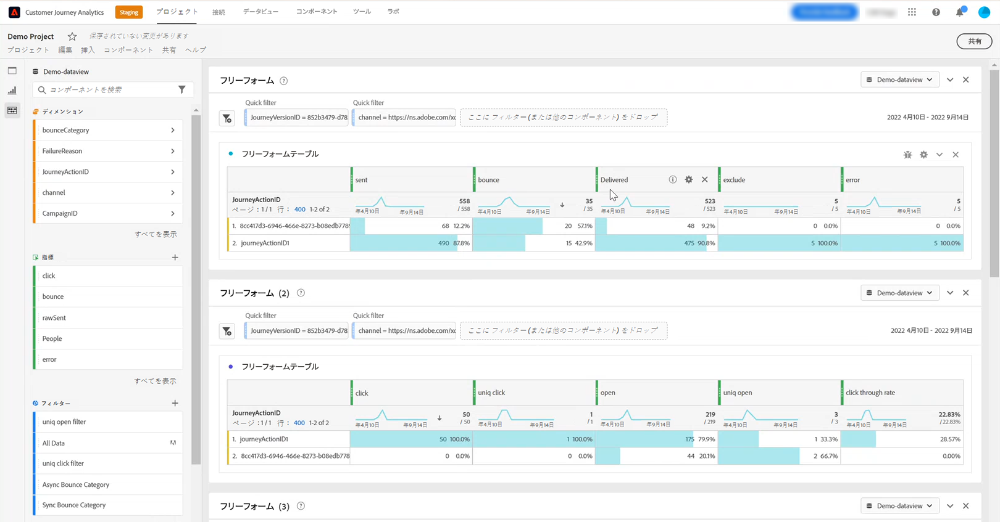

# [!DNL Customer Journey Analytics] の操作 {#cja-ajo}

でジャーニーを作成した後 [!DNL Journey Optimizer]を使用する場合、 [!DNL Customer Journey Analytics] レポートを開始し、ジャーニーとの顧客のやり取りがすべて与える影響を把握する。

➡️ [DiscoverCustomer Journey Analytics](https://docs.adobe.com/content/help/ja-JP/experience-cloud/user-guides/home.translate.html){target=&quot;_blank&quot;}

使用する前に [!DNL Customer Journey Analytics] ジャーニーの場合、最初にこの統合を設定する必要があります。

1. [接続の作成](https://experienceleague.adobe.com/docs/analytics-platform/using/cja-connections/create-connection.html?lang=ja) in [!DNL Customer Journey Analytics] と **[!UICONTROL データセット]** を Platform に送信する場合。

1. [データビューの作成](https://experienceleague.adobe.com/docs/analytics-platform/using/cja-dataviews/create-dataview.html?lang=ja) を使用して、レポートに使用するディメンションと指標を設定します。

   Journey Optimizer固有の指標を作成して、ジャーニーのデータをよりよく反映させることができます。 [詳細情報](https://experienceleague.adobe.com/docs/analytics-platform/using/integrations/ajo.html#configure-the-data-view-to-accommodate-journey-optimizer-dimensions-and-metrics)

使用 [!DNL Journey Optimizer] と [!DNL Customer Journey Analytics] 次の原因で、レポートデータに何らかの相違が生じる可能性があります。

* **両方 [!DNL Journey Optimizer] および [!DNL Customer Journey Analytics] レポート用に Azure Data Lake Storage(ADLS) のデータを同期します。**

   受信データの処理時間は、製品間で少し異なる場合があります。 このため、指定した日付から現在の日付までのレポートを表示する際に、データが一致しない場合があります。 不一致を減らすには、現在の日付を除く日付範囲を使用します。

* **In [!DNL Journey Optimizer] レポート、送信済み指標には、再試行指標も含まれます。**

   **[!UICONTROL 再試行]** 次に含まれません： **[!UICONTROL 送信済み]** 指標 [!DNL Customer Journey Analytics]. これは [!DNL Customer Journey Analytics] **[!UICONTROL 送信済み]** 指標が次の値より小さい [!DNL Journey Optimizer]. ただし、再試行データは **[!UICONTROL メッセージが正常に送信されました]** または **[!UICONTROL バウンス]** 指標。
不一致を減らすには、1 週間前またはそれ以降の日付範囲を使用します。

* **レポートは別のデータソースから提供されています。**

   その結果、製品間で 1～2%のデータの相違が生じる可能性があります。
