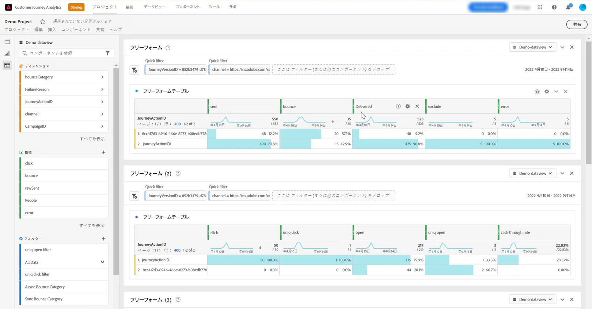

# [!DNL Customer Journey Analytics] の手動設定 {#cja-ajo}

[!DNL Journey Optimizer] と [!DNL Customer Journey Analytics] の統合により、自動レポート配信とデータのカスタムビジュアライゼーションですべてのジャーニーの総合的なビューを確認できるようになります。

次の節では、Journey Optimizer で生成されたデータを手動で活用して、Customer Journey Analytics 内で詳細な分析を行う方法について概説します。 この統合は自動的に設定できます。 [詳細情報](report-gs-cja.md)

[!DNL Journey Optimizer] でジャーニーを作成した後、[!DNL Customer Journey Analytics] に顧客データを読み込んでレポートを開始し、ジャーニーにおける顧客のインタラクションが与える影響を把握できます。

➡️ [Customer Journey Analytics を確認](https://experienceleague.adobe.com/ja/docs/analytics-platform/using/integrations/ajo#manually-configure-a-data-view-to-be-used-with-journey-optimizer){target="_blank"}

>[!NOTE]
>
>この統合に加えて、Adobe Journey Optimizer データセットのコンテンツをクラウドストレージの場所にエクスポート、この情報をレポートや分析の目的で使用することもできます。 [詳しくは、クラウドストレージの場所にデータセットをエクスポートする方法を参照してください](../data/export-datasets.md)
>

ジャーニーで [!DNL Customer Journey Analytics] を使用する前に、まずこの統合を設定する必要があります。

1. Adobe Experience Platform に送信する&#x200B;**[!UICONTROL データセット]**&#x200B;を使用して、[!DNL Customer Journey Analytics] で[接続を作成](https://experienceleague.adobe.com/docs/analytics-platform/using/cja-connections/create-connection.html?lang=ja){target="_blank"}します。

   次の [!DNL Journey Optimizer] を設定できます。
   * [ジャーニーステップイベント](../data/datasets-query-examples.md#journey-step-event)：誰がジャーニーにエントリし、どのくらい進んだかを確認できます。
   * [メッセージフィードバック／トラッキングデータセット](../data/datasets-query-examples.md#message-feedback-event-dataset)：[!DNL Journey Optimizer] を介して送信したメッセージに関する配信情報を表示できます。
   * [エンティティデータセットおよびジャーニーデータセット](../data/datasets-query-examples.md#entity-dataset)：わかりやすい名前を検索し、レポートで使用できます。

1. [データビューを作成](https://experienceleague.adobe.com/docs/analytics-platform/using/cja-dataviews/create-dataview.html?lang=ja){target="_blank"}して、レポートに使用するディメンションおよび指標を設定します。

   Journey Optimizer 固有の指標を作成して、ジャーニーのデータをよりよく反映できます。 [詳細情報](https://experienceleague.adobe.com/docs/analytics-platform/using/integrations/ajo.html?lang=ja#configure-the-data-view-to-accommodate-journey-optimizer-dimensions-and-metrics){target="_blank"}

>[!NOTE]
>
>サンドボックスに複数の接続が存在する場合は、[ データビュー](https://experienceleague.adobe.com/docs/analytics-platform/using/cja-dataviews/create-dataview.html?lang=ja){target="_blank"}が[接続](https://experienceleague.adobe.com/en/docs/analytics-platform/using/cja-connections/manage-connections){target="_blank"}を参照し、**[!UICONTROL CJAでの使用]**&#x200B;のフラグが付けられていることを確認します。 それ以外の場合は、[!DNL Journey Optimizer]で「[**CJAで分析**」ボタン ](report-cja-manage.md#analyze)が無効になっている可能性があります。

[!DNL Journey Optimizer] と [!DNL Customer Journey Analytics] を使用する場合、次の原因により、レポートデータに何らかの相違が生じる可能性があります。

* **[!DNL Journey Optimizer] と [!DNL Customer Journey Analytics] は両方とも、レポート用に Azure Data Lake Storage（ADLS）からのデータを同期します。**

  受信データの処理時間は、製品間で多少異なる場合があります。 このため、指定した日付から現在の日付までのレポートを表示すると、データが一致しない場合があります。 相違を減らすには、現在の日付を除く日付範囲を使用します。

* **[!DNL Journey Optimizer] レポートでは、送信済み指標には、再試行指標も含まれます。**

  **[!UICONTROL 再試行]**&#x200B;は、[!DNL Customer Journey Analytics]での&#x200B;**[!UICONTROL 送信済み]**&#x200B;指標には含まれません。 そのため、[!DNL Customer Journey Analytics] **[!UICONTROL 送信済み]**&#x200B;指標には、[!DNL Journey Optimizer] より低い値が表示されます。 ただし、再試行データは、「**[!UICONTROL 正常に送信されたメッセージ]**」または「**[!UICONTROL バウンス]**」指標に収束されます。
相違を減らすには、1 週間前またはそれ以降の日付範囲を使用します。

* **レポートは、異なるデータソースから提供されています。**

  その結果、製品間で 1～2％のデータの相違が生じる可能性があります。
