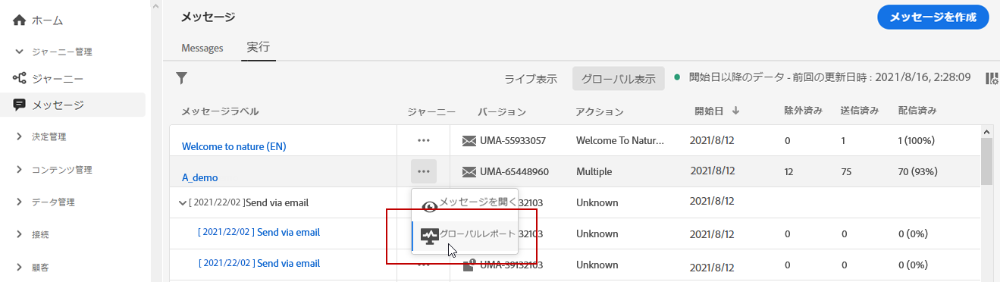
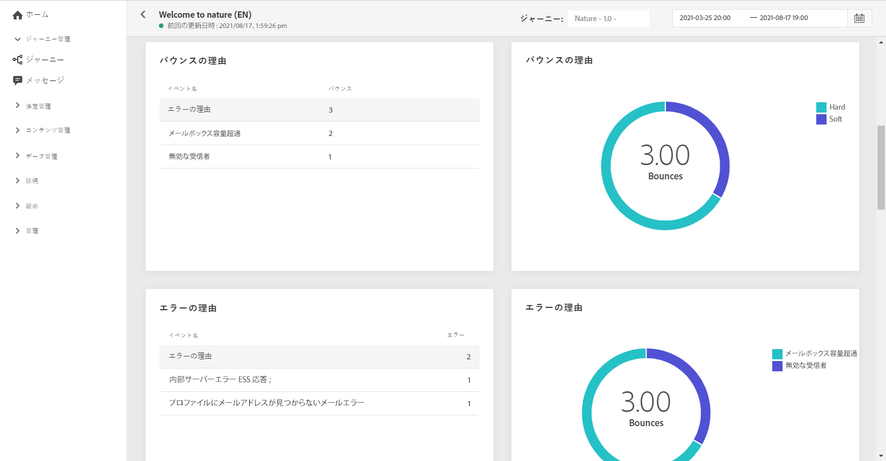
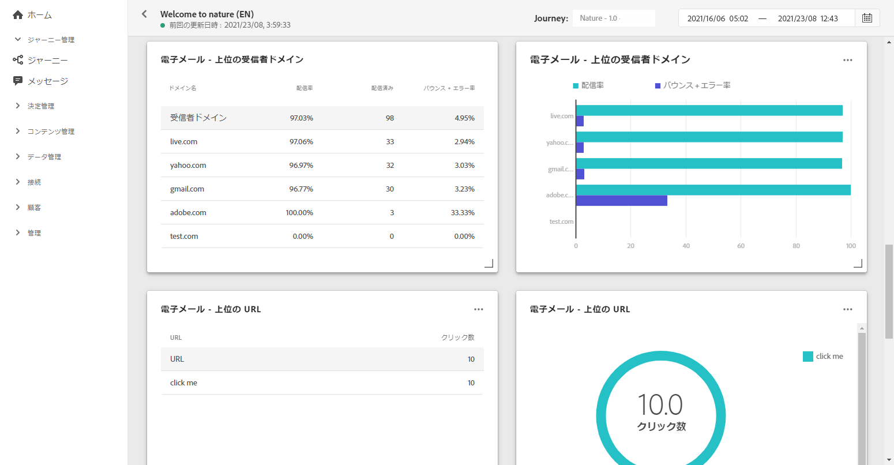

# メールグローバルレポート {#email-global-report}

メールの&#x200B;**[!UICONTROL グローバルレポート]**&#x200B;は、特定のメール配信のみを対象としています。

**[!UICONTROL メッセージ]**&#x200B;メニューの「**[!UICONTROL 実行]**」タブで、「**[!UICONTROL グローバル表示]**」をクリックしてから、選択した配信の詳細メニューで「**[!UICONTROL グローバルレポート]**」を選択します。

メールの&#x200B;**[!UICONTROL グローバルレポート]**&#x200B;は、配信の成功とエラーを示す様々なウィジェットに分かれています。必要に応じて、各ウィジェットのサイズを変更したり削除したりできます。この機能について詳しくは、この[節](global-report.md#modify-dashboard)を参照してください。

**[!UICONTROL メールのパフォーマンス]**&#x200B;では、メッセージに関連する主な情報と次の KPI の詳細を説明します。

* **[!UICONTROL 送信済み]**：配信に対する送信の合計数。

* **[!UICONTROL 配信率]**：正常に送信されたメッセージの割合。

* **[!UICONTROL バウンス率]**：送信メールに対するバウンスメールの割合。

* **[!UICONTROL エラー率]**：送信されたメールに対して、配信中にエラーが発生して送信できなかったメールの割合。

* **[!UICONTROL 開封率]**：開封されたメッセージの割合。

* **[!UICONTROL クリック率]**：配信でのクリック数の割合。

* **[!UICONTROL スパム苦情率]**：配信されたメッセージに対して、受信者がスパムと見なしたメールの割合。苦情の詳細については、[配信品質のベストプラクティスガイド](https://experienceleague.adobe.com/docs/deliverability-learn/deliverability-best-practice-guide/metrics-for-deliverability/complaints.html?lang=ja#metrics-for-deliverability){target=&quot;_blank&quot;}を参照してください。

* **[!UICONTROL 購読解除率]**：配信されたメッセージ数に対する、一意の購読解除の割合。この指標は、購読解除リンクのクリック数に依存しませんが、受信者が開始した購読解除数に基づいています。購読解除について詳しくは、この[ページ](../consent.md)を参照してください。

**[!UICONTROL メール - トラッキング統計情報]**&#x200B;には、配信に対する受信者のアクティビティを確認できるデータが表示されます。

* **[!UICONTROL 開封数]**：配信でメッセージが開かれた回数。

* **[!UICONTROL ユニーク開封数]**：開封された配信の割合。

* **[!UICONTROL 開封率]**：配信されたメール数に対して、開封されたメールの合計数。

* **[!UICONTROL クリック数]**：メールのコンテンツがクリックされた回数。

* **[!UICONTROL ユニーククリック数]**：メールのコンテンツをクリックした受信者の数。

* **[!UICONTROL クリックスルー率]**：ジャーニーに対して何らかのアクションを起こしたユーザーの割合。

**[!UICONTROL 送信統計]**&#x200B;のグラフは、配信の成功の詳細を示します。

* **[!UICONTROL 配信済み]**：送信されたメッセージの合計数に対して、正常に配達できたメッセージの数。

* **[!UICONTROL バウンス]**：送信されたメッセージの総数に対して、配信と自動返信の処理中に発生したエラーの累計。

* **[!UICONTROL エラー]**：配信中に発生し、プロファイルへの送信の妨げとなったエラーの合計数。

**[!UICONTROL バウンスの理由]**&#x200B;ウィジェットおよび&#x200B;**[!UICONTROL バウンスのカテゴリ]**&#x200B;ウィジェットには、次のようなバウンスメッセージに関するデータが含まれています。

* **[!UICONTROL ハードバウンス]**：永続的なエラー（メールアドレスの間違いなど）の合計数。このエラーは、アドレスが無効であることを明示的に示すエラーメッセージ（例：「不明なユーザー」）を伴います。

* **[!UICONTROL ソフトバウンス数]**：一時的なエラー（インボックスが満杯など）の合計数。

* **[!UICONTROL 無視]**：一時的なエラー（不在など）や技術的なエラー（送信者のタイプが postmaster の場合など）の合計数。

バウンスの詳細については、[抑制リスト](../suppression-list.md)のページを参照してください。

「**[!UICONTROL エラー理由]**」のグラフと表を使用すると、配信中に発生したエラーを確認できます。

「**[!UICONTROL メール - 上位の受信者ドメイン]**」のグラフと表は、受信者がメールを開くために最も頻繁に使用されているドメインの詳細を示します。

「**[!UICONTROL メール - 上位の URL]**」のグラフと表は、配信から最もアクセスされた URL の詳細を示します。

「**[!UICONTROL 開封とクリック]**」は、受信者による配信の操作を識別します。

* **[!UICONTROL ユニーククリック数]**：メールのコンテンツをクリックした受信者の数。

* **[!UICONTROL ユニーク開封数]**：配信されたメッセージを開いた受信者の数。

>[!NOTE]
>
>「**[!UICONTROL 抑制]**」または「**[!UICONTROL 許可されていない]**」のステータスを持つプロファイルは、メッセージ送信プロセス中に除外されます。 したがって、**ジャーニーレポート**&#x200B;には、これらのプロファイルがジャーニー（[セグメントを読み取り](../building-journeys/read-segment.md)アクティビティと[メッセージ](../building-journeys/journeys-message.md)アクティビティ）を移動したものとして表示されますが、これらはメール送信前に除外されるので、**メールレポート**&#x200B;では、**[!UICONTROL 送信済み]**&#x200B;指標に含まれません。
>
>詳しくは、[抑制リスト](../suppression-list.md)と[許可リスト](../allow-list.md)を参照してください。すべての除外ケースの理由を確認するには、[Adobe Experience Platform Query Service](https://experienceleague.adobe.com/docs/experience-platform/query/api/getting-started.html?lang=ja){target=&quot;_blank&quot;} を使用します。
