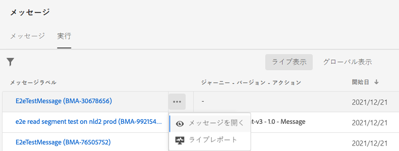
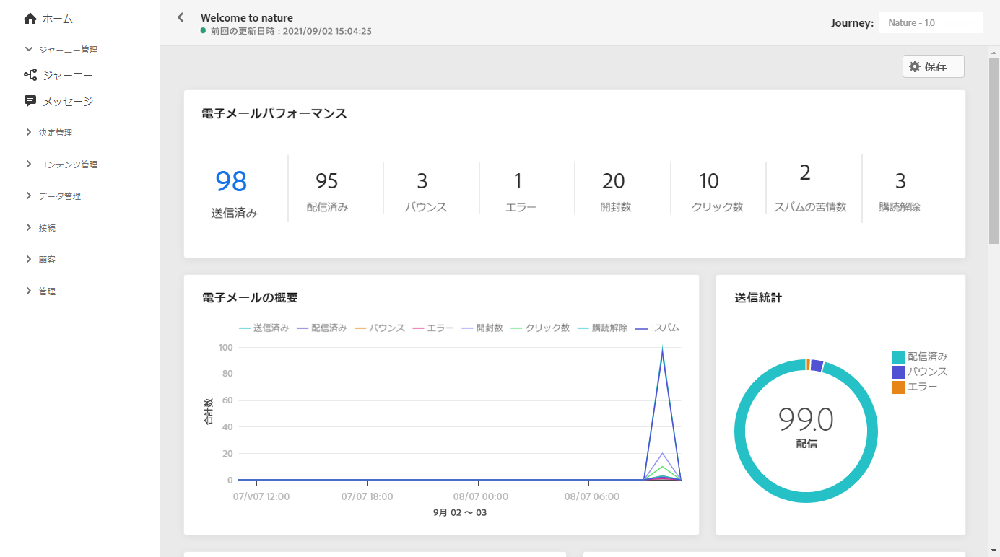
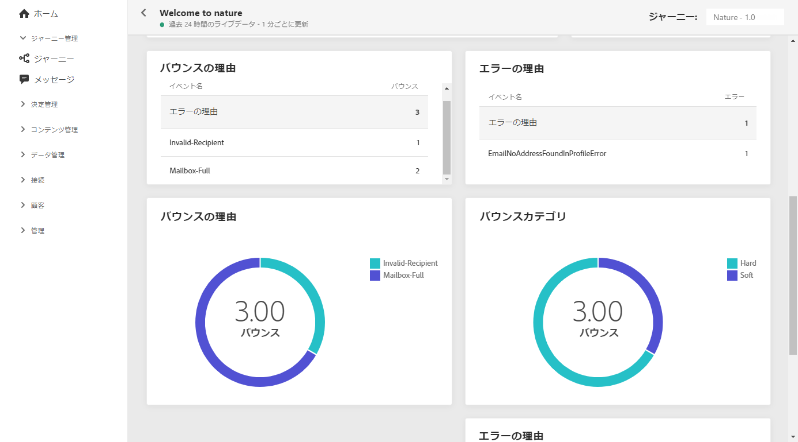

# メールライブレポート {#email-live-report}

メール&#x200B;**[!UICONTROL ライブレポート]**&#x200B;は、特定のメール配信のみをターゲットにします。

**[!UICONTROL メッセージ]**&#x200B;メニューの「**[!UICONTROL 実行]**」タブで、「**[!UICONTROL ライブ表示]**」を選択し、選択した配信の詳細メニューで「**[!UICONTROL ライブレポート]**」を選択します。

メール&#x200B;**[!UICONTROL ライブレポート]**&#x200B;は、配信の成功やエラーを示す様々なウィジェットに分かれています。必要に応じて、各ウィジェットのサイズを変更したり削除したりできます。この機能について詳しくは、この[節](live-report.md#modify-dashboard)を参照してください。

**[!UICONTROL メールのパフォーマンス]**&#x200B;および&#x200B;**[!UICONTROL メールの概要]** ウィジェットでは、メッセージに関連する主な情報の詳細がグラフと KPI と共に表示されます。

* **[!UICONTROL 送信済み]**：配信に対する送信の合計数。

* **[!UICONTROL 配信済み]**：送信されたメッセージの合計数に対して、正常に配達できたメッセージの数。

* **[!UICONTROL バウンス]**：送信されたメッセージの総数に対して、配信と自動返信の処理中に発生したエラーの累計。

* **[!UICONTROL エラー]**：配信中に発生し、プロファイルへの送信の妨げとなったエラーの合計数。

* **[!UICONTROL 開封数]**：配信でメッセージが開封された回数。

* **[!UICONTROL クリック数]**：配信でコンテンツがクリックされた回数。

**[!UICONTROL 送信統計]**&#x200B;のグラフは、配信の成功の詳細を示します。

* **[!UICONTROL 配信済み]**：送信されたメッセージの合計数に対して、正常に配達できたメッセージの数。

* **[!UICONTROL バウンス]**：送信されたメッセージの総数に対して、配信と自動返信の処理中に発生したエラーの累計。

* **[!UICONTROL エラー]**：配信中に発生し、プロファイルへの送信の妨げとなったエラーの合計数。

「**[!UICONTROL エラー理由]**」グラフと表を使用すると、配信中に発生したエラーを確認できます。

**[!UICONTROL バウンスの理由]**&#x200B;ウィジェットおよび&#x200B;**[!UICONTROL バウンスのカテゴリ]**&#x200B;ウィジェットには、次のようなバウンスメッセージに関するデータが含まれています。

* **[!UICONTROL ハードバウンス]**：永続的なエラー（メールアドレスの間違いなど）の合計数。このエラーは、アドレスが無効であることを明示的に示すエラーメッセージ（例：「不明なユーザー」）を伴います。

* **[!UICONTROL ソフトバウンス数]**：一時的なエラー（インボックスが満杯など）の合計数。

* **[!UICONTROL 無視]**：一時的なエラー（不在など）や技術的なエラー（送信者のタイプが postmaster の場合など）の合計数。

>[!NOTE]
>
>「**[!UICONTROL 抑制]**」または「**[!UICONTROL 許可]**」のステータスを持つプロファイルは、メッセージ送信プロセス中に除外されます。 したがって、**ジャーニーレポート**&#x200B;は、ジャーニー（[セグメントの読み取り](../building-journeys/read-segment.md)および[メッセージ](../building-journeys/journeys-message.md)）を通過したとプロファイルを表示しますが、電子メールが除外される前は、**送信された**&#x200B;指標には含まれません送信中&#x200B;****
>
>詳しくは、[抑制リスト](../suppression-list.md)と[許可リスト](../allow-list.md)を参照してください。 すべての除外ケースの理由を調べるには、[Adobe Experience Platformクエリサービス](https://experienceleague.adobe.com/docs/experience-platform/query/api/getting-started.html)を使用します。
