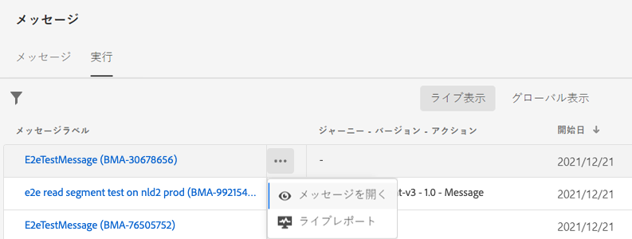
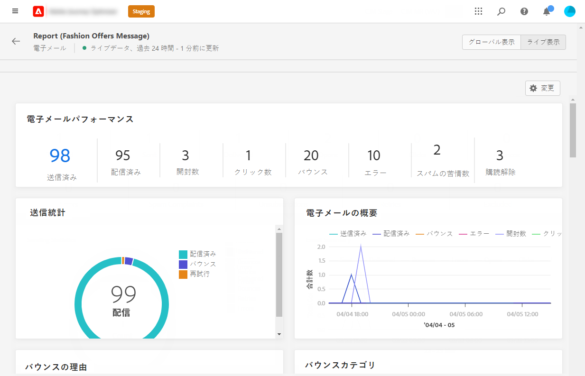
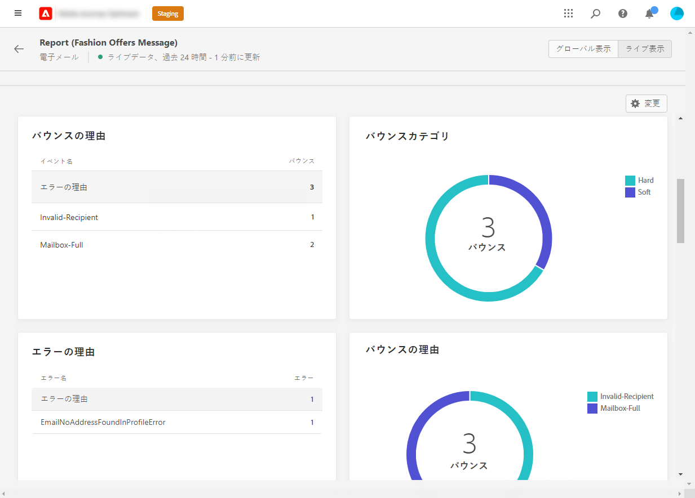

# メールライブレポート {#email-live-report}

メール&#x200B;**[!UICONTROL ライブレポート]**&#x200B;は、特定のメール配信のみをターゲットにします。

**[!UICONTROL メッセージ]**&#x200B;メニューの「**[!UICONTROL 実行]**」タブで、「**[!UICONTROL ライブ表示]**」を選択し、選択した配信の詳細メニューで「**[!UICONTROL ライブレポート]**」を選択します。

メール&#x200B;**[!UICONTROL ライブレポート]**&#x200B;は、配信の成功やエラーを示す様々なウィジェットに分かれています。必要に応じて、各ウィジェットのサイズを変更したり削除したりできます。この機能について詳しくは、この[節](live-report.md#modify-dashboard)を参照してください。

**[!UICONTROL メールの効果]** および **[!UICONTROL 電子メールの概要]** ウィジェットは、メッセージに関する主な情報の詳細をグラフと KPI で示します。

* **[!UICONTROL ターゲット]** : この配信のターゲットプロファイルと認定されるユーザープロファイルの数。

* **[!UICONTROL 送信済み]**：配信に対する送信の合計数。

* **[!UICONTROL 配信済み]**:正常に送信されたメッセージ数。

* **[!UICONTROL 開封数]**：配信でメッセージが開封された回数。

* **[!UICONTROL クリック数]**：配信でコンテンツがクリックされた回数。

* **[!UICONTROL バウンス]**:配信と自動返品処理の間に累積したエラーの合計。

* **[!UICONTROL エラー]**：配信中に発生し、プロファイルへの送信の妨げとなったエラーの合計数。

* **[!UICONTROL スパムの苦情]** : スパムとして分類されたメッセージの数。

* **[!UICONTROL 購読解除]** : 購読解除リンクのクリック数。

* **[!UICONTROL 除外]** : ターゲットプロファイルから除外されメッセージを受信しなかったユーザープロファイルの数。

**[!UICONTROL 送信統計]**&#x200B;ウィジェットは、配信の成功の詳細を表示します。

* **[!UICONTROL 配信済み]**:正常に送信されたメッセージ数。

* **[!UICONTROL バウンス]**:配信と自動返品処理の間に累積したエラーの合計。

* **[!UICONTROL エラー]**：配信中に発生し、プロファイルへの送信の妨げとなったエラーの合計数。

「**[!UICONTROL エラー理由]**」グラフと表を使用すると、配信中に発生したエラーを確認できます。

**[!UICONTROL バウンスの理由]**&#x200B;ウィジェットおよび&#x200B;**[!UICONTROL バウンスのカテゴリ]**&#x200B;ウィジェットには、次のようなバウンスメッセージに関するデータが含まれています。

* **[!UICONTROL ハードバウンス]**：永続的なエラー（メールアドレスの間違いなど）の合計数。このエラーは、アドレスが無効であることを明示的に示すエラーメッセージ（例：「不明なユーザー」）を伴います。

* **[!UICONTROL ソフトバウンス数]**：一時的なエラー（インボックスが満杯など）の合計数。

* **[!UICONTROL 無視]**：一時的なエラー（不在など）や技術的なエラー（送信者のタイプが postmaster の場合など）の合計数。

>[!NOTE]
>
>オファーのウィジェットと指標は、決定がメールに挿入された場合にのみ使用できます。 意思決定管理について詳しくは、[このページ](../offers/get-started/starting-offer-decisioning.md)を参照してください。

**[!UICONTROL オファーの統計情報]**&#x200B;ウィジェットと&#x200B;**[!UICONTROL オファーの時系列の統計情報]**&#x200B;ウィジェットは、オファーの成功とターゲットオーディエンスへの影響を測定します。メッセージに関連する主な情報について、以下の KPI を使用して詳しく説明します。

* **[!UICONTROL 送信されたオファー]**：オファーの送信の総数。

* **[!UICONTROL オファーのインプレッション]**：オファーが配信で開かれた回数。

* **[!UICONTROL オファーのクリック数]**：配信でオファーがクリックされた回数。

>[!NOTE]
>
>「**[!UICONTROL 抑制]**」または「**[!UICONTROL 許可されていない]**」のステータスを持つプロファイルは、メッセージ送信プロセス中に除外されます。したがって、**ジャーニーレポート**&#x200B;には、これらのプロファイルがジャーニー（[セグメントを読み取り](../building-journeys/read-segment.md)アクティビティと[メッセージ](../building-journeys/journeys-message.md)アクティビティ）を移動したものとして表示されますが、これらはメール送信前に除外されるので、**メールレポート**&#x200B;では、**[!UICONTROL 送信済み]**&#x200B;指標に含まれません。
>
>詳しくは、[抑制リスト](suppression-list.md)と[許可リスト](../configuration/allow-list.md)を参照してください。すべての除外ケースの理由を確認するには、[Adobe Experience Platform Query Service](https://experienceleague.adobe.com/docs/experience-platform/query/api/getting-started.html?lang=ja){target=&quot;_blank&quot;} を使用します。
