# グローバルレポートの基本を学ぶ {#global-report}

>[!AVAILABILITY]
>
>現在のレポートエクスペリエンスは、2025 年 1 月をもって廃止されます。 この日以降、新しいレポートエクスペリエンスが標準となります。スムーズに移行できるように、新機能を理解しておくことをお勧めします。[Journey Optimizer の新しいレポートインターフェイスの基本を学ぶ。](report-gs-cja.md)

>[!NOTE]
>
> クエリサービスを使用する際に API を通じてカスタムクエリを作成すると、レポートに多少の遅延が生じる可能性があります。

**[!UICONTROL グローバルレポート]**&#x200B;を使用すると、選択した期間におけるジャーニーと配信の効果を測定できます。

* ジャーニーまたはジャーニーのコンテキストの配信をターゲットする場合は、**[!UICONTROL ジャーニー]**&#x200B;メニューからジャーニーにアクセスし、「**[!UICONTROL レポートを表示]**」ボタンをクリックします。そうすれば、ジャーニー、メール、SMS およびプッシュの各グローバルレポートが見つかります。

  

* キャンペーンをターゲットにする場合は、**[!UICONTROL キャンペーン]**&#x200B;メニューからキャンペーンにアクセスし、「**[!UICONTROL レポート]**」ボタンをクリックします。

  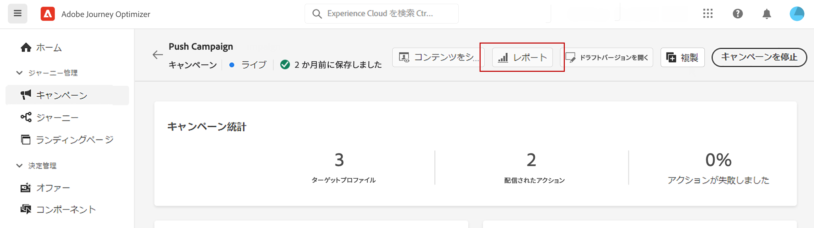

* 配信を&#x200B;**[!UICONTROL ライブレポート]**&#x200B;から&#x200B;**[!UICONTROL グローバルレポート]**&#x200B;に切り替える場合は、タブスイッチャーで「**[!UICONTROL すべての時間]**」をクリックします。

  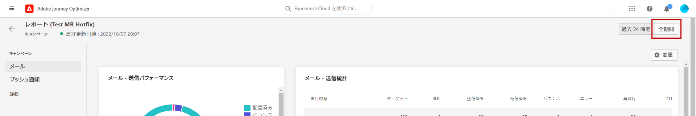

Adobe Journey Optimizer で使用可能なすべての指標の詳細なリストについては、[このページ](#list-of-components-global)を参照してください。

## ダッシュボードのカスタマイズ {#modify-dashboard}

各レポートダッシュボードは、期間を変更し、ウィジェットのサイズを変更または削除することで変更できます。ウィジェットを変更して影響を受けるのは、現在のユーザーのダッシュボードのみです。他のユーザーには、各自のダッシュボードまたはデフォルトで設定されたダッシュボードが表示されます。

1. グローバルレポートから、開始および終了時間を選択して特定のデータをターゲットにします。

   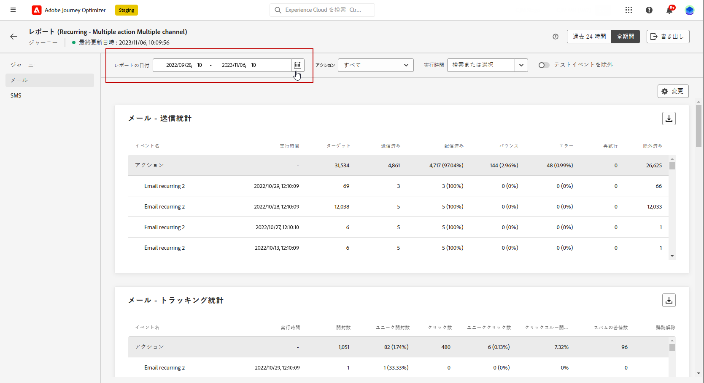

1. 複数の設定済み&#x200B;**[!UICONTROL アクション]**&#x200B;が含まれるジャーニーレポートの場合は、ドロップダウンメニューから特定の&#x200B;**[!UICONTROL アクション]**&#x200B;を選択します。

1. 1 つまたは複数の繰り返しメッセージのみをターゲットにする場合は、**[!UICONTROL 実行時間]**&#x200B;ドロップダウンから選択します。

   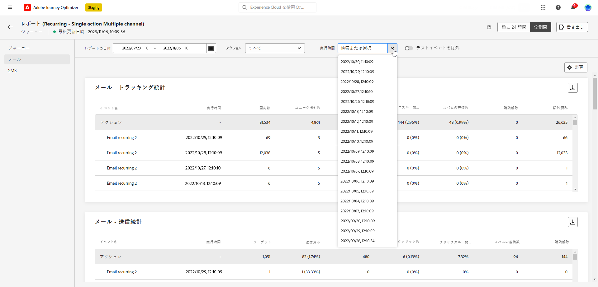

1. 切り替えバーを使用して、レポートからテストイベントを除外する場合に選択します。テストイベントについて詳しくは、[このページ](../building-journeys/testing-the-journey.md)を参照してください。

   「**[!UICONTROL テストイベントの除外]**」オプションは、ジャーニーレポートでしか使用できません。

   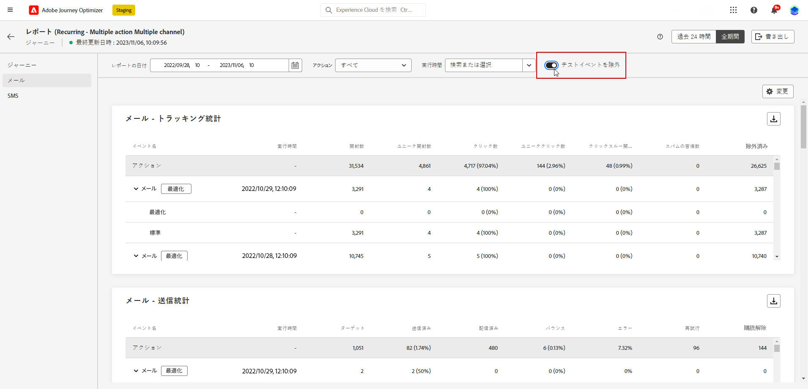

1. 「**[!UICONTROL 変更]**」をクリックして、ダッシュボードのカスタマイズを開始します。

   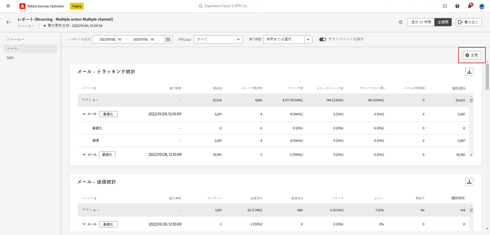

1. ウィジェットの右下隅をドラッグして、ウィジェットのサイズを調整します。

   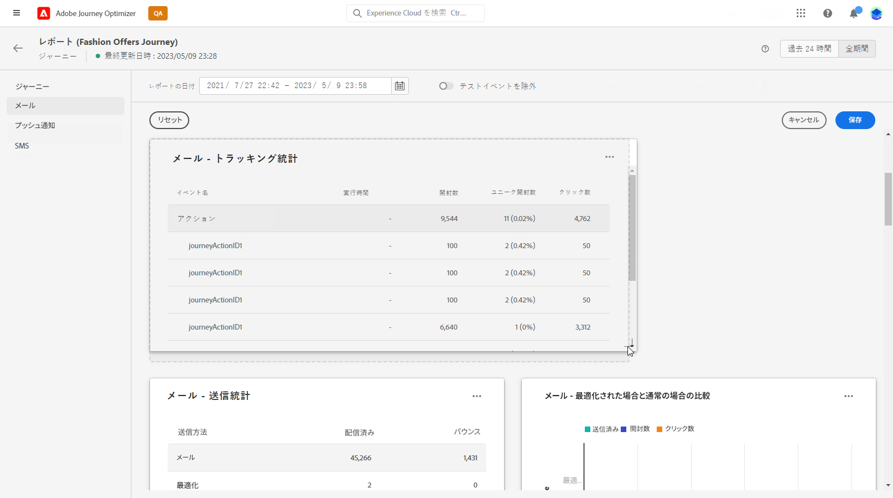

1. 「**[!UICONTROL 削除]**」をクリックして、不要なウィジェットを削除します。

   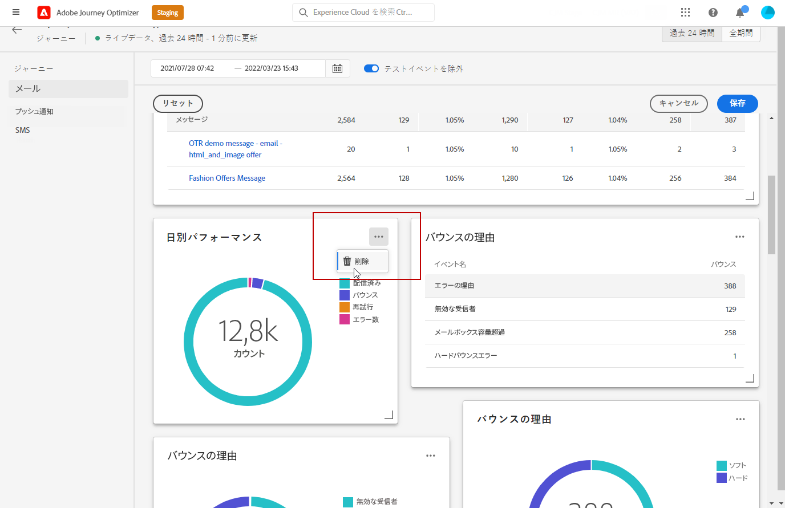

1. ウィジェットの表示順とサイズが定まったら、「**[!UICONTROL 保存]**」をクリックします。

1. データの表示方法をカスタマイズするには、グラフ、テーブル、ドーナツグラフなど、様々なビジュアライゼーションオプションから切り替えます。

   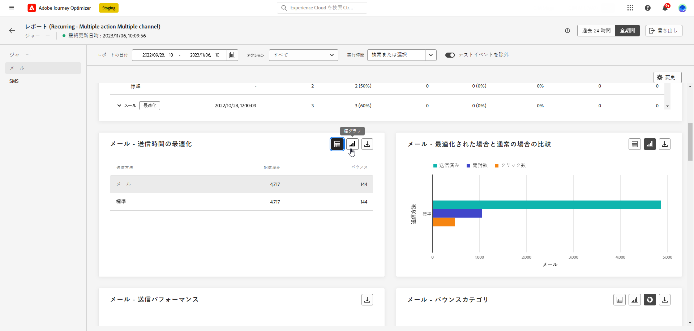

ダッシュボードが保存されました。様々な変更は、後でライブレポートを使用する際にも再度適用されます。必要に応じて、「**[!UICONTROL リセット]**」オプションを使用して、デフォルトのウィジェットとそれらのデフォルト順序に戻します。

## レポートを書き出し {#export-reports}

様々なレポートを PDF 形式または CSV 形式で簡単に書き出して、共有したり印刷したりできます。レポートの書き出し手順について詳しくは、次のタブを参照してください。

➡️ [この機能をビデオで確認](#video-csv)

>[!BEGINTABS]

>[!TAB CSV ファイルでのレポートの書き出し]

1. レポートで、「**[!UICONTROL 書き出し]**」をクリックし、「**[!UICONTROL CSV ファイル]**」を選択して、全体的なレポートレベルで CSV ファイルを生成します。

   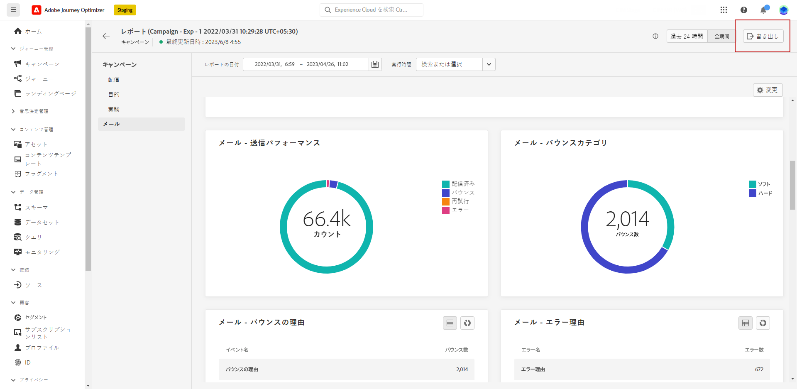

1. 特定のウィジェットからデータを書き出すこともできます。選択したウィジェットの横にある「**[!UICONTROL ウィジェットデータを CSV に書き出し]**」をクリックします。

   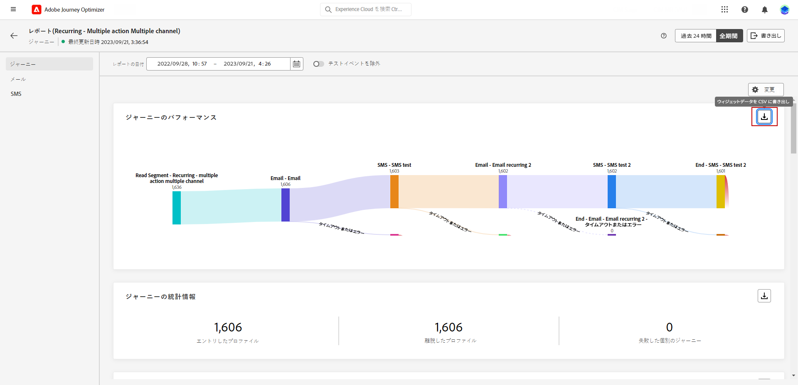

1. ファイルが自動的にダウンロードされ、ローカルファイルに配置できます。

   レポートレベルでファイルを生成した場合は、タイトルやデータなど、各ウィジェットの詳細情報がファイルに含まれています。

   ウィジェットレベルでファイルを生成した場合は、特に、選択したウィジェットのデータがファイルに含まれています。

>[!TAB PDF ファイルでのレポートの書き出し]

1. レポートから、「**[!UICONTROL 書き出し]**」をクリックし、「**[!UICONTROL PDF ファイル]**」を選択します。

   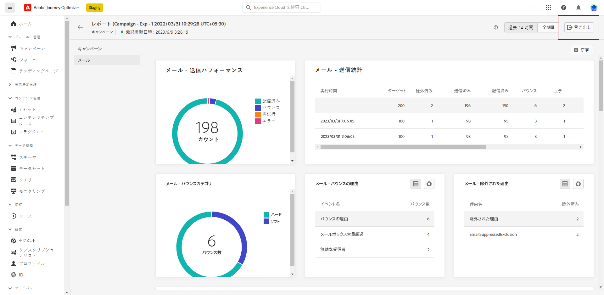

1. 印刷ウィンドウで必要に応じてドキュメントを設定します。なお、オプションはブラウザーによって異なる場合があります。

1. PDF としてレポートを印刷するか、保存するかを選択します。

1. ファイルを保存するフォルダを探し、必要に応じて名前を変更して「保存」をクリックします。

これで、レポートを PDF ファイルで表示または共有できるようになりました。

>[!ENDTABS]

### レポートの書き出し（ビデオ） {#video-csv}

レポートと単一のウィジェットの CSV レポートをダウンロードする方法について詳しくは、次のチュートリアルビデオを参照してください。

>[!VIDEO](https://video.tv.adobe.com/v/3424603?quality=12)

>[!CONTEXTUALHELP]
>id="ajo_report_campaign_ctr"
>title="CTR"
>abstract="CTR ウィジェット"

>[!CONTEXTUALHELP]
>id="ajo_report_campaign_clicks"
>title="クリック数"
>abstract="クリック数ウィジェット"

>[!CONTEXTUALHELP]
>id="ajo_report_campaign_delivered"
>title="配信済み"
>abstract="配信済みウィジェット"

>[!CONTEXTUALHELP]
>id="ajo_report_campaign_overview"
>title="キャンペーンの概要"
>abstract="キャンペーンの概要ウィジェット"

>[!CONTEXTUALHELP]
>id="ajo_report_campaign_funnel"
>title="キャンペーンファネルの結果"
>abstract="キャンペーンファネルの結果ウィジェット"

>[!CONTEXTUALHELP]
>id="ajo_report_campaign_tracking_link"
>title="トラッキング対象リンクラベル"
>abstract="トラッキング対象リンクラベルウィジェット"

>[!CONTEXTUALHELP]
>id="ajo_report_campaign_displays"
>title="表示"
>abstract="表示ウィジェット"

<!--campaign email-->

>[!CONTEXTUALHELP]
>id="ajo_report_campaign_email_delivered_click"
>title="配信済みとクリックのトレンド"
>abstract="配信済みとクリックのトレンドウィジェット"

>[!CONTEXTUALHELP]
>id="ajo_report_campaign_email_delivery_status"
>title="配信ステータス"
>abstract="配信ステータスウィジェット"

>[!CONTEXTUALHELP]
>id="ajo_report_campaign_email_sending_statistics"
>title="送信統計"
>abstract="送信統計ウィジェット"

>[!CONTEXTUALHELP]
>id="ajo_report_campaign_email_tracking_statistics"
>title="トラッキング統計"
>abstract="トラッキング統計ウィジェット"

>[!CONTEXTUALHELP]
>id="ajo_report_campaign_email_domains"
>title="メールドメイン"
>abstract="メールドメインウィジェット"

>[!CONTEXTUALHELP]
>id="ajo_report_campaign_email_tracked_link"
>title="トラッキング対象リンクラベル"
>abstract="トラッキング対象リンクラベルウィジェット"

>[!CONTEXTUALHELP]
>id="ajo_report_campaign_email_tracked_link_urls"
>title="トラッキング対象リンク URL"
>abstract="トラッキング対象リンク URL ウィジェット"

>[!CONTEXTUALHELP]
>id="ajo_report_campaign_email_subjects"
>title="メールの件名"
>abstract="メールの件名ウィジェット"

>[!CONTEXTUALHELP]
>id="ajo_report_campaign_email_bounce_reasons"
>title="バウンスの理由"
>abstract="バウンスの理由ウィジェット"

>[!CONTEXTUALHELP]
>id="ajo_report_campaign_email_exclude"
>title="除外された理由"
>abstract="除外された理由ウィジェット"

>[!CONTEXTUALHELP]
>id="ajo_report_campaign_email_error"
>title="エラーの理由"
>abstract="エラーの理由ウィジェット"

<!--campaign push-->

>[!CONTEXTUALHELP]
>id="ajo_report_campaign_push_sending_statistics"
>title="送信統計"
>abstract="送信統計ウィジェット"

>[!CONTEXTUALHELP]
>id="ajo_report_campaign_push_tracking_statistics"
>title="トラッキング統計"
>abstract="トラッキング統計ウィジェット"

>[!CONTEXTUALHELP]
>id="ajo_report_campaign_push_tracked_link"
>title="トラッキング対象リンクラベル"
>abstract="トラッキング対象リンクラベルウィジェット"

>[!CONTEXTUALHELP]
>id="ajo_report_campaign_push_tracked_link_urls"
>title="トラッキング対象リンク URL"
>abstract="トラッキング対象リンク URL ウィジェット"

>[!CONTEXTUALHELP]
>id="ajo_report_campaign_push_bounce_reasons"
>title="バウンスの理由"
>abstract="バウンスの理由ウィジェット"

>[!CONTEXTUALHELP]
>id="ajo_report_campaign_push_exclude"
>title="除外された理由"
>abstract="除外された理由ウィジェット"

>[!CONTEXTUALHELP]
>id="ajo_report_campaign_push_email_error"
>title="エラーの理由"
>abstract="エラーの理由ウィジェット"

<!--campaign inapp-->

>[!CONTEXTUALHELP]
>id="ajo_report_campaign_inapp_impression"
>title="インプレッションとクリックのトレンド"
>abstract="インプレッションとクリックのトレンドウィジェット"

>[!CONTEXTUALHELP]
>id="ajo_report_campaign_inapp_clicks"
>title="クリック数"
>abstract="クリック数ウィジェット"

>[!CONTEXTUALHELP]
>id="ajo_report_campaign_inapp_displays"
>title="表示"
>abstract="表示ウィジェット"

>[!CONTEXTUALHELP]
>id="ajo_report_campaign_inapp_tracking_data"
>title="トラッキングデータ"
>abstract="トラッキングデータウィジェット"

>[!CONTEXTUALHELP]
>id="ajo_report_campaign_inapp_tracked_link"
>title="トラッキング対象リンクラベル"
>abstract="トラッキング対象リンクラベルウィジェット"

>[!CONTEXTUALHELP]
>id="ajo_report_campaign_inapp_tracked_link_urls"
>title="トラッキング対象リンク URL"
>abstract="トラッキング対象リンク URL ウィジェット"

<!--campaign sms-->

>[!CONTEXTUALHELP]
>id="ajo_report_campaign_sms_delivered_click"
>title="配信済みとクリックのトレンド"
>abstract="配信済みとクリックのトレンドウィジェット"

>[!CONTEXTUALHELP]
>id="ajo_report_campaign_sms_delivery_status"
>title="配信ステータス"
>abstract="配信ステータスウィジェット"

>[!CONTEXTUALHELP]
>id="ajo_report_campaign_sms_tracked_link"
>title="トラッキング対象リンクラベル"
>abstract="トラッキング対象リンクラベルウィジェット"

>[!CONTEXTUALHELP]
>id="ajo_report_campaign_sms_tracked_link_urls"
>title="トラッキング対象リンク URL"
>abstract="トラッキング対象リンク URL ウィジェット"

>[!CONTEXTUALHELP]
>id="ajo_report_campaign_sms_inbound"
>title="SMS インバウンドメッセージ"
>abstract="SMS インバウンドメッセージウィジェット"

>[!CONTEXTUALHELP]
>id="ajo_report_campaign_sms_message_type"
>title="SMS メッセージタイプ"
>abstract="SMS メッセージタイプウィジェット"

>[!CONTEXTUALHELP]
>id="ajo_report_campaign_sms_providers"
>title="SMS プロバイダー"
>abstract="SMS プロバイダーウィジェット"

>[!CONTEXTUALHELP]
>id="ajo_report_campaign_sms_bounce"
>title="バウンスの理由"
>abstract="バウンスの理由ウィジェット"

>[!CONTEXTUALHELP]
>id="ajo_report_campaign_sms_exclude"
>title="除外された理由"
>abstract="除外された理由ウィジェット"

>[!CONTEXTUALHELP]
>id="ajo_report_campaign_sms_error"
>title="エラーの理由"
>abstract="エラーの理由ウィジェット"
