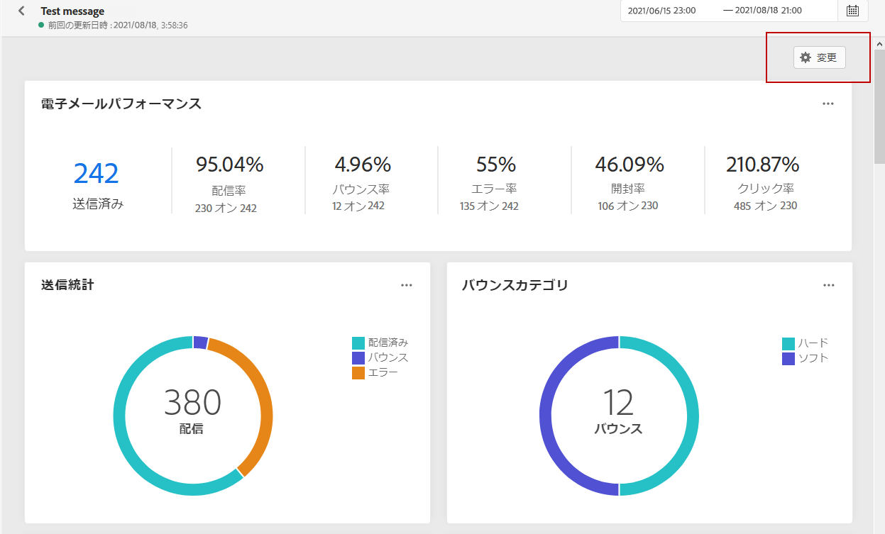
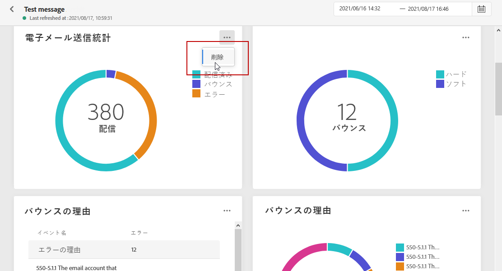

# グローバルレポート {#global-report}

>[!NOTE]
>
> クエリサービスを使用する際に API を通じてカスタムクエリを作成すると、レポートに多少の遅延が生じる可能性があります。

**[!UICONTROL グローバルレポート]**&#x200B;を使用すると、選択した期間におけるジャーニーと配信の効果を測定できます。

* ジャーニーまたはジャーニーのコンテキストの配信をターゲットにする場合は、**[!UICONTROL ジャーニー]**&#x200B;メニューからジャーニーにアクセスし、**[!UICONTROL グローバルレポート]**&#x200B;アイコンをクリックします。ジャーニー、メール、プッシュなどの&#x200B;**[!UICONTROL グローバルレポート]**&#x200B;が見つかります。

* 特定の配信をターゲットにする場合は、メッセージの「**[!UICONTROL 実行]**」タブの&#x200B;**[!UICONTROL グローバル表示]**&#x200B;で、選択した配信の詳細メニューから「**[!UICONTROL グローバルレポート]**」を選択します。

## ダッシュボードのカスタマイズ {#modify-dashboard}

各レポートのダッシュボードは、ウィジェットのサイズを変更したり、ウィジェットを削除したり、ターゲットの時間枠を変更したりすることができます。ウィジェットを変更して影響を受けるのは、現在のユーザーのダッシュボードのみです。他のユーザーには、各自のダッシュボードまたはデフォルトで設定されたダッシュボードが表示されます。

1. **[!UICONTROL グローバルレポート]**&#x200B;ダッシュボードで、スケジューラーボタンをクリックします。

1. 開始日と終了日を指定します。「**[!UICONTROL 開始時刻]**」と「**[!UICONTROL 終了時刻]**」を選択して、レポートを微調整することもできます。

   

1. 「**[!UICONTROL 変更]**」をクリックします。

   

1. ウィジェットの右下隅をドラッグして、ウィジェットのサイズを調整します。

   

1. バウンスを追跡する必要のない他のウィジェットを削除するには、「**[!UICONTROL 削除]**」をクリックします。

   

1. ウィジェットの表示順とサイズが定まったら、「**[!UICONTROL 保存]**」をクリックします。

ダッシュボードが保存されました。グローバルレポートを後で使用するときに、様々な変更を加えることもできます。必要に応じて、「**[!UICONTROL リセット]**」オプションを使用して、デフォルトのウィジェットとそれらのデフォルト順序に戻します。
