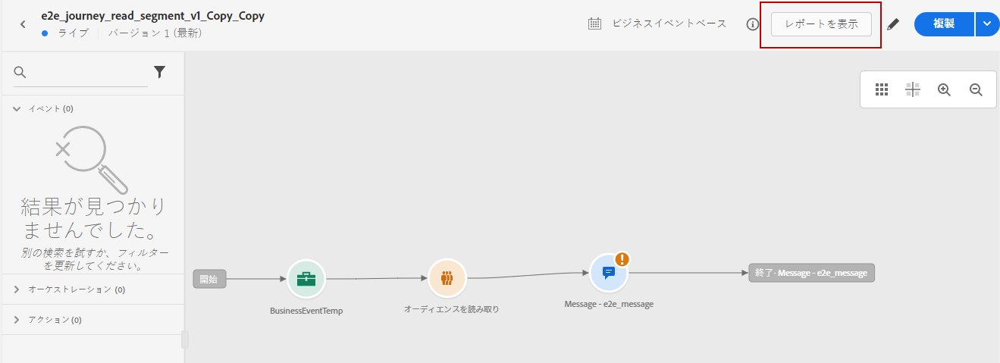
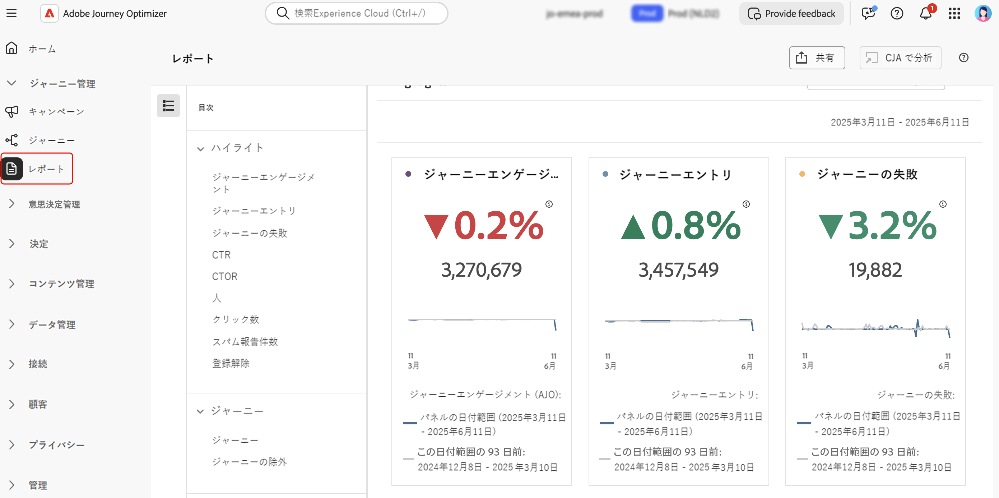

# レポート機能の基本を学ぶ {#get-started-report}

Adobe Journey Optimizer では、堅牢なレポート機能を通じて実用的なインサイトを提供します。レポートは、キャンペーン、ジャーニー、ランディングページ、購読リストなどに使用できます。使用可能なレポートは次のとおりです。

さらに、[!DNL Journey Optimizer] エクスペリエンスの配信品質を最適化するには、[この節](deliverability.md)に示すベストプラクティスを使用することをお勧めします。

## レポートのタイプ {#reporting-types}

* **過去 24 時間のライブレポート** - **[!UICONTROL ライブレポート]**&#x200B;を使用し、ビルトインダッシュボードで、ジャーニーとメッセージの影響とパフォーマンスをリアルタイムで測定および視覚化します。配信が送信されるか、「**[!UICONTROL 過去 24 時間]**」タブからジャーニーが実行されるとすぐに、**[!UICONTROL ライブレポート]**&#x200B;でデータを入手できます。ライブレポートについて詳しくは、[この節](live-report.md)を参照してください。

  

* **Customer Journey Analytics を使用した全期間レポート** - Journey Optimizer レポートが Customer Journey Analytics 機能と完全に統合され、両方のプラットフォームでレポートが標準化され、データの一貫性と信頼性が向上します。Journey Optimizer と Customer Journey Analytics のシームレスな統合により、パフォーマンス指標がより明確に表示され、ユーザーはより多くの情報に基づいて意思決定を行うことができます。全期間レポートについて詳しくは、[この節](report-gs-cja.md)を参照してください。

  

  Adobe Customer Journey Analytics ライセンスを所有している場合は、Journey Optimizer レポートを Customer Journey Analytics で分析できます。この強力なオプションにより、Customer Journey Analytics 環境にシームレスにリダイレクトされ、レポートを幅広くカスタマイズできるようになります。専用の Customer Journey Analytics 指標を使用してウィジェットを強化し、まったく新しいレベルのインサイトを得ることができます。[詳細情報](report-cja-manage.md)

## さらに深く掘り下げましょう

これで、**[!DNL Journey Optimizer]** のレポートのタイプについて理解できたので、これらのドキュメントの節で詳しく説明し、レポート機能にアクセスして理解する方法を学びます。

<table style="table-layout:fixed"><tr style="border: 0;">
<td>

<strong>ジャーニーレポート</strong>

<a href="journey-live-report.md"><strong>ライブレポート</strong></a>

<a href="journey-global-report-cja.md"><strong>全期間レポート</strong></a>

<a href="sharing-overview.md"><strong>ジャーニーレポートの作成</strong></a>

</td>
<td>

<strong>キャンペーンレポート</strong>

<a href="campaign-live-report.md"><strong>ライブレポート</strong></a>

<a href="campaign-global-report-cja.md"><strong>全期間レポート</strong></a>

</td>
<td>

<strong>ランディングページレポート</strong>

<a href="lp-report-live.md"><strong>ライブレポート</strong></a>

<a href="lp-report-global-cja.md"><strong>全期間レポート</strong></a>

</td>
<td>

<strong>購読リストのレポート</strong>

<a href="subscription-report-live.md"><strong>ライブレポート</strong></a>

<a href="subscription-report-global-cja.md"><strong>全期間レポート</strong></a>

</td>
</tr></table>

全期間グローバルレポートは、すべてのチャネルで使用できます。詳細を取得する必要があるチャネルのレポートを選択します。

### アウトバウンドチャネルのレポート

関連する&#x200B;**グローバル全期間レポート**&#x200B;を検出するアウトバウンドチャネルを選択します。

<table style="table-layout:fixed"><tr style="border: 0;">
<td>

<strong>メールチャネル</strong>

<a href="campaign-global-report-cja-email.md"><strong>キャンペーンレポート</strong></a>

<a href="journey-global-report-cja-email.md"><strong>ジャーニーレポート</strong></a>

</td>
<td>

<strong>SMS チャネル</strong>

<a href="campaign-global-report-cja-sms.md"><strong>キャンペーンレポート</strong></a>

<a href="journey-global-report-cja-sms.md"><strong>ジャーニーレポート</strong></a>

</td>
<td>

<strong>プッシュチャネル</strong>

<a href="campaign-global-report-cja-push.md"><strong>キャンペーンレポート</strong></a>

<a href="journey-global-report-cja-push.md"><strong>ジャーニーレポート</strong></a>

</td>
<td>

<strong>ダイレクトメールチャネル</strong>

<a href="campaign-global-report-cja-direct.md"><strong>キャンペーンレポート</strong></a>

<a href="journey-global-report-cja-direct.md"><strong>ジャーニーレポート</strong></a>

</td>
</tr></table>

### インバウンドエクスペリエンスのレポート

関連する&#x200B;**グローバル全期間レポート**&#x200B;を検出するインバウンドエクスペリエンスを選択します。

<table style="table-layout:fixed"><tr style="border: 0;">
<td>

<strong>アプリ内チャネル</strong>

<a href="campaign-global-report-cja-inapp.md"><strong>キャンペーンレポート</strong></a>

<a href="journey-global-report-cja-inapp.md"><strong>ジャーニーレポート</strong></a>

</td>
<td>

<strong>Web チャネル</strong>

<a href="campaign-global-report-cja-web.md"><strong>キャンペーンレポート</strong></a>

<a href="journey-global-report-cja-web.md"><strong>ジャーニーレポート</strong></a>

</td>
<td>

<strong>コードベースのエクスペリエンス</strong>

<a href="campaign-global-report-cja-code.md"><strong>キャンペーンレポート</strong></a>

<a href="campaign-global-report-cja-code.md"><strong>ジャーニーレポート</strong></a>

</td>
<td>

<strong>コンテンツカード</strong>

<a href="campaign-global-report-cja-content.md"><strong>キャンペーンレポート</strong></a>

<a href="journey-global-report-cja-content.md"><strong>ジャーニーレポート</strong></a>

</td>
</tr></table>

### チュートリアルビデオ {#video}

Adobe Journey Optimizerの全期間レポートを効果的に使用する方法について説明します。

+++こちらのビデオをご覧ください

>[!VIDEO](https://video.tv.adobe.com/v/3422696?captions=jpn&learn=on)

+++
