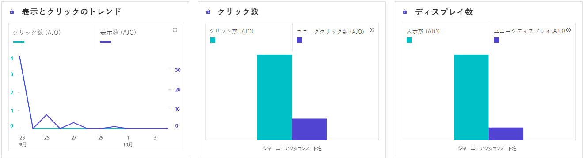
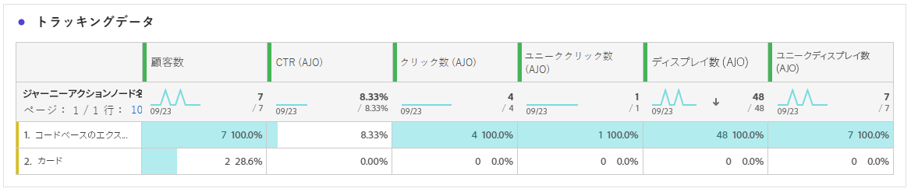

# コードベースのジャーニーレポート {#journey-global-report}

>[!INFO]
>
> ユーザーは一度に複数のジャーニーに関与する可能性があるので、ジャーニーレポートには複数のジャーニーの情報が同時に表示される場合があります。その結果、同時にアクティブなジャーニーに参加しているユーザーに対してインバウンド通信（アプリ内、web およびコードベース）をトリガーした場合、複数のジャーニーに表示される場合があり、データが重複する可能性があります。

>[!BEGINSHADEBOX]

ジャーニー内の「**[!UICONTROL レポートを表示]**」ボタンをクリックすると、コードベースのジャーニーレポートにアクセスできます。 [詳細情報](report-gs-cja.md)

>[!ENDSHADEBOX]

## 表示してクリック {#impressions-code}

**[!UICONTROL 表示してクリック]**&#x200B;のグラフには、プロファイルのコードベースエクスペリエンスへのエンゲージメントに関する詳細な分析が表示され、プロファイルがコンテンツとどのようにやり取りするかについての貴重なインサイトを得ることができます。

+++ インプレッションとクリック指標の詳細情報

* **[!UICONTROL ユニーククリック数]**：エクスペリエンスのコンテンツをクリックしたプロファイルの数。

* **[!UICONTROL クリック数]**：エクスペリエンスのコンテンツがクリックされた回数。

* **[!UICONTROL 表示数]**：エクスペリエンスが開かれた回数。

* **[!UICONTROL ユニーク表示数]**：エクスペリエンスが開かれた回数。1 つのプロファイルによる複数回のインタラクションは考慮されません。

+++

## トラッキングデータ {#track-data-code}

**[!UICONTROL トラッキングデータ]**&#x200B;のテーブルには、コードベースエクスペリエンスと結びつけられたプロファイルアクティビティの詳細なスナップショットが表示され、エンゲージメントとエクスペリエンスの効果に関する重要なインサイトを得ることができます。

+++ トラッキングデータ指標の詳細情報

* **[!UICONTROL ユーザー]**：エクスペリエンスのターゲットプロファイルに適格な、ユーザープロファイルの数。

* **[!UICONTROL クリックスルー率（CTR）]**：エクスペリエンスに対して何らかのアクションを起こしたユーザーの割合。

* **[!UICONTROL クリック数]**：エクスペリエンスのコンテンツがクリックされた回数。

* **[!UICONTROL ユニーククリック数]**：エクスペリエンスのコンテンツをクリックしたプロファイルの数。

* **[!UICONTROL 表示数]**：エクスペリエンスが開かれた回数。

* **[!UICONTROL ユニーク表示数]**：エクスペリエンスが開かれた回数。1 つのプロファイルによる複数回のインタラクションは考慮されません。

+++

## トラッキング対象リンクラベル {#track-link-code}

**[!UICONTROL トラッキング対象リンクラベル]**&#x200B;テーブルには、コードベースエクスペリエンス内のリンクラベルの包括的な概要が表示され、最も多くの訪問者トラフィックを生成するリンクラベルがハイライト表示されます。この機能を使用すると、最も人気のあるリンクを識別し、優先順位を付けることができます。

+++ トラッキング対象リンクラベル指標の詳細情報

* **[!UICONTROL ユニーククリック数]**：コードベースエクスペリエンスのコンテンツをクリックしたプロファイルの数。

* **[!UICONTROL クリック数]**：コードベースエクスペリエンスのコンテンツがクリックされた回数。

* **[!UICONTROL 表示数]**：エクスペリエンスが開かれた回数。

* **[!UICONTROL ユニーク表示数]**：エクスペリエンスが開かれた回数。1 つのプロファイルによる複数回のインタラクションは考慮されません。

+++
