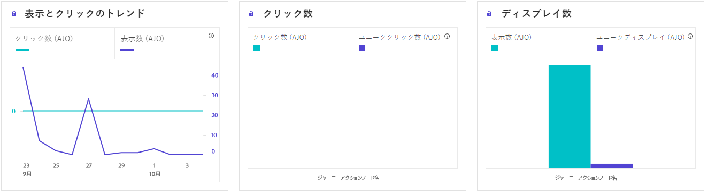

# コンテンツカードジャーニーレポート {#journey-global-report}

>[!BEGINSHADEBOX]

コンテンツカードジャーニーレポートにアクセスするには、ジャーニー内の「**[!UICONTROL レポートを表示]**」ボタンをクリックします。[詳細情報](report-gs-cja.md)

>[!ENDSHADEBOX]

## 表示してクリック {#displays-content-card}

**[!UICONTROL 表示してクリック]**&#x200B;のグラフには、プロファイルのコンテンツカードへのエンゲージメントに関する詳細な分析が表示され、プロファイルがコンテンツとどのようにやり取りするかについての貴重なインサイトを得ることができます。

+++ 表示とクリックの指標の詳細情報

* **[!UICONTROL ユニーククリック数]**：コンテンツカードのコンテンツをクリックしたプロファイルの数。

* **[!UICONTROL クリック数]**：コンテンツカードのコンテンツがクリックされた回数。

* **[!UICONTROL 表示数]**：コンテンツカードが開かれた回数。

* **[!UICONTROL ユニーク表示数]**：コンテンツカードが開かれた回数。1 つのプロファイルによる複数回のインタラクションは考慮されません。

+++

## トラッキングデータ {#track-data-content}

**[!UICONTROL トラッキングデータ]**&#x200B;のテーブルには、コンテンツカードと結びつけられたプロファイルアクティビティの詳細なスナップショットが表示され、エンゲージメントとエクスペリエンスの効果に関する重要なインサイトを得ることができます。

+++ 詳しくは、トラッキングデータ指標を参照してください

* **[!UICONTROL 人物]**：コンテンツカードのターゲットプロファイルに適格な、ユーザープロファイルの数。

* **[!UICONTROL クリックスルー率（CTR）]**：コンテンツカードに対して何らかのアクションを起こしたユーザーの割合。

* **[!UICONTROL クリック数]**：コンテンツカードのコンテンツがクリックされた回数。

* **[!UICONTROL ユニーククリック数]**：コンテンツカードのコンテンツをクリックしたプロファイルの数。

* **[!UICONTROL 表示数]**：コンテンツカードが開かれた回数。

* **[!UICONTROL ユニーク表示数]**：コンテンツカードが開かれた回数。1 つのプロファイルによる複数回のインタラクションは考慮されません。

+++

## トラッキング対象リンクラベル {#track-link-content}

**[!UICONTROL トラッキング対象リンクラベル]**&#x200B;テーブルには、コンテンツカード内のリンクラベルの包括的な概要が表示され、最も多くの訪問者トラフィックを生成するリンクラベルがハイライト表示されます。この機能を使用すると、一番人気のリンクを識別し、優先順位を付けることができます。

+++ 詳しくは、トラッキング対象リンクラベル指標を参照してください

* **[!UICONTROL ユニーククリック数]**：コンテンツカードのコンテンツをクリックしたプロファイルの数。

* **[!UICONTROL クリック数]**：コンテンツカードのコンテンツがクリックされた回数。

* **[!UICONTROL 表示数]**：コンテンツカードが開かれた回数。

* **[!UICONTROL ユニーク表示数]**：コンテンツカードが開かれた回数。1 つのプロファイルによる複数回のインタラクションは考慮されません。

+++
