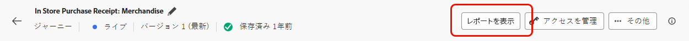
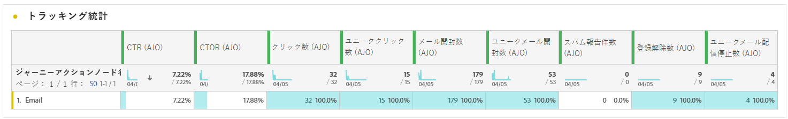
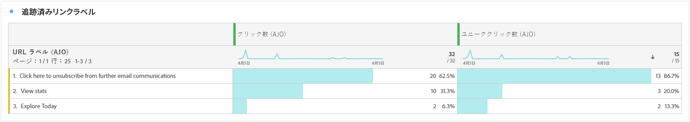

# メールジャーニーレポート {#journey-global-report}

>[!INFO]
>
>Apple ではメールプライバシー保護を含むネイティブのメールアプリに新しいプライバシー保護機能を導入したので、送信者はトラッキングピクセルを使用して、Apple のメールプライバシー保護を有効にしているプロファイルに関するデータを収集できなくなりました。その結果、トラッキングピクセルを使用してメールの開封数を追跡する Adobe Journey Optimizer の機能に影響を与える場合があります。
>> [Apple iOS のプライバシー変更がメールマーケティングに与える影響について詳しくは、こちら](https://experienceleaguecommunities.adobe.com/t5/adobe-campaign-classic-blogs/the-impact-of-apple-ios-privacy-changes-on-email-marketing-and/ba-p/699780?profile.language=ja)を参照してください。
> 
> より正確なインサイトを得るには、開封率ではなくクリック数とコンバージョン指標に焦点を当てることをお勧めします。

>[!BEGINSHADEBOX]

メールジャーニーレポートにアクセスするには、ジャーニー内の「**[!UICONTROL レポートを表示]**」ボタンをクリックします。[詳細情報](report-gs-cja.md)

>[!ENDSHADEBOX]

## 配信済みとクリックのトレンド {#delivered-click}

**[!UICONTROL 配信済みとクリックのトレンド]**&#x200B;のグラフには、プロファイルのメールへのエンゲージメントに関する詳細な分析が表示され、様々なドメインがコンテンツとどのようにやり取りするかに関する貴重なインサイトを得ることができます。

+++ 配信済みとクリックのトレンド指標についての詳細情報

* **[!UICONTROL 配信済み]**：送信されたメッセージの合計数に対する、正常に送信されたメッセージの数。

* **[!UICONTROL クリック数]**：メールでコンテンツがクリックされた回数。

+++

## 配信ステータス {#delivery-status}

**[!UICONTROL 配信ステータス]**&#x200B;のグラフを使用すると、メールのパフォーマンスを一目で確認できます。配信やバウンスなどの主要指標を追跡することで、メールジャーニーの効率をすばやく把握できます。

+++ 配信ステータス指標についての詳細情報

* **[!UICONTROL 配信済み]**：送信されたメッセージの合計数に対する、正常に送信されたメッセージの数。

* **[!UICONTROL アウトバウンドチャネルのバウンス数]**：送信されたメッセージの合計数に対する、送信プロセス中および自動返信処理中に累積したエラーの合計数。

* **[!UICONTROL アウトバウンドエラー数]**：送信プロセス中に発生し、プロファイルにメッセージを送信できなかったエラーの合計数。

* **[!UICONTROL 除外済み]**：Adobe Journey Optimizer によって除外されたプロファイルの数。

+++

## 送信統計 {#email-sending-statistics}

**[!UICONTROL 送信統計]**&#x200B;テーブルには、ジャーニー内でのメールのパフォーマンスに関する明確なビューが表示されます。配信率やインタラクションなどの主要指標を追跡し、メール戦略を最適化してリーチとエンゲージメントを向上させるための貴重なインサイトを提供します。

+++ 詳しくは、送信統計指標を参照してください

* **[!UICONTROL ターゲット]**：送信プロセス中に処理されたメールの合計数。

* **[!UICONTROL 送信数]**：メール送信の合計数。

* **[!UICONTROL 配信済み]**：送信されたメッセージの総数に対する、正常に送信されたメッセージの数。

* **[!UICONTROL ユニーク配信済み]**：1 つ以上のメールを正常に受信したプロファイルの数。

* **[!UICONTROL アウトバウンドチャネルのバウンス数]**：送信されたメッセージの合計数に対する、送信プロセス中および自動返信処理中に累積したエラーの合計数。

* **[!UICONTROL アウトバウンドエラー数]**：送信プロセス中に発生し、プロファイルにメッセージを送信できなかったエラーの合計数。

* **[!UICONTROL アウトバウンド除外数]**：Adobe Journey Optimizer によって除外されたプロファイルの数。

+++

## メール - トラッキング統計 {#email-tracking}

**[!UICONTROL メール - トラッキング統計]**&#x200B;のテーブルには、ジャーニーに含まれるメールに関連するプロファイルアクティビティの詳細な説明が表示されます。これには、開封数、クリック数、その他の関連するエンゲージメント指標など、プロファイルがメールコンテンツとどのようにやり取りしたかを包括的に示す指標が含まれます。

+++ トラッキング統計指標の詳細情報

* **[!UICONTROL クリックスルー率（CTR）]**：メールに対して何らかのアクションを起こしたユーザーの割合。

* **[!UICONTROL クリックスルー開封率（CTOR）]**：メールが開封された回数。

* **[!UICONTROL クリック数]**：メールでコンテンツがクリックされた回数。

* **[!UICONTROL ユニーククリック数]**：メールでコンテンツをクリックしたプロファイルの数。

* **[!UICONTROL メール開封数]**：キャンペーンでメールが開封された回数。

* **[!UICONTROL ユニークメール開封数]**：メールを開封したプロファイルの数。

* **[!UICONTROL スパムのの苦情数]**：メッセージがスパムまたはジャンクとして宣言された回数。

* **[!UICONTROL 登録解除]**：登録解除リンクのクリック数。

* **[!UICONTROL ユニークメール登録解除数]**：メールを登録解除したプロファイルの数。
+++

## メールドメイン {#email-domains}

**[!UICONTROL メールドメイン]**&#x200B;テーブルには、ドメイン別に分類されたメールの詳細な分類が表示され、メールジャーニーのパフォーマンス指標に関する広範なインサイトを得ることができます。この包括的な分析により、メールコンテンツに対する様々なドメインの動作を理解できます。

+++ メールドメイン指標についての詳細情報

* **[!UICONTROL 送信数]**：メールの送信の合計数。

* **[!UICONTROL 配信済み]**：送信されたメッセージの合計数に対する、正常に送信されたメッセージの数。

* **[!UICONTROL メール開封数]**：ジャーニーでメールが開かれた回数。

* **[!UICONTROL クリック数]**：メールでコンテンツがクリックされた回数。

* **[!UICONTROL アウトバウンドチャネルのバウンス数]**：送信メールの合計数に対する、送信プロセス中および自動返信処理中に累積したエラーの合計数。

* **[!UICONTROL アウトバウンドエラー数]**：送信プロセス中に発生し、プロファイルにメッセージを送信できなかったエラーの合計数。

* **[!UICONTROL アウトバウンド除外数]**：Adobe Journey Optimizer によって除外されたプロファイルの数。

+++

## トラッキング対象リンクラベル {#track-link-label}

**[!UICONTROL トラッキング対象リンクラベル]**&#x200B;テーブルでは、メール内のリンクラベルの包括的な概要を確認できます。最も多くの訪問者トラフィックを生成するリンクラベルはハイライト表示されます。この機能を使用すると、一番人気のリンクを識別し、優先順位を付けることができます。

+++ 詳しくは、トラッキング対象リンクラベル指標を参照してください

* **[!UICONTROL ユニーククリック数]**：メールでコンテンツをクリックしたプロファイルの数。

* **[!UICONTROL クリック数]**：メールでコンテンツがクリックされた回数。

+++

## トラッキング対象リンク URL {#track-link-url}

**[!UICONTROL トラッキング対象リンク URL]** のテーブルには、メール内で最も多くの訪問者トラフィックを集めている URL の包括的な概要が表示されます。これにより、最も人気のあるリンクを特定し、優先順位を付けて、メール内の特定のコンテンツに対するプロファイルのエンゲージメントへの理解を深めることができます。

+++ 詳しくは、トラッキング対象リンク URL 指標を参照してください

* **[!UICONTROL ユニーククリック数]**：メールでコンテンツをクリックしたプロファイルの数。

* **[!UICONTROL クリック数]**：メールでコンテンツがクリックされた回数。

+++

## メールの件名 {#email-subject}

**[!UICONTROL メールの件名]**&#x200B;テーブルには、最も多くの訪問者トラフィックを集めているメール件名の完全な概要が表示されます。このリソースでは、オーディエンスのエンゲージメントのダイナミクスに関する貴重なインサイトが提供されます。

+++ メールの件名指標についての詳細情報

* **[!UICONTROL 配信済み]**：送信されたメッセージの合計数に対する、正常に送信されたメッセージの数。

* **[!UICONTROL ユニーク配信済み]**：1 つ以上のメールを正常に受信した個別のプロファイルの数。重複はカウントされません。
+++

## バウンスの理由 {#email-bounce-reasons}

**[!UICONTROL バウンスの理由]**&#x200B;のテーブルには、バウンスメッセージに関連する使用可能なデータが集計され、メールのバウンスの背後にある特定の理由とカテゴリに関する詳細なインサイトが提供されます。

バウンスについて詳しくは、[抑制リスト](../reports/suppression-list.md)のページを参照してください。

## 除外された理由 {#email-excluded}

**[!UICONTROL 除外された理由]**&#x200B;のテーブルには、ターゲットオーディエンスからユーザープロファイルを除外した結果、メッセージが受信されなかった様々な要因の包括的な見解が表示されます。

除外の理由の包括的なリストについては、[このページ](exclusion-list.md)を参照してください。

## エラーの理由 {#email-errors}

**[!UICONTROL エラーの理由]**&#x200B;のテーブルには、送信プロセス中に発生した特定のエラーが表示され、エラーの特性と発生に関する貴重な情報を得ることができます。
