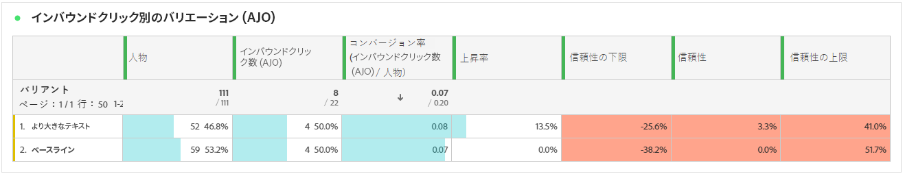

# 実験ジャーニーレポート {#campaign-global-report-cja-experimentation}

ジャーニーレポートでは、実験のパフォーマンスの全体像と、その影響を理解するのに必要な主要指標を提供します。

Journey Optimizer では、ジャーニー実験は次の 2 つのタイプに分割されます。

* [コンテンツ実験](../content-management/content-experiment.md)

  コンテンツ実験に関して詳細に示される表と KPI は、パス実験と同じです。コンテンツ実験を設定している場合は、[以下のドキュメント](#experimentation)を参照してください。

* [パス実験](../building-journeys/optimize.md)

## パス実験 {#experimentation}

### 実験 KPI {#experimentation-kpis}

**実験の概要**&#x200B;には、実験のパフォーマンスに関する主要なインサイトが表示され、最も成功した実験が特定されます。最もパフォーマンスの高い処理の判定には時間がかかる場合があります。実験が成功しなかった場合は、**決定的でない**&#x200B;に設定されます。

**実験の主要業績評価指標（KPI）**&#x200B;は包括的なダッシュボードとして機能し、実験に関連する重要な指標の分析を提供します。

+++ 詳しくは、実験 KPI 指標を参照してください

* **[!UICONTROL 上昇率]**：ベースラインに対する特定の処理のコンバージョン率の向上率を測定します。

* **[!UICONTROL 信頼性]**：ある処理がベースライン処理と同じであることを示す証拠。[詳細情報](../content-management/experiment-calculations.md#adobes-statistical-methodology-any-time-valid-confidence-sequences)

+++

### 成功指標別のバリアント {#variant-inbound}

**成功指標別のバリアント**の表には、実験の設定時に選択した成功指標に基づいて、各バリアントの実行方法が表示されます。
これらの結果の詳細と解釈について詳しくは、[このページ](../content-management/get-started-experiment.md#interpret-results)を参照してください。

+++ 成功指標別のバリアントの詳細情報

* **[!UICONTROL ユーザー]**：メッセージのターゲットプロファイルに適格な、ユーザープロファイルの数。

* **[!UICONTROL インバウンドクリック数]**：実験の作成時に以前に選択した成功指標の合計値。

* **[!UICONTROL コンバージョン率]**：実験の作成時に以前に選択した成功指標の合計値を、プロファイル数で割った値です。

* **[!UICONTROL 上昇率]**：ベースラインに対する特定の処理のコンバージョン率の向上率を測定します。

* **[!UICONTROL 信頼下限]**：選択した信頼区間内での、処理とベースライン間のコンバージョン率の差の最小推定値。

* **[!UICONTROL 信頼性]**：ある処理がベースライン処理と同じであることを示す証拠。[詳細情報](../content-management/experiment-calculations.md#adobes-statistical-methodology-any-time-valid-confidence-sequences)

* **[!UICONTROL 信頼上限]**：選択した信頼区間内での、処理とベースライン間のコンバージョン率の差の最高推定値。

+++

### 成功指標のコンバージョン率 {#conversion-rate}

**[!UICONTROL 信頼区間]**&#x200B;グラフには、選択した成功指標に対してベースラインと最もパフォーマンスの高い処理を比較し、改善の可能性のある範囲が表示されます。[詳細情報](../content-management/experiment-calculations.md#adobes-statistical-methodology-any-time-valid-confidence-sequences)
