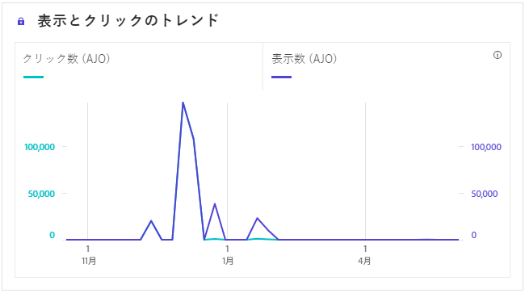
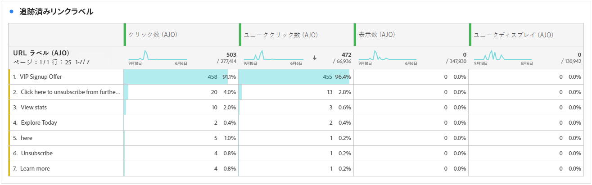
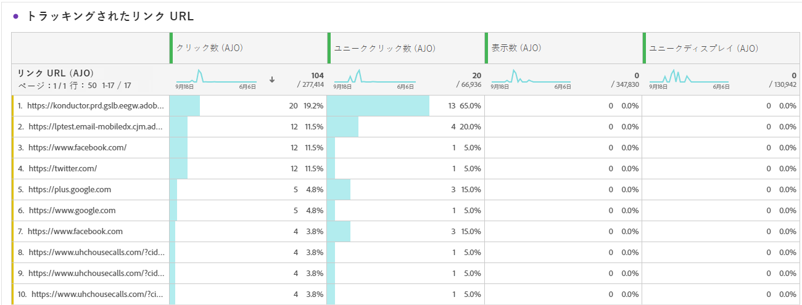

# アプリ内ジャーニーレポート {#journey-global-report}

>[!INFO]
>
>ユーザーは一度に複数のジャーニーに関与できるため、ジャーニーレポートでは、複数のジャーニーからの情報を同時に表示できます。 その結果、インバウンドコミュニケーション（アプリ内、Web、コードベース）は、同時にアクティブなジャーニーに参加しているユーザーに対してトリガーされた場合、複数のジャーニーで表示され、データが重複する可能性があります。

>[!BEGINSHADEBOX]

アプリ内ジャーニーレポートにアクセスするには、ジャーニー内の「**[!UICONTROL レポート]**」ボタンをクリックします。 [詳細情報](report-gs-cja.md)

>[!ENDSHADEBOX]

## 表示とクリックのトレンド {#display-click-trend}

**[!UICONTROL 表示とクリックのトレンド]**&#x200B;のグラフは、プロファイルがアプリ内メッセージに対するエンゲージメントを詳細に分析し、プロファイルがコンテンツとどのように関わっているかに関する貴重なインサイトを提供します。

+++ ディスプレイとクリックのトレンド指標について詳しく見る

* **[!UICONTROL クリック]**: ユーザーがアプリ内メッセージを操作した回数。

* **[!UICONTROL 表示回数]**: アプリ内メッセージがユーザーに表示された回数。

+++

## クリック数 {#clicks-inapp}

**[!UICONTROL クリック]** グラフには、アプリ内クリック指標が表示され、コンテンツのクリック総数と、コンテンツをクリックした一意のプロファイルの数の両方が示されます。

+++ クリック数の指標について詳しく見る

* **[!UICONTROL ユニーククリック]**：アプリ内メッセージのコンテンツをクリックしたプロファイルの数

* **[!UICONTROL クリック]**: ユーザーがアプリ内メッセージを操作した回数。

+++

## 表示 {#display-inapp}

**[!UICONTROL ディスプレイ]** グラフは、メッセージの全体的なリーチと、メッセージに関与しているユニーク プロファイルの数の両方を把握するのに役立ちます。

+++ 表示指標について詳しく見る

* **[!UICONTROL 表示回数]**: アプリ内メッセージがユーザーに表示された回数。

* **[!UICONTROL 一意の表示]**: メッセージが開かれた回数。1つのプロファイルの複数のインタラクションは考慮されません。

+++

## トラッキングデータ {#tracking-data-inapp}

**[!UICONTROL トラッキングデータ]** テーブルには、アプリ内メッセージに関連付けられたプロファイルアクティビティの詳細なスナップショットが表示され、エンゲージメントとアプリ内メッセージの有効性に関する重要なインサイトが提供されます。

+++ トラッキングデータ指標について詳しく見る

* **[!UICONTROL ユーザー]**: アプリ内メッセージのターゲットプロファイルとして認定されるユーザープロファイルの数。

* **[!UICONTROL クリック率（CTR）]**：アプリ内メッセージを操作したユーザーの割合。

* **[!UICONTROL クリック率（CTOR）]**：アプリ内メッセージが開かれた回数。

* **[!UICONTROL クリック]**: ユーザーがアプリ内メッセージを操作した回数。

* **[!UICONTROL ユニーククリック]**：アプリ内メッセージのコンテンツをクリックしたプロファイルの数。

* **[!UICONTROL 表示回数]**: アプリ内メッセージがユーザーに表示された回数。

* **[!UICONTROL 一意の表示]**: メッセージが開かれた回数。1つのプロファイルの複数のインタラクションは考慮されません。

* **[!UICONTROL 送信数]**：アプリ内メッセージの合計送信数。

* **[!UICONTROL インバウンドトリガー]**: ユーザーのインタラクションまたは定義済みイベントによってアプリ内メッセージがトリガーされた回数。

* **[!UICONTROL インバウンド却下]**: ユーザーがアプリ内メッセージを操作せずに却下した回数。

+++

## トラッキングされたリンクラベル {#track-link-label-inapp}

「**[!UICONTROL トラッキングされたリンクラベル]**」テーブルには、アプリ内メッセージ内のリンクラベルの包括的な概要が表示され、最も高い訪問者トラフィックを生み出すリンクラベルが強調表示されます。 この機能により、最も人気のあるリンクを特定し、優先順位を付けることができます。

+++ トラッキングされたリンクラベル指標について詳しく見る

* **[!UICONTROL ユニーククリック]**：アプリ内メッセージのコンテンツをクリックしたプロファイルの数。

* **[!UICONTROL クリック]**: ユーザーがアプリ内メッセージを操作した回数。

* **[!UICONTROL 表示回数]**: アプリ内メッセージがユーザーに表示された回数。

* **[!UICONTROL 一意の表示]**: メッセージが開かれた回数。1つのプロファイルの複数のインタラクションは考慮されません。

+++

## トラッキングされたリンク URL {#track-link-url-inapp}

**[!UICONTROL トラッキングされたリンク URL]** テーブルには、最も高い訪問者トラフィックを引き付けるアプリ内メッセージ内のURLの包括的な概要が表示されます。 これにより、最も人気のあるリンクを特定して優先順位を付けることができ、アプリ内メッセージの特定のコンテンツを使ったプロファイルエンゲージメントに対する理解を深めることができます。

+++ トラッキングされたリンク URL指標について詳しく見る

* **[!UICONTROL ユニーククリック]**：アプリ内メッセージのコンテンツをクリックしたプロファイルの数

* **[!UICONTROL クリック]**: ユーザーがアプリ内メッセージを操作した回数。

+++
