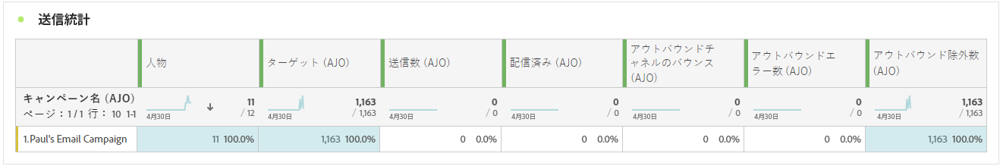
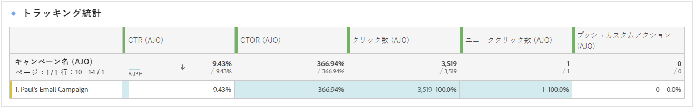
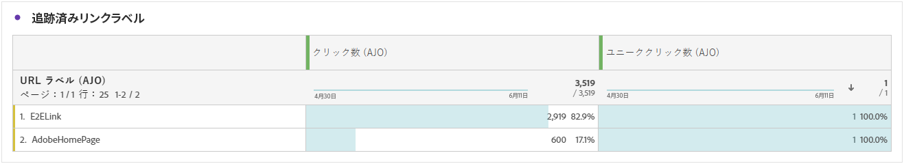
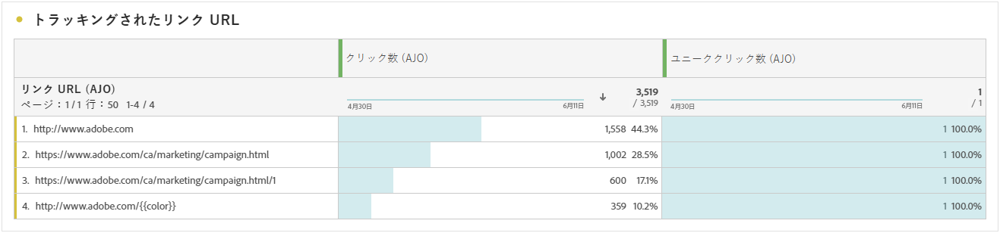
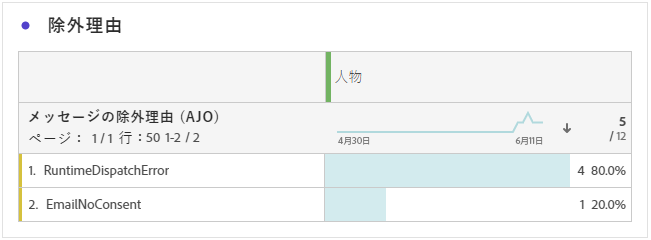

# プッシュ通知のジャーニーレポート {#journey-global-report}

## 送信統計 {#sending-statistics-push}

**[!UICONTROL 送信統計]**&#x200B;テーブルを使用すると、プッシュ通知のパフォーマンスを理解できます。ここでは、配信率やオーディエンスサイズなどの主要指標が表示され、ジャーニーの効果とリーチに関する有益なインサイトを得ることができます。

+++ 送信統計指標の詳細情報

* **[!UICONTROL ユーザー]**：SMS メッセージのターゲットプロファイルに適格な、ユーザープロファイルの数。

* **[!UICONTROL ターゲット]**：分析中に処理されたプッシュ通知の合計数。

* **[!UICONTROL 送信数]**：プッシュ通知送信の合計数。

* **[!UICONTROL 配信済み]**：送信されたプッシュ通知の合計数に対する、正常に送信されたプッシュ通知の数。

* **[!UICONTROL アウトバウンドチャネルのバウンス数]**：プッシュ通知の合計数に対する、送信プロセス中および自動返信処理中に累積したエラーの合計数。

* **[!UICONTROL アウトバウンドエラー数]**：プロファイルにメッセージを送信できなかったエラーの合計数。

* **[!UICONTROL アウトバウンド除外数]**：Adobe Journey Optimizer によって除外されたプロファイルの数。

+++

## トラッキング統計 {#tracking-statistics-push}

**[!UICONTROL トラッキング統計]**&#x200B;のテーブルには、プッシュ通知に関連するプロファイルアクティビティの詳細なスナップショットが表示され、エンゲージメントとプッシュ通知の効果に関する重要なインサイトを得ることができます。

+++ トラッキング統計指標の詳細情報

* **[!UICONTROL クリックスルー率（CTR）]**：プッシュ通知に対して何らかのアクションを起こしたユーザーの割合。

* **[!UICONTROL クリックスルー開封率（CTOR）]**：プッシュ通知が開封された回数。

* **[!UICONTROL クリック数]**：プッシュ通知のコンテンツがクリックされた回数。

* **[!UICONTROL ユニーククリック数]**：プッシュ通知のコンテンツをクリックしたプロファイルの数。

<!--
* **[!UICONTROL Push custom actions]**: 
-->
+++

## トラッキング対象リンクラベル {#track-link-label-push}

**[!UICONTROL トラッキング対象リンクラベル]**&#x200B;テーブルでは、プッシュ通知内のリンクラベルの包括的な概要を確認できます。プッシュ通知内で最も多くの訪問者トラフィックを生成するリンクラベルはハイライト表示されます。この機能を使用すると、最も人気のあるリンクを識別し、優先順位を付けることができます。

+++ トラッキング対象リンクラベル指標の詳細情報

* **[!UICONTROL ユニーククリック数]**：プッシュ通知のコンテンツをクリックしたプロファイルの数。

* **[!UICONTROL クリック数]**：プッシュ通知のコンテンツがクリックされた回数。

+++

## トラッキング対象リンク URL {#track-link-url-push}

**[!UICONTROL トラッキング対象リンク URL]** のテーブルは、プッシュ通知内で最も多くの訪問者トラフィックを集めている URL の包括的な概要を示します。これにより、最も人気のあるリンクを特定し、優先順位を付けて、プッシュ通知内の特定のコンテンツに対するプロファイルのエンゲージメントをより深く理解することができます。

+++ トラッキング対象リンク URL 指標の詳細情報

* **[!UICONTROL ユニーククリック数]**：プッシュ通知のコンテンツをクリックしたプロファイルの数。

* **[!UICONTROL クリック数]**：プッシュ通知のコンテンツがクリックされた回数。

+++

## バウンスの理由 {#bounce-reasons-push}

**[!UICONTROL バウンスの理由]**&#x200B;のテーブルには、バウンスしたプッシュ通知に関するデータの包括的な概要が表示され、プッシュ通知バウンスのインスタンスの背後にある特定の理由に関する貴重なインサイトを得ることができます。

## エラーの理由 {#error-reasons-push}

**[!UICONTROL エラーの理由]**&#x200B;テーブルを使用すると、プッシュ通知の送信プロセス中に発生した特定のエラーを識別し、発生した問題を徹底的に分析できるようになります。

## 除外された理由 {#exclude-reasons-push}

**[!UICONTROL 除外された理由]**&#x200B;テーブルは、ターゲットオーディエンスからユーザープロファイルが除外されてプッシュ通知を受信できなくなった様々な要因を、視覚的に示します。

除外理由の包括的なリストについては、[このページ](exclusion-list.md)を参照してください。
