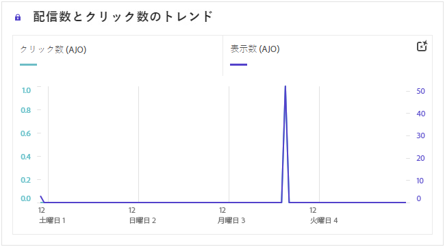
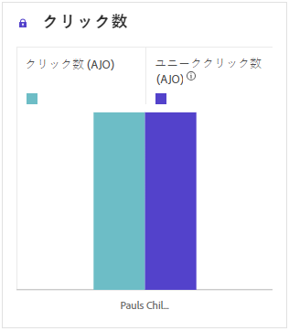
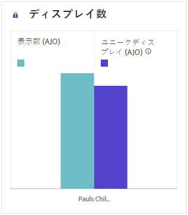
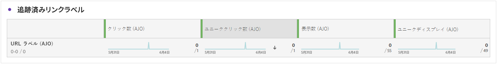

# Web ジャーニーレポート {#journey-global-report}

>[!INFO]
>
>ユーザーは一度に複数のジャーニーに関与する可能性があるので、ジャーニーレポートには複数のジャーニーの情報が同時に表示される場合があります。その結果、同時にアクティブなジャーニーに参加しているユーザーに対してインバウンド通信（アプリ内、web およびコードベース）をトリガーした場合、複数のジャーニーに表示される場合があり、データが重複する可能性があります。

>[!BEGINSHADEBOX]

ジャーニー内の「**[!UICONTROL レポートを表示]**」ボタンをクリックして、web ジャーニーレポートにアクセスできます。 [詳細情報](report-gs-cja.md)

>[!ENDSHADEBOX]

## インプレッションとクリックのトレンド {#impressions-web}

**[!UICONTROL インプレッションとクリックのトレンド]**&#x200B;のグラフには、プロファイルの web ページへのエンゲージメントに関する詳細な分析が表示され、プロファイルがコンテンツとどのようにやり取りするかについての貴重なインサイトを得ることができます。

+++ インプレッションとクリックのトレンド指標の詳細情報

* **[!UICONTROL クリック数]**：Web ページ内のコンテンツがクリックされた回数。

* **[!UICONTROL 表示数]**：メッセージが開封された回数。

+++

## クリック数 {#clicks-web}

**[!UICONTROL クリック数]**&#x200B;のグラフには、コンテンツがクリックされた合計数と、コンテンツをクリックしたユニークプロファイル数の両方を示す、web ページのクリック指標が表示されます。

+++ クリック数指標の詳細情報

* **[!UICONTROL ユニーククリック数]**：Web ページ内のコンテンツをクリックしたプロファイルの数。

* **[!UICONTROL クリック数]**：Web ページ内のコンテンツがクリックされた回数。

+++

## 表示数 {#displays-web}

**[!UICONTROL 表示数]**&#x200B;グラフは、コードベースのエクスペリエンスが開かれた全体的なリーチと、それを利用した固有のプロファイルの数の両方を理解するのに役立ちます。

+++ 表示指標の詳細情報

* **[!UICONTROL 表示数]**：コードベースエクスペリエンスが開かれた回数。

* **[!UICONTROL ユニーク表示数]**：コードベースエクスペリエンスが開かれた回数。1 つのプロファイルによる複数回のインタラクションは考慮されません。

+++

## トラッキングデータ {#track-data-web}

**[!UICONTROL トラッキングデータ]**&#x200B;のテーブルには、web ページに関連付けられているプロファイルアクティビティの詳細なスナップショットが表示され、エンゲージメントと web ページの効果に関する重要なインサイトを得ることができます。

+++ トラッキングデータ指標の詳細情報

* **[!UICONTROL 人物]**：Web ページのターゲットプロファイルに適格な、ユーザープロファイルの数。

* **[!UICONTROL クリックスルー率（CTR）]**：Web ページに対して何らかのアクションを起こしたユーザーの割合。

* **[!UICONTROL クリック数]**：Web ページ内のコンテンツがクリックされた回数。

* **[!UICONTROL ユニーククリック数]**：Web ページ内のコンテンツをクリックしたプロファイルの数。

* **[!UICONTROL 表示数]**：Web ページが開かれた回数。

* **[!UICONTROL ユニーク表示数]**：Web ページが開かれた回数。1 つのプロファイルによる複数回のインタラクションは考慮されません。

+++

## トラッキング対象リンクラベル {#track-link-web}

**[!UICONTROL トラッキング対象リンクラベル]**&#x200B;テーブルでは、web ページ内のリンクラベルの包括的な概要を確認できます。最も多くの訪問者トラフィックを生成するリンクラベルはハイライト表示されます。この機能を使用すると、最も人気のあるリンクを識別し、優先順位を付けることができます。

+++ トラッキング対象リンクラベル指標の詳細情報

* **[!UICONTROL ユニーククリック数]**：Web ページ内のコンテンツをクリックしたプロファイルの数。

* **[!UICONTROL クリック数]**：Web ページ内のコンテンツがクリックされた回数。

* **[!UICONTROL 表示数]**：メッセージが開封された回数。

* **[!UICONTROL ユニーク表示数]**：メッセージが開封された回数。1 つのプロファイルによる複数回のインタラクションは考慮されません。

+++

## トラッキング対象リンク URL {#track-url-web}

**[!UICONTROL トラッキング対象リンク URL]** のテーブルには、web ページ内で最も多くの訪問者トラフィックを集めている URL の包括的な概要が表示されます。これにより、最も人気のあるリンクを特定し、優先順位を付けて、web ページ内の特定のコンテンツに対するプロファイルのエンゲージメントをより深く理解することができます。

+++ トラッキング対象リンク URL 指標の詳細情報

* **[!UICONTROL ユニーククリック数]**：Web ページ内のコンテンツをクリックしたプロファイルの数。

* **[!UICONTROL クリック数]**：Web ページ内のコンテンツがクリックされた回数。

* **[!UICONTROL 表示数]**：メッセージが開封された回数。

* **[!UICONTROL ユニーク表示数]**：メッセージが開封された回数。1 つのプロファイルによる複数回のインタラクションは考慮されません。

+++
