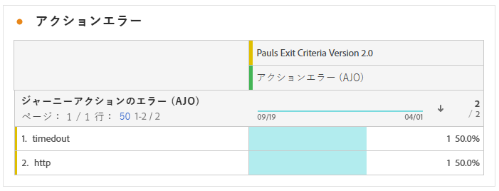

# ジャーニーレポート {#journey-global-report}

**ジャーニーレポート**&#x200B;は包括的なダッシュボードとして機能し、ジャーニーに関連する重要な指標の分析を提供します。これには、入力されたプロファイルの数や失敗した個々のジャーニーのインスタンスなどの詳細が含まれ、ジャーニーの効果とエンゲージメントのレベルを包括的に把握できます。

**ジャーニーレポート**&#x200B;は、「**[!UICONTROL レポートを表示]**」ボタンを使用して、ジャーニーから直接アクセスできます。

Customer Journey Analytics Workspaceの詳細と、データのフィルタリングおよび分析方法については、[ このページ ](https://experienceleague.adobe.com/ja/docs/analytics-platform/using/cja-workspace/home) を参照してください。

## ジャーニーの概要 {#journey-global}

**[!UICONTROL ジャーニー]**&#x200B;レポートには、ジャーニーに関する最も重要なトラッキングデータが明確に表示されます。

### ジャーニーの KPI {#journey-perfomance}

**[!UICONTROL ジャーニー]**&#x200B;の主要業績評価指標（KPI）は包括的なダッシュボードとして機能し、ジャーニーに関連する重要な指標の分析を提供します。これには、入力されたプロファイルの数や失敗した個々のジャーニーのインスタンスなどの詳細が含まれ、ジャーニーの効果とエンゲージメントのレベルを包括的に把握できます。

+++ ジャーニーKPI 指標の詳細を説明します

* **[!UICONTROL ジャーニーのエンゲージメント]**：ジャーニーの指定されたアクションポイントに到達した個別のプロファイルを表す、ジャーニーを通じて送信されたメッセージを受信した一意の個人の合計数。

* **[!UICONTROL ジャーニーのエントリ数]**：ジャーニーのエントリイベントに到達した個人の合計数。

* **[!UICONTROL ジャーニーの退出数]**：ジャーニーから退出した個人の合計数。

+++

### ジャーニーの統計 {#journey-stats}

**[!UICONTROL ジャーニーの統計]**&#x200B;テーブルには、ジャーニーに関する重要なデータの詳細な概要が表示されます。これには、失敗数や成功エントリ数などの主要な指標が含まれ、メールやジャーニーのパフォーマンスとリーチに関する貴重なインサイトを提供します。

+++ ジャーニー統計指標の詳細を説明します

* **[!UICONTROL ジャーニーの除外]**：定義済みの条件または抑制ルールによりジャーニーから除外された個人の合計数。

* **[!UICONTROL ジャーニーのエンゲージメント]**：ジャーニーの指定されたアクションポイントに到達した個別のプロファイルを表す、ジャーニーを通じて送信されたメッセージを受信した一意の個人の合計数。

* **[!UICONTROL ジャーニーのエントリ数]**：ジャーニーのエントリイベントに到達した個人の合計数。

* **[!UICONTROL ジャーニーの退出数]**：ジャーニーから退出した個人の合計数。

* **[!UICONTROL ジャーニーの失敗数]**：正常に実行されなかった個人のジャーニーの合計数。

* **[!UICONTROL ユニークジャーニーのエントリ数]**：ジャーニーのエントリイベントに到達した個人の合計数。1 つのプロファイルによる複数回のインタラクションは考慮されません。

* **[!UICONTROL ユニークジャーニーの退出数]**：ジャーニーから退出した個人の合計数。1 つのプロファイルによる複数回のインタラクションは考慮されません。

* **[!UICONTROL ユニークジャーニーの失敗数]**：正常に実行されなかった個人のジャーニーの合計数。1 つのプロファイルによる複数回のインタラクションは考慮されません。

+++

## ジャーニーの除外 {#journey-exclusion}

**[!UICONTROL ジャーニーの除外]**&#x200B;テーブルには、ユーザープロファイルの除外につながった様々な要因が包括的に表示されます。

## アクションエラー {#action-error}

**[!UICONTROL アクションエラー]**&#x200B;ウィジェットには、ジャーニーのアクションで発生した様々なエラーの詳細が表示されます。

## ジャーニーキャンバス {#journey-canvas}

**[!UICONTROL ジャーニーキャンバス]**&#x200B;ウィジェットには、ターゲットプロファイルのジャーニーの進行状況が視覚的に表示されます。[詳しくは、Customer Journey Analytics ドキュメントを参照してください。](https://experienceleague.adobe.com/ja/docs/analytics-platform/using/cja-workspace/visualizations/journey-canvas/journey-canvas)

次のオプションを使用して、キャンバスのカスタマイズを強化します。

* **[!UICONTROL ノードタイプ]**&#x200B;ドロップダウンメニューから、メッセージや条件などの目的のアクティビティタイプを追加または削除します。
* **[!UICONTROL パーセンテージ値]**&#x200B;を調整して、様々なジャーニーパス間のフローの配分を決定します。
* **[!UICONTROL 矢印設定]**&#x200B;をカスタマイズして、ラベルや条件を含めるか、クリーンな表示を選択します。
* 「**[!UICONTROL フォールアウトを表示]**」オプションを有効にし、ジャーニーを退出したプロファイルをキャンバス上で直接視覚化します。

**[!UICONTROL ノードタイプ]**&#x200B;フィルタリングを使用する場合、次のルールが適用されます。

* ノード上にセグメントを作成する場合、**[!UICONTROL ノードタイプ]**&#x200B;フィルターでそのノードが除外されている場合でも、作成したセグメントにジャーニーの初期段階のノードが含まれます。

* ジャーニーの初期段階のノードが&#x200B;**[!UICONTROL ノードタイプ]**&#x200B;フィルターで除外されている場合、矢印から形成されたセグメントを作成することはできません。この場合、これらの矢印の右クリック機能は無効になります。

## アクションパフォーマンス {#action-performance}

### パフォーマンスの推移 {#action-overtime}

**[!UICONTROL パフォーマンスの推移]**&#x200B;のグラフを使用すると、アクションのターゲットプロファイルと見なされる条件を満たすプロファイルの数を識別して分析できます。このビジュアライゼーションでは、戦略の効果に関する貴重なインサイトを提供し、データ駆動型の意思決定を行ってパフォーマンスを最適化するのに役立ちます。

### アクションの概要 {#action-overview}

**[!UICONTROL アクションの概要]**&#x200B;テーブルは、包括的なダッシュボードとして機能し、ジャーニーのアクションに関連する主要指標の分析を提供します。これには、インタラクション数やクリックスルー率などの重要な詳細が含まれます

+++ アクションの概要指標の詳細を学ぶ

* **[!UICONTROL ノードのエントリ数]**：ジャーニー内の特定のノードにエントリした個人の合計数。

* **[!UICONTROL ジャーニーの失敗]**：正常に実行されなかった個別ジャーニーの合計数。

* **[!UICONTROL クリックスルー率]**：アクションに対してインタラクションを行ったユーザーの割合。

* **[!UICONTROL クリック数]**：アクションでコンテンツがクリックされた回数。

* **[!UICONTROL 配信済み]**：送信されたアクションの合計数に対する、正常に送信されたアクションの数。

+++

## イベントパフォーマンス {#events-performance}

### パフォーマンスの推移 {#event-overtime}

**[!UICONTROL パフォーマンスの推移]**&#x200B;のグラフを使用すると、イベントのターゲットプロファイルに適格な、プロファイルの数を識別して分析できます。この強力なツールは、トレンドとパターンの推移を追跡するのに役立ち、イベント戦略を最適化するための貴重なインサイトを提供します。

### イベントの概要 {#event-overview}

**[!UICONTROL イベントの概要]**&#x200B;テーブルには、イベント条件を満たすプロファイルの数の推移が表示されます。このツールは、選定率のパターンを識別してイベント戦略を絞り込むのに役立ちます。

+++ ジャーニー統計指標の詳細を説明します

* **[!UICONTROL 人物]**：イベントのターゲットプロファイルに適格な、ユーザープロファイルの数。

+++
