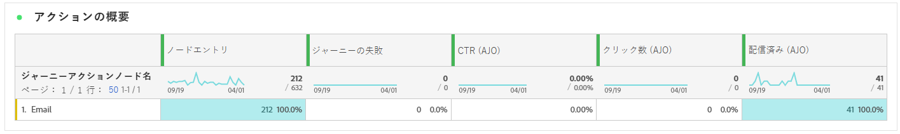
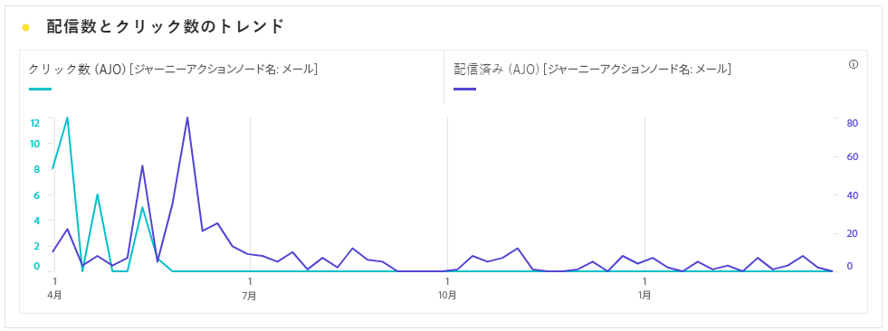
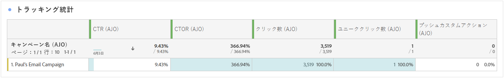
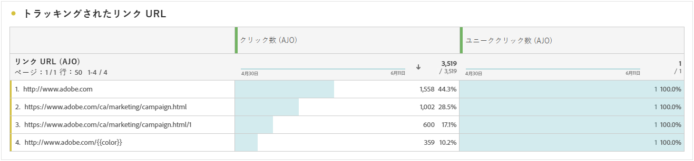
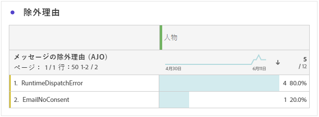
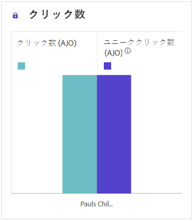

# ジャーニーレポート {#journey-global-report}

**ジャーニーレポート**&#x200B;は包括的なダッシュボードとして機能し、ジャーニーに関連する重要な指標の分析を提供します。これには、入力されたプロファイルの数や失敗した個々のジャーニーのインスタンスなどの詳細が含まれ、ジャーニーの効果とエンゲージメントのレベルを包括的に把握できます。

**ジャーニーレポート**&#x200B;は、「**[!UICONTROL レポートを表示]**」ボタンを使用して、ジャーニーから直接アクセスできます。

**[!UICONTROL ジャーニーレポート]**&#x200B;ページには、ジャーニーのメッセージアクティビティに応じて、次のタブが表示されます。

* [ジャーニー](#journey-global)
* [メール](#email-global)
* [プッシュ](#push-global)
* [SMS](#sms-global)
* [アプリ内](#in-app-global)
* [Web](#web-cja)
* [ダイレクトメール](#direct-mail-cja)

Customer Journey Analytics ワークスペースの詳細と、データのフィルタリングおよび分析方法については、[このページ](https://experienceleague.adobe.com/ja/docs/analytics-platform/using/cja-workspace/home)を参照してください。

## ジャーニーの概要 {#journey-global}

**[!UICONTROL ジャーニー]**&#x200B;レポートには、ジャーニーに関する最も重要なトラッキングデータが明確に表示されます。

### ジャーニーの KPI {#journey-perfomance}

**[!UICONTROL ジャーニー]**&#x200B;の主要業績評価指標（KPI）は包括的なダッシュボードとして機能し、ジャーニーに関連する重要な指標の分析を提供します。これには、入力されたプロファイルの数や失敗した個々のジャーニーのインスタンスなどの詳細が含まれ、ジャーニーの効果とエンゲージメントのレベルを包括的に把握できます。

+++ ジャーニーの KPI 指標の詳細情報

* **[!UICONTROL ジャーニーのエンゲージメント]**：ジャーニーから送信されたメッセージとやり取りした個人の合計数

* **[!UICONTROL ジャーニーのエントリ数]**：ジャーニーのエントリイベントに到達した個人の合計数。

* **[!UICONTROL ジャーニーの退出数]**：ジャーニーから退出した個人の合計数。

* **[!UICONTROL ジャーニーの失敗数]**：正常に実行されなかった個人のジャーニーの合計数。

+++

### ジャーニーの統計 {#journey-stats}

**[!UICONTROL ジャーニーの統計]**&#x200B;テーブルには、ジャーニーに関する重要なデータの詳細な概要が表示されます。これには、失敗数や成功エントリ数などの主要な指標が含まれ、メールやジャーニーのパフォーマンスとリーチに関する貴重なインサイトを提供します。

+++ ジャーニーの統計指標の詳細情報

* **[!UICONTROL ジャーニーのエンゲージメント]**：ジャーニーから送信されたメッセージとやり取りした個人の合計数。

* **[!UICONTROL ジャーニーのエントリ数]**：ジャーニーのエントリイベントに到達した個人の合計数。

* **[!UICONTROL ジャーニーの退出数]**：ジャーニーから退出した個人の合計数。

* **[!UICONTROL ジャーニーの失敗数]**：正常に実行されなかった個人のジャーニーの合計数。

* **[!UICONTROL ユニークジャーニーのエントリ数]**：ジャーニーのエントリイベントに到達した個人の合計数。1 つのプロファイルによる複数回のインタラクションは考慮されません。

* **[!UICONTROL ユニークジャーニーの退出数]**：ジャーニーから退出した個人の合計数。1 つのプロファイルによる複数回のインタラクションは考慮されません。

* **[!UICONTROL ユニークジャーニーの失敗数]**：正常に実行されなかった個人のジャーニーの合計数。1 つのプロファイルによる複数回のインタラクションは考慮されません。

+++

## ジャーニーキャンバス {#journey-canvas}

**[!UICONTROL ジャーニーキャンバス]**&#x200B;ウィジェットには、ターゲットプロファイルのジャーニーの進行状況が視覚的に表示されます。

次のオプションを使用して、キャンバスのカスタマイズを強化します。

* **[!UICONTROL ノードタイプ]**&#x200B;ドロップダウンメニューから、メッセージや条件などの目的のアクティビティタイプを追加または削除します。
* **[!UICONTROL パーセンテージ値]**&#x200B;を調整して、様々なジャーニーパス間のフローの配分を決定します。
* **[!UICONTROL 矢印設定]**&#x200B;をカスタマイズして、ラベルや条件を含めるか、クリーンな表示を選択します。
* 「**[!UICONTROL フォールアウトを表示]**」オプションを有効にし、ジャーニーを退出したプロファイルをキャンバス上で直接視覚化します。

## アクションパフォーマンス {#action-performance}

### パフォーマンスの推移 {#action-overtime}

**[!UICONTROL パフォーマンスの推移]**&#x200B;のグラフを使用すると、アクションのターゲットプロファイルと見なされる条件を満たすプロファイルの数を識別して分析できます。このビジュアライゼーションでは、戦略の効果に関する貴重なインサイトを提供し、データ駆動型の意思決定を行ってパフォーマンスを最適化するのに役立ちます。

### アクションの概要 {#action-overview}

**[!UICONTROL アクションの概要]**&#x200B;テーブルは、包括的なダッシュボードとして機能し、ジャーニーのアクションに関連する主要指標の分析を提供します。これには、インタラクション数やクリックスルー率などの重要な詳細が含まれます

+++ アクションの概要指標の詳細情報

* **[!UICONTROL 人物]**：アクションのターゲットプロファイルに適格な、ユーザープロファイルの数。

* **[!UICONTROL クリックスルー率]**：アクションに対して何らかのアクションを起こしたユーザーの割合。

* **[!UICONTROL クリック数]**：アクションでコンテンツがクリックされた回数。

* **[!UICONTROL 配信済み]**：送信されたアクションの合計数に対する、正常に送信されたアクションの数。

+++

## イベントパフォーマンス {#events-performance}

### パフォーマンスの推移 {#event-overtime}

**[!UICONTROL パフォーマンスの推移]**&#x200B;のグラフを使用すると、イベントのターゲットプロファイルに適格な、プロファイルの数を識別して分析できます。この強力なツールは、トレンドとパターンの推移を追跡するのに役立ち、イベント戦略を最適化するための貴重なインサイトを提供します。

### イベントの概要 {#event-overview}

**[!UICONTROL イベントの概要]**&#x200B;テーブルには、イベント条件を満たすプロファイルの数の推移が表示されます。このツールは、選定率のパターンを識別してイベント戦略を絞り込むのに役立ちます。

+++ ジャーニーの統計指標の詳細情報

* **[!UICONTROL 人物]**：イベントのターゲットプロファイルに適格な、ユーザープロファイルの数。

+++

## メールの詳細 {#email-global}

ジャーニーレポートの「**[!UICONTROL メール]**」タブには、ジャーニーで送信されたメールに関する主な情報が詳細に表示されます。

### 配信済みとクリックのトレンド {#delivered-click}

**[!UICONTROL 配信済みとクリックのトレンド]**&#x200B;のグラフには、プロファイルのメールへのエンゲージメントに関する詳細な分析が表示され、様々なドメインがコンテンツとどのようにやり取りするかに関する貴重なインサイトを得ることができます。

+++ 配信済み指標とクリックトレンド指標の詳細情報

* **[!UICONTROL 配信済み]**：送信されたメッセージの合計数に対する、正常に送信されたメッセージの数。

* **[!UICONTROL クリック数]**：メールでコンテンツがクリックされた回数。

+++

### 配信ステータス {#delivery-status}

**[!UICONTROL 配信ステータス]**&#x200B;のグラフを使用すると、メールのパフォーマンスを一目で確認できます。配信やバウンスなどの主要指標を追跡することで、メールジャーニーの効率をすばやく把握できます。

+++ 配信ステータス指標の詳細情報

* **[!UICONTROL 配信済み]**：送信されたメッセージの合計数に対する、正常に送信されたメッセージの数。

* **[!UICONTROL アウトバウンドチャネルのバウンス数]**：送信されたメッセージの合計数に対する、送信プロセス中および自動返信処理中に累積したエラーの合計数。

* **[!UICONTROL アウトバウンドエラー数]**：送信プロセス中に発生し、プロファイルにメッセージを送信できなかったエラーの合計数。

* **[!UICONTROL 除外済み]**：Adobe Journey Optimizer によって除外されたプロファイルの数。

+++

### 送信統計 {#email-sending-statistics}

**[!UICONTROL 送信統計]**&#x200B;テーブルには、ジャーニー内でのメールのパフォーマンスに関する明確なビューが表示されます。配信率やインタラクションなどの主要指標を追跡し、メール戦略を最適化してリーチとエンゲージメントを向上させるための貴重なインサイトを提供します。

+++ 送信統計指標の詳細情報

* **[!UICONTROL ユーザー]**：メッセージのターゲットプロファイルに適格な、ユーザープロファイルの数。

* **[!UICONTROL ターゲット]**：送信プロセス中に処理されたメールの合計数。

* **[!UICONTROL 送信数]**：メール送信の合計数。

* **[!UICONTROL 配信済み]**：送信されたメッセージの総数に対する、正常に送信されたメッセージの数。

* **[!UICONTROL バウンス数]**：送信されたメッセージの合計数に対する、送信プロセス中および自動返信処理中に累積したエラーの合計数。

* **[!UICONTROL アウトバウンドエラー数]**：送信プロセス中に発生し、プロファイルにメッセージを送信できなかったエラーの合計数。

* **[!UICONTROL アウトバウンド除外数]**：Adobe Journey Optimizer によって除外されたプロファイルの数。

+++

### メール - トラッキング統計 {#email-tracking}

**[!UICONTROL メール - トラッキング統計]**&#x200B;のテーブルには、ジャーニーに含まれるメールに関連するプロファイルアクティビティの詳細な説明が表示されます。これには、開封数、クリック数、その他の関連するエンゲージメント指標など、プロファイルがメールコンテンツとどのようにやり取りしたかを包括的に示す指標が含まれます。

+++ トラッキング統計指標の詳細情報

* **[!UICONTROL クリックスルー率（CTR）]**：メールに対して何らかのアクションを起こしたユーザーの割合。

* **[!UICONTROL クリックスルー開封率（CTOR）]**：メールが開封された回数。

* **[!UICONTROL クリック数]**：メールでコンテンツがクリックされた回数。

* **[!UICONTROL ユニーククリック数]**：メールでコンテンツをクリックしたプロファイルの数。

* **[!UICONTROL メール開封数]**：ジャーニーでメールが開かれた回数。

* **[!UICONTROL ユニークメール開封数]**：開封されたメールの割合。

* **[!UICONTROL スパムのの苦情数]**：メッセージがスパムまたはジャンクとして宣言された回数。

* **[!UICONTROL 登録解除]**：登録解除リンクのクリック数。

+++

### メールドメイン {#email-domains}

**[!UICONTROL メールドメイン]**&#x200B;テーブルには、ドメイン別に分類されたメールの詳細な分類が表示され、メールジャーニーのパフォーマンス指標に関する広範なインサイトを得ることができます。この包括的な分析により、メールコンテンツに対する様々なドメインの動作を理解できます。

+++ メールドメイン指標の詳細情報

* **[!UICONTROL 送信数]**：メールの送信の合計数。

* **[!UICONTROL 配信済み]**：送信されたメッセージの合計数に対する、正常に送信されたメッセージの数。

* **[!UICONTROL メール開封数]**：ジャーニーでメールが開かれた回数。

* **[!UICONTROL クリック数]**：メールでコンテンツがクリックされた回数。

* **[!UICONTROL アウトバウンドチャネルのバウンス数]**：送信メールの合計数に対する、送信プロセス中および自動返信処理中に累積したエラーの合計数。

* **[!UICONTROL アウトバウンドエラー数]**：送信プロセス中に発生し、プロファイルにメッセージを送信できなかったエラーの合計数。
+++

### トラッキング対象リンクラベル {#track-link-label}

**[!UICONTROL トラッキング対象リンクラベル]**&#x200B;テーブルでは、メール内のリンクラベルの包括的な概要を確認できます。最も多くの訪問者トラフィックを生成するリンクラベルはハイライト表示されます。この機能を使用すると、最も人気のあるリンクを識別し、優先順位を付けることができます。

+++ トラッキング対象リンクラベル指標の詳細情報

* **[!UICONTROL ユニーククリック数]**：メールでコンテンツをクリックしたプロファイルの数。

* **[!UICONTROL クリック数]**：メールでコンテンツがクリックされた回数。

+++

### トラッキング対象リンク URL {#track-link-url}

**[!UICONTROL トラッキング対象リンク URL]** のテーブルには、メール内で最も多くの訪問者トラフィックを集めている URL の包括的な概要が表示されます。これにより、最も人気のあるリンクを特定し、優先順位を付けて、メール内の特定のコンテンツに対するプロファイルのエンゲージメントへの理解を深めることができます。

+++ トラッキング対象リンク URL 指標の詳細情報

* **[!UICONTROL ユニーククリック数]**：メールでコンテンツをクリックしたプロファイルの数。

* **[!UICONTROL クリック数]**：メールでコンテンツがクリックされた回数。

* **[!UICONTROL 表示数]**：メッセージが開封された回数。

* **[!UICONTROL ユニーク表示数]**：メッセージが開かれた回数。1 つのプロファイルによる複数回のインタラクションは考慮されません。

+++

### メールの件名 {#email-subject}

**[!UICONTROL メールの件名]**&#x200B;テーブルには、最も多くの訪問者トラフィックを集めているメール件名の完全な概要が表示されます。このリソースでは、オーディエンスのエンゲージメントのダイナミクスに関する貴重なインサイトが提供されます。

+++ メールの件名指標の詳細情報

* **[!UICONTROL ユーザー]**：メールのターゲットプロファイルとして適合するユーザープロファイルの数。

+++

### バウンスの理由 {#email-bounce-reasons}

**[!UICONTROL バウンスの理由]**&#x200B;のテーブルには、バウンスメッセージに関連する使用可能なデータが集計され、メールのバウンスの背後にある特定の理由とカテゴリに関する詳細なインサイトが提供されます。

バウンスについて詳しくは、[抑制リスト](../reports/suppression-list.md)のページを参照してください。

### 除外された理由 {#email-excluded}

**[!UICONTROL 除外された理由]**&#x200B;のテーブルには、ターゲットオーディエンスからユーザープロファイルを除外した結果、メッセージが受信されなかった様々な要因の包括的な見解が表示されます。

除外の理由の包括的なリストについては、[このページ](exclusion-list.md)を参照してください。

### エラーの理由 {#email-errors}

**[!UICONTROL エラーの理由]**&#x200B;テーブルには、送信プロセス中に発生した特定のエラーが表示され、エラーの特性と発生に関する貴重な情報が提供されます。

## 「プッシュ通知」タブ {#push-global}

ジャーニーレポートの「**[!UICONTROL プッシュ通知]**」タブには、ジャーニーで送信されるプッシュ通知に関連する主な情報が詳しく表示されます。

## プッシュ通知 {#push-notification}

### 送信統計 {#sending-statistics-push}

**[!UICONTROL 送信統計]**&#x200B;テーブルを使用すると、プッシュ通知のパフォーマンスを理解できます。ここでは、配信率やオーディエンスサイズなどの主要指標が表示され、ジャーニーの効果とリーチに関する有益なインサイトを得ることができます。

+++ 送信統計指標の詳細情報

* **[!UICONTROL ユーザー]**：SMS メッセージのターゲットプロファイルに適格な、ユーザープロファイルの数。

* **[!UICONTROL ターゲット]**：分析中に処理されたプッシュ通知の合計数。

* **[!UICONTROL 送信数]**：プッシュ通知送信の合計数。

* **[!UICONTROL 配信済み]**：送信されたプッシュ通知の合計数に対する、正常に送信されたプッシュ通知の数。

* **[!UICONTROL アウトバウンドチャネルのバウンス数]**：プッシュ通知の合計数に対する、送信プロセス中および自動返信処理中に累積したエラーの合計数。

* **[!UICONTROL アウトバウンドエラー数]**：プロファイルにメッセージを送信できなかったエラーの合計数。

* **[!UICONTROL アウトバウンド除外数]**：Adobe Journey Optimizer によって除外されたプロファイルの数。

+++

### トラッキング統計 {#tracking-statistics-push}

**[!UICONTROL トラッキング統計]**&#x200B;のテーブルには、プッシュ通知に関連するプロファイルアクティビティの詳細なスナップショットが表示され、エンゲージメントとプッシュ通知の効果に関する重要なインサイトを得ることができます。

+++ トラッキング統計指標の詳細情報

* **[!UICONTROL クリックスルー率（CTR）]**：プッシュ通知に対して何らかのアクションを起こしたユーザーの割合。

* **[!UICONTROL クリックスルー開封率（CTOR）]**：プッシュ通知が開封された回数。

* **[!UICONTROL クリック数]**：プッシュ通知のコンテンツがクリックされた回数。

* **[!UICONTROL ユニーククリック数]**：プッシュ通知のコンテンツをクリックしたプロファイルの数。

<!--
* **[!UICONTROL Push custom actions]**: 
-->
+++

### トラッキング対象リンクラベル {#track-link-label-push}

**[!UICONTROL トラッキング対象リンクラベル]**&#x200B;テーブルでは、プッシュ通知内のリンクラベルの包括的な概要を確認できます。プッシュ通知内で最も多くの訪問者トラフィックを生成するリンクラベルはハイライト表示されます。この機能を使用すると、最も人気のあるリンクを識別し、優先順位を付けることができます。

+++ トラッキング対象リンクラベル指標の詳細情報

* **[!UICONTROL ユニーククリック数]**：プッシュ通知のコンテンツをクリックしたプロファイルの数。

* **[!UICONTROL クリック数]**：プッシュ通知のコンテンツがクリックされた回数。

+++

### トラッキング対象リンク URL {#track-link-url-push}

**[!UICONTROL トラッキング対象リンク URL]** のテーブルは、プッシュ通知内で最も多くの訪問者トラフィックを集めている URL の包括的な概要を示します。これにより、最も人気のあるリンクを特定し、優先順位を付けて、プッシュ通知内の特定のコンテンツに対するプロファイルのエンゲージメントをより深く理解することができます。

+++ トラッキング対象リンク URL 指標の詳細情報

* **[!UICONTROL ユニーククリック数]**：プッシュ通知のコンテンツをクリックしたプロファイルの数。

* **[!UICONTROL クリック数]**：プッシュ通知のコンテンツがクリックされた回数。

+++

### バウンスの理由 {#bounce-reasons-push}

**[!UICONTROL バウンスの理由]**&#x200B;のテーブルには、バウンスしたプッシュ通知に関するデータの包括的な概要が表示され、プッシュ通知バウンスのインスタンスの背後にある特定の理由に関する貴重なインサイトを得ることができます。

### エラーの理由 {#error-reasons-push}

**[!UICONTROL エラーの理由]**&#x200B;テーブルを使用すると、プッシュ通知の送信プロセス中に発生した特定のエラーを識別し、発生した問題を徹底的に分析できるようになります。

### 除外された理由 {#exclude-reasons-push}

**[!UICONTROL 除外された理由]**&#x200B;テーブルは、ターゲットオーディエンスからユーザープロファイルが除外されてプッシュ通知を受信できなくなった様々な要因を、視覚的に示します。

除外理由の包括的なリストについては、[このページ](exclusion-list.md)を参照してください。

## SMS {#sms}

### 配信済みとクリックのトレンド {#delivered-click-sms}

**[!UICONTROL 配信済みとクリックのトレンド]**&#x200B;のグラフには、プロファイルの SMS メッセージへのエンゲージメントに関する詳細な分析が表示され、様々なドメインがコンテンツとどのようにやり取りするかに関する貴重なインサイトを得ることができます。

+++ 配信済み指標とクリックトレンド指標の詳細情報

* **[!UICONTROL 配信済み]**：SMS メッセージの合計数に対する、正常に送信された SMS メッセージの数。

* **[!UICONTROL クリック数]**：SMS メッセージでコンテンツがクリックされた回数。

+++

### 配信ステータス {#delivery-status-sms}

**[!UICONTROL 配信ステータス]**&#x200B;のテーブルには、SMS メッセージに関連するプロファイルアクティビティの詳細なアカウントが表示されます。これには、配信済み、クリック数、その他の関連するエンゲージメント指標など、プロファイルが SMS コンテンツとどのようにやり取りするかを包括的に示す指標が含まれます。

+++ 配信ステータス指標の詳細情報

* **[!UICONTROL 配信済み]**：SMS メッセージの合計数に対する、正常に送信された SMS メッセージの数。

* **[!UICONTROL アウトバウンドチャネルのバウンス数]**：送信された SMS メッセージの合計数に対する、送信プロセス中および自動返信処理中に累積したエラーの合計数。

* **[!UICONTROL アウトバウンドエラー数]**：プロファイルにメッセージを送信できなかったエラーの合計数。

* **[!UICONTROL アウトバウンド除外数]**：Adobe Journey Optimizer によって除外されたプロファイルの数。

+++

### トラッキング対象リンクラベル {#track-link-label-sms}

**[!UICONTROL トラッキング対象リンクラベル]**&#x200B;テーブルでは、SMS メッセージ内のリンクラベルの包括的な概要を確認できます。最も多くの訪問者トラフィックを生成するリンクラベルはハイライト表示されます。この機能を使用すると、最も人気のあるリンクを識別し、優先順位を付けることができます。

+++ トラッキング対象リンクラベル指標の詳細情報

* **[!UICONTROL ユニーククリック数]**：SMS メッセージでコンテンツをクリックしたプロファイルの数。

* **[!UICONTROL クリック数]**：SMS メッセージでコンテンツがクリックされた回数。

+++

### トラッキング対象リンク URL {#track-link-url-sms}

**[!UICONTROL トラッキング対象リンク URL]** のテーブルには、SMS メッセージ内で最も多くの訪問者トラフィックを集めている URL の包括的な概要が表示されます。これにより、最も人気のあるリンクを特定し、優先順位を付けることができ、SMS メッセージ内の特定のコンテンツに対するプロファイルのエンゲージメントをより深く理解することができます。

+++ トラッキング対象リンク URL 指標の詳細情報

* **[!UICONTROL ユニーククリック数]**：SMS メッセージでコンテンツをクリックしたプロファイルの数。

* **[!UICONTROL クリック数]**：SMS メッセージでコンテンツがクリックされた回数。

* **[!UICONTROL 表示数]**：メッセージが開封された回数。

* **[!UICONTROL ユニーク表示数]**：メッセージが開封された回数。1 つのプロファイルによる複数回のインタラクションは考慮されません。

+++

### SMS インバウンドメッセージ {#sms-inbound}

**[!UICONTROL SMS インバウンドメッセージ]**&#x200B;のテーブルには、最も多くの訪問者トラフィックを集めている SMS メッセージの詳細な概要が表示されます。このリソースでは、オーディエンスのエンゲージメントのダイナミクスに関する貴重なインサイトが提供されます。

+++ SMS インバウンドメッセージ指標の詳細情報

* **[!UICONTROL 人物]**：SMS メッセージのターゲットプロファイルに適格な、ユーザープロファイルの数。

+++

### SMS メッセージタイプ {#sms-message-type}

**[!UICONTROL SMS メッセージタイプ]**&#x200B;のテーブルには、最も多くの訪問者トラフィックを集めている SMS メッセージタイプの完全な概要が表示されます。このリソースでは、オーディエンスのエンゲージメントのダイナミクスに関する貴重なインサイトが提供されます。

+++ SMS メッセージタイプ指標の詳細情報

* **[!UICONTROL 人物]**：SMS メッセージのターゲットプロファイルに適格な、ユーザープロファイルの数。

+++

### SMS プロバイダー {#sms-providers}

**[!UICONTROL SMS プロバイダー]**&#x200B;のテーブルには、最も多くの訪問者トラフィックを集めている SMS プロバイダーの完全な概要が表示されます。このリソースでは、オーディエンスのエンゲージメントのダイナミクスに関する貴重なインサイトが提供されます。

+++ SMS プロバイダー指標の詳細情報

* **[!UICONTROL 人物]**：SMS メッセージのターゲットプロファイルに適格な、ユーザープロファイルの数。

+++

### バウンスの理由 {#bounce-reasons-sms}

**[!UICONTROL バウンスの理由]**&#x200B;のテーブルには、バウンスした SMS メッセージに関するデータの包括的な概要が表示され、SMS メッセージバウンスの事例の背後にある特定の理由に関する貴重なインサイトを得ることができます。

### エラーの理由 {#error-reasons-sms}

**[!UICONTROL エラー理由]**&#x200B;のテーブルを使用すると、SMS メッセージの送信プロセス中に発生した特定のエラーを識別し、発生した問題を徹底的に分析できるようになります。

### 除外された理由 {#excluded-reasons-sms}

**[!UICONTROL 除外された理由]**&#x200B;のテーブルには、ターゲットオーディエンスからユーザープロファイルを除外した結果、SMS メッセージを受信できない原因となった様々な要因が視覚的に表示されます。

除外理由の包括的なリストについては、[このページ](exclusion-list.md)を参照してください。

## アプリ内

### インプレッションとクリックのトレンド {#impression-click-trend}

**[!UICONTROL インプレッションとクリックのトレンド]**&#x200B;のグラフには、プロファイルのアプリ内メッセージへのエンゲージメントに関する詳細な分析が表示され、プロファイルがコンテンツとどのようにやり取りするかについての貴重なインサイトを得ることができます。

+++ インプレッションとクリックのトレンド指標の詳細情報

* **[!UICONTROL クリック数]**：アプリ内メッセージでコンテンツがクリックされた回数。

* **[!UICONTROL 表示数]**：メッセージが開封された回数。

+++

### クリック数 {#clicks-inapp}

**[!UICONTROL クリック数]**&#x200B;のグラフには、アプリ内クリック指標と、コンテンツのクリック総数と、コンテンツをクリックした固有のプロファイル数の両方が表示されます。

+++ クリック数指標の詳細情報

* **[!UICONTROL ユニーククリック数]**：アプリ内メッセージでコンテンツをクリックしたプロファイルの数。

* **[!UICONTROL クリック数]**：アプリ内メッセージでコンテンツがクリックされた回数。

+++

### 表示 {#display-inapp}

**[!UICONTROL 表示数]**&#x200B;グラフは、メッセージの全体的なリーチと、メッセージに対して何らかのインタラクションを行ったユニークプロファイルの数の両方を理解するのに役立ちます。

+++ 表示指標の詳細情報

* **[!UICONTROL 表示数]**：メッセージが開封された回数。

* **[!UICONTROL ユニーク表示数]**：メッセージが開封された回数。1 つのプロファイルによる複数回のインタラクションは考慮されません。

+++

### トラッキングデータ {#tracking-data-inapp}

**[!UICONTROL プッシュ - トラッキング統計]**&#x200B;のテーブルには、アプリ内メッセージと結びつけられたプロファイルアクティビティの詳細なスナップショットが表示され、エンゲージメントとアプリ内メッセージの効果に関する重要なインサイトを得ることができます。

+++ トラッキングデータ指標の詳細情報

* **[!UICONTROL 人物]**：アプリ内メッセージのターゲットプロファイルに適格な、ユーザープロファイルの数。

* **[!UICONTROL クリックスルー率（CTR）]**：アプリ内メッセージに対して何らかのアクションを起こしたユーザーの割合。

* **[!UICONTROL クリックスルー開封率（CTOR）]**：アプリ内メッセージが開封された回数。

* **[!UICONTROL クリック数]**：アプリ内メッセージでコンテンツがクリックされた回数。

* **[!UICONTROL ユニーククリック数]**：アプリ内メッセージでコンテンツをクリックしたプロファイルの数。

* **[!UICONTROL 表示数]**：メッセージが開封された回数。

* **[!UICONTROL ユニーク表示数]**：メッセージが開封された回数。1 つのプロファイルによる複数回のインタラクションは考慮されません。。

* **[!UICONTROL 送信数]**：アプリ内メッセージ用の送信の合計数。

<!--
* **[!UICONTROL Inbound triggered]**: 

* **[!UICONTROL Inbound dismisses]**: 
-->
+++

### トラッキング対象リンクラベル {#track-link-label-inapp}

**[!UICONTROL トラッキング対象リンクラベル]**&#x200B;テーブルでは、アプリ内メッセージ内のリンクラベルの包括的な概要を確認できます。最も多くの訪問者トラフィックを生成するリンクラベルはハイライト表示されます。この機能を使用すると、最も人気のあるリンクを識別し、優先順位を付けることができます。

+++ トラッキング対象リンクラベル指標の詳細情報

* **[!UICONTROL ユニーククリック数]**：アプリ内メッセージのコンテンツをクリックしたプロファイルの数。

* **[!UICONTROL クリック数]**：アプリ内メッセージでコンテンツがクリックされた回数。

* **[!UICONTROL 表示数]**：メッセージが開封された回数。

* **[!UICONTROL ユニーク表示数]**：メッセージが開封された回数。1 つのプロファイルによる複数回のインタラクションは考慮されません。

+++

### トラッキング対象リンク URL {#track-link-url-inapp}

**[!UICONTROL トラッキング対象リンク URL]** のテーブルには、アプリ内メッセージ内で最も多くの訪問者トラフィックを集めている URL の包括的な概要が表示されます。これにより、最も人気のあるリンクを特定し、優先順位を付けるて、アプリ内メッセージ内の特定のコンテンツに対するプロファイルのエンゲージメントをより深く理解することができます。

+++ トラッキング対象リンク URL 指標の詳細情報

* **[!UICONTROL ユニーククリック数]**：アプリ内メッセージでコンテンツをクリックしたプロファイルの数。

* **[!UICONTROL クリック数]**：アプリ内メッセージでコンテンツがクリックされた回数。

+++

## Web {#web-cja}

### インプレッションとクリックのトレンド {#impressions-web}

**[!UICONTROL インプレッションとクリックのトレンド]**&#x200B;のグラフには、プロファイルの web ページへのエンゲージメントに関する詳細な分析が表示され、プロファイルがコンテンツとどのようにやり取りするかについての貴重なインサイトを得ることができます。

+++ インプレッションとクリックのトレンド指標の詳細情報

* **[!UICONTROL クリック数]**：Web ページ内のコンテンツがクリックされた回数。

* **[!UICONTROL 表示数]**：メッセージが開封された回数。

+++

### クリック数 {#clicks-web}

**[!UICONTROL クリック数]**&#x200B;のグラフには、コンテンツがクリックされた合計数と、コンテンツをクリックしたユニークプロファイル数の両方を示す、web ページのクリック指標が表示されます。

+++ クリック数指標の詳細情報

* **[!UICONTROL ユニーククリック数]**：Web ページ内のコンテンツをクリックしたプロファイルの数。

* **[!UICONTROL クリック数]**：Web ページ内のコンテンツがクリックされた回数。

+++

### 表示数 {#displays-web}

**[!UICONTROL 表示数]**&#x200B;グラフは、メッセージの全体的なリーチと、メッセージに関与するユニークプロファイルの数の両方を理解するのに役立ちます。

+++ 表示指標の詳細情報

* **[!UICONTROL 表示数]**：メッセージが開封された回数。

* **[!UICONTROL ユニーク表示数]**：メッセージが開封された回数。1 つのプロファイルによる複数回のインタラクションは考慮されません。

+++

### トラッキングデータ {#track-data-web}

**[!UICONTROL トラッキングデータ]**&#x200B;のテーブルには、web ページに関連付けられているプロファイルアクティビティの詳細なスナップショットが表示され、エンゲージメントと web ページの効果に関する重要なインサイトを得ることができます。

+++ トラッキングデータ指標の詳細情報

* **[!UICONTROL 人物]**：Web ページのターゲットプロファイルに適格な、ユーザープロファイルの数。

* **[!UICONTROL クリックスルー率（CTR）]**：Web ページに対して何らかのアクションを起こしたユーザーの割合。

* **[!UICONTROL クリック数]**：Web ページ内のコンテンツがクリックされた回数。

* **[!UICONTROL ユニーククリック数]**：Web ページ内のコンテンツをクリックしたプロファイルの数。

* **[!UICONTROL 表示数]**：Web ページが開かれた回数。

* **[!UICONTROL ユニーク表示数]**：Web ページが開かれた回数。1 つのプロファイルによる複数回のインタラクションは考慮されません。

+++

### トラッキング対象リンクラベル {#track-link-web}

**[!UICONTROL トラッキング対象リンクラベル]**&#x200B;テーブルでは、web ページ内のリンクラベルの包括的な概要を確認できます。最も多くの訪問者トラフィックを生成するリンクラベルはハイライト表示されます。この機能を使用すると、最も人気のあるリンクを識別し、優先順位を付けることができます。

+++ トラッキング対象リンクラベル指標の詳細情報

* **[!UICONTROL ユニーククリック数]**：Web ページ内のコンテンツをクリックしたプロファイルの数。

* **[!UICONTROL クリック数]**：Web ページ内のコンテンツがクリックされた回数。

* **[!UICONTROL 表示数]**：メッセージが開封された回数。

* **[!UICONTROL ユニーク表示数]**：メッセージが開封された回数。1 つのプロファイルによる複数回のインタラクションは考慮されません。

+++

### トラッキング対象リンク URL {#track-url-web}

**[!UICONTROL トラッキング対象リンク URL]** のテーブルには、web ページ内で最も多くの訪問者トラフィックを集めている URL の包括的な概要が表示されます。これにより、最も人気のあるリンクを特定し、優先順位を付けて、web ページ内の特定のコンテンツに対するプロファイルのエンゲージメントをより深く理解することができます。

+++ トラッキング対象リンク URL 指標の詳細情報

* **[!UICONTROL ユニーククリック数]**：Web ページ内のコンテンツをクリックしたプロファイルの数。

* **[!UICONTROL クリック数]**：Web ページ内のコンテンツがクリックされた回数。

* **[!UICONTROL 表示数]**：メッセージが開封された回数。

* **[!UICONTROL ユニーク表示数]**：メッセージが開封された回数。1 つのプロファイルによる複数回のインタラクションは考慮されません。

+++

## ダイレクトメール {#direct-mail-cja}

### 送信統計 {#sending-statistics-directmail}

**[!UICONTROL 送信統計]**&#x200B;テーブルでは、ダイレクト メールジャーニーのパフォーマンスに関するインサイトを得ることができます。ターゲット受信者の数や、正常に配信されたメールの数などの主要指標を確認します。これらはメールのリーチと効果を測定するのに役立ちます。

+++ 送信統計指標の詳細情報

* **[!UICONTROL 人物]**：メッセージのターゲットプロファイルに適格な、ユーザープロファイルの数。

* **[!UICONTROL ターゲット]**：送信プロセス中に処理されたダイレクトメールメッセージの合計数。

* **[!UICONTROL 送信数]**：ダイレクトメールメッセージ用の送信の合計数。

* **[!UICONTROL 配信済み]**：送信されたメッセージの合計数に対して、正常に送信されたダイレクトメールメッセージの数。

* **[!UICONTROL アウトバウンドエラー数]**：送信プロセス中に発生し、プロファイルにメッセージを送信できなかったエラーの合計数。

* **[!UICONTROL アウトバウンド除外数]**：Adobe Journey Optimizer によって除外されたプロファイルの数。

+++

### 配信ステータス {#delivery-status-directmail}

**[!UICONTROL 配信ステータス]**&#x200B;のグラフには、ジャーニーの送信されたダイレクトメールメッセージに関するデータの包括的な見解が表示され、配信済みメールとエラー数などの主要指標に関するインサイトを得ることができます。これにより、ダイレクトメールメッセージ送信プロセスの詳細な分析が可能になり、ジャーニーの効率とパフォーマンスに関する重要な情報を得ることができます。

+++ 配信ステータス指標の詳細情報

* **[!UICONTROL 配信済み]**：送信されたダイレクトメールメッセージの合計数に対する、正常に送信されたダイレクトメールメッセージの数。

* **[!UICONTROL アウトバウンドエラー数]**：送信プロセス中に発生し、プロファイルにダイレクトメールメッセージを送信できなかったエラーの合計数。

* **[!UICONTROL アウトバウンド除外数]**：Adobe Journey Optimizer によって除外されたプロファイルの数。

+++

### エラーの理由 {#error-reasons-directmail}

**[!UICONTROL エラーの理由]**&#x200B;のテーブルを使用すると、ダイレクトメールメッセージの送信プロセス中に発生した特定のエラーを識別し、発生した問題を徹底的に分析できるようになります。

### 除外された理由 {#exclude-reasons-directmail}

**[!UICONTROL 除外された理由]**&#x200B;のテーブルには、ターゲットオーディエンスからユーザープロファイルを除外した結果、ダイレクトメールメッセージを受信できない原因となった様々な要因を視覚的に表示します。

除外理由の包括的なリストについては、[このページ](exclusion-list.md)を参照してください。
