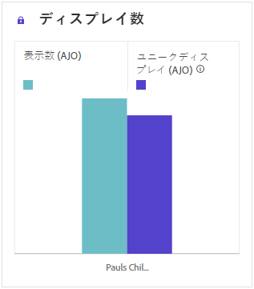
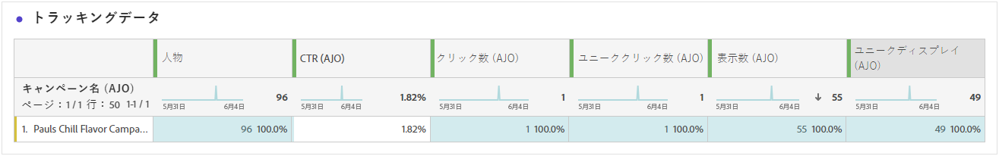

# ジャーニーレポート {#journey-global-report}

この **ジャーニーレポート** は、すべてを包含するダッシュボードとして機能し、ジャーニーに関連する重要な指標の分析を提供します。 これには、入力されたプロファイルの数や失敗した個々のジャーニーのインスタンスなどの詳細が含まれ、ジャーニーの効果とエンゲージメントのレベルを包括的に把握できます。

**ジャーニーレポート** は、を使用して、ジャーニーから直接アクセスできます **[!UICONTROL レポートを表示]** ボタン。

この **[!UICONTROL ジャーニーレポート]** ジャーニーのメッセージアクティビティに応じて、次のタブを持つページが表示されます。

* [ジャーニー](#journey-global)
* [メール](#email-global)
* [プッシュ](#push-global)
* [SMS](#sms-global)
* [アプリ内](#in-app-global)
* [Web](#web-cja)
* [ダイレクトメール](#direct-mail-cja)

Customer Journey Analyticsワークスペースの詳細と、データをフィルタリングして分析する方法については、を参照してください。 [このページ](https://experienceleague.adobe.com/en/docs/analytics-platform/using/cja-workspace/home).

## ジャーニーの概要 {#journey-global}

この **[!UICONTROL ジャーニー]** レポートには、ジャーニーに関する最も重要なトラッキングデータが明確に表示されます。

### ジャーニーKPI {#journey-perfomance}

この **[!UICONTROL ジャーニー]** 主要業績評価指標（KPI）は、すべてを包含するダッシュボードとして機能し、ジャーニーに関連する重要な指標の分析を提供します。 これには、入力されたプロファイルの数や失敗した個々のジャーニーのインスタンスなどの詳細が含まれ、ジャーニーの効果とエンゲージメントのレベルを包括的に把握できます。

+++ ジャーニー KPI 指標の詳細を説明します

* **[!UICONTROL ジャーニーエンゲージメント]**：ジャーニーから送信されたメッセージを操作した個人の合計数

* **[!UICONTROL ジャーニーエントリ]**：ジャーニーのエントリイベントに到達した個人の合計数。

* **[!UICONTROL ジャーニーが終了]**：ジャーニーから退出した個人の合計数。

* **[!UICONTROL ジャーニーエラー]**：正常に実行されなかった個人のジャーニーの合計数。

+++

### ジャーニー統計 {#journey-stats}

この **[!UICONTROL ジャーニーの統計情報]** テーブルには、ジャーニーに関する重要なデータの詳細な概要が表示されます。 失敗数や成功したエントリ数などの主要指標が含まれ、メールやジャーニーのパフォーマンスとリーチに関する貴重なインサイトが提供されます。

+++ ジャーニーの統計指標の詳細情報

* **[!UICONTROL ジャーニーエンゲージメント]**：ジャーニーから送信されたメッセージを操作した個人の合計数。

* **[!UICONTROL ジャーニーエントリ]**：ジャーニーのエントリイベントに到達した個人の合計数。

* **[!UICONTROL ジャーニーが終了]**：ジャーニーから退出した個人の合計数。

* **[!UICONTROL ジャーニーエラー]**：正常に実行されなかった個人のジャーニーの合計数。

* **[!UICONTROL ユニークジャーニーエントリ数]**：ジャーニーのエントリイベントに到達した個人の合計数。1 つのプロファイルの複数のインタラクションは考慮されません。

* **[!UICONTROL 一意のジャーニー出口]**：ジャーニーから退出した個人の合計数。1 つのプロファイルの複数のインタラクションは考慮されません。

* **[!UICONTROL 一意のジャーニーエラー]**：正常に実行されなかった個々のジャーニーの合計数。1 つのプロファイルによる複数のインタラクションは考慮されません。

+++

## ジャーニーキャンバス {#journey-canvas}

この **[!UICONTROL ジャーニーキャンバス]** ウィジェットを使用すると、ターゲットプロファイルがジャーニーを移動する際に、そのプロファイルの軌道を視覚的に追跡できます。

以下のオプションを使用して、キャンバスのカスタマイズを強化します。

* から目的のアクティビティタイプ（メッセージや条件など）を追加または削除します **[!UICONTROL ノードタイプ]** ドロップダウンメニュー。
* を調整 **[!UICONTROL パーセンテージ値]** 異なるジャーニーパス間のフロー分布を決定する。
* のカスタマイズ **[!UICONTROL 矢印の設定]** ラベル、条件を含めたり、クリーンな表示を選択したりできます。
* を有効にする **[!UICONTROL フォールアウトを表示]** ジャーニーから離脱したプロファイルをキャンバス上で直接視覚化するオプションです。

## アクションパフォーマンス {#action-performance}

### パフォーマンスの推移 {#action-overtime}

この **[!UICONTROL パフォーマンスの推移]** グラフを使用すると、条件を満たすプロファイルの数を識別および分析して、アクションのターゲットプロファイルと見なすことができます。 このビジュアライゼーションは、戦略の有効性に関する貴重なインサイトを提供し、パフォーマンスを最適化するためのデータ駆動型の意思決定を行うのに役立ちます。

### アクションの概要 {#action-overview}

この **[!UICONTROL アクションの概要]** テーブルは、ジャーニーのアクションに関連する主要指標の分析を提供する、包括的なダッシュボードとして機能します。 これには、インタラクション数やクリックスルー率などの重要な詳細が含まれます

+++ 詳しくは、アクションの概要指標を参照してください

* **[!UICONTROL 人物]**：アクションのターゲットプロファイルとして認定されるユーザープロファイルの数。

* **[!UICONTROL クリックトラフ率]**：アクションに対してインタラクションを行ったユーザーの割合。

* **[!UICONTROL クリック数]**：アクションでコンテンツがクリックされた回数。

* **[!UICONTROL 配信完了]**：送信されたアクションの総数に対する、正常に送信されたアクションの数。

+++

## イベントパフォーマンス {#events-performance}

### パフォーマンスの推移 {#event-overtime}

この **[!UICONTROL パフォーマンスの推移]** グラフを使用すると、イベントのターゲットプロファイルと認定されるプロファイルの数を特定および分析できます。 この強力なツールは、時間の経過に伴うトレンドやパターンの追跡に役立ち、イベント戦略を最適化するための貴重なインサイトを提供します。

### イベントの概要 {#event-overview}

この **[!UICONTROL イベントの概要]** 表には、イベント条件を満たすプロファイルの数の推移が表示されます。 このツールは、選定率のパターンを特定してイベント戦略を絞り込むのに役立ちます。

+++ ジャーニーの統計指標の詳細情報

* **[!UICONTROL 人物]**：イベントのターゲットプロファイルと認定されるユーザープロファイルの数。

+++

## メールの詳細 {#email-global}

ジャーニーレポートから、 **[!UICONTROL 電子メール]** タブには、ジャーニーで送信されるメールに関連する主な情報の詳細が表示されます。

### 配信済みとクリックのトレンド {#delivered-click}

この **[!UICONTROL 配信済みとクリックのトレンド]** グラフは、プロファイルのメールに対するエンゲージメントの詳細な分析を表示し、様々なドメインがコンテンツとどのようにやり取りするかについての貴重なインサイトを提供します。

+++ 配信済み指標とクリックトレンド指標の詳細を学ぶ

* **[!UICONTROL 配信済み]**：送信されたメッセージの合計数に対する、正常に送信されたメッセージの数。

* **[!UICONTROL クリック数]**：メールでコンテンツがクリックされた回数。

+++

### 配信ステータス {#delivery-status}

この **[!UICONTROL 配信ステータス]** グラフを使用すると、メールのパフォーマンスを一目で確認できます。 配信やバウンスなどの主要指標を追跡すると、メールジャーニーの効率をすばやく把握できます。

+++ 配信ステータス指標について詳しくはこちらを参照

* **[!UICONTROL 配信済み]**：送信されたメッセージの合計数に対する、正常に送信されたメッセージの数。

* **[!UICONTROL アウトバウンドチャネルのバウンス]**：送信プロセスと自動返信処理の間に、送信されたメッセージの合計数に関して累積したエラーの合計数。

* **[!UICONTROL アウトバウンドエラー]**：送信プロセス中に発生し、プロファイルに送信できなかったエラーの合計数。

* **[!UICONTROL 除外済み]**：Adobe Journey Optimizer によって除外されたプロファイルの数。

+++

### 送信統計 {#email-sending-statistics}

この **[!UICONTROL 送信統計]** 表には、ジャーニー内でのメールのパフォーマンスに関する明確なビューが表示されます。 配信率やインタラクションなどの主要指標を追跡し、メール戦略を最適化してリーチとエンゲージメントを向上させるための貴重なインサイトを提供します。

+++ 送信統計指標の詳細を説明します

* **[!UICONTROL 人物]**：メッセージのターゲットプロファイルと認定されるユーザープロファイルの数。

* **[!UICONTROL ターゲット]**：送信プロセス中に処理されたメールの合計数。

* **[!UICONTROL 送信数]**：メールの送信の合計数。

* **[!UICONTROL 配信済み]**：送信されたメッセージの総数に対する、正常に送信されたメッセージの数。

* **[!UICONTROL バウンス数]**：送信されたメッセージの合計数に対する、送信プロセス中および自動返信処理中に累積したエラーの合計数。

* **[!UICONTROL アウトバウンドエラー]**：送信プロセス中に発生し、プロファイルに送信できなかったエラーの合計数。

* **[!UICONTROL アウトバウンド除外]**:Adobe Journey Optimizerによって除外されたプロファイルの数。

+++

### メール - トラッキング統計 {#email-tracking}

**[!UICONTROL メール - トラッキング統計]**&#x200B;のテーブルには、ジャーニーに含まれるメールに関連するプロファイルアクティビティの詳細な説明が表示されます。これには、開封数、クリック数、その他の関連するエンゲージメント指標など、プロファイルがメールコンテンツとどのようにやり取りするかを包括的に示す指標が含まれます。

+++ トラッキング統計指標の詳細

* **[!UICONTROL クリックスルー率（CTR）]**：メールに対してインタラクションを行ったユーザーの割合。

* **[!UICONTROL クリックスルー開封率（CTOR）]**：メールが開封された回数。

* **[!UICONTROL クリック数]**：メールでコンテンツがクリックされた回数。

* **[!UICONTROL ユニーククリック数]**：メールでコンテンツをクリックしたプロファイルの数。

* **[!UICONTROL メールの開封数]**：ジャーニーでメールが開封された回数。

* **[!UICONTROL ユニークメール開封数]**：開封されたメールの割合。

* **[!UICONTROL スパムのの苦情数]**：メッセージがスパムまたはジャンクとして宣言された回数。

* **[!UICONTROL 登録解除]**：登録解除リンクのクリック数。

+++

### メールドメイン {#email-domains}

この **[!UICONTROL メールドメイン]** テーブルには、ドメイン別に分類されたメールの詳細な分類が表示され、メールジャーニーのパフォーマンス指標に関する広範なインサイトが得られます。 この包括的な分析により、メールコンテンツに応じた様々なドメインの動作を理解できます。

+++ メールドメインの指標の詳細情報

* **[!UICONTROL 送信数]**：メールの送信の合計数。

* **[!UICONTROL 配信済み]**：送信されたメッセージの合計数に対する、正常に送信されたメッセージの数。

* **[!UICONTROL メールの開封数]**：ジャーニーでメールが開封された回数。

* **[!UICONTROL クリック数]**：メールでコンテンツがクリックされた回数。

* **[!UICONTROL アウトバウンドチャネルのバウンス]**：送信プロセスと自動返信処理の間に、送信されたメールの合計数に関して累積したエラーの合計数。

* **[!UICONTROL アウトバウンドエラー]**：送信プロセス中に発生し、プロファイルに送信できなかったエラーの合計数。
+++

### トラッキング対象リンクラベル {#track-link-label}

この **[!UICONTROL 追跡されたリンクラベル]** テーブルには、メール内のリンクラベルの包括的な概要が表示され、訪問者トラフィックが最も多いラベルがハイライト表示されます。 この機能を使用すると、最も人気のあるリンクを特定し、優先順位を付けることができます。

+++ トラッキングされるリンクラベルの指標について学ぶ

* **[!UICONTROL ユニーククリック数]**：メールでコンテンツをクリックしたプロファイルの数。

* **[!UICONTROL クリック数]**：メールでコンテンツがクリックされた回数。

+++

### トラッキング対象リンク URL {#track-link-url}

この **[!UICONTROL トラッキングされるリンクの URL]** 表には、訪問者トラフィックを最も多く引き付けるメール内の URL の包括的な概要が表示されます。 これにより、最も人気のあるリンクを特定し、優先順位を付けることができ、メール内の特定のコンテンツに対するプロファイルのエンゲージメントをより深く理解することができます。

+++ トラッキングされるリンク URL の指標について詳しくはこちらを参照

* **[!UICONTROL ユニーククリック数]**：メールでコンテンツをクリックしたプロファイルの数。

* **[!UICONTROL クリック数]**：メールでコンテンツがクリックされた回数。

* **[!UICONTROL ディスプレイ]**：メッセージが開かれた回数。

* **[!UICONTROL 一意のディスプレイ]**：メッセージが開かれた回数。1 つのプロファイルの複数のインタラクションは考慮されません。

+++

### メールの件名 {#email-subject}

この **[!UICONTROL メールの件名]**  表は、訪問者のトラフィックが最も多いメール件名の完全な概要を示しています。 このリソースは、オーディエンゲージメントのダイナミクスに関する貴重なインサイトを提供します。

+++ メール件名指標の詳細

* **[!UICONTROL 人物]**：メールのターゲットプロファイルとして認定されるユーザープロファイルの数。

+++

### バウンスの理由 {#email-bounce-reasons}

この **[!UICONTROL バウンスの理由]** 表は、バウンスメッセージに関して使用可能なデータをコンパイルし、メールバウンスの背後にある特定の理由に関する詳細なインサイトを提供します。

バウンスについて詳しくは、[抑制リスト](../reports/suppression-list.md)のページを参照してください。

### 除外された理由 {#email-excluded}

この **[!UICONTROL 除外された理由]** テーブルには、ターゲットオーディエンスからユーザープロファイルが除外され、メッセージが受信されなくなったさまざまな要因の包括的なビューが表示されます。

除外の理由の包括的なリストについては、[このページ](exclusion-list.md)を参照してください。

### エラー理由 {#email-errors}

この **[!UICONTROL エラー理由]** テーブルは、送信プロセス中に発生した特定のエラーを可視化し、エラーの性質と発生に関する貴重な情報を提供します。

## 「プッシュ通知」タブ {#push-global}

ジャーニーレポートから、 **[!UICONTROL プッシュ通知]** タブには、ジャーニーで送信されるプッシュ通知に関連する主な情報の詳細が表示されます。

## プッシュ通知 {#push-notification}

### 送信統計 {#sending-statistics-push}

この **[!UICONTROL 送信統計]** 表を使用すると、プッシュ通知のパフォーマンスを理解できます。 配信率やオーディエンスサイズなどの主要指標が含まれ、ジャーニーの有効性とリーチに関する貴重なインサイトが得られます。

+++ 送信統計指標の詳細を説明します

* **[!UICONTROL 人物]**:SMS メッセージのターゲットプロファイルとして認定されるユーザープロファイルの数。

* **[!UICONTROL ターゲット]**：分析中に処理されたプッシュ通知の合計数。

* **[!UICONTROL 送信数]**：プッシュ通知用の送信の合計数。

* **[!UICONTROL 配信済み]**：送信されたプッシュ通知の合計数に対する、正常に送信されたプッシュ通知の数。

* **[!UICONTROL アウトバウンドチャネルのバウンス]**：送信プロセスと自動返信処理の間に、プッシュ通知の合計数に関して累積したエラーの合計数。

* **[!UICONTROL アウトバウンドエラー]**：発生したエラーにより、プロファイルに送信できなかった数の合計。

* **[!UICONTROL アウトバウンド除外]**:Adobe Journey Optimizerによって除外されたプロファイルの数。

+++

### トラッキング統計 {#tracking-statistics-push}

この **[!UICONTROL トラッキング統計]** テーブルには、プッシュ通知に関連付けられたプロファイルアクティビティの詳細なスナップショットが表示され、エンゲージメントとプッシュ通知の有効性に関する基本的なインサイトが提供されます。

+++ トラッキング統計指標の詳細

* **[!UICONTROL クリックスルー率（CTR）]**：プッシュ通知とインタラクションを行ったユーザーの割合。

* **[!UICONTROL クリックスルー開封率（CTOR）]**：プッシュ通知が開かれた回数。

* **[!UICONTROL クリック数]**：プッシュ通知でコンテンツがクリックされた回数。

* **[!UICONTROL ユニーククリック数]**：プッシュ通知内のコンテンツをクリックしたプロファイルの数。

<!--
* **[!UICONTROL Push custom actions]**: 
-->
+++

### トラッキング対象リンクラベル {#track-link-label-push}

この **[!UICONTROL 追跡されたリンクラベル]** 表には、プッシュ通知内のリンクラベルの包括的な概要が表示され、訪問者トラフィックが最も多いラベルがハイライト表示されます。 この機能を使用すると、最も人気のあるリンクを特定し、優先順位を付けることができます。

+++ トラッキングされるリンクラベルの指標について学ぶ

* **[!UICONTROL ユニーククリック数]**：プッシュ通知のコンテンツをクリックしたプロファイルの数。

* **[!UICONTROL クリック数]**：プッシュ通知のコンテンツがクリックされた回数。

+++

### トラッキング対象リンク URL {#track-link-url-push}

この **[!UICONTROL トラッキングされるリンクの URL]** 表には、訪問者トラフィックを最も多く引き付けるプッシュ通知内の URL の包括的な概要が表示されます。 これにより、最も人気のあるリンクを特定して優先順位を付け、プッシュ通知の特定のコンテンツに対するプロファイルエンゲージメントの理解を深めることができます。

+++ トラッキングされるリンク URL の指標について詳しくはこちらを参照

* **[!UICONTROL ユニーククリック数]**：プッシュ通知のコンテンツをクリックしたプロファイルの数。

* **[!UICONTROL クリック数]**：プッシュ通知のコンテンツがクリックされた回数。

+++

### バウンスの理由 {#bounce-reasons-push}

この **[!UICONTROL バウンスの理由]** 表は、バウンスプッシュ通知に関連するデータの包括的な概要を示し、プッシュ通知バウンスインスタンスの背後にある特定の理由に関する貴重なインサイトを提供します。

### エラーの理由 {#error-reasons-push}

この **[!UICONTROL エラー理由]** テーブルを使用すると、プッシュ通知の送信プロセス中に発生した特定のエラーを識別し、発生した問題の徹底的な分析を容易にすることができます。

### 除外された理由 {#exclude-reasons-push}

この **[!UICONTROL 理由を除外]** 表は、ターゲットオーディエンスからユーザープロファイルを除外し、プッシュ通知を受信できなかった様々な要因を視覚的に示しています。

除外理由の包括的なリストについては、[このページ](exclusion-list.md)を参照してください。

## SMS {#sms}

### 配信済みとクリックのトレンド {#delivered-click-sms}

この **[!UICONTROL 配信済みとクリックのトレンド]** グラフは、プロファイルの SMS メッセージへのエンゲージメントに関する詳細な分析を表示し、様々なドメインがコンテンツとどのように関わるかに関する貴重なインサイトを提供します。

+++ 配信済み指標とクリックトレンド指標の詳細を学ぶ

* **[!UICONTROL 配信完了]**:SMS メッセージの合計数に対して、正常に送信された SMS メッセージの数。

* **[!UICONTROL クリック数]**：SMS メッセージでコンテンツがクリックされた回数。

+++

### 配信ステータス {#delivery-status-sms}

この **[!UICONTROL 配信ステータス]** 表には、SMS メッセージに関連するプロファイルアクティビティの詳細なアカウントが表示されます。 これには、配信済み、クリック数、その他の関連するエンゲージメント指標に関する指標が含まれ、プロファイルと SMS コンテンツのやり取りの包括的なビューを提供します。

+++ 配信ステータス指標について詳しくはこちらを参照

* **[!UICONTROL 配信完了]**:SMS メッセージの合計数に対して、正常に送信された SMS メッセージの数。

* **[!UICONTROL アウトバウンドチャネルのバウンス]**：送信プロセスと自動返信処理の間に、送信された SMS メッセージの合計数に関して累積したエラーの合計数。

* **[!UICONTROL アウトバウンドエラー]**：発生したエラーにより、プロファイルに送信できなかった数の合計。

* **[!UICONTROL アウトバウンド除外]**:Adobe Journey Optimizerによって除外されたプロファイルの数。

+++

### トラッキング対象リンクラベル {#track-link-label-sms}

この **[!UICONTROL 追跡されたリンクラベル]** 表は、SMS メッセージ内のリンクラベルの包括的な概要を提供し、訪問者トラフィックが最も多いメッセージをハイライト表示します。 この機能を使用すると、最も人気のあるリンクを特定し、優先順位を付けることができます。

+++ トラッキングされるリンクラベルの指標について学ぶ

* **[!UICONTROL ユニーククリック数]**:SMS メッセージのコンテンツをクリックしたプロファイルの数。

* **[!UICONTROL クリック数]**：SMS メッセージでコンテンツがクリックされた回数。

+++

### トラッキング対象リンク URL {#track-link-url-sms}

この **[!UICONTROL トラッキングされるリンクの URL]** 表は、最も高い訪問者トラフィックを引き付ける SMS メッセージ内の URL の包括的な概要を示します。 これにより、最も人気のあるリンクを特定して優先順位を付け、SMS メッセージ内の特定のコンテンツに対するプロファイルエンゲージメントの理解を深めることができます。

+++ トラッキングされるリンク URL の指標について詳しくはこちらを参照

* **[!UICONTROL ユニーククリック数]**:SMS メッセージのコンテンツをクリックしたプロファイルの数。

* **[!UICONTROL クリック数]**：SMS メッセージでコンテンツがクリックされた回数。

* **[!UICONTROL ディスプレイ]**：メッセージが開かれた回数。

* **[!UICONTROL 一意のディスプレイ]**：メッセージが開かれた回数。1 つのプロファイルの複数のインタラクションは考慮されません。

+++

### SMS インバウンドメッセージ {#sms-inbound}

この **[!UICONTROL SMS インバウンドメッセージ]** 表は、最も訪問者トラフィックの多い SMS メッセージの完全な概要を示しています。 このリソースは、オーディエンゲージメントのダイナミクスに関する貴重なインサイトを提供します。

+++ SMS インバウンドメッセージ指標の詳細

* **[!UICONTROL 人物]**:SMS メッセージのターゲットプロファイルとして認定されるユーザープロファイルの数。

+++

### SMS メッセージタイプ {#sms-message-type}

この **[!UICONTROL SMS メッセージタイプ]** 表は、最も訪問者トラフィックの多い SMS メッセージタイプの完全な概要を示しています。 このリソースは、オーディエンゲージメントのダイナミクスに関する貴重なインサイトを提供します。

+++ SMS メッセージタイプ指標の詳細

* **[!UICONTROL 人物]**:SMS メッセージのターゲットプロファイルとして認定されるユーザープロファイルの数。

+++

### SMS プロバイダー {#sms-providers}

この **[!UICONTROL SMS プロバイダー]** 表は、最も訪問者トラフィックの多い SMS プロバイダーの完全な概要を示しています。 このリソースは、オーディエンゲージメントのダイナミクスに関する貴重なインサイトを提供します。

+++ SMS プロバイダーの指標について詳しくはこちらを参照

* **[!UICONTROL 人物]**:SMS メッセージのターゲットプロファイルとして認定されるユーザープロファイルの数。

+++

### バウンスの理由 {#bounce-reasons-sms}

この **[!UICONTROL バウンスの理由]** 表は、バウンスした SMS メッセージに関連するデータの包括的な概要を提供し、SMS メッセージバウンスのインスタンスの背後にある特定の理由に関する貴重なインサイトを提供します。

### エラーの理由 {#error-reasons-sms}

この **[!UICONTROL エラー理由]** テーブルを使用すると、SMS メッセージの送信プロセス中に発生した特定のエラーを識別し、発生した問題の徹底的な分析を容易にすることができます。

### 除外された理由 {#excluded-reasons-sms}

この **[!UICONTROL 理由を除外]** 表は、ターゲットオーディエンスからユーザープロファイルを除外し、SMS メッセージを受信できなかった様々な要因を視覚的に示しています。

除外理由の包括的なリストについては、[このページ](exclusion-list.md)を参照してください。

## アプリ内

### インプレッションとクリックのトレンド {#impression-click-trend}

この **[!UICONTROL インプレッションとクリックのトレンド]** グラフは、プロファイルのアプリ内メッセージへのエンゲージメントに関する詳細な分析を表示し、プロファイルがコンテンツとどのようにやり取りするかについての貴重なインサイトを提供します。

+++ インプレッションとクリックのトレンド指標について詳しくはこちらを参照

* **[!UICONTROL クリック数]**：アプリ内メッセージでコンテンツがクリックされた回数。

* **[!UICONTROL ディスプレイ]**：メッセージが開かれた回数。

+++

### クリック数 {#clicks-inapp}

この **[!UICONTROL クリック数]** グラフには、コンテンツがクリックされた合計数と、コンテンツをクリックした一意のプロファイル数の両方を示すアプリ内クリック指標が表示されます。

+++ クリック数指標の詳細

* **[!UICONTROL ユニーククリック数]**：アプリ内メッセージのコンテンツをクリックしたプロファイルの数

* **[!UICONTROL クリック数]**：アプリ内メッセージでコンテンツがクリックされた回数。

+++

### 表示 {#display-inapp}

この **[!UICONTROL ディスプレイ]** グラフは、メッセージの全体的なリーチと、メッセージに関与する一意のプロファイルの数の両方を理解するのに役立ちます。

+++ 表示指標の詳細

* **[!UICONTROL ディスプレイ]**：メッセージが開かれた回数。

* **[!UICONTROL 一意のディスプレイ]**：メッセージが開かれた回数。1 つのプロファイルの複数のインタラクションは考慮されません。

+++

### トラッキングデータ {#tracking-data-inapp}

この **[!UICONTROL トラッキングデータ]** 表には、アプリ内メッセージに関連付けられたプロファイルアクティビティの詳細なスナップショットが表示され、エンゲージメントとアプリ内メッセージの有効性に関する重要なインサイトが提供されます。

+++ トラッキングデータ指標の詳細情報

* **[!UICONTROL 人物]**：アプリ内メッセージのターゲットプロファイルとして認定されるユーザープロファイルの数。

* **[!UICONTROL クリックスルー率（CTR）]**：アプリ内メッセージを操作したユーザーの割合。

* **[!UICONTROL クリックスルー開封率（CTOR）]**：アプリ内メッセージが開かれた回数。

* **[!UICONTROL クリック数]**：アプリ内メッセージでコンテンツがクリックされた回数。

* **[!UICONTROL ユニーククリック数]**：アプリ内メッセージのコンテンツをクリックしたプロファイルの数。

* **[!UICONTROL ディスプレイ]**：メッセージが開かれた回数。

* **[!UICONTROL 一意のディスプレイ]**：メッセージが開かれた回数。1 つのプロファイルの複数のインタラクションは考慮されません。

* **[!UICONTROL 送信数]**：アプリ内メッセージの送信の合計数。

<!--
* **[!UICONTROL Inbound triggered]**: 

* **[!UICONTROL Inbound dismisses]**: 
-->
+++

### トラッキング対象リンクラベル {#track-link-label-inapp}

この **[!UICONTROL 追跡されたリンクラベル]** 表には、アプリ内メッセージ内のリンクラベルの包括的な概要が表示され、訪問者トラフィックが最も多いメッセージがハイライト表示されます。 この機能を使用すると、最も人気のあるリンクを特定し、優先順位を付けることができます。

+++ トラッキングされるリンクラベルの指標について学ぶ

* **[!UICONTROL ユニーククリック数]**：アプリ内メッセージのコンテンツをクリックしたプロファイルの数。

* **[!UICONTROL クリック数]**：アプリ内メッセージでコンテンツがクリックされた回数。

* **[!UICONTROL ディスプレイ]**：メッセージが開かれた回数。

* **[!UICONTROL 一意のディスプレイ]**：メッセージが開かれた回数。1 つのプロファイルの複数のインタラクションは考慮されません。

+++

### トラッキング対象リンク URL {#track-link-url-inapp}

この **[!UICONTROL トラッキングされるリンクの URL]** 表には、訪問者トラフィックを最も多く引き付けるアプリ内メッセージ内の URL の包括的な概要が表示されます。 これにより、最も人気のあるリンクを特定して優先順位を付け、アプリ内メッセージの特定のコンテンツに対するプロファイルエンゲージメントの理解を深めることができます。

+++ トラッキングされるリンク URL の指標について詳しくはこちらを参照

* **[!UICONTROL ユニーククリック数]**：アプリ内メッセージのコンテンツをクリックしたプロファイルの数

* **[!UICONTROL クリック数]**：アプリ内メッセージでコンテンツがクリックされた回数。

+++

## Web {#web-cja}

### インプレッションとクリックのトレンド {#impressions-web}

この **[!UICONTROL インプレッションとクリックのトレンド]** グラフは、プロファイルの web ページへのエンゲージメントに関する詳細な分析を表示し、プロファイルがコンテンツとどのようにやり取りするかについての貴重なインサイトを提供します。

+++ インプレッションとクリックのトレンド指標について詳しくはこちらを参照

* **[!UICONTROL クリック数]**:Web ページでコンテンツがクリックされた回数。

* **[!UICONTROL ディスプレイ]**：メッセージが開かれた回数。

+++

### クリック数 {#clicks-web}

この **[!UICONTROL クリック数]** グラフには、コンテンツがクリックされた合計数と、コンテンツをクリックした一意のプロファイル数の両方を示す、web ページのクリック指標が表示されます。

+++ クリック数指標の詳細

* **[!UICONTROL ユニーククリック数]**:Web ページのコンテンツをクリックしたプロファイルの数。

* **[!UICONTROL クリック数]**:Web ページでコンテンツがクリックされた回数。

+++

### 表示 {#displays-web}

この **[!UICONTROL ディスプレイ]** グラフは、メッセージの全体的なリーチと、メッセージに関与する一意のプロファイルの数の両方を理解するのに役立ちます。

+++ 表示指標の詳細

* **[!UICONTROL ディスプレイ]**：メッセージが開かれた回数。

* **[!UICONTROL 一意のディスプレイ]**：メッセージが開かれた回数。1 つのプロファイルの複数のインタラクションは考慮されません。

+++

### トラッキングデータ {#track-data-web}

この **[!UICONTROL トラッキングデータ]** 表には、web ページに関連付けられたプロファイルアクティビティの詳細なスナップショットが表示され、エンゲージメントと web ページの有効性に関する基本的なインサイトが提供されます。

+++ トラッキングデータ指標の詳細情報

* **[!UICONTROL 人物]**:Web ページのターゲットプロファイルと認定されるユーザープロファイルの数。

* **[!UICONTROL クリックスルー率（CTR）]**:web ページを操作したユーザーの割合。

* **[!UICONTROL クリック数]**:Web ページでコンテンツがクリックされた回数。

* **[!UICONTROL ユニーククリック数]**:Web ページのコンテンツをクリックしたプロファイルの数。

* **[!UICONTROL ディスプレイ]**:web ページが開かれた回数。

* **[!UICONTROL 一意のディスプレイ]**:Web ページが開かれた回数。1 つのプロファイルの複数のインタラクションは考慮されません。

+++

### トラッキング対象リンクラベル {#track-link-web}

この **[!UICONTROL 追跡されたリンクラベル]** 表では、web ページ内のリンクラベルの包括的な概要が提供され、訪問者トラフィックが最も多いラベルがハイライト表示されます。 この機能を使用すると、最も人気のあるリンクを特定し、優先順位を付けることができます。

+++ トラッキングされるリンクラベルの指標について学ぶ

* **[!UICONTROL ユニーククリック数]**:Web ページのコンテンツをクリックしたプロファイルの数。

* **[!UICONTROL クリック数]**:Web ページでコンテンツがクリックされた回数。

* **[!UICONTROL ディスプレイ]**：メッセージが開かれた回数。

* **[!UICONTROL 一意のディスプレイ]**：メッセージが開かれた回数。1 つのプロファイルの複数のインタラクションは考慮されません。

+++

### トラッキング対象リンク URL {#track-url-web}

この **[!UICONTROL トラッキングされるリンクの URL]** 表では、訪問者トラフィックを最も多く引き付ける web ページ内の URL の包括的な概要を説明しています。 これにより、最も人気のあるリンクを特定して優先順位を付け、web ページ内の特定のコンテンツに対するプロファイルエンゲージメントの理解を深めることができます。

+++ トラッキングされるリンク URL の指標について詳しくはこちらを参照

* **[!UICONTROL ユニーククリック数]**:Web ページのコンテンツをクリックしたプロファイルの数。

* **[!UICONTROL クリック数]**:Web ページでコンテンツがクリックされた回数。

* **[!UICONTROL ディスプレイ]**：メッセージが開かれた回数。

* **[!UICONTROL 一意のディスプレイ]**：メッセージが開かれた回数。1 つのプロファイルの複数のインタラクションは考慮されません。

+++

## ダイレクトメール {#direct-mail-cja}

### 送信統計 {#sending-statistics-directmail}

この **[!UICONTROL 送信統計]** テーブルを使用すると、ダイレクトメールジャーニーのパフォーマンスを把握できます。 メールのリーチと効果を測定するのに役立つ、ターゲット受信者の数や正常に配信されたフラグメントなどの主要指標を確認します。

+++ 送信統計指標の詳細を説明します

* **[!UICONTROL 人物]**：メッセージのターゲットプロファイルと認定されるユーザープロファイルの数。

* **[!UICONTROL ターゲット]**：送信プロセス中に処理されたダイレクトメールメッセージの合計数。

* **[!UICONTROL 送信数]**：ダイレクトメールメッセージの送信の合計数。

* **[!UICONTROL 配信完了]**：送信されたメッセージの合計数に対して、正常に送信されたダイレクトメールメッセージの数。

* **[!UICONTROL アウトバウンドエラー]**：送信プロセス中に発生し、プロファイルに送信できなかったエラーの合計数。

* **[!UICONTROL アウトバウンド除外]**:Adobe Journey Optimizerによって除外されたプロファイルの数。

+++

### 配信ステータス {#delivery-status-directmail}

この **[!UICONTROL 配信ステータス]** graph は、ジャーニーで送信されたダイレクトメールメッセージに関連するデータの包括的な表示を提供し、配信されたエラーやエラーなどの主要指標に関するインサイトを提供します。 これにより、ダイレクトメールメッセージの送信プロセスを詳細に分析し、ジャーニーの効率とパフォーマンスに関する貴重な情報を提供できます。

+++ 配信ステータス指標について詳しくはこちらを参照

* **[!UICONTROL 配信完了]**：送信されたダイレクトメールメッセージの合計数に対して、正常に送信されたダイレクトメールメッセージの数。

* **[!UICONTROL アウトバウンドエラー]**：送信プロセス中に発生し、ダイレクトメールメッセージがプロファイルに送信できなかったエラーの合計数。

* **[!UICONTROL アウトバウンド除外]**:Adobe Journey Optimizerによって除外されたプロファイルの数。

+++

### エラーの理由 {#error-reasons-directmail}

この **[!UICONTROL エラー理由]** テーブルを使用すると、ダイレクトメールメッセージの送信プロセス中に発生した特定のエラーを識別し、発生した問題の徹底的な分析を容易にすることができます。

### 除外された理由 {#exclude-reasons-directmail}

この **[!UICONTROL 理由を除外]** 表は、ターゲットオーディエンスからユーザープロファイルを除外し、ダイレクトメールメッセージを受信できなかった様々な要因を視覚的に示しています。

除外理由の包括的なリストについては、[このページ](exclusion-list.md)を参照してください。
