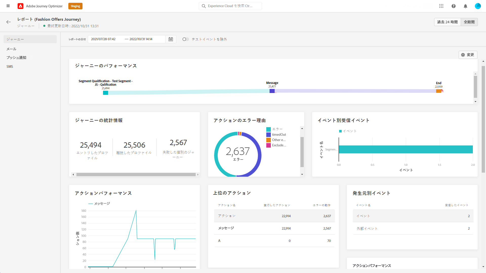
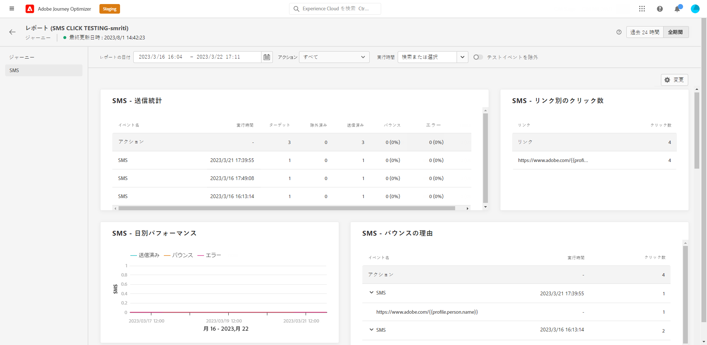

# ジャーニーグローバルレポート {#journey-global-report}

「**[!UICONTROL グローバルレポート]**」ボタンで、ジャーニーのグローバルレポートにジャーニーから直接アクセスします。

ジャーニーの&#x200B;**[!UICONTROL グローバルレポート]**&#x200B;ページが表示され、次のタブが表示されます。

* [ジャーニー](#journey-global)
* [メール](#email-global)
* [プッシュ](#push-global)
* [SMS](#sms-global)

ジャーニーの&#x200B;**[!UICONTROL グローバルレポート]**&#x200B;は、ジャーニーの成功とエラーについて説明する様々なウィジェットに分かれています。必要に応じて、各ウィジェットのサイズを変更したり削除したりできます。詳しくは、この[節](global-report.md#modify-dashboard)を参照してください。

Adobe Journey Optimizer で使用可能なすべての指標の詳細なリストについては、[このページ](global-report.md#list-of-components-global)を参照してください。

## 「ジャーニー」タブ {#journey-global}

ジャーニーの&#x200B;**[!UICONTROL グローバルレポート]**&#x200B;の「**[!UICONTROL ジャーニー]**」タブには、ジャーニーに関する重要なトラッキングデータが明確に表示されます。

+++ジャーニーレポートで使用できる様々な指標およびウィジェットの詳細情報。

**[!UICONTROL ジャーニーのパフォーマンス]**&#x200B;ウィジェットを使用すると、ターゲットプロファイルのパスを、ジャーニーを通じて段階的に確認できます。

**[!UICONTROL ジャーニーの統計情報]**&#x200B;ウィジェットには、次の KPI が表示されます。

* **[!UICONTROL エントリしたプロファイル]**：ジャーニーのエントリイベントに到達した個人の合計数。

* **[!UICONTROL 退出したプロファイル]**：ジャーニーから退出した個人の合計数。

* **[!UICONTROL 失敗した個人のジャーニー]**：正常に実行されなかった個人のジャーニーの合計数。

**[!UICONTROL イベントごとに受信したイベント]**、**[!UICONTROL 発信元別のイベント]**&#x200B;および&#x200B;**[!UICONTROL 上位のイベント]**&#x200B;の各ウィジェットを使用すると、どの&#x200B;**[!UICONTROL イベント]**&#x200B;が正常に実行されたかをグラフや表を通して確認できます。

**[!UICONTROL アクションパフォーマンス]**、**[!UICONTROL アクションエラーの理由]**&#x200B;および&#x200B;**[!UICONTROL 上位アクション]**&#x200B;の各ウィジェットは、最も成功したアクションと、**[!UICONTROL アクション]**&#x200B;がトリガーされた際に発生したエラーを表します。

**[!UICONTROL 上位のアクション]**&#x200B;テーブルには、**[!UICONTROL アクション]**&#x200B;に関する次のようなデータが表示されます。

* **[!UICONTROL 正常に実行されたアクション]**：ジャーニーに対して正常に実行された&#x200B;**[!UICONTROL アクション]**&#x200B;の合計数。

* **[!UICONTROL アクションのエラー]**：**[!UICONTROL アクション]**&#x200B;で発生したエラーの合計数。

この&#x200B;**[!UICONTROL 同意ポリシー]**テーブルおよびグラフには、カスタムアクションで各ポリシーから除外されたプロファイルの数が表示されます。
カスタムアクションについて詳しくは、[詳細ドキュメント](../action/about-custom-action-configuration.md)を参照してください。

これらのウィジェットをジャーニーレポートに表示するには、ダッシュボードをリセットする必要があります。これを行うには、**[!UICONTROL 変更]**&#x200B;をクリックし、その後レポートの上部にある&#x200B;**[!UICONTROL リセット]**をクリックします。
+++

## 「メール」タブ {#email-global}

ジャーニーの&#x200B;**[!UICONTROL グローバルレポート]**&#x200B;の「**[!UICONTROL メール]**」タブには、ジャーニーで送信したメールの配信に関する主な情報が表示されます。

+++メールレポートで使用できる様々な指標およびウィジェットについて詳しくは、こちらを参照してください。

**[!UICONTROL メール送信統計]**&#x200B;グラフは、配信の成功の詳細を示します。

* **[!UICONTROL ターゲット]**：任意のアクション（メールや SMS の送信など）で Adobe Journey Orchestration がターゲットとするプロファイルの数。

* **[!UICONTROL 送信済み]**：配信に対する送信の合計数。

* **[!UICONTROL 配信済み]**：送信されたメッセージの合計数に対して、正常に配達できたメッセージの数。

* **[!UICONTROL 配信率]**：正常に送信されたメッセージの割合。

* **[!UICONTROL バウンス]**：送信されたメッセージの総数に対して、配信と自動返信の処理中に発生したエラーの累計。

* **[!UICONTROL バウンス率]**：送信メールに対するバウンスメールの割合。

* **[!UICONTROL エラー]**：配信中に発生し、プロファイルへの送信の妨げとなったエラーの合計数。

* **[!UICONTROL エラー率]**：送信されたメールに対して、配信中にエラーが発生して送信できなかったメールの割合。

**[!UICONTROL メール - トラッキング統計情報]**&#x200B;には、配信に対する受信者のアクティビティを確認できるデータが表示されます。

* **[!UICONTROL 開封数]**：配信でメッセージが開かれた回数。

* **[!UICONTROL ユニーク開封数]**：開封された配信の割合。

* **[!UICONTROL ユニーク開封率]**：配信されたメール数に対して、開封されたメールの合計数。

* **[!UICONTROL クリック数]**：メールのコンテンツがクリックされた回数。

* **[!UICONTROL ユニーククリック数]**：メールのコンテンツをクリックした受信者の数。

* **[!UICONTROL クリックスルー率]**：ジャーニーに対して何らかのアクションを起こしたユーザーの割合。

* **[!UICONTROL 購読解除]**：購読解除リンクのクリック数。

* **[!UICONTROL スパムのの苦情数]**：メッセージがスパムまたはジャンクとして宣言された回数。

**[!UICONTROL 送信統計情報]**&#x200B;グラフを使用すると、次のような送信済みメールに関するデータを確認できます。

* **[!UICONTROL 配信済み]**：送信されたメッセージの合計数に対して、正常に配達できたメッセージの数。

* **[!UICONTROL バウンス]**：送信されたメッセージの総数に対して、配信と自動返信の処理中に発生したエラーの累計。

* **[!UICONTROL エラー]**：配信中に発生し、プロファイルへの送信の妨げとなったエラーの合計数。

**[!UICONTROL バウンスの理由]**&#x200B;ウィジェットおよび&#x200B;**[!UICONTROL バウンスのカテゴリ]**&#x200B;ウィジェットには、次のようなバウンスメッセージに関するデータが含まれています。

* **[!UICONTROL ハードバウンス]**：永続的なエラー（メールアドレスの間違いなど）の合計数。このエラーは、アドレスが無効であることを明示的に示すエラーメッセージ（例：「不明なユーザー」）を伴います。

* **[!UICONTROL ソフトバウンス数]**：一時的なエラー（インボックスが満杯など）の合計数。

* **[!UICONTROL 無視]**：一時的なエラー（不在など）や技術的なエラー（送信者のタイプが postmaster の場合など）の合計数。

バウンスの詳細については、[抑制リスト](../reports/suppression-list.md)のページを参照してください。

「**[!UICONTROL エラー理由]**」のグラフと表を使用すると、配信中に発生したエラーを確認できます。

この&#x200B;**[!UICONTROL 除外された理由]**&#x200B;グラフおよびテーブルには、ターゲットプロファイルから除外されたユーザープロファイルがメッセージを受信できなかった様々な理由が表示されます。

「**[!UICONTROL メール - 上位の URL]**」のグラフと表は、配信されたメールの中で最もアクセス頻度の高い URL の詳細を示しています。

「**[!UICONTROL メール - 上位の受信者ドメイン]**」のグラフと表は、受信者が電子メールを開くために最も多く使用しているドメインの詳細を示しています。

>[!NOTE]
>
>この&#x200B;**[!UICONTROL 最適化済みと最適化されていない]**&#x200B;および&#x200B;**[!UICONTROL 送信時間の最適化]**&#x200B;ウィジェットは、配信で「送信時間の最適化」オプションが有効になっている場合にのみ使用できます。送信時間の最適化について詳しくは、[このページ](../messages/send-time-optimization.md)を参照してください。

この&#x200B;**[!UICONTROL 最適化済みと最適化されていない]**&#x200B;グラフは、メッセージが最適化されているかどうかに関する主な情報の詳細を示します。

* **[!UICONTROL 送信済み]**：配信に対する送信の合計数。
* **[!UICONTROL 開封数]**：配信でメッセージが開かれた回数。
* **[!UICONTROL クリック数]**：メールのコンテンツがクリックされた回数。

この&#x200B;**[!UICONTROL 送信時間の最適化]**&#x200B;は、送信方法（最適化または標準）に応じて、配信の成功を詳細に示します。

* **[!UICONTROL 配信済み]**：送信されたメッセージの合計数に対して、正常に配達できたメッセージの数。
* **[!UICONTROL バウンス]**：送信されたメッセージの総数に対して、配信と自動返信の処理中に発生したエラーの累計。

>[!NOTE]
>
>オファーのウィジェットと指標は、決定がメールに挿入された場合にのみ使用できます。 意思決定管理について詳しくは、[このページ](../offers/get-started/starting-offer-decisioning.md)を参照してください。

**[!UICONTROL オファーの統計情報]**&#x200B;ウィジェットと&#x200B;**[!UICONTROL オファーの時系列の統計情報]**&#x200B;ウィジェットは、オファーの成功とターゲットオーディエンスへの影響を測定します。メッセージに関連する主な情報について、以下の KPI を使用して詳しく説明します。

* **[!UICONTROL 送信されたオファー]**：オファーの送信の総数。

* **[!UICONTROL オファーのインプレッション]**：オファーが配信で開かれた回数。

* **[!UICONTROL オファーのクリック数]**：配信でオファーがクリックされた回数。

**[!UICONTROL オファーの詳細な統計情報]**&#x200B;テーブルには、オファーを利用した受信者アクティビティに関する利用可能なデータが含まれています。

* **[!UICONTROL プレースメント名]**：オファーを表示するために使用するプレースメントの名前。プレースメントについて詳しくは、この[ページ](../offers/offer-library/creating-placements.md)を参照してください。

* **[!UICONTROL オファー名]**：配信に追加されたオファーの名前。プレースメントについて詳しくは、この[ページ](../offers/offer-library/creating-personalized-offers.md)を参照してください。

* **[!UICONTROL 送信されたオファー]**：オファーの送信の総数。

* **[!UICONTROL オファーのインプレッション率]**：送信されたオファーの数に対する、開封されたオファーの割合。

* **[!UICONTROL オファーのクリック率]**：オファーに対してアクションを起こしたユーザーの割合。
+++

## 「プッシュ通知」タブ {#push-global}

ジャーニーの&#x200B;**[!UICONTROL グローバルレポート]**&#x200B;の「**[!UICONTROL プッシュ通知]**」タブには、ジャーニーで送信されるプッシュ配信に関連する主な情報が詳しく表示されます。

+++プッシュレポートで使用できる様々な指標およびウィジェットの詳細を説明します。

「**[!UICONTROL プッシュ通知 - 送信統計]**」テーブルは、プッシュ通知に関連するメイン情報の詳細をグラフと KPI で示します。

* **[!UICONTROL ターゲット]**：メールや SMS の送信などの任意のアクションに対して Adobe Journey Orchestration がターゲットとするプロファイルの数。

* **[!UICONTROL 送信済み]**：配信に対する送信の合計数。

* **[!UICONTROL 配信済み]**：送信されたメッセージの合計数に対して、正常に配達できたメッセージの数。

* **[!UICONTROL 配信率]**：正常に送信されたメッセージの割合。

* **[!UICONTROL バウンス]**：送信されたメッセージの総数に対して、配信と自動返信の処理中に発生したエラーの累計。

* **[!UICONTROL バウンス率]**：送信されたプッシュ通知と比較した、バウンスしたプッシュ通知の割合。

* **[!UICONTROL エラー]**：配信中に発生し、プロファイルへの送信の妨げとなったエラーの合計数。

* **[!UICONTROL エラー率]**：送信されたプッシュ通知と比較した、配信中に発生した送信を妨げるエラーの割合。

「**[!UICONTROL プッシュ - トラッキング統計]**」には、配信の受信者アクティビティに使用できるデータが含まれます。

* **[!UICONTROL 開封数]**：配信でメッセージが開封された回数。

* **[!UICONTROL 開封率]**：開封されたプッシュ通知の割合。

* **[!UICONTROL アクション]**：配信されたプッシュ通知に対するアクション（ボタンのクリックや解除など）の合計数。

* **[!UICONTROL エンゲージメント]**：このプッシュ通知に対する開封数とアクション数（「プロファイルがプッシュを開封した」、「ボタンがクリックされた」など）の合計。

* **[!UICONTROL エンゲージメント率]**：このプッシュ通知の開封とアクションの割合（プロファイルによるプッシュの開封や、ボタンのクリックなど）。

「**[!UICONTROL プッシュ通知の概要]**」グラフには、次のような送信済みプッシュ通知に使用できるデータが含まれています。

* **[!UICONTROL 開封数]**：配信でメッセージが開封された回数。

* **[!UICONTROL アクション]**：配信されたプッシュ通知に対するアクション（ボタンのクリックや解除など）の合計数。

* **[!UICONTROL バウンス]**：送信されたメッセージの総数に対して、配信と自動返信の処理中に発生したエラーの累計。

* **[!UICONTROL 配信済み]**：送信されたメッセージの合計数に対して、正常に配達できたメッセージの数。

* **[!UICONTROL エラー]**：配信中に発生し、プロファイルへの送信の妨げとなったエラーの合計数。

>[!NOTE]
>
>この&#x200B;**[!UICONTROL 最適化済みと最適化されていない]**&#x200B;および&#x200B;**[!UICONTROL 送信時間の最適化]**&#x200B;ウィジェットは、配信で「送信時間の最適化」オプションが有効になっている場合にのみ使用できます。送信時間の最適化について詳しくは、[このページ](../messages/send-time-optimization.md)を参照してください。

この&#x200B;**[!UICONTROL 最適化済みと最適化されていない]**&#x200B;グラフは、メッセージが最適化されているかどうかに関する主な情報の詳細を示します。

* **[!UICONTROL 配信済み]**：送信されたメッセージの合計数に対して、正常に配達できたメッセージの数。
* **[!UICONTROL 開封数]**：配信でメッセージが開かれた回数。
* **[!UICONTROL アクション]**：配信されたプッシュ通知に対するアクション（ボタンのクリックや解除など）の合計数。

この&#x200B;**[!UICONTROL 送信時間の最適化]**&#x200B;は、送信方法（最適化または標準）に応じて、配信の成功を詳細に示します。

* **[!UICONTROL 配信済み]**：送信されたメッセージの合計数に対して、正常に配達できたメッセージの数。
* **[!UICONTROL バウンス]**：送信されたメッセージの総数に対して、配信と自動返信の処理中に発生したエラーの累計。

「**[!UICONTROL エラー理由]**」のグラフと表を使用すると、配信中に発生したエラーを確認できます。

この&#x200B;**[!UICONTROL 除外された理由]**&#x200B;グラフおよびテーブルには、ターゲットプロファイルから除外されたユーザープロファイルがメッセージを受信できなかった様々な理由が表示されます。

**[!UICONTROL プラットフォームごとのトラッキング]**、**[!UICONTROL プラットフォームごとの送信]**、**[!UICONTROL プラットフォームごとの分類]**&#x200B;のグラフとテーブルには、オペレーティングシステムに応じたプッシュ通知の成功の詳細が表示されます。

SMS の&#x200B;**[!UICONTROL グローバルレポート]**&#x200B;は、配信の成功とエラーを示す様々なウィジェットに分かれています。必要に応じて、各ウィジェットのサイズを変更したり削除したりできます。この機能について詳しくは、この[節](global-report.md#modify-dashboard)を参照してください。
+++

## 「SMS」タブ {#sms-global}

+++SMS レポートで使用できる様々な指標およびウィジェットの詳細を説明します。

**[!UICONTROL SMS - 送信統計]**&#x200B;テーブルは、配信の成功の詳細を示します。

* **[!UICONTROL ターゲット]** : この配信のターゲットプロファイルとして認定されるユーザープロファイルの数。

* **[!UICONTROL 除外]** : ターゲットプロファイルから除外されメッセージを受信しなかったユーザープロファイルの数。

* **[!UICONTROL 送信済み]**：配信用に送信した合計数。

* **[!UICONTROL 配信済み]**：送信されたメッセージの合計数に対して、正常に配達できたメッセージの数。

* **[!UICONTROL バウンス]**：送信されたメッセージの総数に対して、配信と自動返信の処理中に発生したエラーの累計。

* **[!UICONTROL エラー]**：配信中に発生し、プロファイルへの送信の妨げとなったエラーの合計数。

**[!UICONTROL SMS の概要]**&#x200B;ウィジェットは、メッセージに関連する主な情報の詳細をグラフで表示します。

* **[!UICONTROL 送信済み]**：配信に対する送信の合計数。

* **[!UICONTROL 配信済み]**：送信されたメッセージの合計数に対して、正常に配達できたメッセージの数。

* **[!UICONTROL バウンス]**：送信されたメッセージの総数に対して、配信と自動返信の処理中に発生したエラーの累計。

* **[!UICONTROL エラー]**：配信中に発生し、プロファイルに送信できなかったエラーの合計数。

**[!UICONTROL 除外された理由]**のグラフとテーブルを使用すると、配信中に発生したエラーと除外を確認できます。
+++
