# ジャーニーのグローバルレポート {#journey-global-report}

>[!CONTEXTUALHELP]
>id="ajo_journey_global_report"
>title="ジャーニーのグローバルレポート"
>abstract="ジャーニーのグローバルレポートを使用すると、選択した期間におけるジャーニーの効果を測定できます。レポートは、ジャーニーの成功とエラーの詳細を示す様々なウィジェットに分かれています。各レポートダッシュボードは、ウィジェットのサイズ変更や削除を行うことで変更できます。"

>[!AVAILABILITY]
>
>現在のレポートエクスペリエンスは、2025 年 1 月をもって廃止されます。 この日以降、新しいレポートエクスペリエンスが標準となります。スムーズに移行できるように、新機能を理解しておくことをお勧めします。[Journey Optimizer の新しいレポートインターフェイスの基本を学ぶ。](report-gs-cja.md)

「全期間」タブからアクセスできるグローバルレポートには、少なくとも 2 時間前に発生したイベントと、選択した期間のイベントが表示されます。これに対し、ライブレポートには、過去 24 時間以内に発生したイベントが焦点となり、イベント発生から最小 2 分の時間間隔で表示されます。

「**[!UICONTROL グローバルレポート]**」ボタンで、ジャーニーのグローバルレポートにジャーニーから直接アクセスします。

ジャーニーの&#x200B;**[!UICONTROL グローバルレポート]**&#x200B;ページが表示され、次のタブが表示されます。

* [ジャーニー](#journey-global)
* [メール](#email-global)
* [プッシュ](#push-global)
* [SMS](#sms-global)
* [アプリ内](#in-app-global)

ジャーニーの&#x200B;**[!UICONTROL グローバルレポート]**&#x200B;は、ジャーニーの成功とエラーについて説明する様々なウィジェットに分かれています。必要に応じて、各ウィジェットのサイズを変更したり削除したりできます。詳しくは、この[節](global-report.md#modify-dashboard)を参照してください。

Adobe Journey Optimizer で使用可能なすべての指標の詳細なリストについては、[このページ](global-report.md#list-of-components-global)を参照してください。

## 「ジャーニー」タブ {#journey-global}

ジャーニーの&#x200B;**[!UICONTROL グローバルレポート]**&#x200B;の「**[!UICONTROL ジャーニー]**」タブには、ジャーニーに関する重要なトラッキングデータが明確に表示されます。

### ジャーニーパフォーマンス {#journey-perfomance}

>[!CONTEXTUALHELP]
>id="ajo_journey_performance"
>title="ジャーニーパフォーマンス"
>abstract="ジャーニーパフォーマンスウィジェットを使用すると、ジャーニーの進行状況に応じて、ターゲットプロファイルのパスを視覚的にトラックできます。"

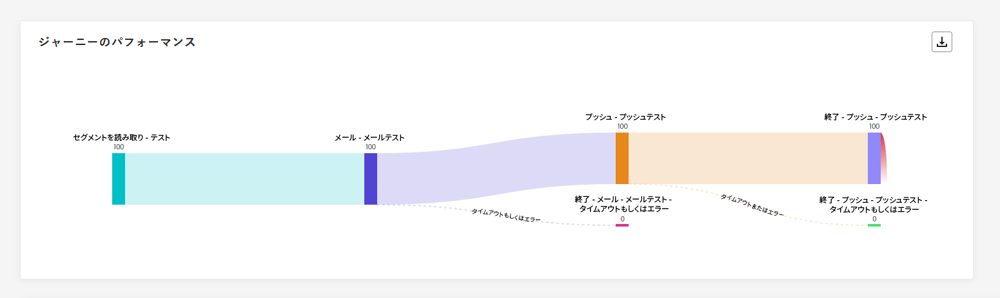

**[!UICONTROL ジャーニーパフォーマンス]**&#x200B;ウィジェットには、ターゲットプロファイルのジャーニーの進行状況が視覚的に表示されます。

ノードのプロファイル数は、プロファイルがノードを入力するときではなく、ノードを完了した後にのみ更新されることに注意してください。例えば、**待機**&#x200B;ノード上のプロファイルは、指定した日付に達し、プロファイルがノードを終了した場合にのみカウントされます。

### ジャーニーの統計 {#journey-statistics}

>[!CONTEXTUALHELP]
>id="ajo_journey_statistics"
>title="ジャーニーの統計"
>abstract="ジャーニーの統計の主要業績評価指標（KPI）は包括的なダッシュボードとして機能し、ジャーニーに関連する重要な指標の詳細な分析を提供します。"

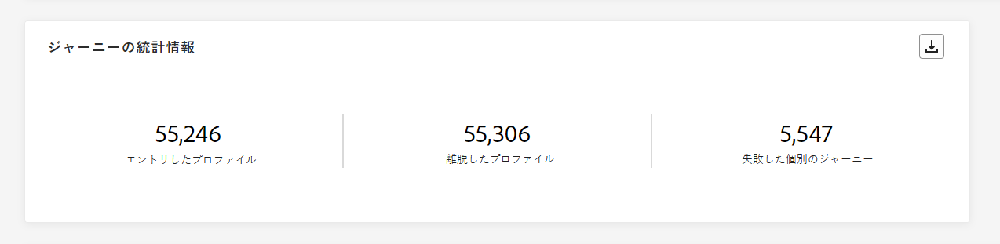

**[!UICONTROL ジャーニーの統計]**&#x200B;の主要業績評価指標（KPI）は包括的なダッシュボードとして機能し、ジャーニーに関連する重要な指標の分析を提供します。これには、入力されたプロファイルの数や失敗した個々のジャーニーのインスタンスなどの詳細が含まれ、ジャーニーの効果とエンゲージメントのレベルを包括的に把握できます。

+++ ジャーニーの統計指標の詳細情報

* **[!UICONTROL エントリしたプロファイル]**：ジャーニーのエントリイベントに到達した個人の合計数。

* **[!UICONTROL 退出したプロファイル]**：ジャーニーから退出した個人の合計数。

* **[!UICONTROL 失敗した個人のジャーニー]**：正常に実行されなかった個人のジャーニーの合計数。

+++

### アクションパフォーマンス {#action-performance}

>[!CONTEXTUALHELP]
>id="ajo_journey_action_performance"
>title="アクションパフォーマンス"
>abstract="アクションパフォーマンスウィジェットには、アクションが開始された際に発生した最も効果的なアクションが表示されます。"

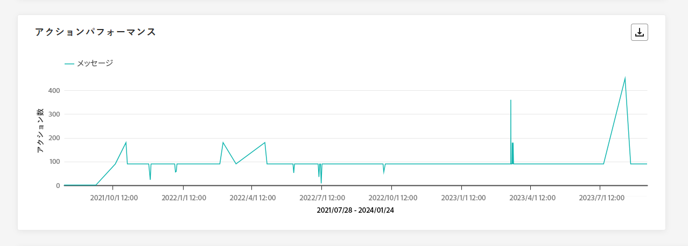

**[!UICONTROL アクションパフォーマンス]**&#x200B;ウィジェットには、**[!UICONTROL アクション]**&#x200B;がトリガーされた際に発生した最も効果的なアクションが表示されます。

### 上位のアクション {#top-actions}

>[!CONTEXTUALHELP]
>id="ajo_journey_top_actions"
>title="上位のアクション"
>abstract="上位のアクションのテーブルには、アクションに関する重要な情報が統合され、各アクションの頻度と有効性の両方について簡潔な観測結果が得られます。"

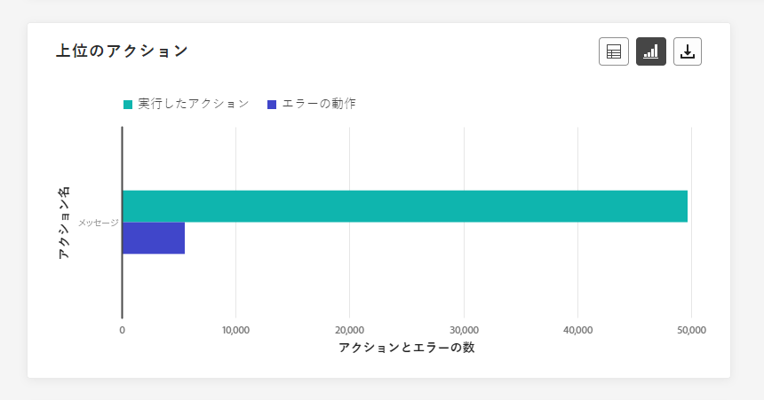

**[!UICONTROL 上位のアクション]**&#x200B;のテーブルには、**[!UICONTROL アクション]**&#x200B;に関する重要なデータがまとめて表示されます。各アクションの頻度とパフォーマンスについての簡潔なインサイトを提供します。

+++ 上位のアクション指標の詳細情報

* **[!UICONTROL 正常に実行されたアクション]**：ジャーニーに対して正常に実行された&#x200B;**[!UICONTROL アクション]**&#x200B;の合計数。

* **[!UICONTROL アクションのエラー]**：**[!UICONTROL アクション]**&#x200B;で発生したエラーの合計数。

+++

### アクションのエラー理由 {#action-error}

>[!CONTEXTUALHELP]
>id="ajo_journey_actions_error_reasons"
>title="アクションのエラー理由"
>abstract="アクションのエラー理由のテーブルとグラフには、アクションの実行中に発生したエラーの詳細な概要が表示され、発生した可能性のある問題の包括的な概要が提供されます。"

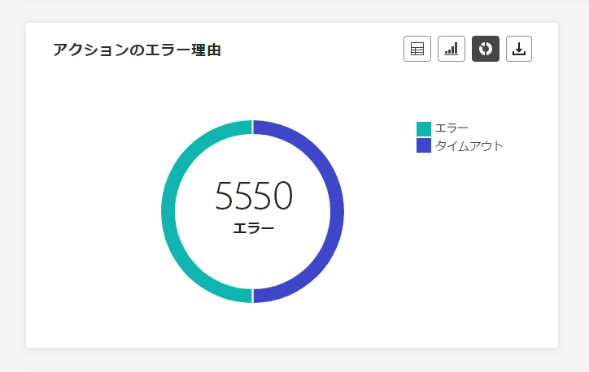

**[!UICONTROL アクションのエラー理由]**&#x200B;のテーブルとグラフには、**[!UICONTROL アクション]**&#x200B;の実行中に発生したエラーの包括的な概要が表示されます。

### 発生元別イベント {#events-origin}

>[!CONTEXTUALHELP]
>id="ajo_journey_events_origin"
>title="発生元別イベント"
>abstract="発生元別イベントのテーブルとグラフには、イベントが正常に受信されたかどうかが表示されます。これらの視覚的な表示によって、効果的に受信されたイベントを正確に識別し、ジャーニー内の各イベントのパフォーマンスと影響についての貴重なインサイトを得ることができます。"

**[!UICONTROL 発生元別イベント]**&#x200B;のテーブルとグラフには、**[!UICONTROL イベント]**&#x200B;が正常に受信されたかどうかが視覚的かつ詳細に表示されます。この視覚的な表示によって、どの&#x200B;**[!UICONTROL イベント]**&#x200B;が効果的に受信されたかを正確に識別し、ジャーニー内の個々のイベントのパフォーマンスと影響についての貴重なインサイトを得ることができます。

### イベント別受信イベント {#events-received}

>[!CONTEXTUALHELP]
>id="ajo_journey_events_received"
>title="イベント別受信イベント"
>abstract="イベント別受信イベントのグラフを使用すると、ジャーニー内の効果的に実行された特定のイベントを識別して分析し、個々のイベントのパフォーマンスと成功率についての貴重なインサイトを得ることができます。"

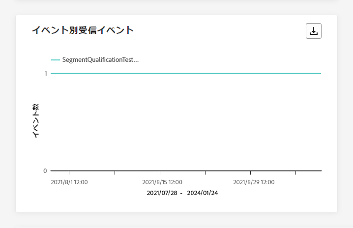

**[!UICONTROL イベント別受信イベント]**&#x200B;のグラフを使用すると、ジャーニー内のどの特定の&#x200B;**[!UICONTROL イベント]**&#x200B;が効果的に実行されたかを識別して分析し、個々のイベントのパフォーマンスと成功率についての貴重なインサイトを得ることができます。

### 上位のイベント {#top-events}

>[!CONTEXTUALHELP]
>id="ajo_journey_top_events"
>title="上位のイベント"
>abstract="上位のイベントのテーブルには、イベントに関する重要なデータが統合され、個々のイベントの頻度とパフォーマンスの両方について簡潔な観測結果が得られます。"

**[!UICONTROL 上位のイベント]**&#x200B;のテーブルには、**[!UICONTROL イベント]**&#x200B;に関する重要なデータがまとめて表示されます。各&#x200B;**[!UICONTROL イベント]**&#x200B;の頻度とパフォーマンスについての簡潔なインサイトが得られます。

### 同意ポリシー {#consent-policies}

>[!CONTEXTUALHELP]
>id="ajo_journey_consent_policies"
>title="同意ポリシー"
>abstract="同意ポリシーのテーブルとグラフには、カスタムアクション内で各ポリシーから除外されたプロファイルの数量が表示されます。この表示により、各同意ポリシーがプロファイルの除外に与えた影響についての明確なインサイトを得ることができます。"

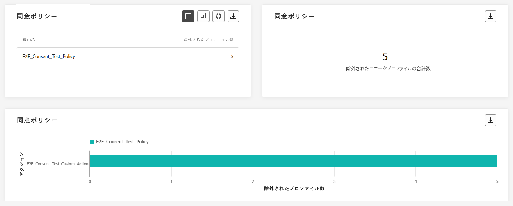

**[!UICONTROL 同意ポリシー]**&#x200B;のテーブルとグラフには、カスタムアクション内の各ポリシーから除外されたプロファイルの数が表示されます。これにより、各同意ポリシーがプロファイルの除外に与えた影響についての明確なインサイトを得ることができます。

カスタムアクションについて詳しくは、[詳細ドキュメント](../action/about-custom-action-configuration.md)を参照してください。

これらのウィジェットをジャーニーレポートに表示するには、ダッシュボードをリセットする必要があります。これを行うには、**[!UICONTROL 変更]**&#x200B;をクリックし、その後レポートの上部にある&#x200B;**[!UICONTROL リセット]**&#x200B;をクリックします。

## 「メール」タブ {#email-global}

ジャーニーの&#x200B;**[!UICONTROL グローバルレポート]**&#x200B;の「**[!UICONTROL メール]**」タブには、ジャーニーで送信されたメールに関する主な情報が詳しく表示されます。

### メール - 送信統計 {#email-sending-statistics}

>[!CONTEXTUALHELP]
>id="ajo_journey_email_sending_statistics"
>title="メール - 送信統計"
>abstract="メール - 送信統計テーブルは、ターゲットや配信など、メールに関する重要なデータを要約します。"

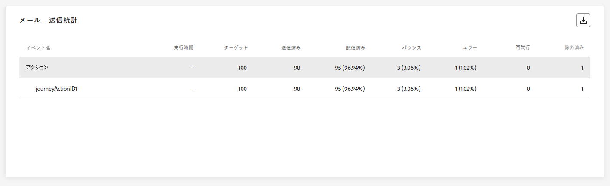

**[!UICONTROL メール送信統計]**&#x200B;のテーブルには、ジャーニー内のメールに関する重要なデータの包括的な概要が表示されます。ターゲットオーディエンスの規模や正常に配信されたメール数などの主要指標を詳しく示し、メールやジャーニーの効果とリーチに関する有益なインサイトを提供します。

+++ メール送信統計の指標の詳細情報

* **[!UICONTROL 実行時間]**：繰り返しジャーニーの場合の各ジャーニー実行の開始時間。1 つまたは複数の繰り返しのみをターゲットにするには、**[!UICONTROL 実行時間]**&#x200B;ドロップダウンから選択します。

* **[!UICONTROL ターゲット]**：任意のアクション（メールや SMS の送信など）のターゲットになるプロファイルの数。

* **[!UICONTROL 送信済み]**：ジャーニーで送信されたメールの合計数。

* **[!UICONTROL 配信済み]**：送信されたメールの合計数に対する、正常に送信されたメールの数。

* **[!UICONTROL 配信率]**：正常に送信されたメールの割合。

* **[!UICONTROL バウンス数]**：送信メールの合計数に対する、送信プロセス中および自動返信処理中に累積したエラーの合計数。

* **[!UICONTROL バウンス率]**：送信メールに対するバウンスメールの割合。

* **[!UICONTROL エラー]**：送信プロセス中に発生し、プロファイルへの送信の妨げとなったエラーの合計数。

* **[!UICONTROL エラー率]**：送信されたメールに対して、送信プロセス中にエラーが発生して送信できなかったメールの割合。

* **[!UICONTROL 再試行]**：再試行のキュー内のメール数。

* **[!UICONTROL 除外済み]**：Adobe Journey Optimizer によって除外されたプロファイルの数。

+++

### メール - トラッキング統計 {#email-tracking}

>[!CONTEXTUALHELP]
>id="ajo_journey_email_tracking_statistics"
>title="メール - トラッキング統計"
>abstract="メール - トラッキング統計テーブルには、メールのプロファイルアクティビティに関するデータが表示されます。"

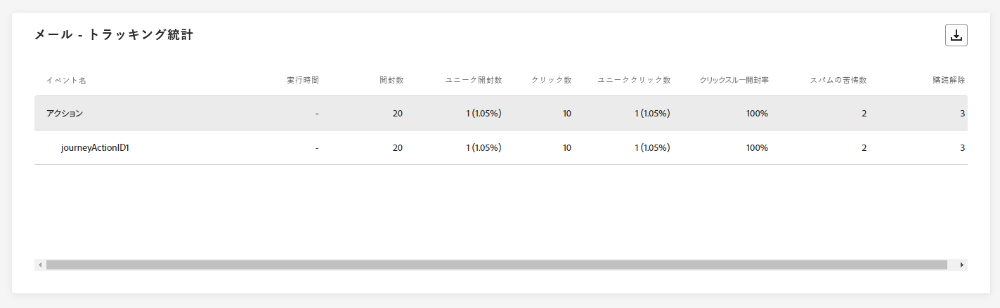

**[!UICONTROL メール - トラッキング統計]**&#x200B;のテーブルには、ジャーニーに含まれるメールに関連するプロファイルアクティビティの詳細な説明が表示されます。これには、開封数、クリック数、その他の関連するエンゲージメント指標など、プロファイルがメールコンテンツとどのようにやり取りするかを包括的に示す指標が含まれます。

+++ メール - トラッキング統計指標の詳細情報

* **[!UICONTROL 実行時間]**：ジャーニーでの繰り返しメールの各実行の開始時間。1 つまたは複数の繰り返しメールのみをターゲットにするには、**[!UICONTROL 実行時間]**&#x200B;ドロップダウンから選択します。

* **[!UICONTROL 開封数]**：ジャーニーでメールが開かれた回数。

* **[!UICONTROL ユニーク開封数]**：開封されたメールの割合。

* **[!UICONTROL ユニーク開封率]**：配信されたメール数に対して、開封されたメールの合計数。

* **[!UICONTROL クリック数]**：メールのコンテンツがクリックされた回数。

* **[!UICONTROL ユニーククリック数]**：メールのコンテンツをクリックした受信者の数。

* **[!UICONTROL クリックスルー率]**：ジャーニーに対して何らかのアクションを起こしたユーザーの割合。

* **[!UICONTROL 購読解除数]**：購読解除リンクのクリック数。

* **[!UICONTROL スパムの苦情数]**：メールがスパムまたはジャンクとして宣言された回数。

+++

### メール - 送信パフォーマンス {#email-performance}

>[!CONTEXTUALHELP]
>id="ajo_journey_email_sending_performance"
>title="メール - 送信パフォーマンス"
>abstract="メール - 送信パフォーマンスのグラフでは、送信されたメールに関する包括的なデータが表示され、配信やバウンスなどの主要指標に関するインサイトを提供し、メール配信プロセスを詳細に分析できます。"

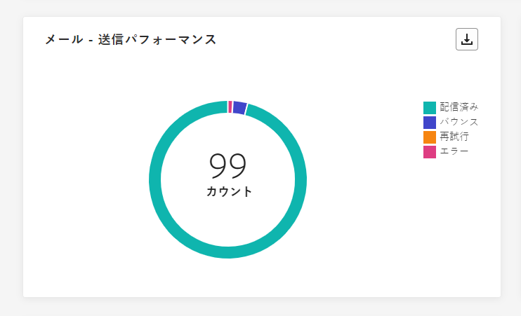

**[!UICONTROL メール - 送信パフォーマンス]**&#x200B;のグラフは、ジャーニーの送信されたメールに関するデータの包括的な見解を提供し、配信済みメールとバウンス数などの主要指標に関するインサイトを提供します。これにより、メール送信プロセスの詳細な分析を可能にし、ジャーニーの効率性とパフォーマンスに関する貴重な情報を提供します。

+++ メール - 送信パフォーマンス指標の詳細情報

* **[!UICONTROL 配信済み]**：送信されたメッセージの合計数に対する、正常に送信されたメッセージの数。

* **[!UICONTROL バウンス数]**：送信されたメッセージの合計数に対して、送信プロセスおよび自動返信処理の間に累積したエラーの合計数。

* **[!UICONTROL 再試行]**：再試行のキュー内のメール数。

* **[!UICONTROL エラー]**：送信プロセス中に発生し、プロファイルへの送信の妨げとなったエラーの合計数。

+++

### メール - バウンスのカテゴリと理由 {#email-bounce-categories}

>[!CONTEXTUALHELP]
>id="ajo_journey_email_bounces"
>title="メール - バウンスのカテゴリと理由"
>abstract="メール - バウンスのカテゴリと理由ウィジェットは、バウンスメッセージに関するデータを集計し、メールのバウンスに関与する特定の理由とカテゴリに関する詳細なインサイトを提供します。"

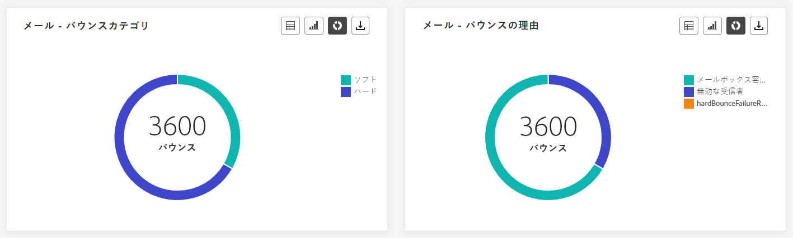

**[!UICONTROL バウンスの理由]**&#x200B;および&#x200B;**[!UICONTROL バウンスのカテゴリ]**&#x200B;のウィジェットは、バウンスメッセージに関連する使用可能なデータを集計し、メールのバウンスの背後にある特定の理由とカテゴリに関する詳細なインサイトを提供します。

バウンスについて詳しくは、[抑制リスト](../reports/suppression-list.md)のページを参照してください。

+++ メール - バウンスカテゴリ指標の詳細情報

* **[!UICONTROL ハードバウンス]**：永続的なエラー（メールアドレスの間違いなど）の合計数。このエラーは、アドレスが無効であることを明示的に示すエラーメッセージ（例：「不明なユーザー」）を伴います。

* **[!UICONTROL ソフトバウンス数]**：一時的なエラー（インボックスが満杯など）の合計数。

* **[!UICONTROL 無視]**：一時的なエラー（不在など）や技術的なエラー（送信者のタイプが postmaster の場合など）の合計数。

+++

### メール - エラー理由 {#email-errors}

>[!CONTEXTUALHELP]
>id="ajo_journey_email_error_reasons"
>title="メール - エラー理由"
>abstract="メール - エラー理由のグラフとテーブルを使用すると、送信プロセス中に発生した特定のエラーを識別できます。"

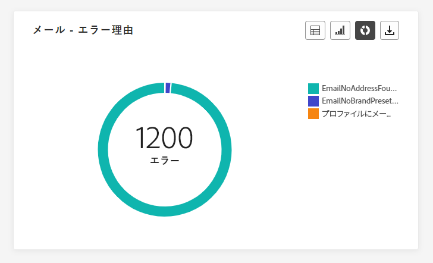

**[!UICONTROL エラーの理由]**&#x200B;のグラフとテーブルには、送信プロセス中に発生した特定のエラーを表示し、エラーの特性と発生に関する貴重な情報を提供します。

### メール - 除外された理由 {#email-excluded}

>[!CONTEXTUALHELP]
>id="ajo_journey_email_excluded_reasons"
>title="メール - 除外された理由"
>abstract="この除外された理由のグラフとテーブルには、ユーザープロファイルがターゲットオーディエンスから除外され、メッセージが受信されない原因となった様々な要因が表示されます。"

**[!UICONTROL 除外理由]**&#x200B;のグラフとテーブルは、ターゲットのオーディエンスからユーザープロファイルを除外した結果、メッセージを受信できない原因となった様々な要因の包括的なビューを示します。

除外理由の包括的なリストについては、[このページ](exclusion-list.md)を参照してください。

### ドメイン別に送信および配信 {#sent-domains}

>[!CONTEXTUALHELP]
>id="ajo_journey_email_sent_delivered_domains"
>title="ドメイン別に送信および配信"
>abstract="ドメイン別に送信および配信のテーブルとグラフは、ドメイン別に分類されたメールの分類を提供し、メール通信の全体的なパフォーマンスに関する詳細なインサイトを提供します。"

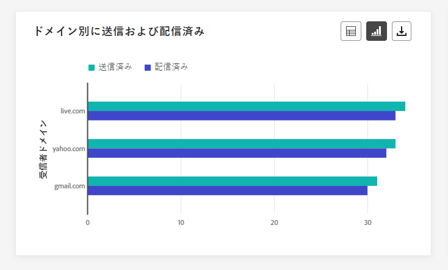

**[!UICONTROL ドメイン別に送信および配信]**&#x200B;のテーブルとグラフは、ドメインレベルでのメールの詳細な分類を表示し、メールのパフォーマンスに関する包括的なインサイトを提供します。

+++ ドメイン別に送信および配信指標の詳細情報

* **[!UICONTROL 送信済み]**：メールの送信の合計数。

* **[!UICONTROL 配信済み]**：送信されたメッセージの合計数に対する、正常に送信されたメッセージの数。

+++

### ドメイン別の開封数およびクリック数 {#open-domains}

>[!CONTEXTUALHELP]
>id="ajo_journey_email_open_clicks_domains"
>title="ドメイン別の開封数およびクリック数"
>abstract="ドメイン別の開封数およびクリック数のテーブルとグラフは、ドメインレベルで詳細な分類を提供し、オーディエンスがメールとどのようにやり取りするかを包括的に示します。"

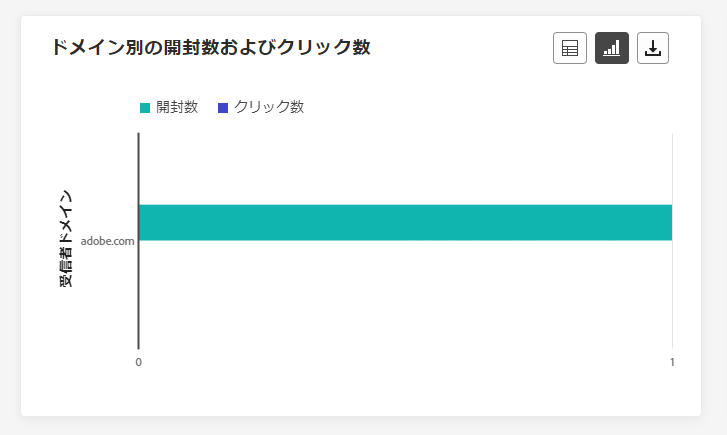

**[!UICONTROL ドメイン別の開封数およびクリック数]**&#x200B;のグラフとテーブルでは、プロファイルのメールに対するエンゲージメントのドメインレベルの分類を示し、様々なドメインがコンテンツとどのようにやり取りするかに関する有益なインサイトを提供します。

+++ ドメイン別の開封数およびクリック数指標の詳細情報

* **[!UICONTROL 開封数]**：メールが開封された回数。

* **[!UICONTROL クリック数]**：メールのコンテンツがクリックされた回数。

+++

### ドメイン別バウンス数とエラー数 {#bounces-domains}

>[!CONTEXTUALHELP]
>id="ajo_journey_email_bounces_errors_domains"
>title="ドメイン別バウンス数とエラー数"
>abstract="ドメイン別バウンス数とエラー数のグラフとテーブルは、ドメインレベルでの詳細な分類を示し、メールの送信プロセス中に発生した特定のエラーに関するインサイトを提供します。"

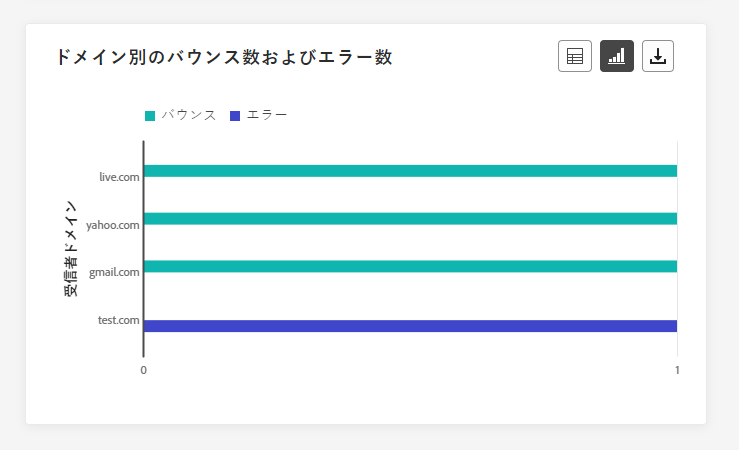

**[!UICONTROL ドメイン別のバウンス数およびエラー数]**&#x200B;のグラフとテーブルには、送信プロセス中に発生した特定のエラーのドメインレベルでの分類が表示され、発生した問題を詳しく分析できます。

+++ ドメイン別のバウンス数およびエラー数指標の詳細情報

* **[!UICONTROL バウンス数]**：送信メールの合計数に対する、送信プロセス中および自動返信処理中に累積したエラーの合計数。

* **[!UICONTROL エラー数]**：送信プロセス中に発生し、プロファイルへの送信の妨げとなったエラーの合計数。

+++

### ドメイン別のバウンス理由 {#bounce-reasons-domains}

>[!CONTEXTUALHELP]
>id="ajo_journey_email_bounces_reasons_domains"
>title="ドメイン別バウンス理由"
>abstract="ドメイン別のバウンス理由のグラフとテーブルは、ドメインレベルでの分類を示し、一時的なエラーと永続的なエラーの両方に関する包括的なインサイトを提供します。この詳細な分析では、バウンスメッセージの原因に関する貴重な情報を提供します。"

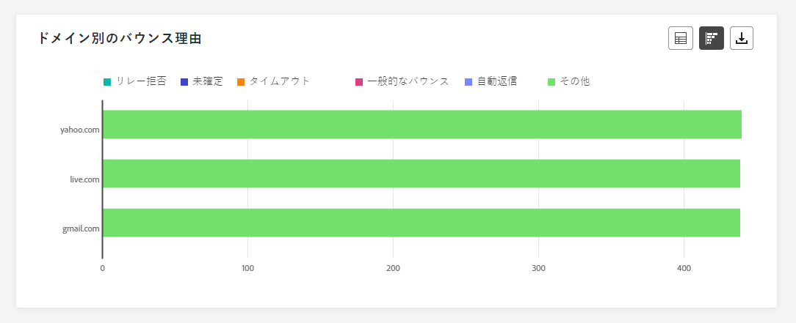

**[!UICONTROL ドメイン別のバウンス理由]**&#x200B;のグラフとテーブルには、一時的なエラーと永続的なエラーの両方に関するデータがドメインレベルで分類して表示され、バウンスメッセージの原因に関する詳細なインサイトを得ることができます。

### メール - 上位 URL {#email-top}

>[!CONTEXTUALHELP]
>id="ajo_journey_email_top_url"
>title="メール - 上位 URL"
>abstract="メール - 上位 URL のグラフとテーブルには、訪問者のトラフィックが最も多いメール内の URL の包括的な概要が表示され、一番人気のあるリンクを特定できます。"

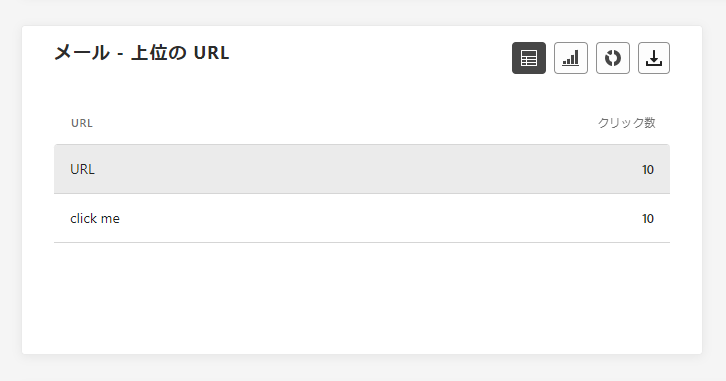

**[!UICONTROL メール - 上位 URL]** のグラフとテーブルは、メール内で最も多くの訪問者トラフィックを集めている URL の包括的な概要を提供します。これにより、最も人気のあるリンクを特定し、優先順位を付けることができ、メール内の特定のコンテンツに対するプロファイルのエンゲージメントをより深く理解することができます。

### メール - 最適化 {#email-sto}

>[!CONTEXTUALHELP]
>id="ajo_journey_email_optimization"
>title="メール - 最適化"
>abstract="送信時間の最適化ウィジェットと最適化と非最適化に比較ウィジェットは、メッセージに関する詳細情報を提供し、メッセージが最適化されているかどうかをハイライト表示します。"

>[!NOTE]
>
>**[!UICONTROL 送信時間の最適化]**&#x200B;ウィジェットと&#x200B;**[!UICONTROL 最適化と非最適化の比較]**&#x200B;ウィジェットは、配信で送信時間の最適化オプションが有効になっている場合にのみ使用できます。送信時間の最適化について詳しくは、[このページ](../building-journeys/journeys-message.md#send-time-optimization)を参照してください。

**[!UICONTROL 送信時間の最適化]**&#x200B;ウィジェットと&#x200B;**[!UICONTROL 最適化と非最適化の比較]**&#x200B;ウィジェットは、送信方法（最適化または通常）に応じてメールの成功状況を詳しく示します。

+++ 送信時間の最適化と、最適化と非最適化の指標の比較に関する情報

* **[!UICONTROL 配信済み]**：送信されたメッセージの合計数に対して、正常に配達できたメッセージの数。
* **[!UICONTROL バウンス数]**：送信されたメッセージの合計数に対して、送信プロセスおよび自動返信処理の間に累積したエラーの合計数。

* **[!UICONTROL 送信済み]**：ジャーニーの送信メールの合計数。

* **[!UICONTROL 開封数]**：ジャーニーでメールが開封された回数。

* **[!UICONTROL クリック数]**：メールのコンテンツがクリックされた回数。

+++

### メール - オファー {#email-offers}

>[!CONTEXTUALHELP]
>id="ajo_journey_email_offers"
>title="メール - オファー"
>abstract="オファー統計ウィジェットとオファー詳細統計ウィジェットは、時間の経過に伴う影響の詳細な分析や、より詳細に理解するための詳細な統計を示して、オファーのパフォーマンスに関する包括的なインサイトを提供します。"

>[!NOTE]
>
>オファーのウィジェットと指標は、決定がメールに挿入された場合にのみ使用できます。 意思決定管理について詳しくは、[このページ](../offers/get-started/starting-offer-decisioning.md)を参照してください。

**[!UICONTROL オファー統計]**&#x200B;と&#x200B;**[!UICONTROL オファー詳細統計]**&#x200B;の推移ウィジェットは、オファーの成功とターゲットにしたオーディエンスへの影響を長期にわたって測定します。メッセージに関連する主な情報について、KPI を使用して詳しく説明します。

+++ メール - オファー指標の詳細情報

* **[!UICONTROL 送信されたオファー]**：オファーの送信の合計数。

* **[!UICONTROL オファーのインプレッション]**：メールのオファーが開封された回数。

* **[!UICONTROL オファーのクリック数]**：メールのオファーがクリックされた回数。

* **[!UICONTROL プレースメント名]**：オファーを表示するために使用するプレースメントの名前。プレースメントについて詳しくは、この[ページ](../offers/offer-library/creating-placements.md)を参照してください。

* **[!UICONTROL オファー名]**：メールに追加されたオファーの名前。プレースメントについて詳しくは、この[ページ](../offers/offer-library/creating-personalized-offers.md)を参照してください。

* **[!UICONTROL 送信されたオファー]**：オファーの送信の総数。

* **[!UICONTROL オファーのインプレッション率]**：送信されたオファーの数に対する、開封されたオファーの割合。

* **[!UICONTROL オファーのクリック率]**：オファーに対してアクションを起こしたユーザーの割合。

+++

## 「プッシュ通知」タブ {#push-global}

ジャーニーの&#x200B;**[!UICONTROL グローバルレポート]**&#x200B;の「**[!UICONTROL プッシュ通知]**」タブには、ジャーニーで送信されるプッシュ通知に関連する主な情報が詳しく表示されます。

### プッシュ通知 - 送信統計 {#push-sending-stat}

>[!CONTEXTUALHELP]
>id="ajo_journey_push_sending_statistics"
>title="プッシュ通知 - 送信統計"
>abstract="プッシュ通知 - 送信統計テーブルは、ターゲットメッセージや配信メッセージなどのプッシュ通知に関する重要なデータを要約します。"

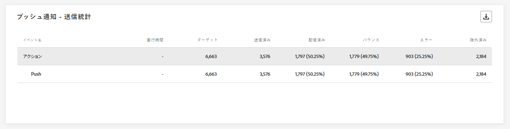

**[!UICONTROL プッシュ通知 - 送信統計]**&#x200B;のテーブルは、ターゲットメッセージ数や正常に配信されたメッセージ数などの主要指標を含む、プッシュ通知に関する重要なデータの簡潔な概要を示します。

+++ プッシュ通知 - 送信統計指標の詳細情報

* **[!UICONTROL 実行時間]**：繰り返しジャーニーの場合の各ジャーニー実行の開始時間。1 つまたは複数の繰り返しのみをターゲットにするには、**[!UICONTROL 実行時間]**&#x200B;ドロップダウンから選択します。

* **[!UICONTROL ターゲット]**：任意のアクション（メールや SMS の送信など）でターゲットとするプロファイルの数。

* **[!UICONTROL 送信済み]**：送信されたプッシュ通知の合計数。

* **[!UICONTROL 配信済み]**：送信されたプッシュ通知の合計数に対する、正常に送信されたプッシュ通知の数。

* **[!UICONTROL 配信率]**：正常に送信されたプッシュ通知の割合。

* **[!UICONTROL バウンス数]**：送信されたプッシュ通知の合計数に対して、送信プロセスおよび自動返信処理の間に累積したエラーの合計数。

* **[!UICONTROL バウンス率]**：送信済みのプッシュ通知に対する、バウンスしたプッシュ通知の割合。

* **[!UICONTROL エラー]**：送信プロセス中に発生し、プロファイルへの送信の妨げとなったエラーの合計数。

* **[!UICONTROL エラー率]**：送信されたプッシュ通知と比較した、送信プロセス中に発生した送信の妨げとなったエラーの割合。

* **[!UICONTROL 除外済み]**：Adobe Journey Optimizer によって除外されたプロファイルの数。

+++

### プッシュ通知 - トラッキング統計 {#push-tracking-stat}

>[!CONTEXTUALHELP]
>id="ajo_journey_push_tracking_statistics"
>title="プッシュ通知 - トラッキング統計"
>abstract="プッシュ通知 - トラッキング統計では、プッシュ通知のプロファイルアクティビティに関するデータを提供します。"

**[!UICONTROL プッシュ - トラッキング統計]**&#x200B;のウィジェットは、プッシュ通知に関連するプロファイルアクティビティの詳細なスナップショットを提供し、エンゲージメントとプッシュ通知の効果に関する重要なインサイトを提供します。

+++ プッシュ通知 - トラッキング統計指標の詳細情報

* **[!UICONTROL 実行時間]**：繰り返しジャーニーの場合の各ジャーニー実行の開始時間。1 つまたは複数の繰り返しのみをターゲットにするには、**[!UICONTROL 実行時間]**&#x200B;ドロップダウンから選択します。

* **[!UICONTROL 開封数]**：ジャーニーでプッシュ通知が開かれた回数。

* **[!UICONTROL アクション]**：配信されたプッシュ通知に対するアクション（ボタンのクリックや解除など）の合計数。

+++

### プッシュ通知 - 送信の概要 {#push-summary}

>[!CONTEXTUALHELP]
>id="ajo_journey_push_sending_summary"
>title="プッシュ通知 - 送信の概要"
>abstract="プッシュ通知 - 送信の概要グラフには、送信されたプッシュ通知に使用可能なデータが表示されます。"

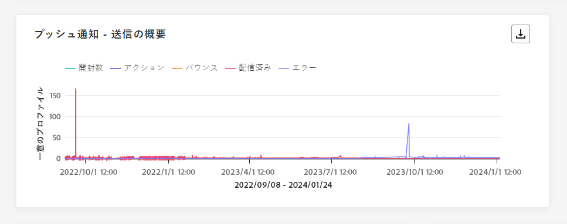

**[!UICONTROL プッシュ通知 - 送信の概要]**&#x200B;のグラフは、プッシュ通知アクティビティの分析を動的に表示します。このグラフでは、送信されたプッシュ通知の包括的な分類を示します。

+++ プッシュ通知 - 送信の概要指標の詳細情報

* **[!UICONTROL 開封数]**：ジャーニーでプッシュ通知が開かれた回数。

* **[!UICONTROL アクション]**：配信されたプッシュ通知に対するアクション（ボタンのクリックや解除など）の合計数。

* **[!UICONTROL バウンス数]**：送信されたプッシュ通知の合計数に対して、送信プロセスおよび自動返信処理の間に累積したエラーの合計数。

* **[!UICONTROL 配信済み]**：送信されたプッシュ通知の合計数に対する、正常に送信されたプッシュ通知の数。

* **[!UICONTROL エラー]**：送信プロセス中に発生し、プロファイルへの送信の妨げとなったエラーの合計数。

+++

### プッシュ通知 - エラー理由 {#push-error-reasons}

>[!CONTEXTUALHELP]
>id="ajo_journey_push_error_reasons"
>title="プッシュ通知 - エラー理由"
>abstract="エラー理由のグラフとテーブルを使用すると、送信プロセス中に発生した特定のエラーを識別できます"

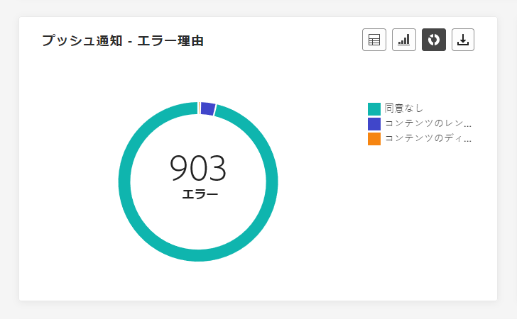

**[!UICONTROL エラー理由]**&#x200B;のテーブルとグラフは、プッシュ通知の送信プロセス中に発生した特定のエラーを識別することができ、進行中に発生した問題に関する詳細なインサイトを提供します。

### プッシュ通知 - 除外された理由 {#push-excluded}

>[!CONTEXTUALHELP]
>id="ajo_journey_push_excluded_reasons"
>title="プッシュ通知 - 除外された理由"
>abstract="除外された理由のグラフとテーブルには、ターゲットオーディエンスから除外されたユーザープロファイルがメッセージを受信できない様々な要因が表示されます。"

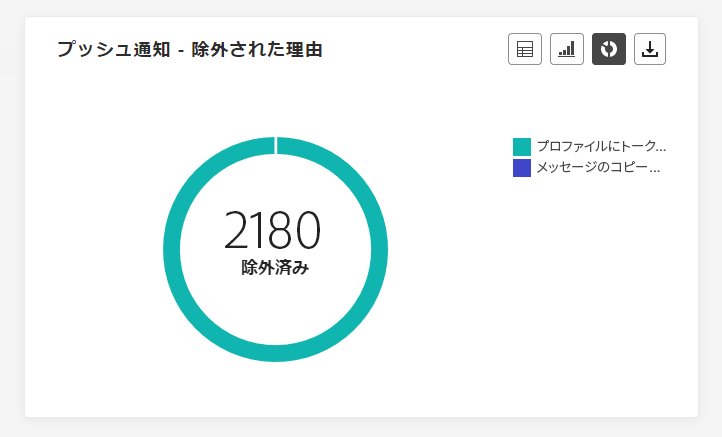

**[!UICONTROL 除外された理由]**&#x200B;のグラフとテーブルには、ターゲットプロファイルから除外されたユーザープロファイルがプッシュ通知を受信できない様々な理由が表示されます。

除外理由の包括的なリストについては、[このページ](exclusion-list.md)を参照してください。

### プッシュ通知 - プラットフォームごとの分類 {#push-breakdown}

>[!CONTEXTUALHELP]
>id="ajo_journey_push_breakdown_platform"
>title="プッシュ通知 - プラットフォームごとの分類"
>abstract="プッシュ通知 - プラットフォームごとの分類のグラフとテーブルには、プロファイルのオペレーティングシステムに基づいたプッシュ通知の成功の分類が表示されます。"

**[!UICONTROL プッシュ通知 - プラットフォームごとの分類]**&#x200B;のグラフとテーブルは、正常に送信されたプッシュ通知の詳細な分析を提供し、プロファイルのオペレーティングシステムに基づいたインサイトを示します。この分類により、様々なプラットフォームでのプッシュ通知のパフォーマンスをさらに把握できます。

### プッシュ通知 - 最適化 {#push-sto}

>[!NOTE]
>
>**[!UICONTROL 最適化と非最適化に比較]**&#x200B;ウィジェットと&#x200B;**[!UICONTROL 送信時間の最適化]**&#x200B;ウィジェットは、配信で「送信時間の最適化」オプションがアクティブ化されている場合にのみ使用できます。送信時間の最適化について詳しくは、[このページ](../building-journeys/journeys-message.md#send-time-optimization)を参照してください。

**[!UICONTROL 最適化と非最適化に比較]**&#x200B;ウィジェットと&#x200B;**[!UICONTROL 送信時間の最適化]**&#x200B;ウィジェットでは、メッセージが最適化されているかどうかに関係なく、メッセージに関する主な情報が詳しく表示されます。

+++ プッシュ配信 - 最適化指標の詳細情報

* **[!UICONTROL 配信済み]**：送信されたメッセージの合計数に対して、正常に送信されたメッセージの数。

* **[!UICONTROL 開封数]**：ジャーニーでプッシュ通知が開かれた回数。

* **[!UICONTROL アクション]**：配信されたプッシュ通知に対するアクション（ボタンのクリックや解除など）の合計数。

* **[!UICONTROL 配信済み]**：送信されたメッセージの合計数に対して、正常に配達できたメッセージの数。

* **[!UICONTROL バウンス数]**：送信されたメッセージの合計数に対して、送信プロセスおよび自動返信処理の間に累積したエラーの合計数。

+++

## 「SMS」タブ {#sms-global}

### SMS - 送信統計 {#sms-sending-stat}

>[!CONTEXTUALHELP]
>id="ajo_journey_sms_sending_statistics"
>title="SMS - 送信統計"
>abstract="SMS - 送信統計テーブルは、ターゲットメッセージや配信メッセージなど、SMS メッセージに関する重要なデータを要約します。"

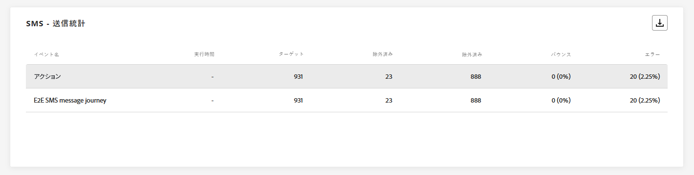

**[!UICONTROL SMS - 送信統計]**&#x200B;のテーブルは、ターゲットのメッセージ数や正常に配信されたメッセージ数などの主要指標を含む、SMS メッセージに関する重要なデータの簡潔な概要を示しています。

+++ SMS － 送信統計の指標の詳細情報

* **[!UICONTROL 実行時間]**：繰り返しジャーニーの場合の各ジャーニー実行の開始時間。1 つまたは複数の繰り返しのみをターゲットにするには、**[!UICONTROL 実行時間]**&#x200B;ドロップダウンから選択します。

* **[!UICONTROL ターゲット]**：SMS メッセージのターゲットプロファイルとして適合するユーザープロファイルの数。

* **[!UICONTROL 除外済み]**：ターゲットプロファイルから除外され、SMS メッセージを受信しなかったユーザープロファイルの数。

* **[!UICONTROL 送信済み]**：ジャーニーで送信された SMS メッセージの合計数。

* **[!UICONTROL バウンス数]**：送信された SMS メッセージの合計数に対する、送信プロセス中および自動返信処理中に累積したエラーの合計数。

* **[!UICONTROL エラー数]**：送信プロセス中に発生し、プロファイルに送信できない原因となったエラーの合計数。

+++

### SMS - トラッキング統計 {#sms-tracking-stat}

>[!CONTEXTUALHELP]
>id="ajo_journey_sms_tracking_statistics"
>title="SMS - トラッキング統計"
>abstract="SMS - トラッキング統計ウィジェットは、訪問者の URL とのやり取りに関する重要な情報の包括的な概要を提供します。"

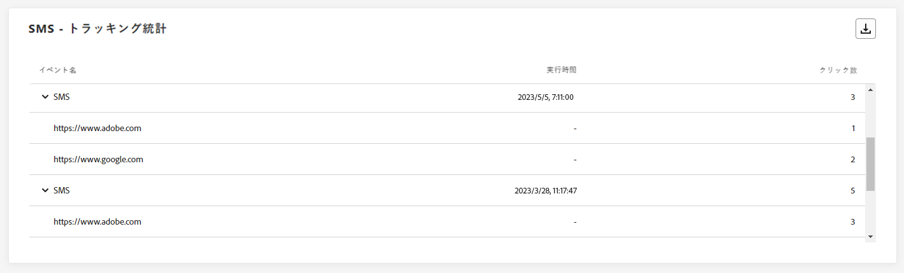

**[!UICONTROL SMS - トラッキング統計]**&#x200B;ウィジェットでは、訪問者の URL へのエンゲージメントに関する主要情報の詳細な概要を確認し、SMS メッセージの有効性に関するインサイトを得ることができます。

* **[!UICONTROL 実行時間]**：繰り返し SMS の実行開始時間。1 つまたは複数の繰り返し SMS のみをターゲットにするには、**[!UICONTROL 実行時間]**&#x200B;ドロップダウンから選択します。

* **[!UICONTROL クリック数]**：SMS メッセージでコンテンツがクリックされた回数。

### SMS - 日別パフォーマンス {#sms-performance-date}

>[!CONTEXTUALHELP]
>id="ajo_journey_sms_perfomance_date"
>title="SMS - 日別パフォーマンス"
>abstract="SMS - 日別パフォーマンスウィジェットには、メッセージに関する主な情報がグラフィックで表示されます。"

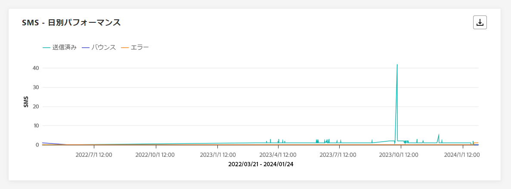

**[!UICONTROL SMS - 日別パフォーマンス]**&#x200B;ウィジェットでは、メッセージに関する主要情報の概要を詳細なグラフで確認し、特定の期間におけるパフォーマンスの傾向に関するインサイトを得ることができます。

+++ SMS - 日別パフォーマンス指標の詳細情報

* **[!UICONTROL 送信済み]**：ジャーニーで送信された SMS メッセージの合計数

* **[!UICONTROL バウンス数]**：送信された SMS メッセージの合計数に対する、送信プロセス中および自動返信処理中に累積したエラーの合計数。

* **[!UICONTROL エラー数]**：送信プロセス中に発生し、プロファイルに送信できない原因となったエラーの合計数。

+++

### SMS - バウンスの理由 {#sms-bounce}

>[!CONTEXTUALHELP]
>id="ajo_journey_sms_bounces_reasons"
>title="SMS - バウンスの理由"
>abstract="バウンス理由のグラフとテーブルには、バウンスされたメッセージに関連して使用可能なデータが含まれます。"

**[!UICONTROL バウンスの理由]**&#x200B;グラフおよびテーブルは、バウンスした SMS メッセージに関するデータの包括的な概要を示し、SMS メッセージバウンスの事例の背後にある特定の理由に関する貴重なインサイトを提供します。

### SMS - エラー理由 {#sms-error}

>[!CONTEXTUALHELP]
>id="ajo_journey_sms_error_reasons"
>title="SMS - エラー理由"
>abstract="SMS - エラー理由のグラフとテーブルを使用すると、送信プロセス中に発生した特定のエラーを識別できます。"

**[!UICONTROL エラーの理由]**&#x200B;グラフおよびテーブルは、SMS メッセージの送信プロセス中に発生した特定のエラーを識別できるようにし、発生した問題の徹底的な分析を促進します。

### SMS - 除外された理由 {#sms-excluded}

>[!CONTEXTUALHELP]
>id="ajo_journey_sms_excluded_reasons"
>title="SMS - 除外された理由"
>abstract="この除外された理由のグラフとテーブルには、ユーザープロファイルがターゲットオーディエンスから除外され、メッセージが受信されない原因となった様々な要因が表示されます。"

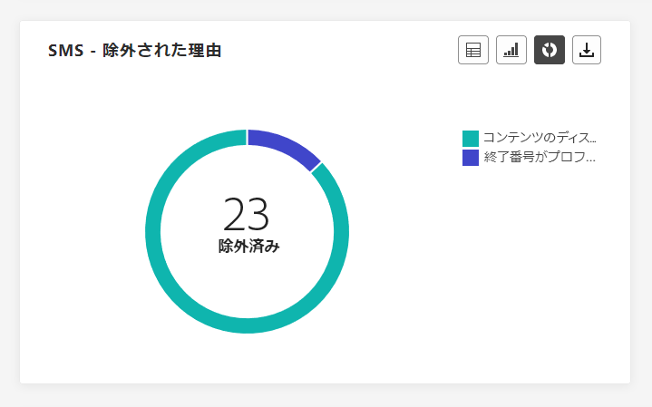

**[!UICONTROL 除外された理由]**&#x200B;のグラフとテーブルには、ターゲットオーディエンスからユーザープロファイルを除外した結果、SMS メッセージを受信できない原因となった様々な要因が視覚的に表示されます。

除外された理由の包括的なリストについて詳しくは、[このページ](exclusion-list.md)を参照してください。

### SMS - リンク別のクリック数 {#sms-clicks}

>[!CONTEXTUALHELP]
>id="ajo_journey_sms_clicks"
>title="SMS - リンク別のクリック数"
>abstract="SMS - リンク別のクリック数ウィジェットは、メッセージ内の URL に対する訪問者のエンゲージメントに関する重要なインサイトを提供します。"

**[!UICONTROL SMS - リンク別のクリック数]**&#x200B;ウィジェットは、メッセージに含まれる URL に対する訪問者のエンゲージメントに関する基本的なインサイトを提供し、どのリンクが最も多くのやり取りを生み出しているかについての重要な情報を提供します。

## 「アプリ内」タブ {#in-app-global}

ジャーニーの&#x200B;**[!UICONTROL グローバルレポート]**&#x200B;の「**[!UICONTROL アプリ内]**」タブには、ジャーニーで送信されたアプリ内メッセージに関連する主な情報が詳細に示されています。

### アプリ内パフォーマンス {#inapp-performance}

>[!CONTEXTUALHELP]
>id="ajo_journey_inapp_performance"
>title="アプリ内パフォーマンス"
>abstract="アプリ内パフォーマンス KPI は、アプリ内メッセージに対する訪問者のエンゲージメントに関する重要なインサイトを提供します。"

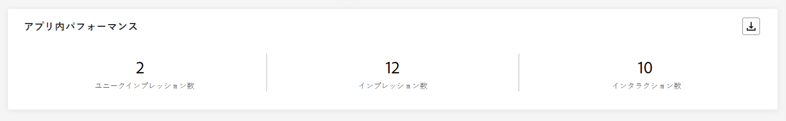

**[!UICONTROL アプリ内パフォーマンス]**&#x200B;の KPI は、プロファイルのアプリ内メッセージとのエンゲージメントに関する基本的なインサイトを提供し、ジャーニーに含まれるアプリ内メッセージの有効性と影響を評価するための重要な指標を提供します。

+++ アプリ内 - 日別パフォーマンス指標の詳細情報

* **[!UICONTROL ユニークインプレッション数]**：アプリ内メッセージが表示されたユニークユーザーの数。

* **[!UICONTROL インプレッション数]**：すべてのユーザーに表示されたアプリ内メッセージの合計数。

  >[!NOTE]
  >
  >インプレッションが確実にカウントされるようにするには、ユーザーが次の 2 つの条件を満たす必要があります。
  >* アプリ内エクスペリエンス内の認定。ジャーニー内の特定のアプリ内アクティビティに到達することで達成されます。
  >* トリガールールで指定された条件を満たす。
  > 
  >2 つ目の条件により、ターゲットプロファイルの数と個別インプレッション数には顕著な違いが生じる場合があります。

* **[!UICONTROL インタラクション数]**：アプリ内メッセージに対するエンゲージメント数。これには、クリック、解除またはその他のやり取りなど、ユーザーが実行したすべてのアクションが含まれます。
+++

### アプリ内の概要 {#inapp-summary}

>[!CONTEXTUALHELP]
>id="ajo_journey_inapp_summary"
>title="アプリ内の概要"
>abstract="アプリの内概要グラフは、指定した期間におけるアプリ内のインプレッション数とインタラクション数の進行状況を示します。"

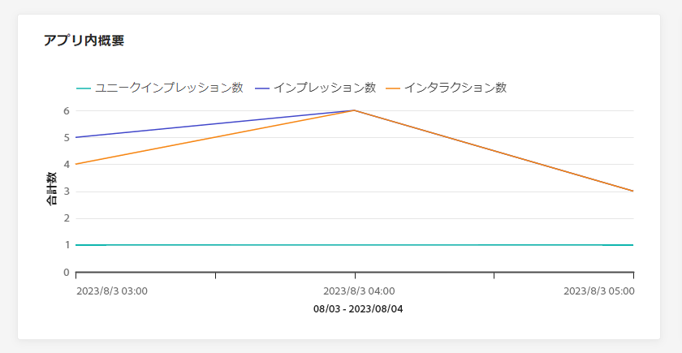

**[!UICONTROL アプリ内の概要]**&#x200B;のグラフは、指定した期間におけるアプリ内のインプレッション数とインタラクション数の進行状況を示し、アプリ内メッセージのパフォーマンスの包括的な概要を示します。

### タイプ別インタラクション数 {#interactions-type}

>[!CONTEXTUALHELP]
>id="ajo_journey_inapp_interactions"
>title="タイプ別インタラクション数"
>abstract="タイプ別インタラクション数グラフと表は、クリック、破棄、インタラクションを追跡して、ユーザーがアプリ内メッセージに対してどのような操作をしたかを示します。"

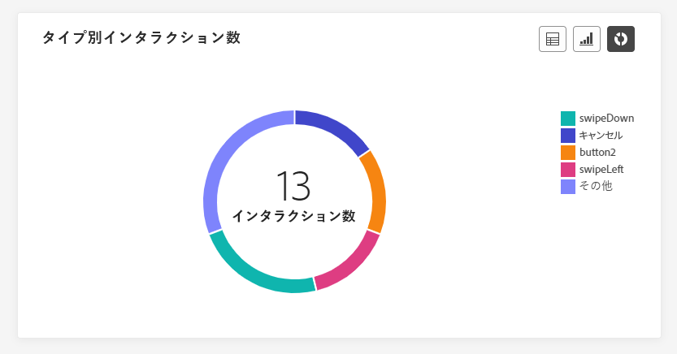

**[!UICONTROL タイプ別のインタラクション数]**&#x200B;のグラフとテーブルは、クリック、解除またはその他のエンゲージメントなどのアクションを追跡し、プロファイルがアプリ内メッセージでどのようなやり取りを行ったかに関する詳細な説明を提供します。
