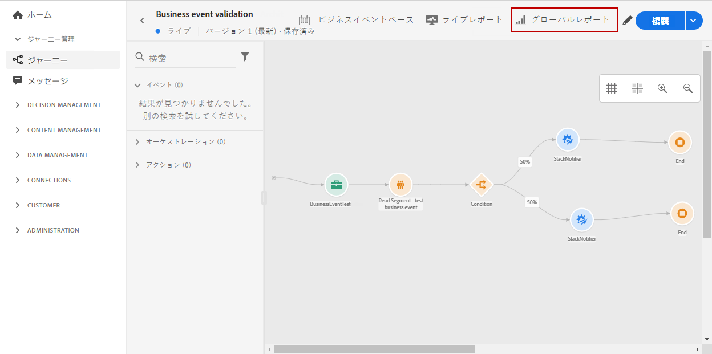
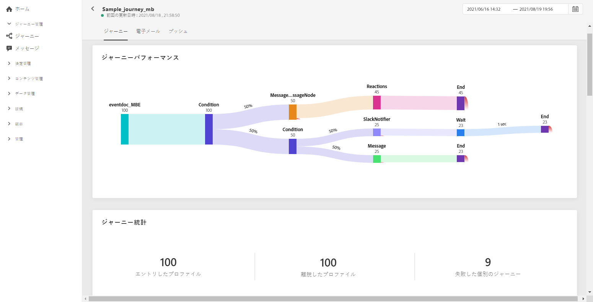

# ジャーニーグローバルレポート{#journey-global-report}

ジャーニーグローバルレポートにジャーニーから直接アクセスするには、「**[!UICONTROL グローバルレポート]**」ボタンを押します。

ジャーニー&#x200B;**[!UICONTROL グローバルレポート]**&#x200B;ページが表示され、次のタブが表示されます。

* [ジャーニー](#journey-global)
* [メール](#email-global)
* [プッシュ](#push-global)

ジャーニー&#x200B;**[!UICONTROL グローバルレポート]**&#x200B;は、ジャーニーの成功とエラーについて説明している様々なウィジェットに分かれています。 必要に応じて、各ウィジェットのサイズを変更したり削除したりできます。 詳細については、[このセクション](global-report.md#modify-dashboard)を参照してください。

## ジャーニータブ{#journey-global}

ジャーニー&#x200B;**[!UICONTROL グローバルレポート]**&#x200B;の「**[!UICONTROL ジャーニー]**」タブには、ジャーニーに関する重要なトラッキングデータが明確に表示されます。

**[!UICONTROL ジャーニーのパフォーマンス]**&#x200B;ウィジェットを使用すると、ターゲットにしたプロファイルのパスをジャーニーの中で順を追って確認できます。

**[!UICONTROL ジャーニーの統計情報]**&#x200B;ウィジェットには、次の KPI が表示されます。

* **[!UICONTROL 進入したプロファイル]**：ジャーニーのエントリイベントに到達した個人の合計数。

* **[!UICONTROL 退出したプロファイル]**：ジャーニーから退出した個人の合計数。

* **[!UICONTROL 失敗した個人のジャーニー]**：正常に実行されなかった個人のジャーニーの合計数。

**[!UICONTROL イベントのパフォーマンス]**&#x200B;と&#x200B;**[!UICONTROL 上位のイベント]**&#x200B;のウィジェットを使用すると、どの&#x200B;**[!UICONTROL イベント]**&#x200B;が正常に実行されたかをグラフや表を通して確認できます。

**[!UICONTROL アクションのパフォーマンス]**&#x200B;と&#x200B;**[!UICONTROL 上位のアクション]**&#x200B;のウィジェットを使用すると、最も成功したアクションと&#x200B;**[!UICONTROL アクション]**&#x200B;がトリガーされたときに発生したエラーを確認できます。**[!UICONTROL 上位のアクション]**&#x200B;テーブルには、**[!UICONTROL アクション]**&#x200B;に関する次のようなデータが表示されます。

* **[!UICONTROL 正常に実行されたアクション]**：ジャーニーにおいて正常に実行された **[!UICONTROL アクション]**&#x200B;の合計数。

* **[!UICONTROL アクションのエラー]**：**[!UICONTROL アクション]**&#x200B;で発生したエラーの合計数。

**[!UICONTROL エラー原因]**&#x200B;グラフには、**[!UICONTROL アクション]**&#x200B;で発生したエラーの種類を表示します。

<!--Events by origin-->

## メールタブ{#email-global}

ジャーニー&#x200B;**[!UICONTROL グローバルレポート]**&#x200B;の「**[!UICONTROL メール]**」タブには、ジャーニーで送信したメールの配信に関連して、主要な情報が表示されます。

特定のメール配信に関する詳細なレポートについては、[メールグローバルレポート](#email-global-report)のセクションを参照してください。

**[!UICONTROL メール送信統計]**&#x200B;グラフは、成功した配信の詳細を示します。

* **[!UICONTROL 送信済み]**：この配信における送信の合計数。

* **[!UICONTROL 配信済み]**：送信されたメッセージの合計数に対して、正常に配達できたメッセージの数。

* **[!UICONTROL 配信率]**：正常に送信されたメッセージの割合。

* **[!UICONTROL バウンス]**：送信されたメッセージの総数に対して、配信と自動返信の処理中に発生したエラーの合計。

* **[!UICONTROL バウンス率]**：送信メールに対するバウンスメールの割合。

* **[!UICONTROL エラー]**：配信中に発生した（プロファイルに配信できなかった）エラーの総数。

* **[!UICONTROL エラー率]**：送信されたメールに対して、配信中に発生した（配信できなかった）エラーの割合。

**[!UICONTROL メール - トラッキング統計情報]**&#x200B;には、配信に対する受信者のアクティビティを確認できるデータが表示されます。

* **[!UICONTROL 開封数]**：配信でメッセージが開かれた回数。

* **[!UICONTROL ユニーク開封数]**：開封された配信の割合。

* **[!UICONTROL 開封率]**：配信されたメール数に対して、開封されたメールの合計数。

* **[!UICONTROL クリック数]**：メール内の内容がクリックされた回数。

* **[!UICONTROL ユニーククリック数]**：メール内の内容をクリックした受信者数。

* **[!UICONTROL クリックスルー率]**：ジャーニーに対して何らかのアクションを起こしたユーザーの割合。

**[!UICONTROL 送信統計情報]**&#x200B;グラフを使用すると、次のような送信済みメールに関するデータを確認できます。

* **[!UICONTROL 配信済み]**：送信されたメッセージの合計数に対して、正常に配達できたメッセージの数。

* **[!UICONTROL バウンス]**: 配信および自動返信処理中に発生したエラーの合計で、送信されたメッセージの合計数に関連して計算されたエラーの合計。

* **[!UICONTROL エラー]**：配信中に発生した（プロファイルに配信できなかった）エラーの総数。

**[!UICONTROL バウンス理由]**&#x200B;と&#x200B;**[!UICONTROL バウンス分類]**&#x200B;には、次のような、バウンスメッセージに関するデータが表示されます。

* **[!UICONTROL ハードバウンス]**：メールアドレスの間違いなど、永続的なエラーの合計数。このエラーは、アドレスが無効であることを明示的に示すエラーメッセージ（例：「不明なユーザー」）を伴います。

* **[!UICONTROL ソフトバウンス]**：受信ボックスがいっぱいであるなど、一時的なエラーの合計数。

* **[!UICONTROL 無視]**：不在の返信や、技術的なエラー通知（たとえば送信者が postmaster である）など、一時的なエラーの合計数。

バウンスについて詳しくは、[抑制リスト](../suppression-list.md)のページを参照してください。

**[!UICONTROL E メール - トップ URL]** のグラフと表は、配信されたメールの中で最もアクセスされた URL の詳細を示しています。

**[!UICONTROL E メール - ベスト受信者ドメイン]**&#x200B;のグラフと表は、受信者が電子メールを開くために最も使用しているドメインの詳細を示しています。

## プッシュタブ {#push-global}

ジャーニー&#x200B;**[!UICONTROL グローバルレポート]**&#x200B;の&#x200B;**[!UICONTROL プッシュ]**&#x200B;タブには、ジャーニーで送信されるプッシュ配信に関連するメイン情報が詳しく表示されます。

特定のプッシュ配信に関する詳細なレポートについては、[プッシュグローバルレポート](#push-global-report)を参照してください。

**[!UICONTROL プッシュ通知 - 送信する統計]**&#x200B;テーブルでは、グラフと KPI を使用してプッシュ通知に関連するメイン情報を詳細に表示します。

* **[!UICONTROL 送信済み]**：配信の総送信数。

* **[!UICONTROL 配信済み]**：送信されたメッセージの合計数に対して、正常に配達できたメッセージの数。

* **[!UICONTROL 配信率]**：正常に送信されたメッセージの割合。

* **[!UICONTROL バウンス]**：送信されたメッセージの総数に対して、配信および自動返信処理中に累積されたエラーの合計。

* **[!UICONTROL バウンス率]**：送信されたプッシュ通知と比較した、バウンスしたプッシュ通知の割合。

* **[!UICONTROL エラー]**：配信中に発生した、プロファイルへの送信ができなかったエラーの総数。

* **[!UICONTROL エラー率]**：送信されたプッシュ通知と比較した、配信中に発生した送信を妨げるエラーの割合。

**[!UICONTROL プッシュ - トラッキング統計]**&#x200B;には、配信の受信者アクティビティに使用できるデータが含まれます。

* **[!UICONTROL 開封数]**：配信でメッセージが開封された回数。

* **[!UICONTROL 開封率]**：開封されたプッシュ通知の割合。

* **[!UICONTROL アクション]**：配信されたプッシュ通知に対するアクション（ボタンのクリックや却下など）の総数。

* **[!UICONTROL エンゲージメント]**：このプッシュ通知の開封数とアクション数の合計（プロファイルがプッシュを開封した場合やボタンがクリックされた場合など）。

* **[!UICONTROL エンゲージメント率]**：このプッシュ通知の開封とアクションの割合（プロファイルがプッシュを開封した場合やボタンがクリックされた場合など）。

**[!UICONTROL プッシュ通知の概要]**&#x200B;グラフには、次のような送信済みプッシュ通知に使用できるデータが含まれています。

* **[!UICONTROL 開封数]**：配信でメッセージが開封された回数。

* **[!UICONTROL アクション]**：プッシュ通知が配信された操作（ボタンのクリックや却下など）の合計数です。配信されたプッシュ通知に対するアクションの総数（ボタンのクリックや解除など）。

* **[!UICONTROL バウンス]**：送信されたメッセージの総数に対して、配信および自動返信処理中に累積したエラーの合計。

* **[!UICONTROL 配信済み]**：送信されたメッセージの総数に対する、正常に送信されたメッセージの数。

* **[!UICONTROL エラー]**：配信中に発生したプロファイルへの送信を妨げるエラーの総数。

**[!UICONTROL エラー理由]**&#x200B;のグラフとテーブルを使用すると、配信中に発生したエラーを確認できます。

**[!UICONTROL プラットフォーム別トラッキング]**、**[!UICONTROL プラットフォーム別送信]**、**[!UICONTROL プラットフォーム別分類]**&#x200B;のグラフとテーブルには、受信者の運用システムに応じたプッシュ通知の成功を詳細に示しています。
