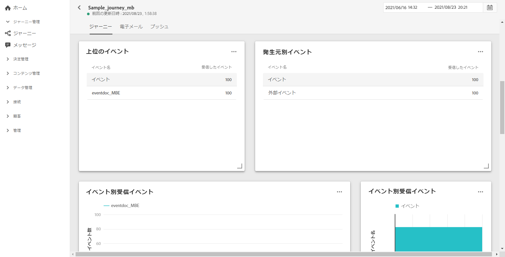
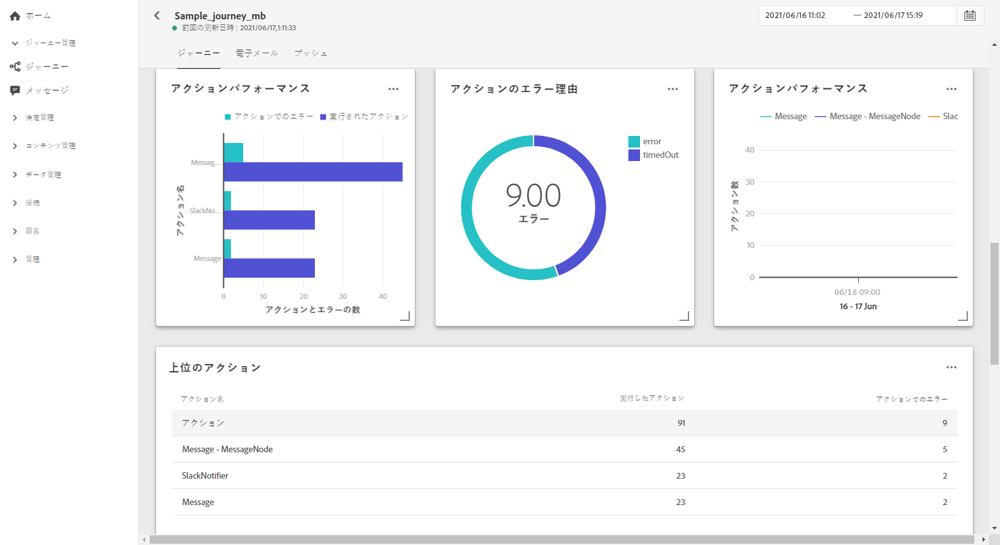
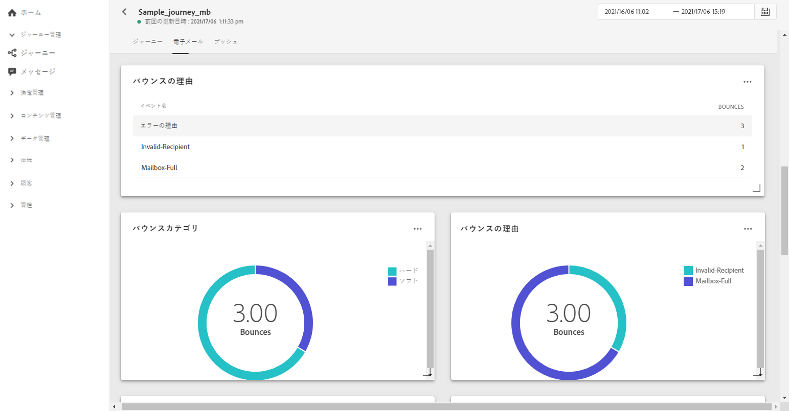
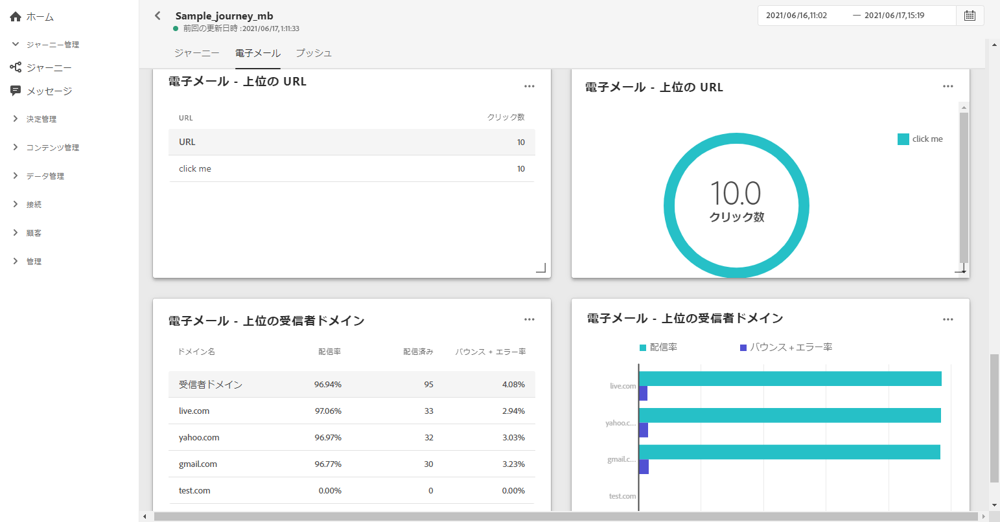
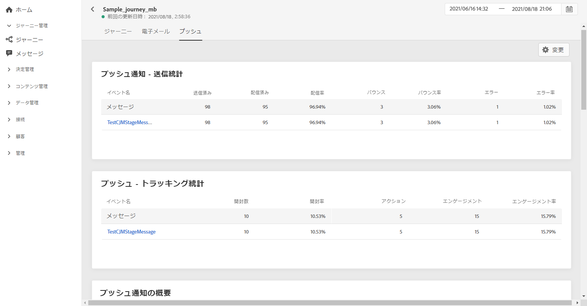
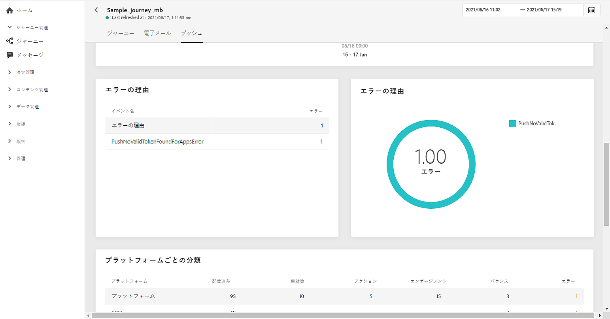
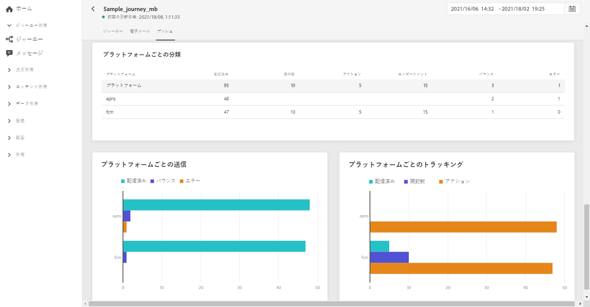

# ジャーニーグローバルレポート {#journey-global-report}

ジャーニーのグローバルレポートにジャーニーから直接アクセスするには、「**[!UICONTROL グローバルレポート]**」ボタンを押します。

ジャーニーの&#x200B;**[!UICONTROL グローバルレポート]**&#x200B;ページが表示され、次のタブが表示されます。

* [ジャーニー](#journey-global)
* [メール](#email-global)
* [プッシュ](#push-global)

ジャーニーの&#x200B;**[!UICONTROL グローバルレポート]**&#x200B;は、ジャーニーの成功とエラーについて説明する様々なウィジェットに分かれています。必要に応じて、各ウィジェットのサイズを変更したり削除したりできます。詳しくは、この[節](global-report.md#modify-dashboard)を参照してください。

## 「ジャーニー」タブ {#journey-global}

ジャーニーの&#x200B;**[!UICONTROL グローバルレポート]**&#x200B;の「**[!UICONTROL ジャーニー]**」タブには、ジャーニーに関する重要なトラッキングデータが明確に表示されます。

**[!UICONTROL ジャーニーパフォーマンス]**&#x200B;ウィジェットを使用すると、ターゲットプロファイルのパスをジャーニー全体を順を追って確認できます。

**[!UICONTROL ジャーニー統計]**&#x200B;ウィジェットには、次のKPIが表示されます。

* **[!UICONTROL エントリしたプロファイル]**：ジャーニーのエントリイベントに到達した個人の合計数。

* **[!UICONTROL 退出したプロファイル]**：ジャーニーから退出した個人の合計数。

* **[!UICONTROL 失敗した個人のジャーニー]**：正常に実行されなかった個人のジャーニーの合計数。

**[!UICONTROL イベント]**、**[!UICONTROL オリジン別イベント]**、**[!UICONTROL トップイベント]**&#x200B;ウィジェットを使用すると、グラフとテーブルを通じて、**[!UICONTROL イベント]**&#x200B;のどれが正常に実行されたかを確認できます。

**[!UICONTROL アクションのパフォーマンス]**、 **[!UICONTROL アクションエ]** ラーの理由 **[!UICONTROL と上位のActionswidgets]** は、アクションがトリガーされたときに発生した、最も成功したアクションとエ **** ラーを表します。

**[!UICONTROL 上位のアクション]**&#x200B;テーブルには、**[!UICONTROL アクション]**&#x200B;に関する次のようなデータが表示されます。

* **[!UICONTROL 正常に実行されたアクション]**：ジャーニーに対して正常に実行された&#x200B;**[!UICONTROL アクション]**&#x200B;の合計数。

* **[!UICONTROL アクションのエラー]**：**[!UICONTROL アクション]**&#x200B;で発生したエラーの合計数。

## 「メール」タブ  {#email-global}

ジャーニーの&#x200B;**[!UICONTROL グローバルレポート]**&#x200B;の「**[!UICONTROL メール]**」タブには、ジャーニーで送信したメールの配信に関する主な情報が表示されます。

特定のメール配信に関する詳細なレポートについては、[メールのグローバルレポート](#email-global-report)のセクションを参照してください。

**[!UICONTROL メール送信統計]**&#x200B;グラフは、成功した配信の詳細を示します。

* **[!UICONTROL 送信済み]**：配信に対する送信の合計数。

* **[!UICONTROL 配信済み]**：送信されたメッセージの合計数に対して、正常に配達できたメッセージの数。

* **[!UICONTROL 配信率]**：正常に送信されたメッセージの割合。

* **[!UICONTROL バウンス]**：送信されたメッセージの総数に対して、配信と自動返信の処理中に発生したエラーの累計。

* **[!UICONTROL バウンス率]**：送信メールに対するバウンスメールの割合。

* **[!UICONTROL エラー]**：配信中に発生し、プロファイルへの送信の妨げとなったエラーの合計数。

* **[!UICONTROL エラー率]**：送信されたメールに対して、配信中にエラーが発生して送信できなかったメールの割合。

**[!UICONTROL メール - トラッキング統計情報]**&#x200B;には、配信に対する受信者のアクティビティを確認できるデータが表示されます。

* **[!UICONTROL 開封数]**：配信でメッセージが開かれた回数。

* **[!UICONTROL ユニーク開封数]**：開封された配信の割合。

* **[!UICONTROL 開封率]**：配信されたメール数に対して、開封されたメールの合計数。

* **[!UICONTROL クリック数]**：メールのコンテンツがクリックされた回数。

* **[!UICONTROL ユニーククリック数]**：メールのコンテンツをクリックした受信者の数。

* **[!UICONTROL クリックスルー率]**：ジャーニーに対して何らかのアクションを起こしたユーザーの割合。

* **[!UICONTROL 購読解除]**:購読解除リンクのクリック数。

* **[!UICONTROL スパムの苦情]**:メッセージがスパムまたは迷惑メールとして宣言された回数。

**[!UICONTROL 送信統計情報]**&#x200B;グラフを使用すると、次のような送信済みメールに関するデータを確認できます。

* **[!UICONTROL 配信済み]**：送信されたメッセージの合計数に対して、正常に配達できたメッセージの数。

* **[!UICONTROL バウンス]**：送信されたメッセージの総数に対して、配信と自動返信の処理中に発生したエラーの累計。

* **[!UICONTROL エラー]**：配信中に発生し、プロファイルへの送信の妨げとなったエラーの合計数。

**[!UICONTROL バウンスの理由]**&#x200B;ウィジェットおよび&#x200B;**[!UICONTROL バウンスのカテゴリ]**&#x200B;ウィジェットには、次のようなバウンスメッセージに関するデータが含まれています。

* **[!UICONTROL ハードバウンス]**：永続的なエラー（メールアドレスの間違いなど）の合計数。このエラーは、アドレスが無効であることを明示的に示すエラーメッセージ（例：「不明なユーザー」）を伴います。

* **[!UICONTROL ソフトバウンス数]**：一時的なエラー（インボックスが満杯など）の合計数。

* **[!UICONTROL 無視]**：一時的なエラー（不在など）や技術的なエラー（送信者のタイプが postmaster の場合など）の合計数。

バウンスについて詳しくは、[抑制リスト](../suppression-list.md)のページを参照してください。

「**[!UICONTROL メール - 上位の URL]**」のグラフと表は、配信されたメールの中で最もアクセス頻度の高い URL の詳細を示しています。

**[!UICONTROL Eメール — 上位の受信者ドメイン]**&#x200B;グラフおよびテーブル詳細は、Eメールを開く際に受信者が最も使用するドメインを示します。

## 「プッシュ」タブ  {#push-global}

ジャーニーの&#x200B;**[!UICONTROL グローバルレポート]**&#x200B;の「**[!UICONTROL プッシュ]**」タブには、ジャーニーで送信されるプッシュ配信に関連する主な情報が詳しく表示されます。

特定のプッシュ配信に関する詳細なレポートについては、[プッシュグローバルレポート](#push-global-report)を参照してください。

「**[!UICONTROL プッシュ通知 - 送信統計]**」テーブルは、プッシュ通知に関連するメイン情報の詳細をグラフと KPI で示します。

* **[!UICONTROL 送信済み]**：配信に対する送信の合計数。

* **[!UICONTROL 配信済み]**：送信されたメッセージの合計数に対して、正常に配達できたメッセージの数。

* **[!UICONTROL 配信率]**：正常に送信されたメッセージの割合。

* **[!UICONTROL バウンス]**：送信されたメッセージの総数に対して、配信と自動返信の処理中に発生したエラーの累計。

* **[!UICONTROL バウンス率]**：送信されたプッシュ通知と比較した、バウンスしたプッシュ通知の割合。

* **[!UICONTROL エラー]**：配信中に発生し、プロファイルへの送信の妨げとなったエラーの合計数。

* **[!UICONTROL エラー率]**：送信されたプッシュ通知と比較した、配信中に発生した送信を妨げるエラーの割合。

「**[!UICONTROL プッシュ - トラッキング統計]**」には、配信の受信者アクティビティに使用できるデータが含まれます。

* **[!UICONTROL 開封数]**：配信でメッセージが開封された回数。

* **[!UICONTROL 開封率]**：開封されたプッシュ通知の割合。

* **[!UICONTROL アクション]**：配信されたプッシュ通知に対するアクション（ボタンのクリックや解除など）の合計数。

* **[!UICONTROL エンゲージメント]**：このプッシュ通知に対する開封数とアクション数（「プロファイルがプッシュを開封した」、「ボタンがクリックされた」など）の合計。

* **[!UICONTROL エンゲージメント率]**：このプッシュ通知の開封とアクションの割合（プロファイルによるプッシュの開封や、ボタンのクリックなど）。

「**[!UICONTROL プッシュ通知の概要]**」グラフには、次のような送信済みプッシュ通知に使用できるデータが含まれています。

* **[!UICONTROL 開封数]**：配信でメッセージが開封された回数。

* **[!UICONTROL アクション]**：配信されたプッシュ通知に対するアクション（ボタンのクリックや解除など）の合計数。

* **[!UICONTROL バウンス]**：送信されたメッセージの総数に対して、配信と自動返信の処理中に発生したエラーの累計。

* **[!UICONTROL 配信済み]**：送信されたメッセージの合計数に対して、正常に配達できたメッセージの数。

* **[!UICONTROL エラー]**：配信中に発生し、プロファイルへの送信の妨げとなったエラーの合計数。

「**[!UICONTROL エラー理由]**」グラフと表を使用すると、配信中に発生したエラーを確認できます。

**[!UICONTROL プラットフォーム別トラッキング]**、**[!UICONTROL プラットフォーム別送信]**、**[!UICONTROL プラットフォーム別分類]**&#x200B;のグラフとテーブルには、プッシュ通知の成功の詳細がオペレーティングシステムに応じて表示されます。
