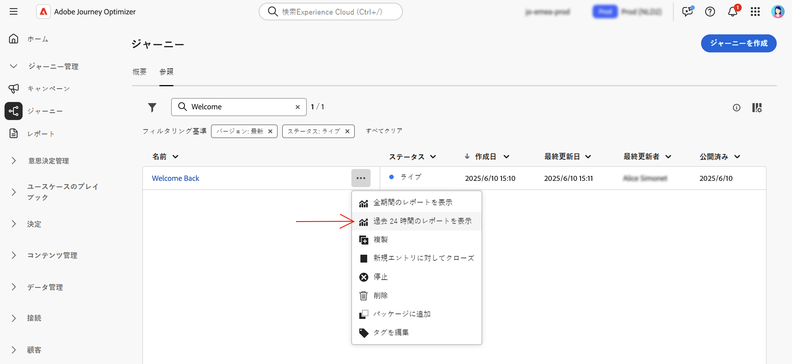

# 「旅グローバル」レポート {#journey-global-report}

旅グローバルレポートには、 **[!UICONTROL View report]** このボタンを使用して直接アクセスすることができます。

次のタブを使用して、旅 **[!UICONTROL Global report]** ページが表示されます。

* [旅](#journey-global)
* [電子メール](#email-global)
* [プル](#push-global)
* [SMS](#sms-global)

この旅 **[!UICONTROL Global report]** は、旅の成功と間違いについての様々な widget に分割されています。 各 widget については、必要に応じてサイズ変更や削除を行うことができます。 詳細については、ここを  参照してください。

アドビシステムズ社のオプティマイザーで利用可能なすべてのメトリックスのリストについては、このページ ](global-report.md#list-of-components-global) を [ 参照してください。

## 「フライト」タブ {#journey-global}

タブを使用 **[!UICONTROL Global report]** **[!UICONTROL Journey]** すると、旅に関する最も重要なトラッキングデータを表示できます。

詳細については、「参考情報」と「参考情報」を参照してください。

**[!UICONTROL Journey Performance]**&#x200B;この widget を使用すると、ターゲットのプロファイルのパスを段階的に調べることができます。

**[!UICONTROL Journey Statistics]** Widget には、次のように kpi が表示されます。

* **[!UICONTROL Entered profiles]**: 旅の入場イベントに達した人物の総数を示します。

* **[!UICONTROL Exited profiles]**: 旅を終了した人物の総数です。

* **[!UICONTROL Failed individual journey]**: 正常に実行されなかった個々の journeys の合計数。

**[!UICONTROL Events received by event]**&#x200B;および widget を使用すると **[!UICONTROL Top events]** 、どの機能が正常に実行されたか **[!UICONTROL Events]** を、 **[!UICONTROL Events by origin]** グラフやテーブルを使用して調べることができます。

**[!UICONTROL Action Performance]****[!UICONTROL Top Actions]**、 **[!UICONTROL Action Error Reasons]** widget がトリガーされたときに **[!UICONTROL Actions]** 発生する、最も成功したアクションとエラーを表します。

テーブルに **[!UICONTROL Top Actions]** は、次のような次の **[!UICONTROL Actions]** データが格納されています。

* **[!UICONTROL Actions successfully executed]**: 1 つの旅において正常に実行されたの **[!UICONTROL Actions]** 合計数。

* **[!UICONTROL Error in action]**: 発生し **[!UICONTROL Actions]** たエラーの合計数。

テーブルとグラフに **[!UICONTROL Consent policies]** は、カスタムアクションの各ポリシーから除外されたプロファイルの数が表示されます。カスタムアクションについて詳しくは、詳細なマニュアル ](../action/about-custom-action-configuration.md) を [ 参照してください。

このような widget が Journeys のレポートに表示されるようにするには、ダッシュボードを再設定する必要があります。 そのためには、レポートの上部にある次 **[!UICONTROL Reset]** のボタンをクリックし **[!UICONTROL Modify]** ます。
+++

## 電子メールタブ {#email-global}

このタブには、お客様の旅において **[!UICONTROL Global report]** 、お客様との間で送信された電子メール配信に関する重要な情報が表示され **[!UICONTROL Email]** ます。

電子メールレポートに使用できる様々なメトリックスと widget について詳しくは、+ + + こちらを参照してください。

このグラフは **[!UICONTROL Email Sending Statistics]** 、配信が成功したことを示します。

* **[!UICONTROL Targeted]**: 電子メールや SMS などすべての操作について、Adobe の旅オーケストレーションに対象とされていたプロファイルの数です。

* **[!UICONTROL Sent]**: 配布に使用された送信の合計数。

* **[!UICONTROL Delivered]**: 送信されたメッセージの総数に対する、送信が成功したメッセージの数を指定します。

* **[!UICONTROL Delivery Rate]**: 送信に成功したメッセージの割合 (%) を指定します。

* **[!UICONTROL Bounces]**: 配信中に発生したエラーの合計数が、送信メッセージの総数に対する相対処理で累積されます。

* **[!UICONTROL Bounce Rate]**: 送り返された電子メールのうち、送信された電子メールのパーセンテージを示します。

* **[!UICONTROL Errors]**: 配信中に発生したエラーの総数が、プロファイルに送信されるのを防ぐことができます。

* **[!UICONTROL Error Rate]**: 配信中に発生したエラーのうち、送信中に発生したメールと比較して送信されたものを防ぐことができます。

には **[!UICONTROL Email - Tracking statistics]** 、配信に使用できる受信者アクティビティのデータが格納されています。

* **[!UICONTROL Opens]**: 配信が開かれた回数を指定します。

* **[!UICONTROL Unique Opens]**: 開かれた出荷に対する割合です。

* **[!UICONTROL Unique Open Rate]**: 配信された電子メールの数と比較して開かれた電子メールの合計数。

* **[!UICONTROL Clicks]**: 電子メールのコンテンツがクリックされた回数を指定します。

* **[!UICONTROL Unique Clicks]**: 電子メールのコンテンツをクリックした受信者の数です。

* **[!UICONTROL Click through rate]**: 旅に出てきたユーザーに対する割合です。

* **[!UICONTROL Unsubscribe]**: Unsubscription リンクのクリック回数。

* **[!UICONTROL Spam complaints]**: メッセージがスパムまたは迷惑メールとして宣言された回数。

このグラフに **[!UICONTROL Sending Statistics]** は、送信された電子メールで利用可能なデータが含まれています。

* **[!UICONTROL Delivered]**: 送信されたメッセージの総数に対する、送信が成功したメッセージの数を指定します。

* **[!UICONTROL Bounces]**: 配信中に発生したエラーの合計数が、送信メッセージの総数に対する相対処理で累積されます。

* **[!UICONTROL Errors]**: 配信中に発生したエラーの総数が、プロファイルに送信されるのを防ぐことができます。

**[!UICONTROL Bounce Reasons]**&#x200B;および **[!UICONTROL Bounce categories]** widget には、バウンスメッセージに関連する次のようなデータが含まれています。

* **[!UICONTROL Hard bounce]**: 電子メールアドレスの間違いなどの永続的なエラーの合計数。 これには、不明なユーザーなど、アドレスが無効であることを示すエラーメッセージが表示されます。

* **[!UICONTROL Soft bounce]**: 完全な受信ボックスなど、一時的なエラーの合計数。

* **[!UICONTROL Ignored]**: 「外出中」などの一時的な合計数、または送信者の種類がポストマスターである場合などの技術的なエラーが挙げられます。

バウンスについて詳しくは、抑制リスト ](../reports/suppression-list.md) ページを [ 参照してください。

**[!UICONTROL Error Reasons]**&#x200B;グラフとテーブルを使用すると、配信中に発生したエラーを確認することができます。

**[!UICONTROL Excluded reasons]**「グラフとテーブル」には、対象のプロファイルから除外されたユーザープロファイルがメッセージの受信から除外されるというさまざまな理由が表示されます。

表示されている情報は、グラフとテーブルに **[!UICONTROL Email - Top Url]** よって異なります。

グラフとテーブルに **[!UICONTROL Email - Top recipient domain]** は、電子メールを開くために受信者が最も頻繁に使用するドメインが詳しく表示されます。

>[!NOTE]
>
>**[!UICONTROL Optimized vs non optimized]** And **[!UICONTROL Send time optimization]** widget を使用できるのは、配信時に「送信時の最適化」オプションが有効になっている場合のみです。送信時最適化について詳しくは、このページ ](../building-journeys/journeys-message.md#send-time-optimization) を [ 参照してください。

グラフは **[!UICONTROL Optimized vs non optimized]** 、最適化されているかどうかに関係なく、メッセージに関する主な情報を示します。

* **[!UICONTROL Sent]**: 配布に使用された送信の合計数。
* **[!UICONTROL Opens]**: 配信が開かれた回数を指定します。
* **[!UICONTROL Clicks]**: 電子メールのコンテンツがクリックされた回数を指定します。

送信方法に応じて、 **[!UICONTROL Send time optimization]** 「最適化」または「標準」を使用して配信を成功させることができます。

* **[!UICONTROL Delivered]**: 送信されたメッセージの総数に対する、送信が成功したメッセージの数を指定します。
* **[!UICONTROL Bounces]**: 配信中に発生したエラーの合計数が、送信メッセージの総数に対する相対処理で累積されます。

>[!NOTE]
>
>提示される widget and metrics は、電子メールに意思決定が追加された場合にのみ使用できます。 意思決定管理について詳しくは、この [ ページ ](../offers/get-started/starting-offer-decisioning.md) を参照してください。

**[!UICONTROL Offers statistics]**&#x200B;時間と共に一定の widget を使用することで、お客様に提供される成功と影響が **[!UICONTROL Offers statistic]** 計測されます。Kpi を使用してメッセージに関連する主要な情報を詳細に説明します。

* **[!UICONTROL Offer sent]**: 申し出の合計数。

* **[!UICONTROL Offer impression]**: 配信中にオファーが開かれた回数を指定します。

* **[!UICONTROL Offer clicks]**: 配信中にキャンペーンがクリックされた回数。

このテーブルに **[!UICONTROL Offers detailed statistic]** は、オファーと共に受信者の操作に使用可能なデータが含まれています。

* **[!UICONTROL Placement name]**: オファーを表示するために使用された位置の名前。 配置について詳しくは、この [ ページ ](../offers/offer-library/creating-placements.md) を参照してください。

* **[!UICONTROL Offer name]**: 配送に追加されたサービスの名前。 配置について詳しくは、この [ ページ ](../offers/offer-library/creating-personalized-offers.md) を参照してください。

* **[!UICONTROL Offer sent]**: 申し出の合計数。

* **[!UICONTROL Offer impression rate]**: 「受信したキャンペーン数」と「送信されたキャンペーン数」の比率を比較します。

* **[!UICONTROL Offer click rate]**: 申し出によって対話したユーザのパーセンテージ。
+++

## 「プッシュ通知」タブ {#push-global}

このタブには、お客様 **[!UICONTROL Global report]** が旅に送信された配信に関する主な情報が記載され **[!UICONTROL Push notification]** ています。

+ + + プッシュレポートに使用できる様々なメトリックスと widget について詳しくは、こちらを参照してください。

この表では、 **[!UICONTROL Push notification - Sending statistics]** グラフと kpi を使用した push 通知に関する主な情報について説明しています。

* **[!UICONTROL Targeted]**: 電子メールや SMS などすべての操作について、Adobe の旅オーケストレーションに対象とされていたプロファイルの数です。

* **[!UICONTROL Sent]**: 配布に使用された送信の合計数。

* **[!UICONTROL Delivered]**: 送信されたメッセージの総数に対する、送信が成功したメッセージの数を指定します。

* **[!UICONTROL Delivery Rate]**: 送信に成功したメッセージの割合 (%) を指定します。

* **[!UICONTROL Bounces]**: 配信中に発生したエラーの合計数が、送信メッセージの総数に対する相対処理で累積されます。

* **[!UICONTROL Bounce Rate]**: プッシュ通知が送信されたときにバウンスされた push 通知の割合。

* **[!UICONTROL Errors]**: 配信中に発生したエラーの総数が、プロファイルに送信されるのを防ぐことができます。

* **[!UICONTROL Error Rate]**: 配信中に発生したエラーのうち、プッシュ通知が送信されたときとの間に発生したエラーの割合を示します。

には **[!UICONTROL Push - Tracking statistics]** 、配信に使用できる受信者アクティビティのデータが格納されています。

* **[!UICONTROL Opens]**: メッセージが配信中に開かれた回数を示します。

* **[!UICONTROL Open Rate]**: 開かれたプッシュ通知の割合。

* **[!UICONTROL Actions]**: プッシュ通知で配信されたアクションの合計数 (例えば、ボタンのクリックまたは dismissal)。

* **[!UICONTROL Engagements]**: このプッシュ通知のオープン数とアクション数の合計、つまり、プロファイルからプッシュが開かれたか、ボタンがクリックされたかどうかを示します。

* **[!UICONTROL Engagement Rate]**: このプッシュ通知のオープン数とアクション数、つまり、プロファイルがプッシュを開いたか、ボタンがクリックされたかどうかを示します。

このグラフに **[!UICONTROL Push notification summary]** は、送信されたプッシュ通知の次のようなデータが含まれています。

* **[!UICONTROL Opens]**: メッセージが配信中に開かれた回数を示します。

* **[!UICONTROL Actions]**: プッシュ通知で配信されたアクションの合計数 (例えば、ボタンのクリックまたは dismissal)。

* **[!UICONTROL Bounces]**: 配信中に発生したエラーの合計数が、送信メッセージの総数に対する相対処理で累積されます。

* **[!UICONTROL Delivered]**: 送信されたメッセージの総数に対する、送信が成功したメッセージの数を指定します。

* **[!UICONTROL Errors]**: 配信中に発生したエラーの総数が、プロファイルに送信されるのを防ぐことができます。

>[!NOTE]
>
>**[!UICONTROL Optimized vs non optimized]** And **[!UICONTROL Send time optimization]** widget を使用できるのは、配信時に「送信時の最適化」オプションが有効になっている場合のみです。送信時最適化について詳しくは、このページ ](../building-journeys/journeys-message.md#send-time-optimization) を [ 参照してください。

グラフは **[!UICONTROL Optimized vs non optimized]** 、最適化されているかどうかに関係なく、メッセージに関する主な情報を示します。

* **[!UICONTROL Delivered]**: 送信されたメッセージの総数に対する、送信が成功したメッセージの数を指定します。
* **[!UICONTROL Opens]**: 配信が開かれた回数を指定します。
* **[!UICONTROL Actions]**: プッシュ通知で配信されたアクションの合計数 (例えば、ボタンのクリックまたは dismissal)。

送信方法に応じて、 **[!UICONTROL Send time optimization]** 「最適化」または「標準」を使用して配信を成功させることができます。

* **[!UICONTROL Delivered]**: 送信されたメッセージの総数に対する、送信が成功したメッセージの数を指定します。
* **[!UICONTROL Bounces]**: 配信中に発生したエラーの合計数が、送信メッセージの総数に対する相対処理で累積されます。

**[!UICONTROL Error Reasons]**&#x200B;グラフとテーブルを使用すると、配信中に発生したエラーを確認することができます。

**[!UICONTROL Excluded reasons]**「グラフとテーブル」には、対象のプロファイルから除外されたユーザープロファイルがメッセージの受信から除外されるというさまざまな理由が表示されます。

**[!UICONTROL Tracking by platform]**、 **[!UICONTROL Sending by platform]** 、グラフ、および **[!UICONTROL Breakdown by platform]** テーブルによって、受信者のオペレーティングシステムに応じた push 通知の成否が詳しく説明されています。

SMS **[!UICONTROL Global report]** は、配達の成功とエラーについての詳細な widget に分割されています。 各 widget については、必要に応じてサイズ変更や削除を行うことができます。 詳細については、ここを  参照してください。
+++

## 「SMS」タブ {#sms-global}

、SMS レポートに使用できる様々なメトリックスと widget について詳しく説明します。

以下の表は **[!UICONTROL SMS - Sending statistics]** 、配信が成功したことを示しています。

* **[!UICONTROL Targeted]**&#x200B;この配信には、ターゲットのプロファイルとして認定されるユーザープロファイルの数を指定します。

* **[!UICONTROL Excluded]**: メッセージが配信されなかった対象のプロファイルから除外されたユーザープロファイルの数。

* **[!UICONTROL Sent]**: 配布に使用された送信の合計数。

* **[!UICONTROL Delivered]**: 送信されたメッセージの総数に対する、送信が成功したメッセージの数を指定します。

* **[!UICONTROL Bounces]**: 配信中に発生したエラーの合計数が、送信メッセージの総数に対する相対処理で累積されます。

* **[!UICONTROL Errors]**: 配信中に発生したエラーの総数が、プロファイルに送信されるのを防ぐことができます。

Widget を使用すると、 **[!UICONTROL SMS summary]** グラフでメッセージを基準とした主な情報が詳細に表示されます。

* **[!UICONTROL Sent]**: 配布に使用された送信の合計数。

* **[!UICONTROL Delivered]**: 送信されたメッセージの総数に対する、送信が成功したメッセージの数を指定します。

* **[!UICONTROL Bounces]**: 配信中に発生したエラーの合計数が、送信メッセージの総数に対する相対処理で累積されます。

* **[!UICONTROL Errors]**: 配信中に発生したエラーの総数が、プロファイルに送信されるのを防ぐことができます。

これらの **[!UICONTROL Exclude Reasons]** グラフとテーブルを使用すると、配信中に発生したエラーと除外を確認できます。
+++
