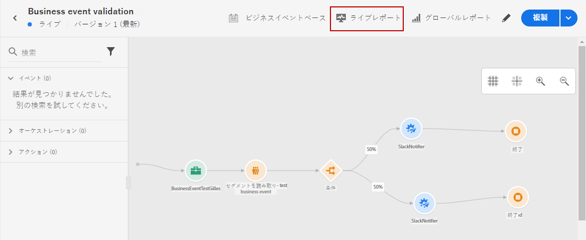
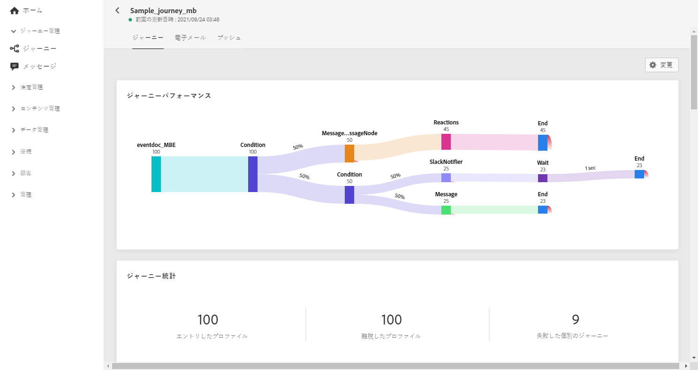
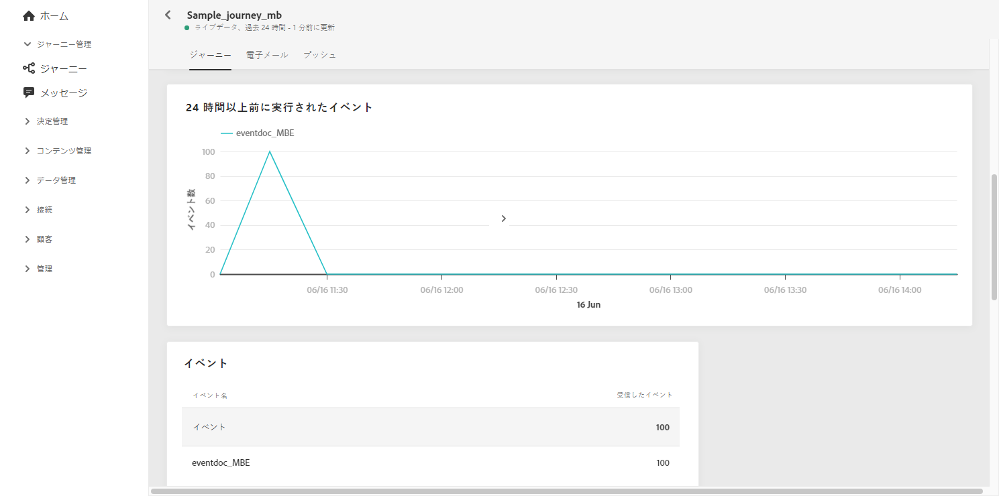
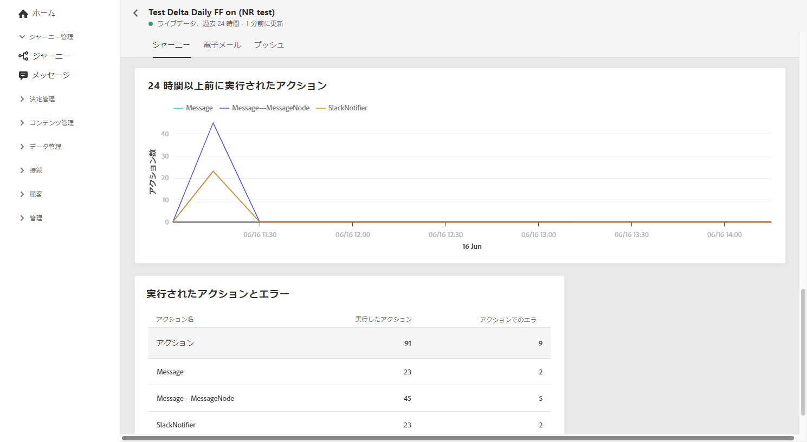
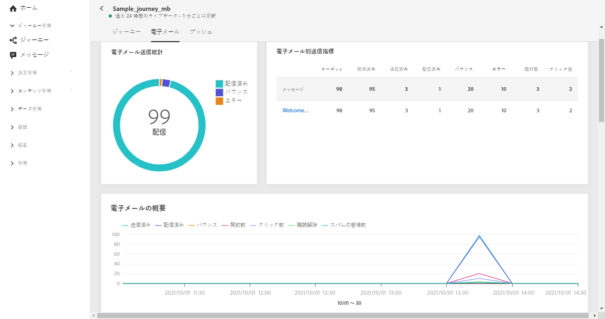
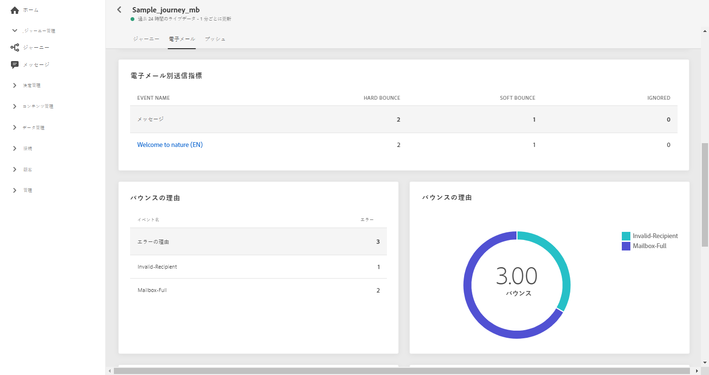
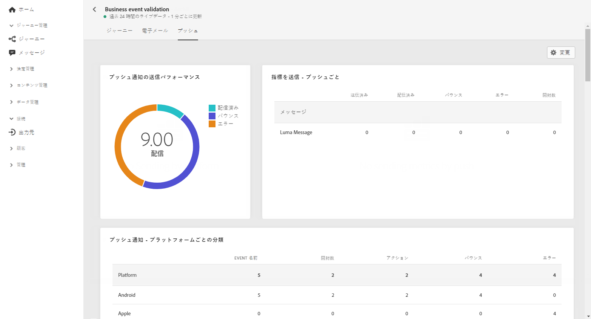
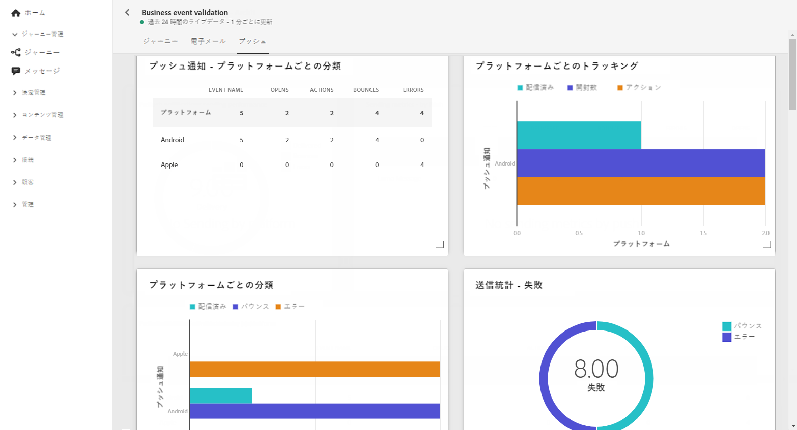

# ジャーニーライブレポート {#journey-live-report}

ジャーニーライブレポートは、「**[!UICONTROL ライブレポート]**」ボタンを使用して、ジャーニーから直接アクセスできます。

ジャーニー&#x200B;**[!UICONTROL ライブレポート]**&#x200B;ページは次のタブで表示されます。

* [ジャーニー](#journey-live)
* [メール](#email-live)
* [プッシュ](#push-live)

ジャーニー&#x200B;**[!UICONTROL ライブレポート]**&#x200B;は、ジャーニーの成功とエラーの詳細を示す様々なウィジェットに分かれています。必要に応じて、各ウィジェットのサイズを変更したり削除したりできます。詳しくは、この[節](live-report.md#modify-dashboard)を参照してください。

## 「ジャーニー」タブ {#journey-live}

ジャーニー&#x200B;**[!UICONTROL ライブレポート]**&#x200B;の「**[!UICONTROL ジャーニー]**」タブには、ジャーニーに関する最も重要なトラッキングデータが明確に表示されます。

**[!UICONTROL ジャーニーのパフォーマンス]**&#x200B;を使用すると、ターゲットとするプロファイルのパスをジャーニーの初めから終わりまで段階的に表示できます。

**[!UICONTROL ジャーニーの統計情報]**&#x200B;ウィジェットには、次の KPI が表示されます。

* **[!UICONTROL エントリしたプロファイル]**：ジャーニーのエントリイベントに到達した個人の合計数。

* **[!UICONTROL 退出したプロファイル]**：ジャーニーから退出した個人の合計数。

* **[!UICONTROL 失敗した個別のジャーニー]**：正常に実行されなかった個別のジャーニーの総数。

「**[!UICONTROL 過去 24 時間以内に実行されたイベント]**」ウィジェットと「**[!UICONTROL イベント]**」ウィジェットを使用すると、どのイベントが正常に実行されたかをサマリー番号、グラフおよびテーブルから確認できます。

「**[!UICONTROL 過去 24 時間以内に実行されたアクション]**」ウィジェットと「**[!UICONTROL 実行されたアクションとエラー]**」ウィジェットは、最も成功したアクションと、アクションがトリガーされたときに発生したエラーを表します。アクションのグラフ、テーブルおよびサマリー番号には、アクションに関する次のようなデータが含まれています。

* **[!UICONTROL 実行されたアクション]**：ジャーニーで正常に実行されたアクションの総数。

* **[!UICONTROL アクションのエラー]**：アクションで発生したエラーの総数。

<!--

>[!NOTE]
>
>The Offers widgets and metrics are only available if a decision was inserted in an email. For more information on Decision Management, refer to this [page](../offers/get-started/starting-offer-decisioning.md).

The **[!UICONTROL Offers statistic]** and **[!UICONTROL Offers statistics]** over time widgets measure your offer's success and impact on your targeted audience. It detail the main information relative to your message with KPIs:

* **[!UICONTROL Offer sent]**: Total number of sends for the offer.

* **[!UICONTROL Offer impression]**: Number of times the offer was opened in a delivery.

* **[!UICONTROL Offer clicks]**: Number of times an offer was clicked on in a delivery.
-->

## 「メール」タブ  {#email-live}

ジャーニー&#x200B;**[!UICONTROL ライブレポート]**&#x200B;の「**[!UICONTROL メール]**」タブには、ジャーニーで送信されるメール配信に関連する主な情報の詳細が表示されます。

特定のメール配信に関する詳細なレポートについては、[メールライブレポート](email-live-report.md)の節を参照してください。

**[!UICONTROL メール送信統計情報]**&#x200B;ウィジェットには、メッセージに関連する主な情報の詳細が表示されます。

* **[!UICONTROL 配信済み]**：送信されたメッセージの合計数に対して、正常に配達できたメッセージの数。

* **[!UICONTROL バウンス]**：送信されたメッセージの総数に対して、配信と自動返信の処理中に発生したエラーの累計。

* **[!UICONTROL エラー]**：配信中に発生し、プロファイルへの送信の妨げとなったエラーの合計数。

**[!UICONTROL メール別送信指標]**&#x200B;テーブルと&#x200B;**[!UICONTROL メールの概要]**&#x200B;グラフに、配信が成功した詳細を示します。

* **[!UICONTROL 送信済み]**：配信に対する送信の合計数。

* **[!UICONTROL 配信済み]**：送信されたメッセージの合計数に対して、正常に配達できたメッセージの数。

* **[!UICONTROL バウンス]**：送信されたメッセージの総数に対して、配信と自動返信の処理中に発生したエラーの累計。

* **[!UICONTROL エラー]**：配信中に発生し、プロファイルへの送信の妨げとなったエラーの合計数。

* **[!UICONTROL 開封数]**：配信でメッセージが開封された回数。

* **[!UICONTROL クリック数]**：配信でコンテンツがクリックされた回数。

* **[!UICONTROL 購読解除]**：購読解除リンクのクリック数。

* **[!UICONTROL スパムの苦情数]**：メッセージがスパムまたは迷惑メールとして宣言された回数。

**[!UICONTROL バウンス理由]**、**[!UICONTROL バウンスカテゴリ]**、**[!UICONTROL ハードとバウンス - メール別]**&#x200B;などのウィジェットには、バウンスメッセージに関して利用できるデータが含まれます。

* **[!UICONTROL ハードバウンス]**：永続的なエラー（メールアドレスの間違いなど）の合計数。このエラーは、アドレスが無効であることを明示的に示すエラーメッセージ（例：「不明なユーザー」）を伴います。

* **[!UICONTROL ソフトバウンス数]**：一時的なエラー（インボックスが満杯など）の合計数。

* **[!UICONTROL 無視]**：一時的なエラー（不在など）や技術的なエラー（送信者のタイプが postmaster の場合など）の合計数。

「**[!UICONTROL エラー理由]**」グラフと表を使用すると、配信中に発生したエラーを確認できます。

## 「プッシュ」タブ  {#push-live}

ジャーニー&#x200B;**[!UICONTROL ライブレポート]**&#x200B;の「**[!UICONTROL プッシュ]**」タブには、ジャーニーで送信されたプッシュ配信に関連する主な情報の詳細が表示されます。

特定のプッシュ配信に関する詳細なレポートについては、[プッシュライブレポート](push-live-report.md)の節を参照してください。

**[!UICONTROL プッシュ通知の送信パフォーマンス]**、 **[!UICONTROL プッシュ通知の概要]**&#x200B;および&#x200B;**[!UICONTROL 送信指標（プッシュ別）]**&#x200B;の各ウィジェットには、メッセージに関連する主な情報の詳細が表示されます。

* **[!UICONTROL 送信済み]**：配信に対する送信の合計数。

* **[!UICONTROL 配信済み]**：送信されたメッセージの合計数に対して、正常に配達できたメッセージの数。

* **[!UICONTROL バウンス]**：送信されたメッセージの総数に対して、配信と自動返信の処理中に発生したエラーの累計。

* **[!UICONTROL エラー]**：配信中に発生し、プロファイルへの送信の妨げとなったエラーの合計数。

* **[!UICONTROL 開封数]**：配信でメッセージが開封された回数。

* **[!UICONTROL アクション]**：配信されたプッシュ通知に対するアクション（ボタンのクリックや解除など）の合計数。

* **[!UICONTROL エンゲージメント]**：このプッシュ通知に対する開封数とアクション数（「プロファイルがプッシュを開封した」、「ボタンがクリックされた」など）の合計。

「**[!UICONTROL エラー理由]**」グラフと表を使用すると、配信中に発生したエラーを確認できます。

**[!UICONTROL プラットフォーム別トラッキング]**、**[!UICONTROL プラットフォーム別送信]**、**[!UICONTROL プラットフォーム別分類]**&#x200B;のグラフとテーブルには、プッシュ通知の成功の詳細がオペレーティングシステムに応じて表示されます。

**[!UICONTROL 送信の統計 - 失敗]**&#x200B;ウィジェットには、発生したエラーとバウンスの数が表示されます。
