# ジャーニーライブレポート {#journey-live-report}

>[!CONTEXTUALHELP]
>id="ajo_journey_live_report"
>title="ジャーニーライブレポート"
>abstract="ジャーニーのライブレポートでは、過去 24 時間のみのジャーニーの影響とパフォーマンスをリアルタイムで測定および視覚化できます。レポートは、ジャーニーの成功とエラーの詳細を示す様々なウィジェットに分かれています。各レポートダッシュボードは、ウィジェットのサイズ変更や削除を行うことで変更できます。"

>[!AVAILABILITY]
>
>現在のレポートエクスペリエンスは、10 月リリースの時点で廃止されます。 この日以降、新しいレポートエクスペリエンスが標準となります。 スムーズな移行を確実に行うために、新機能を理解しておくことをお勧めします。 [Journey Optimizerの新しいレポートインターフェイスの概要 ](report-gs-cja.md)

「過去 24 時間」タブからアクセスできるライブレポートには、過去 24 時間以内に発生したイベントが、イベント発生から最小 2 分の時間間隔で表示されます。これに対し、グローバルレポートでは、少なくとも 2 時間前に発生したイベントに焦点を当て、選択した期間のイベントが表示されます。

ジャーニーライブレポートは、「**[!UICONTROL レポートを表示]**」ボタンを使用して、ジャーニーから直接アクセスできます。

ジャーニー&#x200B;**[!UICONTROL ライブレポート]**&#x200B;ページは次のタブで表示されます。

* [ジャーニー](#journey-live)
* [メール](#email-live)
* [プッシュ](#push-live)
* [SMS](#sms-live)
* [アプリ内](#in-app-live)

ジャーニー&#x200B;**[!UICONTROL ライブレポート]**&#x200B;は、ジャーニーの成功とエラーの詳細を示す様々なウィジェットに分かれています。必要に応じて、各ウィジェットのサイズを変更したり削除したりできます。詳しくは、この[節](live-report.md#modify-dashboard)を参照してください。

Adobe Journey Optimizer で使用可能なすべての指標の詳細なリストについては、[このページ](live-report.md#list-of-components-live)を参照してください。

## 「ジャーニー」タブ {#journey-live}

ジャーニー&#x200B;**[!UICONTROL ライブレポート]**&#x200B;の「**[!UICONTROL ジャーニー]**」タブには、ジャーニーに関する最も重要なトラッキングデータが明確に表示されます。

### ジャーニーのパフォーマンス {#journey-performance}

>[!CONTEXTUALHELP]
>id="ajo_journey_performance_live"
>title="ジャーニーのパフォーマンス"
>abstract="ジャーニーのパフォーマンスウィジェットを使用すると、過去 24 時間のジャーニーの進行状況に応じて、ターゲットプロファイルのパスを視覚的に追跡できます。"

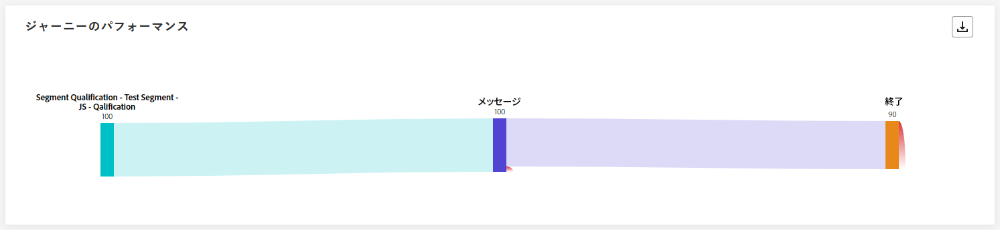

**[!UICONTROL ジャーニーのパフォーマンス]**&#x200B;を使用すると、ターゲットプロファイルのパスを、ジャーニーの初めから終わりまで段階的に表示できます。

ノードのプロファイル数は、プロファイルがノードを入力するときではなく、ノードを完了した後にのみ更新されることに注意してください。例えば、**待機**&#x200B;ノード上のプロファイルは、指定した日付に達し、プロファイルがノードを終了した場合にのみカウントされます。

### ジャーニーの統計 {#journey-statistics}

>[!CONTEXTUALHELP]
>id="ajo_journey_statistics_live"
>title="ジャーニーの統計"
>abstract="ジャーニーの統計の主要業績評価指標（KPI）は包括的なダッシュボードとして機能し、ジャーニーに関連する過去 24 時間の重要な指標の詳細な分析を提供します。"

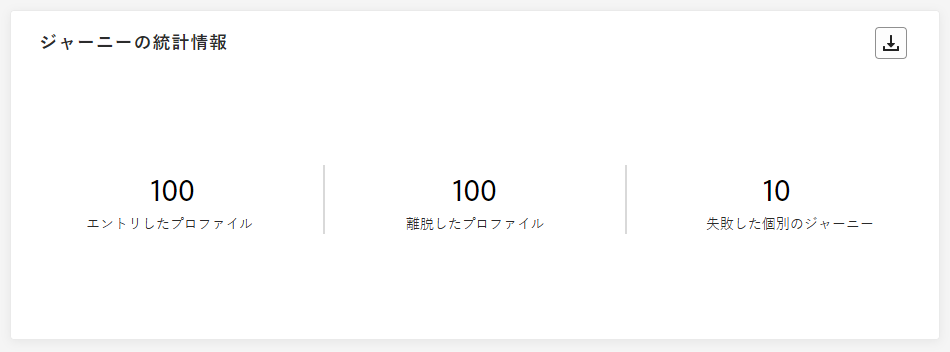

**[!UICONTROL ジャーニーの統計]**&#x200B;の主要業績評価指標（KPI）は包括的なダッシュボードとして機能し、過去 24 時間のジャーニーに関連する重要な指標の分析を提供します。これには、入力されたプロファイルの数や失敗した個々のジャーニーのインスタンスなどの詳細が含まれ、ジャーニーの効果とエンゲージメントのレベルを包括的に把握できます。

+++ ジャーニーの統計指標の詳細情報

* **[!UICONTROL エントリしたプロファイル]**：ジャーニーのエントリイベントに到達した個人の合計数。

* **[!UICONTROL 退出したプロファイル]**：ジャーニーから退出した個人の合計数。

* **[!UICONTROL 失敗した個別のジャーニー]**：正常に実行されなかった個別のジャーニーの総数。
+++

### 過去 24 時間に実行されたアクション {#action-executed}

>[!CONTEXTUALHELP]
>id="ajo_journey_actions_executed_live"
>title="過去 24 時間に実行されたアクション"
>abstract="過去 24 時間に実行されたアクションウィジェットは、最新のパフォーマンスのスナップショットを提供し、過去 24 時間以内に実行されたアクションの有効性を示します。"

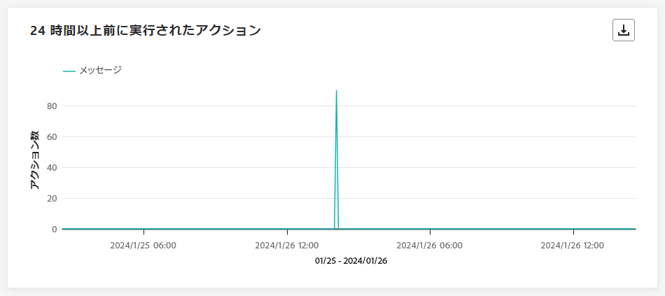

**[!UICONTROL 過去 24 時間に実行されたアクション]**&#x200B;ウィジェットには、アクションがトリガーされたときに発生した最も成功したアクションが表示されます。

+++ 過去 24 時間に実行されたアクション指標の詳細情報

* **[!UICONTROL 実行されたアクション]**：ジャーニーで正常に実行されたアクションの総数。

* **[!UICONTROL アクションのエラー]**：アクションで発生したエラーの総数。

+++

### 実行されたアクションとエラー {#actions-errors}

>[!CONTEXTUALHELP]
>id="ajo_journey_actions_executed__errors_live"
>title="実行されたアクションとエラー"
>abstract="実行されたアクションとエラーウィジェットには、最も成功したアクションと、過去 24 時間にアクションのトリガー中に発生したエラーが表示されます。このウィジェットは、成功した実行と発生したエラーの両方の包括的な概要を提供し、アクションの最新のパフォーマンスに関する貴重なインサイトを示します。"

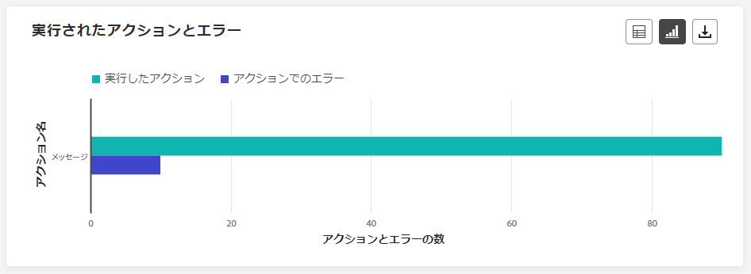

**[!UICONTROL 実行されたアクションとエラー]**&#x200B;ウィジェットには、過去 24 時間にアクションがトリガーされたときに発生した最も成功したアクションとエラーが表示されます。

+++ 実行されたアクションとエラー指標の詳細情報

* **[!UICONTROL 実行されたアクション]**：ジャーニーで正常に実行されたアクションの総数。

* **[!UICONTROL アクションのエラー]**：アクションで発生したエラーの総数。

+++

### アクションのエラー理由 {#actions-error-reasons}

>[!CONTEXTUALHELP]
>id="ajo_journey_actions_errors_live"
>title="アクションのエラー理由"
>abstract="アクションのエラー理由のテーブルとグラフには、アクションの実行中に発生したエラーの詳細な概要が表示され、過去 24 時間に発生した可能性のある問題の包括的な概要が提供されます。"

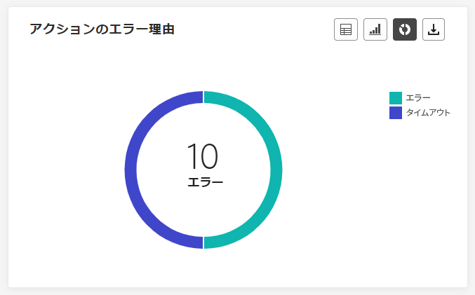

**[!UICONTROL アクションのエラー理由]**&#x200B;のテーブルとグラフには、過去 24 時間以内にアクションの実行中に発生したエラーの包括的な概要が表示されます。

### アクション別エラータイプ {#error-type-actions}

>[!CONTEXTUALHELP]
>id="ajo_journey_actions_error_type_live"
>title="アクション別エラータイプ"
>abstract="アクション別エラータイプのテーブルとグラフには、過去 24 時間以内にアクションが実行されるたびに発生したエラーの詳細な概要が表示されます。"

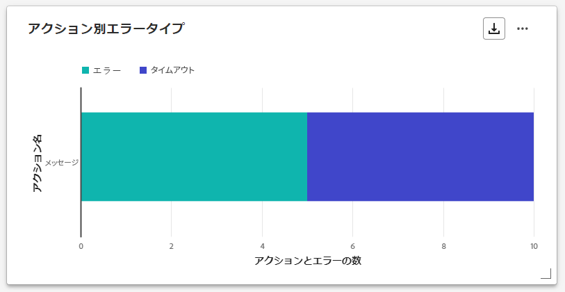

**[!UICONTROL アクション別エラータイプ]**&#x200B;のテーブルとグラフには、過去 24 時間以内にアクションが実行されるたびに発生したエラーの包括的な概要が表示されます。

### 過去 24 時間に実行されたイベント {#event-executed-24hours}

>[!CONTEXTUALHELP]
>id="ajo_journey_event_24hours_live"
>title="過去 24 時間に実行されたイベント"
>abstract="過去 24 時間に実行されたイベントウィジェットを使用すると、過去 24 時間以内に正常に実行されたイベントを特定できます。 "

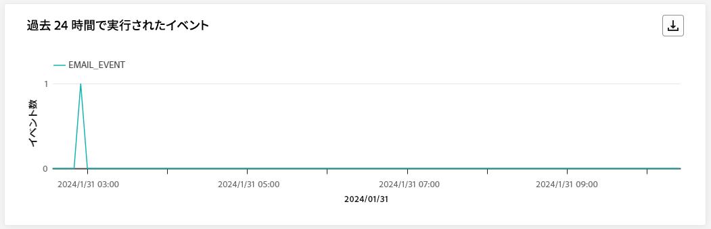

**[!UICONTROL 過去 24 時間に実行されたイベント]**&#x200B;ウィジェットを使用すると、過去 24 時間以内に正常に実行されたイベントを特定できます。

### イベント {#events}

>[!CONTEXTUALHELP]
>id="ajo_journey_events_live"
>title="イベント"
>abstract="イベントウィジェットは、どのイベントが正常に実行されたかを包括的に表示し、過去 24 時間の詳細なインサイトを示す概要番号、グラフおよびテーブルを提供します。"

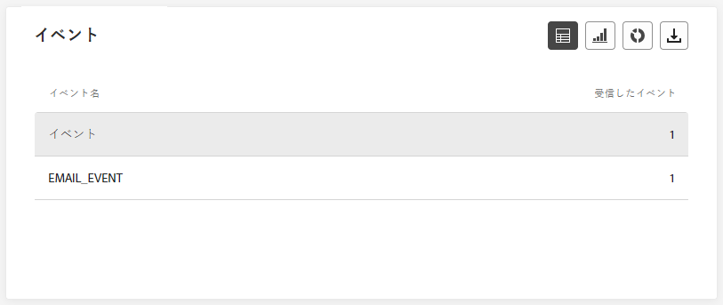

**[!UICONTROL イベント]**&#x200B;ウィジェットを使用すると、どのイベントが正常に実行されたかを概要番号、グラフおよびテーブルを通じて確認できます。

### 発生元別イベント {#events-origin}

>[!CONTEXTUALHELP]
>id="ajo_journey_events_origin_live"
>title="発生元別イベント"
>abstract="発生元別イベントのテーブルとグラフには、過去 24 時間にイベントが正常に受信されたかどうかがが表示されます。これらの視覚的な表示によって、効果的に受信されたイベントを正確に識別し、ジャーニー内の各イベントのパフォーマンスと影響についての貴重なインサイトを得ることができます。"

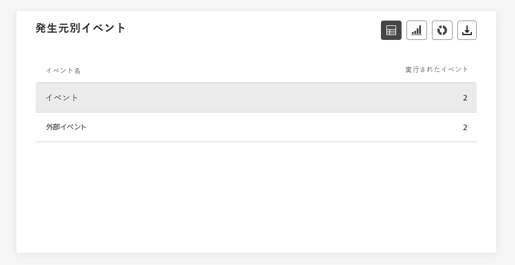

**[!UICONTROL 発生元別イベント]**&#x200B;のテーブルとグラフには、過去 24 時間にイベントが正常に受信されたかどうかが詳細に表示されます。この視覚的な表示によって、どのイベントが効果的に受信されたかを正確に識別し、ジャーニー内の個々のイベントのパフォーマンスと影響についての貴重なインサイトを得ることができます。

## 「メール」タブ {#email-live}

ジャーニー&#x200B;**[!UICONTROL ライブレポート]**&#x200B;の「**[!UICONTROL メール]**」タブには、ジャーニーで送信されたメールに関する主な情報が詳細に表示されます。

### メール - 送信パフォーマンス {#email-sending-performance}

>[!CONTEXTUALHELP]
>id="ajo_journey_email_sending_performance_live"
>title="メール - 送信パフォーマンス"
>abstract="メール - 送信統計グラフは、過去 24 時間のターゲットや配信など、メールに関する重要なデータを要約します。"

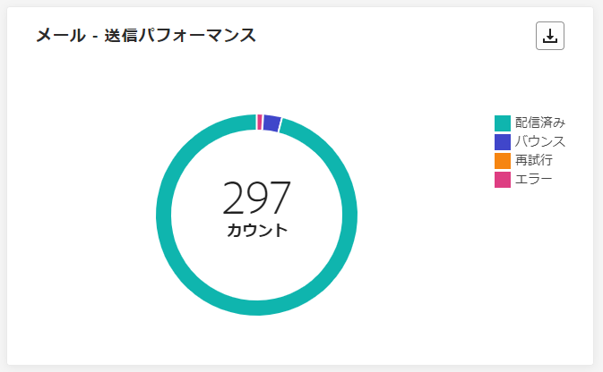

**[!UICONTROL メール - 送信パフォーマンス]**&#x200B;のグラフには、ジャーニーで送信されたメールに関するデータの包括的な見解と、配信済みメールやバウンス数などの主要指標に関するインサイトが表示されます。これにより、メール送信プロセスの詳細な分析を可能にし、ジャーニーの効率性とパフォーマンスに関する貴重な情報を提供します。

+++ メール - 送信パフォーマンス指標の詳細情報

* **[!UICONTROL 配信済み]**：正常に送信されたメールの数。

* **[!UICONTROL バウンス数]**：送信プロセスおよび自動返信処理の間に累積したエラーの合計数。

* **[!UICONTROL エラー]**：配信中に発生してプロファイルに送信できない原因となったエラーの合計数。

* **[!UICONTROL 再試行]**：再試行のキュー内のメール数。

+++

### メール - 統計 {#email-stat}

>[!CONTEXTUALHELP]
>id="ajo_journey_email_statistics_live"
>title="メール - 統計"
>abstract="メール - 統計テーブルには、過去 24 時間のメールのプロファイルアクティビティに関するデータが表示されます。"

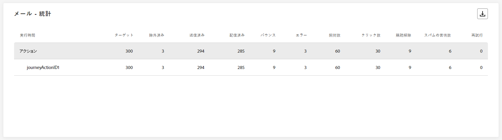

**[!UICONTROL メール - 統計]**&#x200B;のテーブルには、過去 24 時間にジャーニーで送信されたメールに関する重要なデータの包括的な概要が表示されます。ターゲットオーディエンスの規模や正常に配信されたメール数などの主要指標を詳しく示し、メールやジャーニーの効果とリーチに関する有益なインサイトを提供します。

+++ メール送信統計の指標の詳細情報

* **[!UICONTROL ターゲット]**：送信プロセス中に処理されたメッセージの合計数。

* **[!UICONTROL 除外済み]**：Adobe Journey Optimizer によって除外されたプロファイルの数。

* **[!UICONTROL 送信済み]**：送信されたメールの合計数。

* **[!UICONTROL 配信済み]**：送信されたメッセージの総数に対する、正常に送信されたメッセージの数。

* **[!UICONTROL バウンス数]**：送信されたメッセージの合計数に対する、送信プロセス中および自動返信処理中に累積したエラーの合計数。

* **[!UICONTROL エラー数]**：送信プロセス中に発生し、プロファイルに送信できない原因となったエラーの合計数。

* **[!UICONTROL 開封数]**：メールが開封された回数。

* **[!UICONTROL クリック数]**：メールのコンテンツがクリックされた回数。

* **[!UICONTROL 購読解除]**：購読解除リンクのクリック数。

* **[!UICONTROL スパムのの苦情数]**：メッセージがスパムまたはジャンクとして宣言された回数。

* **[!UICONTROL 再試行]**：再試行のキュー内のメール数。

+++

### メール - 日別のパフォーマンス {#email-perf-date}

>[!CONTEXTUALHELP]
>id="ajo_journey_email_performance_bydate_live"
>title="メール - 日別のパフォーマンス"
>abstract="メール - 日別パフォーマンスのグラフには、送信されたメールに関する過去 24 時間の包括的なデータが表示され、配信やバウンスなどの主要指標に関するインサイトが提供され、メール送信プロセスの詳細な分析を提供します。"

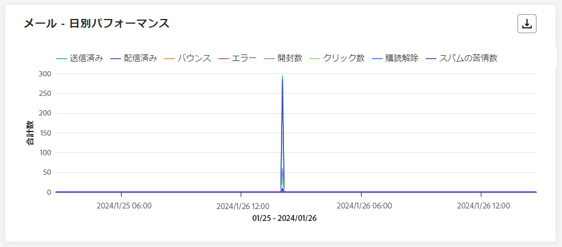

**[!UICONTROL メール - 日別パフォーマンス]**&#x200B;ウィジェットでは、メールに関する主要情報の詳細な概要を示すグラフを確認し、過去 24 時間のパフォーマンスのトレンドに関するインサイトを得ることができます。

+++ メール - 日別パフォーマンス指標の詳細情報

* **[!UICONTROL 送信済み]**：送信されたメールの合計数。

* **[!UICONTROL 配信済み]**：正常に送信されたメールの数。

* **[!UICONTROL バウンス数]**：送信プロセスおよび自動返信処理の間に累積したエラーの合計数。

* **[!UICONTROL エラー数]**：送信プロセス中に発生し、プロファイルに送信できない原因となったエラーの合計数。

* **[!UICONTROL 開封数]**：メールが開封された回数。

* **[!UICONTROL クリック数]**：メールのコンテンツがクリックされた回数。

* **[!UICONTROL 購読解除]**：購読解除リンクのクリック数。

* **[!UICONTROL スパムのの苦情数]**：メッセージがスパムまたはジャンクとして宣言された回数。

+++

### メール - バウンスのカテゴリと理由 {#email-bounce-categories}

>[!CONTEXTUALHELP]
>id="ajo_journey_email_bounces_live"
>title="メール - バウンスのカテゴリと理由"
>abstract="XX"

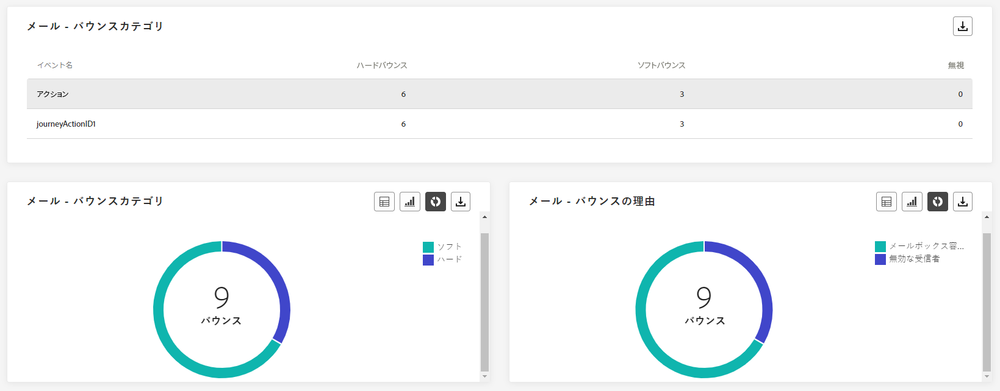

**[!UICONTROL バウンスの理由]**&#x200B;ウィジェットと&#x200B;**[!UICONTROL バウンスカテゴリ]**&#x200B;ウィジェットでは、バウンスされたメッセージに関連する使用可能なデータをまとめて確認し、過去 24 時間のメールバウンスの背後にある特定の理由とカテゴリに関する詳細なインサイトを得ることができます。

バウンスの詳細については、[抑制リスト](../reports/suppression-list.md)のページを参照してください。

+++ メール - バウンスのカテゴリと理由指標の詳細情報

* **[!UICONTROL ハードバウンス]**：永続的なエラー（メールアドレスの間違いなど）の合計数。このエラーは、アドレスが無効であることを明示的に示すエラーメッセージ（例：「不明なユーザー」）を伴います。

* **[!UICONTROL ソフトバウンス数]**：一時的なエラー（インボックスが満杯など）の合計数。

* **[!UICONTROL 無視]**：一時的なエラー（不在など）や技術的なエラー（送信者のタイプが postmaster の場合など）の合計数。

+++

### メール - エラー理由 {#email-error-reasons}

>[!CONTEXTUALHELP]
>id="ajo_journey_email_errors_live"
>title="メール - エラー理由"
>abstract="メール - エラー理由のグラフとテーブルを使用すると、過去 24 時間の送信プロセス中に発生した特定のエラーを特定できます。"

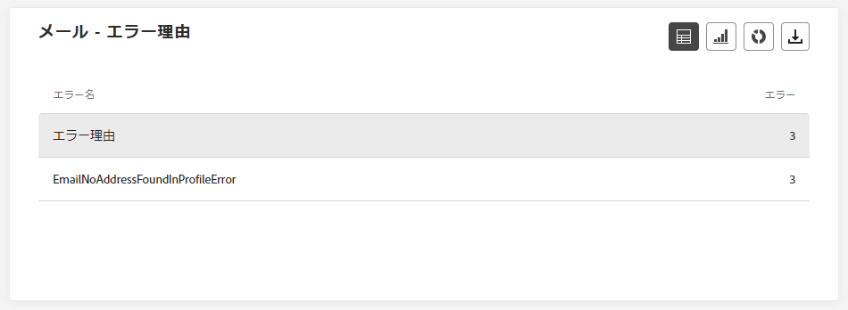

**[!UICONTROL エラー理由]**&#x200B;のグラフとテーブルには、過去 24 時間に送信プロセス中に発生した特定のエラーが表示され、エラーの性質と発生に関する貴重な情報を確認できます。

### メール - 除外された理由 {#email-excluded}

>[!CONTEXTUALHELP]
>id="ajo_journey_email_excluded_live"
>title="メール - 除外された理由"
>abstract="「除外された理由」グラフとテーブルには、対象のオーディエンスから除外され、過去 24 時間にメッセージを受信しなかった、ユーザープロファイルにつながった様々な要因が表示されます。"

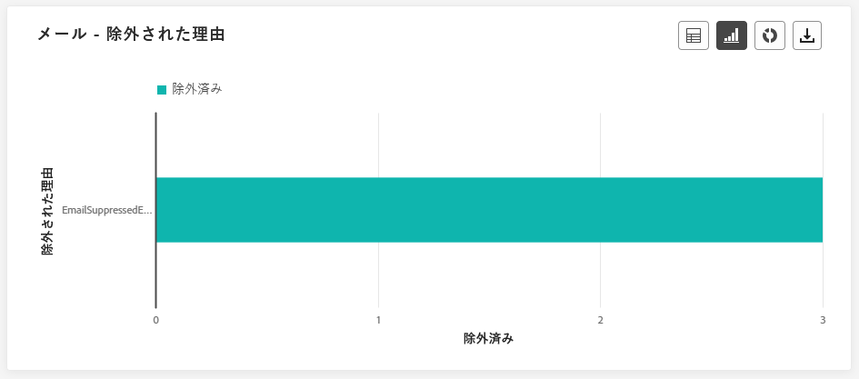

**[!UICONTROL 除外された理由]**&#x200B;のグラフとテーブルには、ターゲットオーディエンスからユーザープロファイルを除外した結果、過去 24 時間にメッセージを受信できない原因となった様々な要因が包括的に表示されます。

除外された理由の包括的なリストについては、[このページ](exclusion-list.md)を参照してください。

### メール - 最適な受信者ドメイン {#email-best-recipient}

>[!CONTEXTUALHELP]
>id="ajo_journey_email_best_recipient_live"
>title="メール - 最適な受信者ドメイン"
>abstract="メール - 最適な受信者ドメインのグラフとテーブルには、受信者がメールを開くのに最も頻繁に使用するドメインの詳細な分類が表示され、過去 24 時間の受信者の行動に関する有益なインサイトが提供されます。"

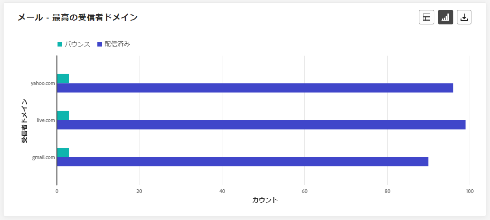

**[!UICONTROL メール - 最高の受信者ドメイン]**&#x200B;のグラフとテーブルには、過去 24 時間以内にメールを開く際に最も頻繁に使用されたドメインの詳細な分類が表示されます。これにより、プロファイルの行動に関する重要なインサイトが得られ、好まれるプラットフォームを理解するのに役立ちます。

### メール - オファー {#email-offers}

>[!CONTEXTUALHELP]
>id="ajo_journey_email_offers_live"
>title="メール - オファー"
>abstract="オファー統計ウィジェットとオファー詳細統計ウィジェットは、時間の経過に伴う影響の詳細な分析や、より詳細に理解するための詳細な統計を示して、過去 24 時間のオファーのパフォーマンスに関する包括的なインサイトを提供します。"

>[!NOTE]
>
>オファーのウィジェットと指標は、決定がメールに挿入された場合にのみ使用できます。 意思決定管理について詳しくは、[このページ](../offers/get-started/starting-offer-decisioning.md)を参照してください。

**[!UICONTROL オファー統計]**&#x200B;および&#x200B;**[!UICONTROL オファー統計の推移]**&#x200B;のウィジェットは、オファーの成功とターゲットオーディエンスに対する影響を測定します。メッセージに関連する主な情報について、KPI を使用して詳しく説明します。

+++ メール - オファー指標の詳細情報

* **[!UICONTROL 送信されたオファー]**：オファーの送信の合計数。

* **[!UICONTROL オファーのインプレッション]**：メールのオファーが開封された回数。

* **[!UICONTROL オファークリック数]**：メールでオファーがクリックされた回数。

+++

### メール - 最適化 {#email-sto}

>[!CONTEXTUALHELP]
>id="ajo_journey_email_optimization_live"
>title="メール - 最適化"
>abstract="送信時間の最適化ウィジェットと最適化と非最適化に比較ウィジェットは、メッセージに関する過去 24 時間の詳細情報を提供し、メッセージが最適化されているかどうかをハイライト表示します。"

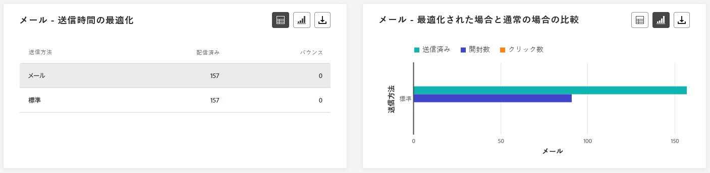

>[!NOTE]
>
>**[!UICONTROL 送信時間の最適化]**&#x200B;ウィジェットと&#x200B;**[!UICONTROL 最適化と非最適化の比較]**&#x200B;ウィジェットは、配信で送信時間の最適化オプションが有効になっている場合にのみ使用できます。送信時間の最適化について詳しくは、[このページ](../building-journeys/journeys-message.md#send-time-optimization)を参照してください。

**[!UICONTROL 送信時間の最適化]**&#x200B;ウィジェットと&#x200B;**[!UICONTROL 最適化と非最適化の比較]**&#x200B;ウィジェットは、送信方法（最適化または通常）に応じてメールの成功状況を詳しく示します。

+++ 送信時間の最適化と、最適化と非最適化の指標の比較に関する情報

* **[!UICONTROL 配信済み]**：送信されたメッセージの合計数に対して、正常に配達できたメッセージの数。
* **[!UICONTROL バウンス数]**：送信されたメッセージの合計数に対して、送信プロセスおよび自動返信処理の間に累積したエラーの合計数。

* **[!UICONTROL 送信済み]**：ジャーニーの送信メールの合計数。

* **[!UICONTROL 開封数]**：ジャーニーでメールが開封された回数。

* **[!UICONTROL クリック数]**：メールのコンテンツがクリックされた回数。

+++

## 「プッシュ通知」タブ {#push-live}

ジャーニー&#x200B;**[!UICONTROL ライブレポート]**&#x200B;の「**[!UICONTROL プッシュ通知]**」タブには、ジャーニーで送信されたプッシュ通知に関連する主な情報の詳細が表示されます。

### プッシュ通知 - 送信パフォーマンス {#push-sending-performance}

>[!CONTEXTUALHELP]
>id="ajo_journey_push_sending_performance_live"
>title="プッシュ通知 - 送信パフォーマンス"
>abstract="プッシュ通知送信パフォーマンスのグラフは、過去 24 時間のエラーメッセージや配信済みメッセージなど、プッシュ通知に関する重要なデータを要約します。"

**[!UICONTROL プッシュ通知の送信パフォーマンス]**&#x200B;のグラフでは、過去 24 時間以内に送信されたプッシュ通知に関連するデータの詳細な概要を提供します。配信済みとバウンスなどの重要な指標に関するインサイトを提供し、プッシュ通知の送信プロセスを詳細に確認できます。

+++ プッシュ通知 - 送信パフォーマンス指標の詳細情報

* **[!UICONTROL 配信済み]**：正常に送信されたメッセージ数。

* **[!UICONTROL バウンス数]**：送信プロセスおよび自動返信処理の間に累積したエラーの合計数。

* **[!UICONTROL エラー数]**：送信プロセス中に発生し、プロファイルへの送信の妨げとなったエラーの合計数。

+++

### プッシュ通知 - 統計 {#push-statistics}

>[!CONTEXTUALHELP]
>id="ajo_journey_push_statistics_live"
>title="プッシュ通知 - 統計"
>abstract="プッシュ統計テーブルには、過去 24 時間のプッシュ通知の受信者アクティビティに関するデータが表示されます。"

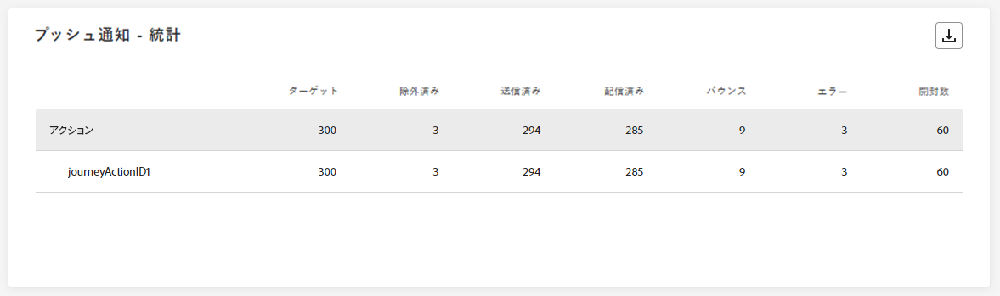

**[!UICONTROL プッシュ通知 - 統計]**&#x200B;テーブルは、ターゲットメッセージの数や過去 24 時間以内に正常に配信されたメッセージの数などの主要指標を含む、プッシュ通知に関する重要なデータの簡潔な概要を示します。

+++ プッシュ通知 - 統計指標の詳細情報

* **[!UICONTROL ターゲット]**：任意のアクション（メールや SMS の送信など）でターゲットとするプロファイルの数。

* **[!UICONTROL 除外済み]**：Adobe Journey Optimizer によって除外されたプロファイルの数。

* **[!UICONTROL 送信済み]**：送信されたプッシュ通知の合計数。

* **[!UICONTROL 配信済み]**：正常に送信されたプッシュ通知の数。

* **[!UICONTROL バウンス数]**：送信プロセスおよび自動返信処理の間に累積したエラーの合計数。

* **[!UICONTROL エラー]**：配信中に発生してプロファイルに送信できない原因となったエラーの合計数。

* **[!UICONTROL 開封数]**：プッシュ通知が開封された回数。
+++

### プッシュ通知 - プラットフォームごとの分類 {#push-breakdown}

>[!CONTEXTUALHELP]
>id="ajo_journey_push_breakdown_live"
>title="プッシュ通知 - プラットフォームごとの分類"
>abstract="プラットフォームごとの分類のグラフとテーブルには、過去 24 時間のプッシュ通知の成功の分類が、受信者のオペレーティングシステムに基づいて表示されます。"

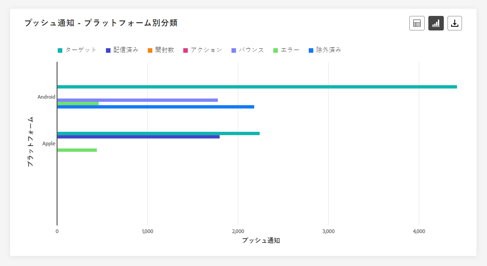

**[!UICONTROL プッシュ通知 - プラットフォーム別分類]**&#x200B;のグラフとテーブルには、プッシュ通知の成功の詳細な分析が表示され、プロファイルのオペレーティングシステムに基づいたインサイトが得られます。この分類により、様々なプラットフォームでのプッシュ通知のパフォーマンスをさらに把握できます。

### プッシュ通知 - 送信の概要 {#push-sending-summary}

>[!CONTEXTUALHELP]
>id="ajo_journey_push_sending_summary_live"
>title="プッシュ通知 - 送信の概要"
>abstract="プッシュ通知送信の概要グラフには、過去 24 時間に送信されたプッシュ通知で使用可能なデータが表示されます。"

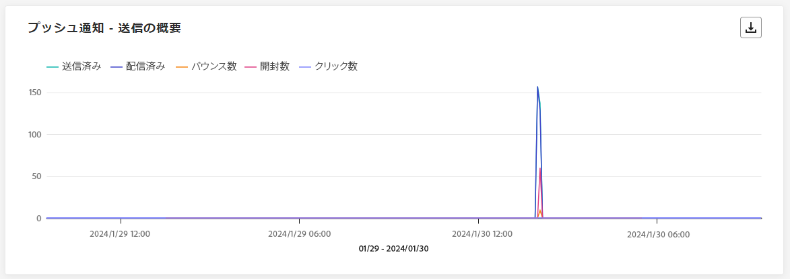

**[!UICONTROL プッシュ通知 - 送信の概要]**&#x200B;グラフは、過去 24 時間以内のプッシュ通知アクティビティの分析を動的に表示します。このグラフでは、送信されたプッシュ通知の包括的な分類を示します。

+++ プッシュ通知 - 送信の概要指標の詳細情報

* **[!UICONTROL 送信済み]**：送信されたプッシュ通知の合計数。

* **[!UICONTROL 配信済み]**：正常に送信されたプッシュ通知の数。

* **[!UICONTROL バウンス数]**：送信プロセスおよび自動返信処理の間に累積したエラーの合計数。

* **[!UICONTROL エラー]**：配信中に発生してプロファイルに送信できない原因となったエラーの合計数。

* **[!UICONTROL 開封数]**：プッシュ通知が開封された回数。

* **[!UICONTROL クリック数]**：プッシュ通知のコンテンツがクリックされた回数。

+++

### プッシュ通知 - エラー理由 {#push-error}

>[!CONTEXTUALHELP]
>id="ajo_journey_push_error_reasons_live"
>title="プッシュ通知 - エラー理由"
>abstract="エラー理由のグラフとテーブルを使用して、過去 24 時間の送信プロセス中に発生した特定のエラーを特定できます。"

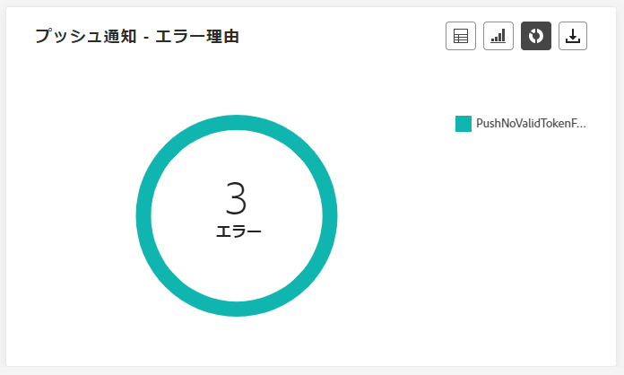

**[!UICONTROL エラーの理由]**&#x200B;の表とグラフは、プッシュ通知の送信プロセス中に発生した特定のエラーを識別し、過去 24 時間に発生した問題について詳しいインサイトが得られる機能を提供します。

### プッシュ通知 - 除外された理由 {#push-excluded}

>[!CONTEXTUALHELP]
>id="ajo_journey_push_excluded_reasons_live"
>title="プッシュ通知 - 除外された理由"
>abstract="「除外された理由」グラフとテーブルには、対象のオーディエンスから除外され、過去 24 時間にメッセージを受信しなかった、ユーザープロファイルにつながった様々な要因が表示されます。"

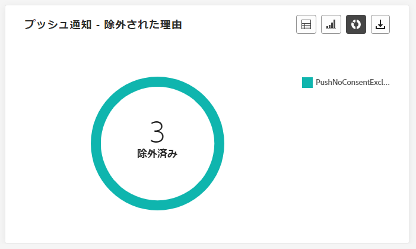

**[!UICONTROL 除外理由]**&#x200B;のグラフと表には、ユーザープロファイルがターゲットのプロファイルから除外され、メッセージを受信できなかった様々な理由が表示されます。

除外理由の包括的なリストについては、[このページ](exclusion-list.md)を参照してください。

## 「SMS」タブ {#sms-live}

### SMS - 統計 {#sms-statistics}

>[!CONTEXTUALHELP]
>id="ajo_journey_sms_statistics_live"
>title="SMS - 統計"
>abstract="SMS 送信統計のテーブルは、過去 24 時間のターゲットメッセージや配信済みメッセージなど、SMS メッセージに関する重要なデータを要約します。"

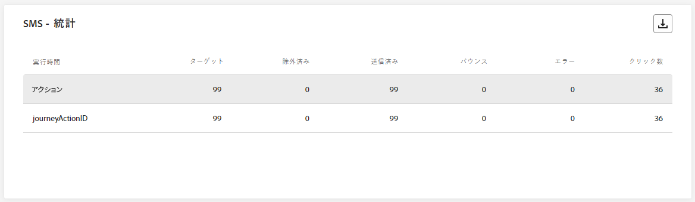

**[!UICONTROL SMS - 統計]**&#x200B;の表は、SMS メッセージに関する重要なデータの概要（ターゲットメッセージ数や過去 24 時間で正常に配信されたメッセージ数などの主要指標など）を簡潔に示しています。

+++ SMS - 統計指標の詳細情報

* **[!UICONTROL ターゲット]**：ターゲットプロファイルとして適合するユーザープロファイルの数。

* **[!UICONTROL 除外済み]**：ターゲットプロファイルから除外されメッセージを受信しなかったユーザープロファイルの数。

* **[!UICONTROL 送信済み]**：送信された SMS メッセージの合計数。

* **[!UICONTROL クリック数]**：SMS メッセージでコンテンツがクリックされた回数。

* **[!UICONTROL バウンス数]**：送信プロセスおよび自動返信処理の間に累積したエラーの合計数。

* **[!UICONTROL エラー]**：送信プロセス中に発生し、プロファイルへの送信の妨げとなったエラーの合計数。

+++

### SMS - 日別パフォーマンス {#sms-performance}

>[!CONTEXTUALHELP]
>id="ajo_journey_sms_performance_live"
>title="SMS - 日別パフォーマンス"
>abstract="日付別 SMS パフォーマンスのウィジェットには、過去 24 時間のメッセージに関する重要な情報がグラフで表示されます。"

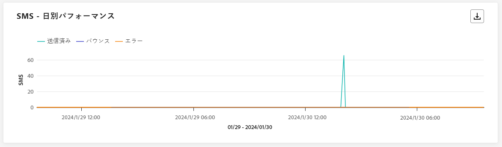

**[!UICONTROL SMS - 日別パフォーマンス]**&#x200B;ウィジェットは、メッセージに関する主要情報の概要を詳しく示し、過去 24 時間のパフォーマンスの傾向に関するインサイトを提供します。

+++ SMS - 日別パフォーマンス指標の詳細情報

* **[!UICONTROL 送信済み]**：送信された SMS メッセージの合計数。

* **[!UICONTROL バウンス数]**：送信プロセスおよび自動返信処理の間に累積したエラーの合計数。

* **[!UICONTROL エラー数]**：送信プロセス中に発生し、プロファイルに送信できない原因となったエラーの合計数。

+++

### SMS - バウンスの理由 {#sms-bounces}

>[!CONTEXTUALHELP]
>id="ajo_journey_sms_bounces_live"
>title="SMS - バウンスの理由"
>abstract="バウンス理由のグラフとテーブルには、バウンスメッセージに関連する過去 24 時間のデータが含まれています。"

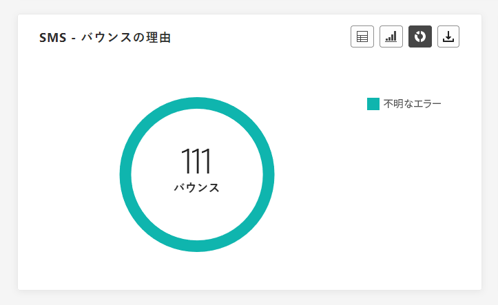

**[!UICONTROL SMS - バウンス理由]**&#x200B;のグラフと表は、バウンスした SMS メッセージに関するデータの概要を包括的に示し、過去 24 時間に SMS メッセージがバウンスした特定の理由に関する貴重なインサイトを提供します。

### SMS - エラー理由 {#sms-error}

>[!CONTEXTUALHELP]
>id="ajo_journey_sms_error_live"
>title="SMS - エラー理由"
>abstract="SMS - エラー理由のグラフとテーブルを使用すると、過去 24 時間の送信プロセス中に発生した特定のエラーを識別できます。"

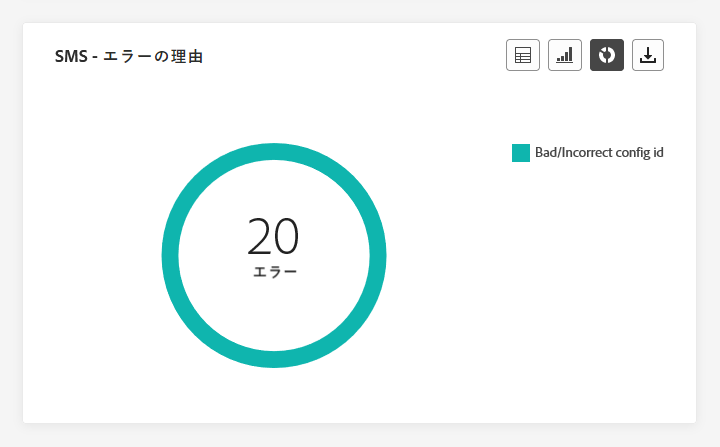

**[!UICONTROL SMS - エラー理由]**&#x200B;のグラフと表を使用すると、SMS メッセージの送信プロセス中に発生した特定のエラーを識別し、過去 24 時間に発生した問題を徹底して分析できます。

### SMS - 除外された理由 {#sms-excluded}

>[!CONTEXTUALHELP]
>id="ajo_journey_sms_excluded_live"
>title="SMS - 除外された理由"
>abstract="「除外された理由」グラフとテーブルには、対象のオーディエンスから除外され、過去 24 時間にメッセージを受信しなかった、ユーザープロファイルにつながった様々な要因が表示されます。"

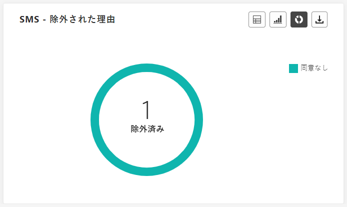

**[!UICONTROL SMS - 除外理由]**&#x200B;グラフと表では、ユーザープロファイルがターゲットのオーディエンスから除外され、SMS メッセージを受信できなくなった様々な要因を視覚的に示します。

除外の理由の包括的なリストについては、[このページ](exclusion-list.md)を参照してください。

<!--
### SMS - Clicks by links {#sms-clicks}

The **[!UICONTROL SMS - Clicks by links]** widget offers essential insights into your visitors' engagement with the URLs included in your messages, providing valuable information about which links attract the most interaction within the last 24 hours.
-->

## 「アプリ内」タブ {#in-app-live}

### アプリ内パフォーマンス {#inapp-performance}

>[!CONTEXTUALHELP]
>id="ajo_journey_inapp_performance_live"
>title="アプリ内パフォーマンス"
>abstract="アプリ内パフォーマンス KPI は、過去 24 時間の訪問者のアプリ内メッセージに対するエンゲージメントに関する重要なインサイトを提供します。"

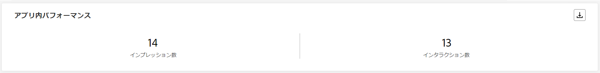

**[!UICONTROL アプリ内パフォーマンス]** KPI は、過去 24 時間のプロファイルのアプリ内メッセージに対するエンゲージメントについて重要なインサイトを提供し、ジャーニーに含まれるアプリ内メッセージの有効性と影響を評価するための重要な指標を提供します。

+++ アプリ内 - パフォーマンスの指標について説明します

* **[!UICONTROL インプレッション数]**：すべてのユーザーに配信されたアプリ内メッセージの合計数。

  >[!NOTE]
  >
  >インプレッションが確実にカウントされるようにするには、ユーザーが次の 2 つの条件を満たす必要があります。
  >* アプリ内エクスペリエンス内の認定。ジャーニー内の特定のアプリ内アクティビティに到達することで達成されます。
  >* トリガールールで指定された条件を満たす。
  > 
  >2 つ目の条件により、ターゲットプロファイルの数と個別インプレッション数には顕著な違いが生じる場合があります。

* **[!UICONTROL インタラクション数]**：アプリ内メッセージに対するエンゲージメントの合計数。これには、クリック、解除またはその他のやり取りなど、ユーザーが実行したすべてのアクションが含まれます。

+++

### アプリ内の概要 {#inapp-summary}

>[!CONTEXTUALHELP]
>id="ajo_journey_inapp_summary_live"
>title="アプリ内の概要"
>abstract="アプリ内概要グラフは、過去 24 時間のアプリ内インプレッション数およびインタラクション数の進行状況を示します。"

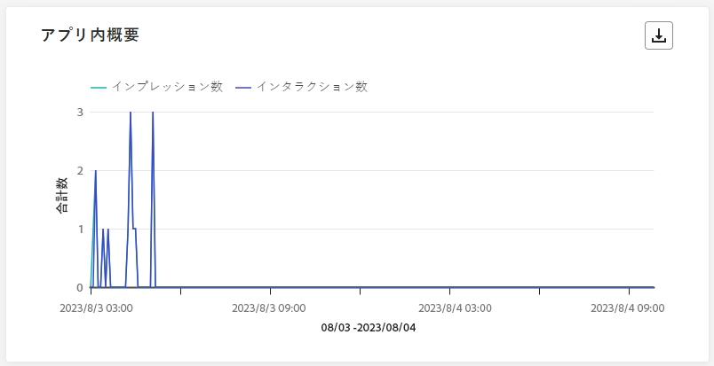

**[!UICONTROL アプリ内概要]**&#x200B;グラフは、過去 24 時間のアプリ内インプレッション数とインタラクション数の推移を表し、アプリ内メッセージのパフォーマンスの包括的な概要を示します。

+++ アプリ内の概要指標の詳細情報

* **[!UICONTROL インプレッション数]**：すべてのユーザーに配信されたアプリ内メッセージの合計数。

  >[!NOTE]
  >
  >インプレッションが確実にカウントされるようにするには、ユーザーが次の 2 つの条件を満たす必要があります。
  >* アプリ内エクスペリエンス内の認定。ジャーニー内の特定のアプリ内アクティビティに到達することで達成されます。
  >* トリガールールで指定された条件を満たす。
  > 
  >2 つ目の条件により、ターゲットプロファイルの数と個別インプレッション数には顕著な違いが生じる場合があります。

* **[!UICONTROL インタラクション数]**：アプリ内メッセージとのエンゲージメントの合計数。これには、クリック、解除またはその他のやり取りなど、ユーザーが実行したすべてのアクションが含まれます。

+++

### タイプ別インタラクション数 {#interactions-type}

>[!CONTEXTUALHELP]
>id="ajo_journey_inapp_interactions_live"
>title="タイプ別インタラクション数"
>abstract="タイプ別インタラクション数のグラフとテーブルは、過去 24 時間のクリック、破棄、インタラクションを追跡して、ユーザーがアプリ内メッセージに対して行った操作の詳細を示します。"

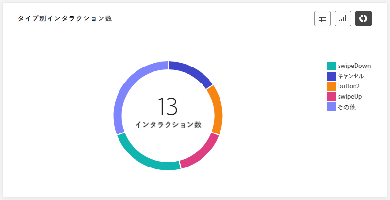

**[!UICONTROL タイプ別インタラクション数]**&#x200B;のグラフとテーブルは、クリック、破棄またはインタラクションを追跡して、ユーザーがアプリ内メッセージに対してどのような操作をしたかを示します。
