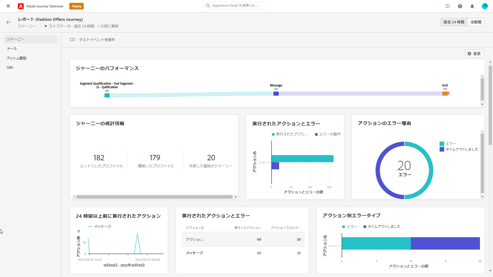
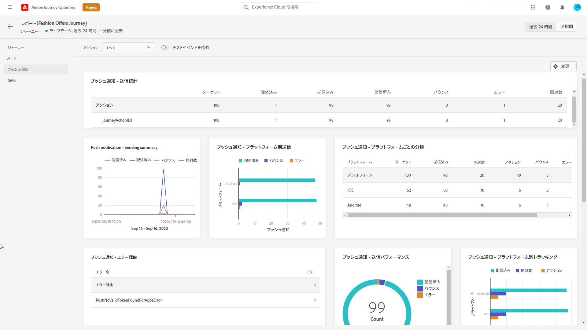
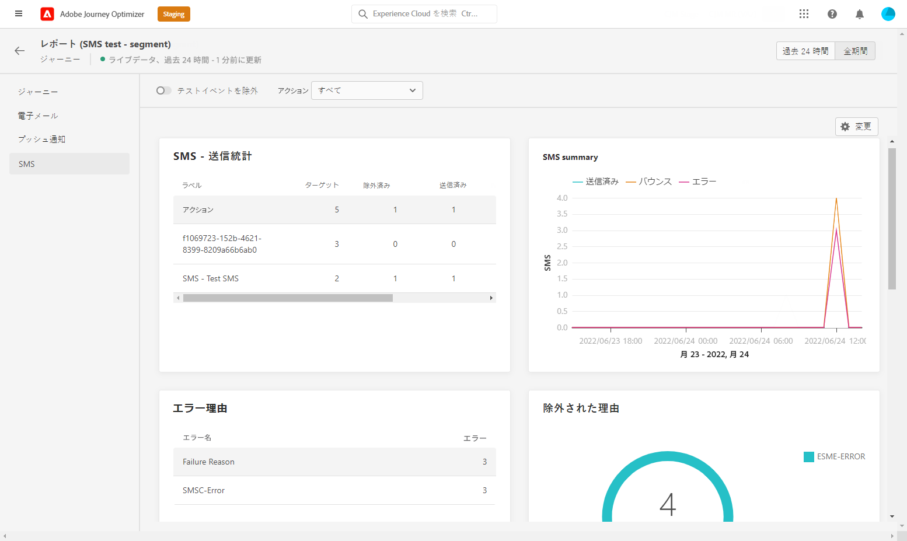

# ライブレポートの旅 {#journey-live-report}

旅のライブレポートには、 **[!UICONTROL View report]** ボタンを使用して直接アクセスすることができます。

次のタブを使用して、旅 **[!UICONTROL Live report]** ページが表示されます。

* [旅](#journey-live)
* [電子メール](#email-live)
* [プル](#push-live)
* [SMS](#sms-live)

この旅 **[!UICONTROL Live report]** は、旅の成功と間違いについての様々な widget に分割されています。 各 widget については、必要に応じてサイズ変更や削除を行うことができます。 詳細については、ここを  参照してください。

アドビシステムズ社のオプティマイザーで利用可能なすべてのメトリックスのリストについては、このページ ](live-report.md#list-of-components-live) を [ 参照してください。

## 「フライト」タブ {#journey-live}

タブを使用 **[!UICONTROL Live report]** **[!UICONTROL Journey]** すると、旅に関する最も重要なトラッキングデータを表示できます。

詳細については、「詳細」を参照してください。

**[!UICONTROL Journey Performance]** では、ターゲットのプロファイルのパスを段階的に調べることができます。

**[!UICONTROL Journey Statistics]** Widget には、次のように kpi が表示されます。

* **[!UICONTROL Entered profiles]**: 旅の入場イベントに達した人物の総数を示します。

* **[!UICONTROL Exited profiles]**: 旅を終了した人物の総数です。

* **[!UICONTROL Failed individual journeys]**: 正常に実行されなかった個々の journeys の合計数。

および widget を使用すると **[!UICONTROL Events]** 、 **[!UICONTROL Event executed over the last 24 hours]** どのイベントが実行されたかを、要約数、グラフ、テーブルのいずれかで確認することができます。

And **[!UICONTROL Actions executed and errors]** widget は **[!UICONTROL Action executed over the last 24 hours]** 、アクションがトリガーされたときに発生する、最も成功したアクションとエラーを表します。アクショングラフ、テーブル、および概要番号には、次のようなアクションに使用可能なデータが含まれています。

* **[!UICONTROL Actions executed]**: 旅中に正常に実行された操作の合計数です。

* **[!UICONTROL Error in actions]**: アクションについて発生したエラーの合計数。
+++

## 電子メールタブ {#email-live}

このタブには、お客様の旅において **[!UICONTROL Live report]** 、お客様との間で送信された電子メール配信に関する重要な情報が表示され **[!UICONTROL Email]** ます。

電子メールレポートに使用できる様々なメトリックスと widget について詳しくは、+ + + こちらを参照してください。

Widget には、メッセージを基準とした重要な情報が表示され **[!UICONTROL Email Sending Statistics]** ます。

* **[!UICONTROL Delivered]**: 正常に送信されたメッセージの数を指定します。

* **[!UICONTROL Bounces]**: 配信中に発生したエラーの合計数が累積され、戻り処理は自動的に実行されます。

* **[!UICONTROL Errors]**: 配信中に発生したエラーの総数が、プロファイルに送信されるのを防ぐことができます。

テーブルと **[!UICONTROL Email Summary]** グラフは、 **[!UICONTROL Sending metrics by Email]** 配信が成功した場合に、次のことを行います。

* **[!UICONTROL Sent]**: 配布に使用された送信の合計数。

* **[!UICONTROL Delivered]**: 正常に送信されたメッセージの数を指定します。

* **[!UICONTROL Bounces]**: 配信中に発生したエラーの合計数が累積され、戻り処理は自動的に実行されます。

* **[!UICONTROL Errors]**: 配信中に発生したエラーの総数が、プロファイルに送信されるのを防ぐことができます。

* **[!UICONTROL Opens]**: メッセージが配信中に開かれた回数を示します。

* **[!UICONTROL Clicks]**: 配信されたコンテンツをクリックした回数。

* **[!UICONTROL Unsubscribe]**: Unsubscription リンクのクリック回数。

* **[!UICONTROL Spam complaints]**: メッセージがスパムまたは迷惑メールとして宣言された回数。

**[!UICONTROL Bounce Reasons]** **[!UICONTROL Bounce categories]** および **[!UICONTROL Hard and bounce - by Email]** widget には、バウンスメッセージに関連する次のようなデータが含まれています。

* **[!UICONTROL Hard bounce]**: 電子メールアドレスの間違いなどの永続的なエラーの合計数。 これには、不明なユーザーなど、アドレスが無効であることを示すエラーメッセージが表示されます。

* **[!UICONTROL Soft bounce]**: 完全な受信ボックスなど、一時的なエラーの合計数。

* **[!UICONTROL Ignored]**: 「外出中」などの一時的な合計数、または送信者の種類がポストマスターである場合などの技術的なエラーが挙げられます。

**[!UICONTROL Error Reasons]**&#x200B;および **[!UICONTROL Exclude Reasons]** グラフとテーブルを使用すると、配信中に発生したエラーと除外を確認できます。

グラフとテーブルに **[!UICONTROL Email - Top recipient domain]** は、電子メールを開くために受信者が最も頻繁に使用するドメインが詳しく表示されます。

>[!NOTE]
>
>提示される widget and metrics は、電子メールに意思決定が追加された場合にのみ使用できます。 意思決定管理について詳しくは、この [ ページ ](../offers/get-started/starting-offer-decisioning.md) を参照してください。

**[!UICONTROL Offers statistics]**&#x200B;時間と共に一定の widget を使用することで、お客様に提供される成功と影響が **[!UICONTROL Offers statistic]** 計測されます。Kpi を使用してメッセージに関連する主要な情報を詳細に説明します。

* **[!UICONTROL Offer sent]**: 申し出の合計数。

* **[!UICONTROL Offer impression]**: 配信中にオファーが開かれた回数を指定します。

* **[!UICONTROL Offer clicks]**: 配信中にキャンペーンがクリックされた回数。
+++

## 「プッシュ通知」タブ {#push-live}

このタブには、お客様 **[!UICONTROL Live report]** が旅に送信された配信に関する主な情報が記載され **[!UICONTROL Push notification]** ています。

+ + + プッシュレポートに使用できる様々なメトリックスと widget について詳しくは、こちらを参照してください。

**[!UICONTROL Push notification sending performance]**、ウィジェットによって、 **[!UICONTROL Push notification summary]** メッセージを基準とし **[!UICONTROL Sending metrics - by Push]** た重要な情報が表示されます。

* **[!UICONTROL Sent]**: 配布に使用された送信の合計数。

* **[!UICONTROL Delivered]**: 正常に送信されたメッセージの数を指定します。

* **[!UICONTROL Bounces]**: 配信中に発生したエラーの合計数が累積され、戻り処理は自動的に実行されます。

* **[!UICONTROL Errors]**: 配信中に発生したエラーの総数が、プロファイルに送信されるのを防ぐことができます。

* **[!UICONTROL Opens]**: メッセージが配信中に開かれた回数を示します。

* **[!UICONTROL Actions]**: プッシュ通知で配信されたアクションの合計数 (例えば、ボタンのクリックまたは dismissal)。

* **[!UICONTROL Engagements]**: このプッシュ通知のオープン数とアクション数の合計、つまり、プロファイルからプッシュが開かれたか、ボタンがクリックされたかどうかを示します。

**[!UICONTROL Error Reasons]**&#x200B;および **[!UICONTROL Exclude Reasons]** グラフとテーブルを使用すると、配信中に発生したエラーと除外を確認できます。

この widget を使用すると、 **[!UICONTROL Sending statistics - Failed]** エラーが発生した回数と、バウンスが発生したことを確認できます。

**[!UICONTROL Tracking by platform]** **[!UICONTROL Sending by platform]** 、、グラフ、および **[!UICONTROL Breakdown by platform]** テーブルによって、稼働システムによってはプッシュ通知が成功したかを確認することができます。
+++

## 「SMS」タブ {#sms-live}

、SMS レポートに使用できる様々なメトリックスと widget について詳しく説明します。

以下の表は **[!UICONTROL SMS - Sending statistics]** 、配信が成功したことを示しています。

* **[!UICONTROL Targeted]**&#x200B;この配信には、ターゲットのプロファイルとして認定されるユーザープロファイルの数を指定します。

* **[!UICONTROL Excluded]**: メッセージが配信されなかった対象のプロファイルから除外されたユーザープロファイルの数。

* **[!UICONTROL Sent]**: 配布に使用された送信の合計数。

* **[!UICONTROL Delivered]**: 正常に送信されたメッセージの数を指定します。

* **[!UICONTROL Opens]**: メッセージが配信中に開かれた回数を示します。

* **[!UICONTROL Clicks]**: 配信されたコンテンツをクリックした回数。

* **[!UICONTROL Bounces]**: 配信中に発生したエラーの合計数が累積され、戻り処理は自動的に実行されます。

* **[!UICONTROL Errors]**: 配信中に発生したエラーの総数が、プロファイルに送信されるのを防ぐことができます。

このグラフは **[!UICONTROL SMS Summary]** 、配信が成功したことを示します。

* **[!UICONTROL Delivered]**: 正常に送信されたメッセージの数を指定します。

* **[!UICONTROL Bounces]**: 配信中に発生したエラーの合計数が累積され、戻り処理は自動的に実行されます。

* **[!UICONTROL Errors]**: 配信中に発生したエラーの総数が、プロファイルに送信されるのを防ぐことができます。

これらの **[!UICONTROL Exclude Reasons]** グラフとテーブルを使用すると、配信中に発生したエラーと除外を確認できます。
+++
