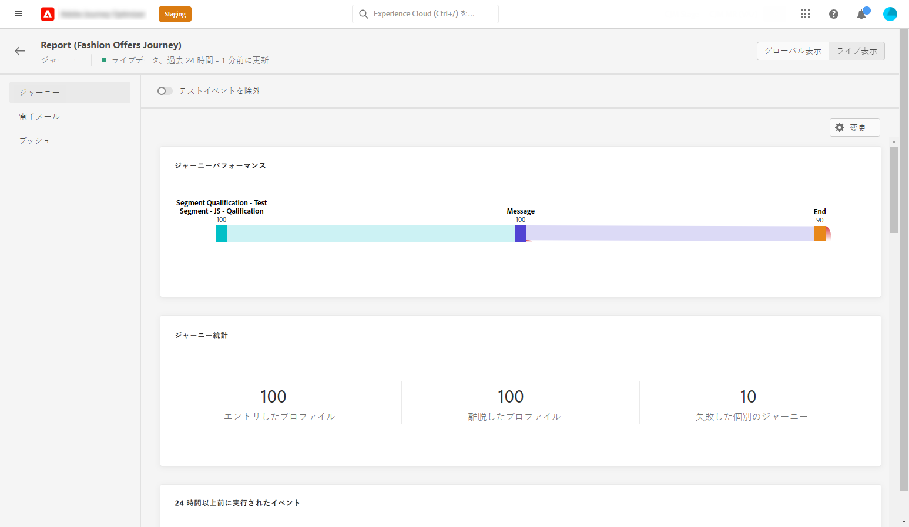
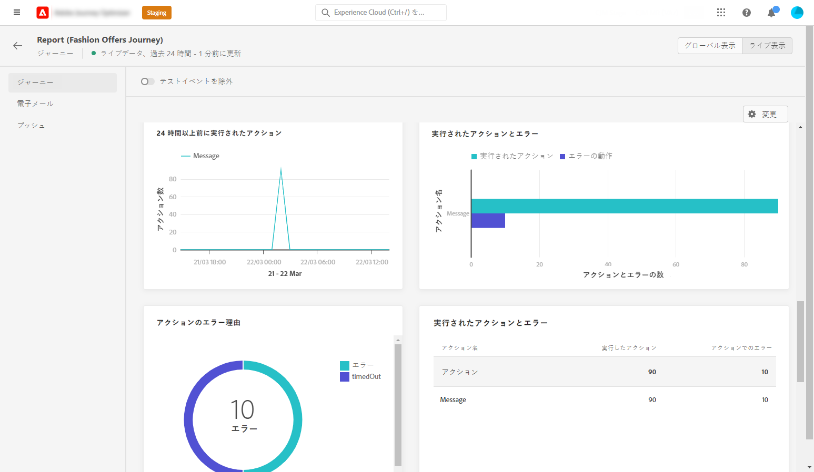
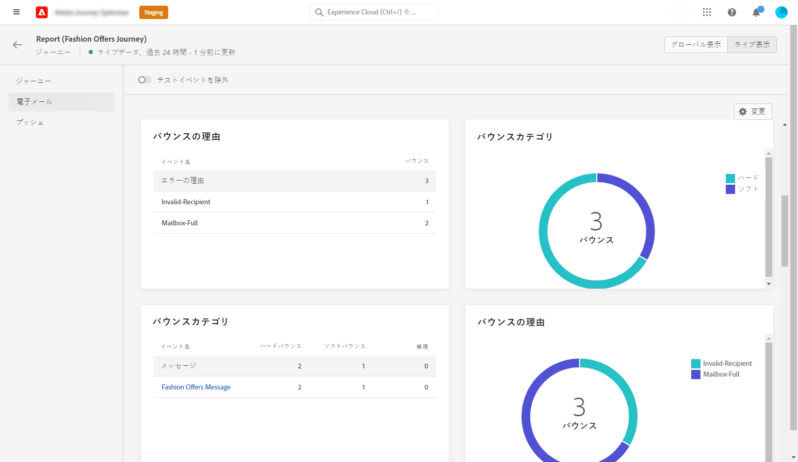
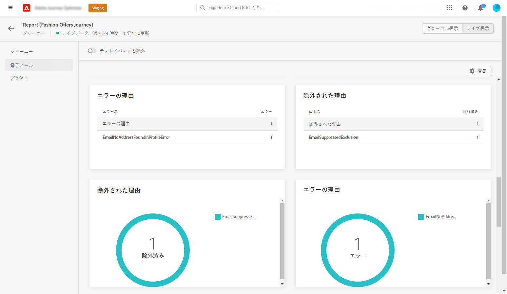
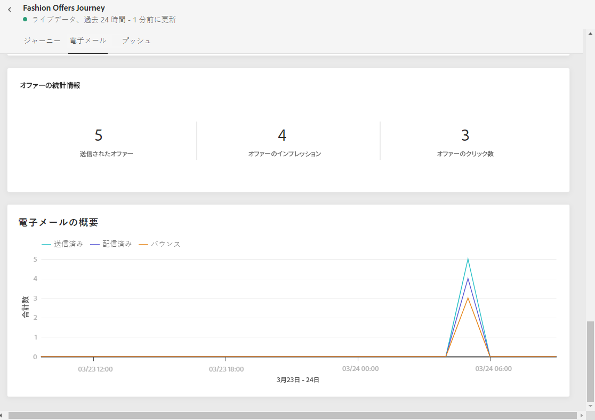
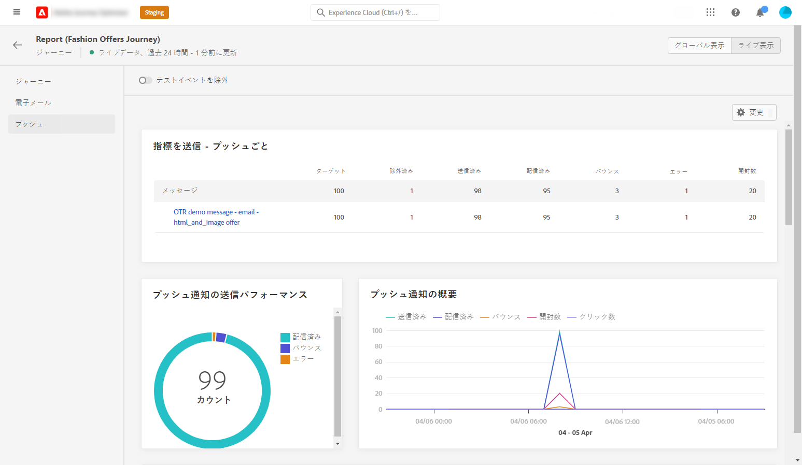
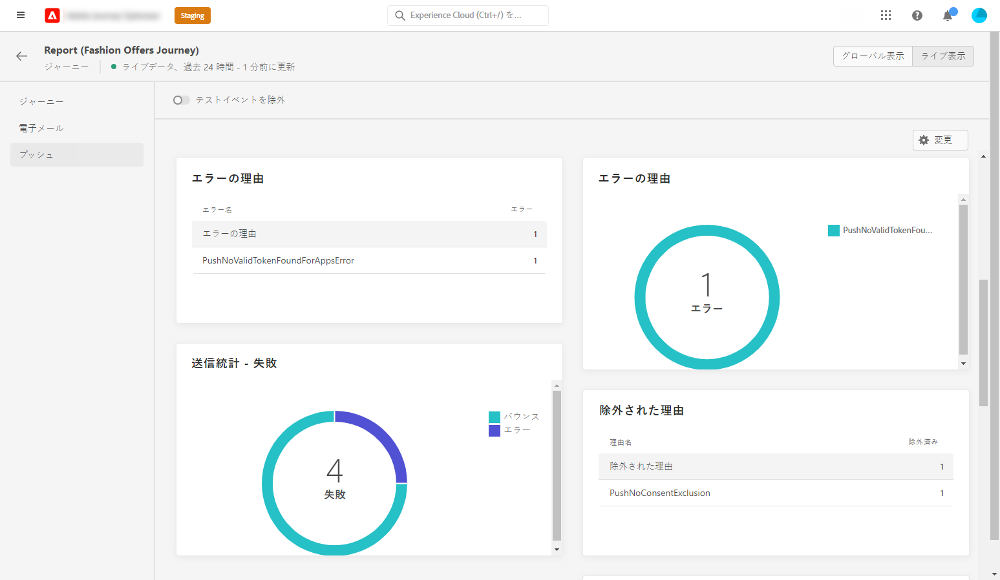
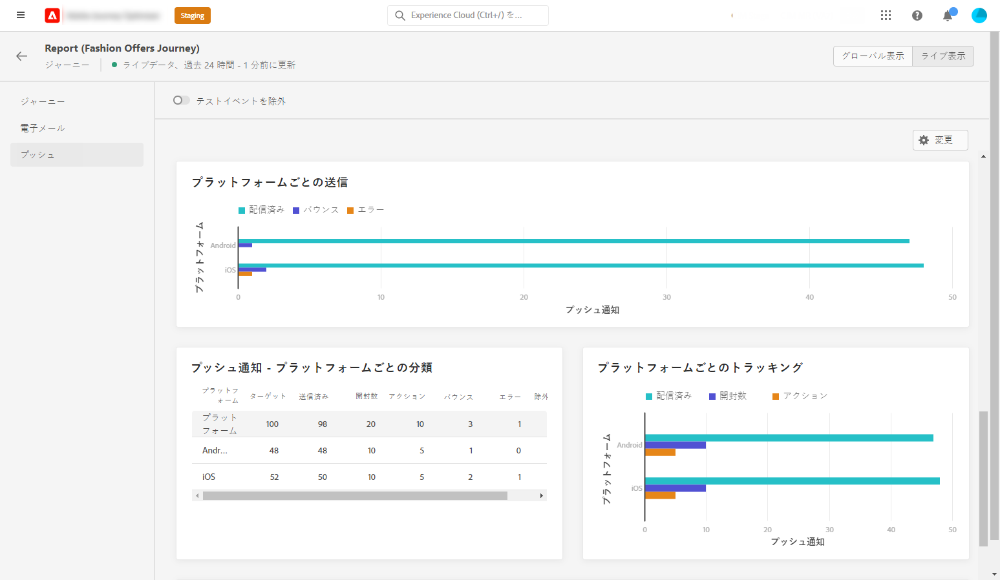
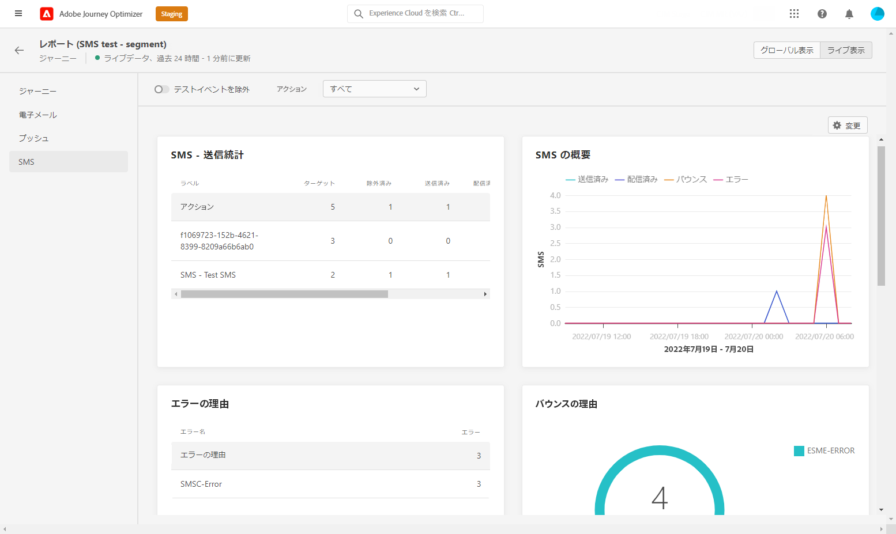

# ジャーニーライブレポート {#journey-live-report}

ジャーニーのライブレポートには、 **[!UICONTROL レポートを表示]** 」ボタンをクリックします。

ジャーニー&#x200B;**[!UICONTROL ライブレポート]**&#x200B;ページは次のタブで表示されます。

* [ジャーニー](#journey-live)
* [メール](#email-live)
* [プッシュ](#push-live)
* [SMS](#sms-live)

ジャーニー&#x200B;**[!UICONTROL ライブレポート]**&#x200B;は、ジャーニーの成功とエラーの詳細を示す様々なウィジェットに分かれています。必要に応じて、各ウィジェットのサイズを変更したり削除したりできます。詳しくは、この[節](live-report.md#modify-dashboard)を参照してください。

## 「ジャーニー」タブ {#journey-live}

ジャーニー&#x200B;**[!UICONTROL ライブレポート]**&#x200B;の「**[!UICONTROL ジャーニー]**」タブには、ジャーニーに関する最も重要なトラッキングデータが明確に表示されます。

**[!UICONTROL ジャーニーのパフォーマンス]**&#x200B;を使用すると、ターゲットとするプロファイルのパスをジャーニーの初めから終わりまで段階的に表示できます。

**[!UICONTROL ジャーニーの統計情報]**&#x200B;ウィジェットには、次の KPI が表示されます。

* **[!UICONTROL エントリしたプロファイル]**：ジャーニーのエントリイベントに到達した個人の合計数。

* **[!UICONTROL 退出したプロファイル]**：ジャーニーから退出した個人の合計数。

* **[!UICONTROL 失敗した個別のジャーニー]**：正常に実行されなかった個別のジャーニーの総数。

「**[!UICONTROL 過去 24 時間以内に実行されたイベント]**」ウィジェットと「**[!UICONTROL イベント]**」ウィジェットを使用すると、どのイベントが正常に実行されたかをサマリー番号、グラフおよびテーブルから確認できます。

「**[!UICONTROL 過去 24 時間以内に実行されたアクション]**」ウィジェットと「**[!UICONTROL 実行されたアクションとエラー]**」ウィジェットは、最も成功したアクションと、アクションがトリガーされたときに発生したエラーを表します。アクションのグラフ、テーブルおよびサマリー番号には、アクションに関する次のようなデータが含まれています。

* **[!UICONTROL 実行されたアクション]**：ジャーニーで正常に実行されたアクションの総数。

* **[!UICONTROL アクションのエラー]**：アクションで発生したエラーの総数。

## 「メール」タブ  {#email-live}

ジャーニー&#x200B;**[!UICONTROL ライブレポート]**&#x200B;の「**[!UICONTROL メール]**」タブには、ジャーニーで送信されるメール配信に関連する主な情報の詳細が表示されます。

**[!UICONTROL メール送信統計情報]**&#x200B;ウィジェットには、メッセージに関連する主な情報の詳細が表示されます。

* **[!UICONTROL 配信済み]**：正常に送信されたメッセージ数。

* **[!UICONTROL バウンス数]**：配信中および自動返信処理中のエラーの累計。

* **[!UICONTROL エラー]**：配信中に発生し、プロファイルに送信できなかったエラーの合計数。

**[!UICONTROL メール別送信指標]**&#x200B;テーブルと&#x200B;**[!UICONTROL メールの概要]**&#x200B;グラフに、配信が成功した詳細を示します。

* **[!UICONTROL 送信済み]**：配信用に送信した合計数。

* **[!UICONTROL 配信済み]**：正常に送信されたメッセージ数。

* **[!UICONTROL バウンス数]**：配信中および自動返信処理中のエラーの累計。

* **[!UICONTROL エラー]**：配信中に発生し、プロファイルに送信できなかったエラーの合計数。

* **[!UICONTROL 開封数]**：配信でメッセージが開封された回数。

* **[!UICONTROL クリック数]**：配信でコンテンツがクリックされた回数。

* **[!UICONTROL 購読解除]**：購読解除リンクのクリック数。

* **[!UICONTROL スパムの苦情数]**：メッセージがスパムまたは迷惑メールとして宣言された回数。

**[!UICONTROL バウンス理由]**、**[!UICONTROL バウンスカテゴリ]**、**[!UICONTROL ハードとバウンス - メール別]**&#x200B;などのウィジェットには、バウンスメッセージに関して利用できるデータが含まれます。

* **[!UICONTROL ハードバウンス]**：永続的なエラー（メールアドレスの間違いなど）の合計数。このエラーは、アドレスが無効であることを明示的に示すエラーメッセージ（例：「不明なユーザー」）を伴います。

* **[!UICONTROL ソフトバウンス数]**：一時的なエラー（インボックスが満杯など）の合計数。

* **[!UICONTROL 無視]**：一時的なエラー（不在など）や技術的なエラー（送信者のタイプが postmaster の場合など）の合計数。

**[!UICONTROL エラーの理由]**&#x200B;および&#x200B;**[!UICONTROL 除外された理由]**&#x200B;のグラフとテーブルを使用すると、配信中に発生したエラーと除外を確認できます。

「**[!UICONTROL 電子メール - 上位の受信者ドメイン]**」のグラフと表は、受信者が電子メールを開くために最も多く使用しているドメインの詳細を示しています。

>[!NOTE]
>
>オファーのウィジェットと指標は、決定がメールに挿入された場合にのみ使用できます。 意思決定管理について詳しくは、[このページ](../offers/get-started/starting-offer-decisioning.md)を参照してください。

**[!UICONTROL オファーの統計情報]**&#x200B;ウィジェットと&#x200B;**[!UICONTROL オファーの時系列の統計情報]**&#x200B;ウィジェットは、オファーの成功とターゲットオーディエンスへの影響を測定します。メッセージに関連する主な情報について、以下の KPI を使用して詳しく説明します。

* **[!UICONTROL 送信されたオファー]**：オファーの送信の総数。

* **[!UICONTROL オファーのインプレッション]**：オファーが配信で開かれた回数。

* **[!UICONTROL オファーのクリック数]**：配信でオファーがクリックされた回数。

## 「プッシュ」タブ  {#push-live}

ジャーニー&#x200B;**[!UICONTROL ライブレポート]**&#x200B;の「**[!UICONTROL プッシュ]**」タブには、ジャーニーで送信されたプッシュ配信に関連する主な情報の詳細が表示されます。

**[!UICONTROL プッシュ通知の送信パフォーマンス]**、 **[!UICONTROL プッシュ通知の概要]**&#x200B;および&#x200B;**[!UICONTROL 送信指標（プッシュ別）]**&#x200B;の各ウィジェットには、メッセージに関連する主な情報の詳細が表示されます。

* **[!UICONTROL 送信済み]**：配信用に送信した合計数。

* **[!UICONTROL 配信済み]**：正常に送信されたメッセージ数。

* **[!UICONTROL バウンス数]**：配信中および自動返信処理中のエラーの累計。

* **[!UICONTROL エラー]**：配信中に発生し、プロファイルに送信できなかったエラーの合計数。

* **[!UICONTROL 開封数]**：配信でメッセージが開封された回数。

* **[!UICONTROL アクション]**：配信されたプッシュ通知に対するアクション（ボタンのクリックや解除など）の合計数。

* **[!UICONTROL エンゲージメント]**：このプッシュ通知に対する開封数とアクション数（「プロファイルがプッシュを開封した」、「ボタンがクリックされた」など）の合計。

**[!UICONTROL エラーの理由]**&#x200B;および&#x200B;**[!UICONTROL 除外された理由]**&#x200B;のグラフとテーブルを使用すると、配信中に発生したエラーと除外を確認できます。

**[!UICONTROL 送信統計 - 失敗]**&#x200B;ウィジェットには、発生したエラーとバウンスの数が表示されます。

**[!UICONTROL プラットフォームごとのトラッキング]**、**[!UICONTROL プラットフォームごとの送信]**、**[!UICONTROL プラットフォームごとの分類]**&#x200B;のグラフとテーブルには、オペレーティングシステムに応じたプッシュ通知の成功の詳細が表示されます。

## 「SMS」タブ {#sms-live}

**[!UICONTROL SMS - 送信統計]**&#x200B;テーブルは、配信の成功の詳細を示します。

* **[!UICONTROL ターゲット]** : この配信のターゲットプロファイルとして認定されるユーザープロファイルの数。

* **[!UICONTROL 除外]** : ターゲットプロファイルから除外されメッセージを受信しなかったユーザープロファイルの数。

* **[!UICONTROL 送信済み]**：配信用に送信した合計数。

* **[!UICONTROL 配信済み]**：正常に送信されたメッセージ数。

* **[!UICONTROL 開封数]**：配信でメッセージが開封された回数。

* **[!UICONTROL クリック数]**：配信でコンテンツがクリックされた回数。

* **[!UICONTROL バウンス数]**：配信中および自動返信処理中のエラーの累計。

* **[!UICONTROL エラー]**：配信中に発生し、プロファイルに送信できなかったエラーの合計数。

**[!UICONTROL SMS の概要]**&#x200B;グラフは、配信の成功の詳細を示します。

* **[!UICONTROL 配信済み]**：正常に送信されたメッセージ数。

* **[!UICONTROL バウンス数]**：配信中および自動返信処理中のエラーの累計。

* **[!UICONTROL エラー]**：配信中に発生し、プロファイルに送信できなかったエラーの合計数。

**[!UICONTROL 除外された理由]**&#x200B;のグラフとテーブルを使用すると、配信中に発生したエラーと除外を確認できます。
