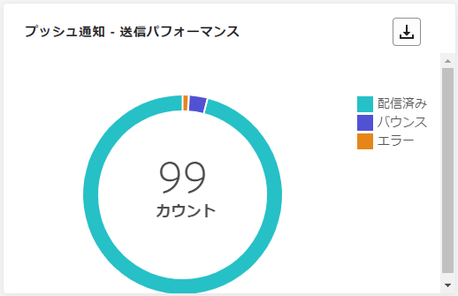

# ジャーニーライブレポート {#journey-live-report}

>[!CONTEXTUALHELP]
>id="ajo_journey_live_report"
>title="ジャーニーライブレポート"
>abstract="ジャーニーのライブレポートでは、過去 24 時間のみのジャーニーの影響とパフォーマンスをリアルタイムで測定および視覚化できます。レポートは、ジャーニーの成功とエラーの詳細を示す様々なウィジェットに分かれています。各レポートダッシュボードは、ウィジェットのサイズ変更や削除を行うことで変更できます。"

「過去 24 時間」タブからアクセスできるライブレポートには、過去 24 時間以内に発生したイベントが、イベント発生から最小 2 分の時間間隔で表示されます。これに対し、グローバルレポートでは、少なくとも 2 時間前に発生したイベントに焦点を当て、選択した期間のイベントが表示されます。

ジャーニーライブレポートは、「**[!UICONTROL レポートを表示]**」ボタンを使用して、ジャーニーから直接アクセスできます。

ジャーニー&#x200B;**[!UICONTROL ライブレポート]**&#x200B;ページは次のタブで表示されます。

* [ジャーニー](#journey-live)
* [メール](#email-live)
* [プッシュ](#push-live)
* [SMS](#sms-live)
* [アプリ内](#in-app-live)

ジャーニー&#x200B;**[!UICONTROL ライブレポート]**&#x200B;は、ジャーニーの成功とエラーの詳細を示す様々なウィジェットに分かれています。必要に応じて、各ウィジェットのサイズを変更したり削除したりできます。詳しくは、この[節](live-report.md#modify-dashboard)を参照してください。

Adobe Journey Optimizer で使用可能なすべての指標の詳細なリストについては、[このページ](live-report.md#list-of-components-live)を参照してください。

## 「ジャーニー」タブ {#journey-live}

ジャーニー&#x200B;**[!UICONTROL ライブレポート]**&#x200B;の「**[!UICONTROL ジャーニー]**」タブには、ジャーニーに関する最も重要なトラッキングデータが明確に表示されます。

### ジャーニーの実績 {#journey-performance}

>[!CONTEXTUALHELP]
>id="ajo_journey_performance_live"
>title="ジャーニーの実績"
>abstract="XX"

**[!UICONTROL ジャーニーのパフォーマンス]**&#x200B;を使用すると、ターゲットとするプロファイルのパスをジャーニーの初めから終わりまで段階的に表示できます。

### ジャーニー統計 {#journey-statistics}

>[!CONTEXTUALHELP]
>id="ajo_journey_statistics_live"
>title="ジャーニー統計"
>abstract="XX"

The **[!UICONTROL ジャーニー統計]** 主要業績評価指標 (KPI) は包括的なダッシュボードとして機能し、過去 24 時間のジャーニーに関連する重要な指標の分析を提供します。 これには、入力されたプロファイルの数や失敗した個々のジャーニーのインスタンスなどの詳細が含まれ、ジャーニーの効果とエンゲージメントレベルを包括的に把握できます。

+++ ジャーニーの統計指標の詳細

* **[!UICONTROL エントリしたプロファイル]**：ジャーニーのエントリイベントに到達した個人の合計数。

* **[!UICONTROL 退出したプロファイル]**：ジャーニーから退出した個人の合計数。

* **[!UICONTROL 失敗した個別のジャーニー]**：正常に実行されなかった個別のジャーニーの総数。
+++

### 過去 24 時間に実行されたアクション {#action-executed}

>[!CONTEXTUALHELP]
>id="ajo_journey_actions_executed_live"
>title="過去 24 時間に実行されたアクション"
>abstract="XX"

The **[!UICONTROL 過去 24 時間に実行されたアクション]** ウィジェットは、アクションがトリガーされたときに発生した最も成功したアクションを表します。

+++ 過去 24 時間の指標で実行されたアクションの詳細を説明します

* **[!UICONTROL 実行されたアクション]**：ジャーニーで正常に実行されたアクションの総数。

* **[!UICONTROL アクションのエラー]**：アクションで発生したエラーの総数。

+++

### 実行されたアクションとエラー {#actions-errors}

>[!CONTEXTUALHELP]
>id="ajo_journey_actions_executed__errors_live"
>title="実行されたアクションとエラー"
>abstract="XX"

The **[!UICONTROL 実行されたアクションとエラー]** ウィジェットは、最も成功したアクションと、アクションがトリガーされたときに発生したエラーを表します。

+++ 実行されたアクションおよびエラー指標の詳細を説明します

* **[!UICONTROL 実行されたアクション]**：ジャーニーで正常に実行されたアクションの総数。

* **[!UICONTROL アクションのエラー]**：アクションで発生したエラーの総数。

+++

### アクションのエラー理由 {#actions-error-reasons}

>[!CONTEXTUALHELP]
>id="ajo_journey_actions_errors_live"
>title="アクションのエラー理由"
>abstract="XX"

The **[!UICONTROL アクションエラーの理由]** 表およびグラフでは、過去 24 時間以内にアクションの実行中に発生したエラーの包括的な概要を提供します。

### アクション別のエラータイプ {#error-type-actions}

>[!CONTEXTUALHELP]
>id="ajo_journey_actions_error_type_live"
>title="アクション別のエラータイプ"
>abstract="XX"

The **[!UICONTROL アクション別のエラータイプ]** 表とグラフには、過去 24 時間以内にアクションが実行されるたびに発生したエラーの包括的な概要が表示されます。

### 過去 24 時間に実行されたイベント {#event-executed-24hours}

>[!CONTEXTUALHELP]
>id="ajo_journey_event_24hours_live"
>title="過去 24 時間に実行されたイベント"
>abstract="XX"

The **[!UICONTROL 過去 24 時間に実行されたイベント]** ウィジェットを使用すると、過去 24 時間以内に正常に実行されたイベントを特定できます。

### イベント {#events}

>[!CONTEXTUALHELP]
>id="ajo_journey_events_live"
>title="イベント"
>abstract="XX"

The **[!UICONTROL イベント]** ウィジェットでは、概要番号、グラフ、表を使用して、どのイベントが正常に実行されたかを確認できます。

### 接触チャネル別のイベント {#events-origin}

>[!CONTEXTUALHELP]
>id="ajo_journey_events_origin_live"
>title="接触チャネル別のイベント"
>abstract="XX"

The **[!UICONTROL 接触チャネル別のイベント]** 表とグラフは、過去 24 時間にイベントが正常に受信されたことに関する詳細な視点を提供します。 これらの視覚的表現を通じて、効果的に受け取ったイベントを正確に識別し、ジャーニー内の個々のイベントのパフォーマンスと影響に関する貴重なインサイトを提供できます。

## 「メール」タブ {#email-live}

ジャーニーから **[!UICONTROL ライブレポート]**、 **[!UICONTROL 電子メール]** 「 」タブには、ジャーニーで送信される e メールに関する主な情報の詳細が表示されます。

### メール - 送信パフォーマンス {#email-sending-performance}

>[!CONTEXTUALHELP]
>id="ajo_journey_email_sending_performance_live"
>title="メール - 送信パフォーマンス"
>abstract="XX"

The **[!UICONTROL 電子メール — 送信パフォーマンス]** グラフでは、ジャーニーの送信済み E メールに関するデータの包括的なビューを提供し、過去 24 時間に発生した配信済み指標やバウンス数などの主要指標に関するインサイトを提供します。 これにより、E メール送信プロセスの詳細な分析を可能にし、ジャーニーの効率性とパフォーマンスに関する貴重な情報を提供します。

+++ 電子メール — パフォーマンス指標の送信の詳細を説明します

* **[!UICONTROL 配信済み]**：正常に送信された電子メールの数。

* **[!UICONTROL バウンス数]**：送信プロセスおよび自動返信処理の間に累積したエラーの合計数。

* **[!UICONTROL エラー]**：配信中に発生してプロファイルに送信できない原因となったエラーの合計数。

* **[!UICONTROL 再試行]**：再試行のキュー内のメール数。

+++

### メール - 統計 {#email-stat}

>[!CONTEXTUALHELP]
>id="ajo_journey_email_statistics_live"
>title="メール - 統計"
>abstract="XX"

The **[!UICONTROL 電子メール — 統計]** この表は、過去 24 時間のジャーニー内の E メールに関する基本的なデータの包括的な概要を示しています。 ターゲットオーディエンスのサイズや正常に配信された電子メールの数など、主要な指標の詳細を説明し、電子メールやジャーニーの効果とリーチに関する有益なインサイトを提供します。

+++ 電子メール送信統計指標の詳細を説明します

* **[!UICONTROL ターゲット]**：送信プロセス中に処理されたメッセージの合計数。

* **[!UICONTROL 除外済み]**：Adobe Journey Optimizer によって除外されたプロファイルの数。

* **[!UICONTROL 送信済み]**：送信された電子メールの合計数。

* **[!UICONTROL 配信済み]**：送信されたメッセージの総数に対する、正常に送信されたメッセージの数。

* **[!UICONTROL バウンス数]**：送信されたメッセージの合計数に対して、送信プロセスおよび自動返信処理の間に累積したエラーの合計数。

* **[!UICONTROL エラー]**：送信プロセス中に発生し、プロファイルへの送信の妨げとなったエラーの合計数。

* **[!UICONTROL 開封数]**:E メールが開封された回数。

* **[!UICONTROL クリック数]**:E メールでコンテンツがクリックされた回数。

* **[!UICONTROL 購読解除]**：購読解除リンクのクリック数。

* **[!UICONTROL スパムのの苦情数]**：メッセージがスパムまたはジャンクとして宣言された回数。

* **[!UICONTROL 再試行]**：再試行のキュー内のメール数。

+++

### メール - 日別のパフォーマンス {#email-perf-date}

>[!CONTEXTUALHELP]
>id="ajo_journey_email_performance_bydate_live"
>title="メール - 日別のパフォーマンス"
>abstract="XX"

The **[!UICONTROL メール — 日別のパフォーマンス]** ウィジェットは、メールに関する主要情報の詳細な概要をグラフで示し、過去 24 時間のパフォーマンスの傾向に関するインサイトを提供します。

+++ メール — 日付指標別のパフォーマンスの詳細を説明します

* **[!UICONTROL 送信済み]**：送信された電子メールの合計数。

* **[!UICONTROL 配信済み]**：正常に送信された電子メールの数。

* **[!UICONTROL バウンス数]**：送信プロセスおよび自動返信処理の間に累積したエラーの合計数。

* **[!UICONTROL エラー]**：送信プロセス中に発生し、プロファイルに送信できなかったエラーの合計数。

* **[!UICONTROL 開封数]**:E メールが開封された回数。

* **[!UICONTROL クリック数]**:E メールでコンテンツがクリックされた回数。

* **[!UICONTROL 購読解除]**：購読解除リンクのクリック数。

* **[!UICONTROL スパムのの苦情数]**：メッセージがスパムまたはジャンクとして宣言された回数。

+++

### 電子メール — バウンスのカテゴリと理由 {#email-bounce-categories}

>[!CONTEXTUALHELP]
>id="ajo_journey_email_bounces_live"
>title="電子メール — バウンスのカテゴリと理由"
>abstract="XX"

The **[!UICONTROL バウンスの理由]** および **[!UICONTROL バウンスのカテゴリ]** ウィジェットは、バウンスメッセージに関連する使用可能なデータをコンパイルし、過去 24 時間の電子メールバウンスの背後にある特定の理由とカテゴリに関する詳細なインサイトを提供します。

バウンスの詳細については、[抑制リスト](../reports/suppression-list.md)のページを参照してください。

+++ E メール — バウンスカテゴリと理由指標の詳細を説明します

* **[!UICONTROL ハードバウンス]**：永続的なエラー（メールアドレスの間違いなど）の合計数。このエラーは、アドレスが無効であることを明示的に示すエラーメッセージ（例：「不明なユーザー」）を伴います。

* **[!UICONTROL ソフトバウンス数]**：一時的なエラー（インボックスが満杯など）の合計数。

* **[!UICONTROL 無視]**：一時的なエラー（不在など）や技術的なエラー（送信者のタイプが postmaster の場合など）の合計数。

+++

### メール - エラー理由 {#email-error-reasons}

>[!CONTEXTUALHELP]
>id="ajo_journey_email_errors_live"
>title="メール - エラー理由"
>abstract="XX"

The **[!UICONTROL エラーの理由]** グラフと表には、過去 24 時間の送信プロセス中に発生した特定のエラーが表示され、エラーの性質と発生に関する貴重な情報が示されます。

### メール - 除外された理由 {#email-excluded}

>[!CONTEXTUALHELP]
>id="ajo_journey_email_excluded_live"
>title="メール - 除外された理由"
>abstract="XX"

The **[!UICONTROL 除外された理由]** グラフと表は、ターゲットオーディエンスからユーザープロファイルが除外され、過去 24 時間にメッセージが受信されなかった様々な要因の包括的なビューを示します。

参照： [このページ](exclusion-list.md) 除外の理由の包括的なリストを参照してください。

### メール - 最適な受信者ドメイン {#email-best-recipient}

>[!CONTEXTUALHELP]
>id="ajo_journey_email_best_recipient_live"
>title="メール - 最適な受信者ドメイン"
>abstract="XX"

The **[!UICONTROL E メール — 最適な受信者ドメイン]** グラフと表には、過去 24 時間以内に E メールを開くのに最も頻繁に使用されるドメインの詳細な分類が表示されます。 これにより、プロファイルの動作に関する貴重なインサイトが得られ、優先プラットフォームの理解に役立ちます。

### 電子メール — オファー {#email-offers}

>[!CONTEXTUALHELP]
>id="ajo_journey_email_offers_live"
>title="電子メール — オファー"
>abstract="XX"

>[!NOTE]
>
>オファーのウィジェットと指標は、決定がメールに挿入された場合にのみ使用できます。 意思決定管理について詳しくは、[このページ](../offers/get-started/starting-offer-decisioning.md)を参照してください。

The **[!UICONTROL オファー統計]** および **[!UICONTROL オファーの統計の推移]** ウィジェットは、オファーの成功と、ターゲットオーディエンスに与える影響を測定します。 KPI を使用して、メッセージに関する主な情報の詳細を示します。

+++ 電子メール — オファー指標の詳細を説明します

* **[!UICONTROL 送信されたオファー]**：オファーの送信の総数。

* **[!UICONTROL オファーインプレッション]**：オファーが電子メールで開かれた回数。

* **[!UICONTROL オファークリック数]**：オファーが E メールでクリックされた回数。

+++

### 電子メール — 最適化 {#email-sto}

>[!CONTEXTUALHELP]
>id="ajo_journey_email_optimization_live"
>title="電子メール — 最適化"
>abstract="XX"

>[!NOTE]
>
>The **[!UICONTROL 送信時間の最適化]** および **[!UICONTROL 最適化済みと最適化されていない]** ウィジェットは、配信で「送信時間の最適化」オプションが有効になっている場合にのみ使用できます。 送信時間の最適化について詳しくは、[このページ](../building-journeys/journeys-message.md#send-time-optimization)を参照してください。

The **[!UICONTROL 送信時間の最適化]** および **[!UICONTROL 最適化済みと最適化されていない]** ウィジェットでは、送信方法（最適化、通常）に応じて、e メールの成功の詳細を説明します。

+++ 送信時間の最適化と最適化された指標と最適化されていない指標の詳細を説明します

* **[!UICONTROL 配信済み]**：送信されたメッセージの合計数に対して、正常に配達できたメッセージの数。
* **[!UICONTROL バウンス数]**：送信されたメッセージの合計数に対して、送信プロセスおよび自動返信処理の間に累積したエラーの合計数。

* **[!UICONTROL 送信済み]**：ジャーニーで送信された電子メールの合計数。

* **[!UICONTROL 開封数]**：ジャーニーで E メールが開封された回数。

* **[!UICONTROL クリック数]**:E メールでコンテンツがクリックされた回数。

+++

## 「プッシュ通知」タブ {#push-live}

ジャーニーから **[!UICONTROL ライブレポート]**、 **[!UICONTROL プッシュ通知]** 「 」タブには、ジャーニーで送信されるプッシュ通知に関連する主な情報の詳細が表示されます。

### プッシュ通知 - 送信パフォーマンス {#push-sending-performance}

>[!CONTEXTUALHELP]
>id="ajo_journey_push_sending_performance_live"
>title="プッシュ通知 - 送信パフォーマンス"
>abstract="プッシュ通知送信パフォーマンスのグラフは、過去 24 時間のエラーメッセージや配信済みメッセージなど、プッシュ通知に関する重要なデータを要約します。"

The **[!UICONTROL プッシュ通知の送信パフォーマンス]** グラフでは、過去 24 時間以内に送信されたプッシュ通知に関連するデータの詳細な概要を提供します。 配信済みとバウンスなどの重要な指標に関するインサイトを提供し、プッシュ通知の送信プロセスを詳細に調べることができます。

+++ プッシュ通知 — パフォーマンス指標の送信の詳細を説明します

* **[!UICONTROL 配信済み]**：正常に送信されたメッセージ数。

* **[!UICONTROL バウンス数]**：送信プロセスおよび自動返信処理の間に累積したエラーの合計数。

* **[!UICONTROL エラー]**：配信中に発生してプロファイルに送信できない原因となったエラーの合計数。

+++

### プッシュ通知 - 統計 {#push-statistics}

>[!CONTEXTUALHELP]
>id="ajo_journey_push_statistics_live"
>title="プッシュ通知 - 統計"
>abstract="XX"

**[!UICONTROL プッシュ通知 — 統計]** この表は、ターゲットメッセージ数や過去 24 時間以内に正常に配信されたメッセージ数など、主要指標を含む、プッシュ通知に関する重要なデータの簡潔な概要を示します。

+++ プッシュ通知 — 統計指標の詳細を説明します

* **[!UICONTROL ターゲット]**：任意のアクション（メールや SMS の送信など）でターゲットとするプロファイルの数。

* **[!UICONTROL 除外済み]**：Adobe Journey Optimizer によって除外されたプロファイルの数。

* **[!UICONTROL 送信済み]**：送信されたプッシュ通知の合計数。

* **[!UICONTROL 配信済み]**：正常に送信されたプッシュ通知の数。

* **[!UICONTROL バウンス数]**：送信プロセスおよび自動返信処理の間に累積したエラーの合計数。

* **[!UICONTROL エラー]**：配信中に発生してプロファイルに送信できない原因となったエラーの合計数。

* **[!UICONTROL 開封数]**：プッシュ通知が開封された回数。
+++

### プッシュ通知 - プラットフォームごとの分類 {#push-breakdown}

>[!CONTEXTUALHELP]
>id="ajo_journey_push_breakdown_live"
>title="プッシュ通知 - プラットフォームごとの分類"
>abstract="XX"

The **[!UICONTROL プッシュ通知 — プラットフォーム別の分類]** グラフと表は、プッシュ通知の成功の詳細な分析を提供し、プロファイルのオペレーティングシステムに基づいたインサイトを提供します。 この分類により、様々なプラットフォームでのプッシュ通知のパフォーマンスを把握できます。

### プッシュ通知 - 送信の概要 {#push-sending-summary}

>[!CONTEXTUALHELP]
>id="ajo_journey_push_sending_summary_live"
>title="プッシュ通知 - 送信の概要"
>abstract="XX"

The **[!UICONTROL プッシュ通知の概要]** グラフは、過去 24 時間以内のプッシュ通知アクティビティの分析を表示する、動的な表現を提供します。 このグラフでは、送信されたプッシュ通知の包括的な分類を示します。

+++ プッシュ通知 — 概要指標の送信の詳細を説明します

* **[!UICONTROL 送信済み]**：送信されたプッシュ通知の合計数。

* **[!UICONTROL 配信済み]**：正常に送信されたプッシュ通知の数。

* **[!UICONTROL バウンス数]**：送信プロセスおよび自動返信処理の間に累積したエラーの合計数。

* **[!UICONTROL エラー]**：配信中に発生してプロファイルに送信できない原因となったエラーの合計数。

* **[!UICONTROL 開封数]**：プッシュ通知が開かれた回数。

* **[!UICONTROL クリック数]**：プッシュ通知でコンテンツがクリックされた回数。

+++

### プッシュ通知 - エラー理由 {#push-error}

>[!CONTEXTUALHELP]
>id="ajo_journey_push_error_reasons_live"
>title="プッシュ通知 - エラー理由"
>abstract="XX"

The **[!UICONTROL エラーの理由]** 表とグラフは、プッシュ通知の送信プロセス中に発生した特定のエラーを特定し、過去 24 時間に発生した問題に関する詳細なインサイトを提供する機能を提供します。

### プッシュ通知 - 除外された理由 {#push-excluded}

>[!CONTEXTUALHELP]
>id="ajo_journey_push_excluded_reasons_live"
>title="プッシュ通知 - 除外された理由"
>abstract="XX"

The **[!UICONTROL 除外された理由]** グラフと表には、ターゲットプロファイルから除外されたユーザープロファイルが、過去 24 時間以内にプッシュ通知を受信できなかった様々な理由が表示されます。

参照： [このページ](exclusion-list.md) 除外の理由の包括的なリストを参照してください。

## 「SMS」タブ {#sms-live}

### SMS - 統計 {#sms-statistics}

>[!CONTEXTUALHELP]
>id="ajo_journey_sms_statistics_live"
>title="SMS - 統計"
>abstract="XX"

The **[!UICONTROL SMS — 統計]** この表は、ターゲットメッセージの数や過去 24 時間で正常に配信されたメッセージの数など、主要指標を含む、SMS メッセージに関する重要なデータの簡潔な概要を示しています。

+++ SMS — 統計指標の詳細を説明します

* **[!UICONTROL ターゲット]**：ターゲットプロファイルとして適合するユーザープロファイルの数。

* **[!UICONTROL 除外済み]**：ターゲットプロファイルから除外されメッセージを受信しなかったユーザープロファイルの数。

* **[!UICONTROL 送信済み]**：送信された SMS メッセージの合計数。

* **[!UICONTROL 開封数]**:SMS メッセージが開封された回数。

* **[!UICONTROL クリック数]**:SMS メッセージでコンテンツがクリックされた回数。

* **[!UICONTROL バウンス]**：送信プロセスと自動返信処理の送信プロセス中に累積したエラーの合計。

* **[!UICONTROL エラー]**：送信プロセス中に発生し、プロファイルへの送信の妨げとなったエラーの合計数。

+++

### SMS - 日別パフォーマンス {#sms-performance}

>[!CONTEXTUALHELP]
>id="ajo_journey_sms_performance_live"
>title="SMS - 日別パフォーマンス"
>abstract="XX"

The **[!UICONTROL SMS — 日別パフォーマンス]** ウィジェットは、メッセージに関する主要情報の詳細な概要をグラフで示し、過去 24 時間のパフォーマンスの傾向に関するインサイトを提供します。

+++ SMS — 日付指標別のパフォーマンスの詳細を説明します

* **[!UICONTROL 送信済み]**：送信された SMS メッセージの合計数。

* **[!UICONTROL バウンス数]**：送信プロセスおよび自動返信処理の間に累積したエラーの合計数。

* **[!UICONTROL エラー]**：配信中に発生してプロファイルに送信できない原因となったエラーの合計数。

+++

### SMS - バウンス理由 {#sms-bounces}

>[!CONTEXTUALHELP]
>id="ajo_journey_sms_bounces_live"
>title="SMS - バウンス理由"
>abstract="XX"

The **[!UICONTROL SMS — バウンス理由]** グラフと表は、バウンスした SMS メッセージに関するデータの包括的な概要を示し、過去 24 時間に SMS メッセージがバウンスした特定の理由に関する貴重なインサイトを提供します。

### SMS - エラー理由 {#sms-error}

>[!CONTEXTUALHELP]
>id="ajo_journey_sms_error_live"
>title="SMS - エラー理由"
>abstract="XX"

The **[!UICONTROL SMS — エラー理由]** グラフと表を使用すると、SMS メッセージの送信プロセス中に発生した特定のエラーを特定し、過去 24 時間に発生した問題を完全に分析できます。

### SMS - 除外された理由 {#sms-excluded}

>[!CONTEXTUALHELP]
>id="ajo_journey_sms_excluded_live"
>title="SMS - 除外された理由"
>abstract="XX"

The **[!UICONTROL SMS — 除外された理由]** グラフと表では、ターゲットオーディエンスからユーザープロファイルが除外され、SMS メッセージを受信できなくなった様々な要因を視覚的に示しています。

参照： [このページ](exclusion-list.md) 除外の理由の包括的なリストを参照してください。

<!--
### SMS - Clicks by links {#sms-clicks}

The **[!UICONTROL SMS - Clicks by links]** widget offers essential insights into your visitors' engagement with the URLs included in your messages, providing valuable information about which links attract the most interaction within the last 24 hours.
-->

## 「アプリ内」タブ {#in-app-live}

### アプリ内パフォーマンス {#inapp-performance}

>[!CONTEXTUALHELP]
>id="ajo_journey_inapp_performance_live"
>title="アプリ内パフォーマンス"
>abstract="XX"

The **[!UICONTROL アプリ内パフォーマンス]** KPI は、過去 24 時間のプロファイルのアプリ内メッセージに対する関与に関する重要なインサイトを提供し、ジャーニーに含まれるアプリ内メッセージの有効性と影響を評価するための重要な指標を提供します。

+++ アプリ内 — パフォーマンス指標の詳細を説明します

* **[!UICONTROL インプレッション数]**：すべてのユーザーに配信されたアプリ内メッセージの合計数。

  >[!NOTE]
  >
  >インプレッションが確実にカウントされるようにするには、ユーザーが次の 2 つの条件を満たす必要があります。
  >* アプリ内エクスペリエンス内の認定。ジャーニー内の特定のアプリ内アクティビティに到達することで達成されます。
  >* トリガールールで指定された条件を満たす。
  > 
  >2 つ目の条件により、ターゲットプロファイルの数と個別インプレッション数には顕著な違いが生じる場合があります。

* **[!UICONTROL インタラクション数]**：アプリ内メッセージに対するエンゲージメントの合計数。これには、クリック、破棄、その他のインタラクションなど、ユーザーが実行したすべてのアクションが含まれます。

+++

### アプリ内の概要 {#inapp-summary}

>[!CONTEXTUALHELP]
>id="ajo_journey_inapp_summary_live"
>title="アプリ内の概要"
>abstract="XX"

The **[!UICONTROL アプリ内概要]** グラフは、過去 24 時間のアプリ内インプレッション数とインタラクション数の進行状況を示し、アプリ内メッセージのパフォーマンスの包括的な概要を示します。

+++ アプリ内概要指標の詳細を説明します

* **[!UICONTROL インプレッション数]**：すべてのユーザーに配信されたアプリ内メッセージの合計数。

  >[!NOTE]
  >
  >インプレッションが確実にカウントされるようにするには、ユーザーが次の 2 つの条件を満たす必要があります。
  >* アプリ内エクスペリエンス内の認定。ジャーニー内の特定のアプリ内アクティビティに到達することで達成されます。
  >* トリガールールで指定された条件を満たす。
  > 
  >2 つ目の条件により、ターゲットプロファイルの数と個別インプレッション数には顕著な違いが生じる場合があります。

* **[!UICONTROL インタラクション数]**：アプリ内メッセージに対するエンゲージメントの合計数。これには、クリック、破棄、その他のインタラクションなど、ユーザーが実行したすべてのアクションが含まれます。

+++

### タイプ別インタラクション数 {#interactions-type}

>[!CONTEXTUALHELP]
>id="ajo_journey_inapp_interactions_live"
>title="タイプ別インタラクション数"
>abstract="XX"

The **[!UICONTROL タイプ別のインタラクション数]** のグラフと表は、クリック、解除またはインタラクションを追跡して、ユーザーがアプリ内メッセージに対してどのような操作をしたかを示します。
