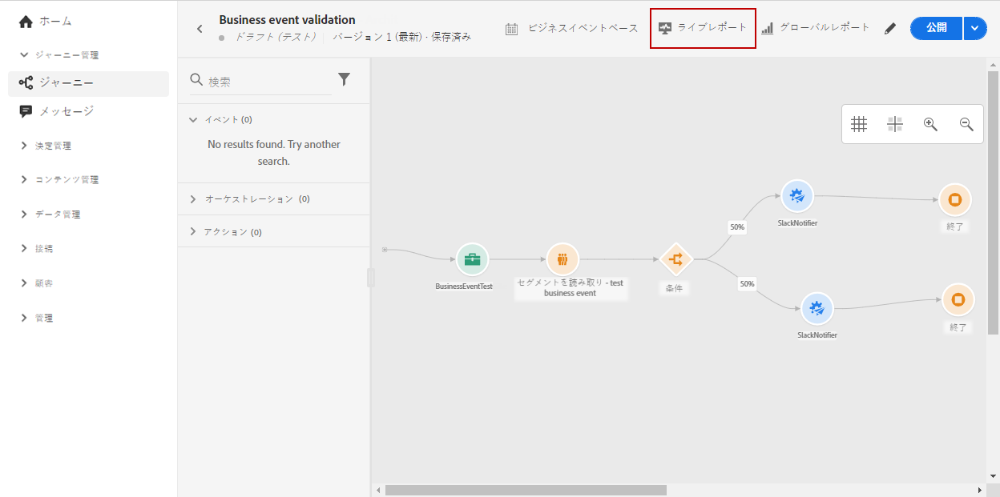
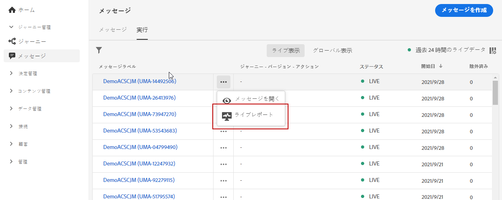
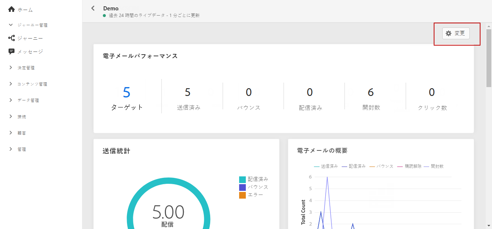
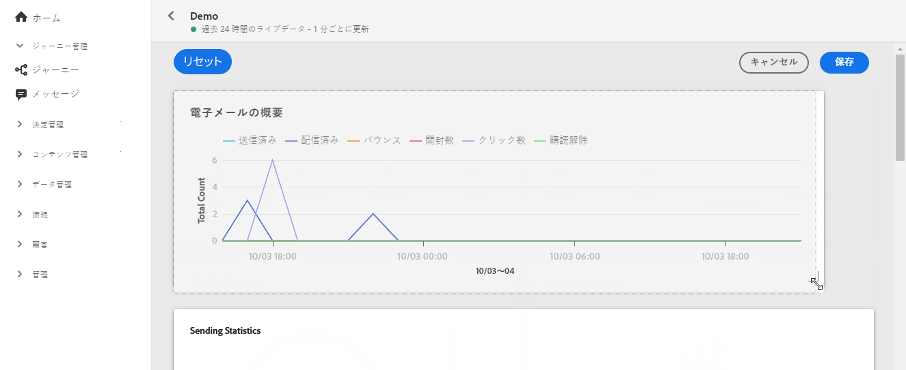
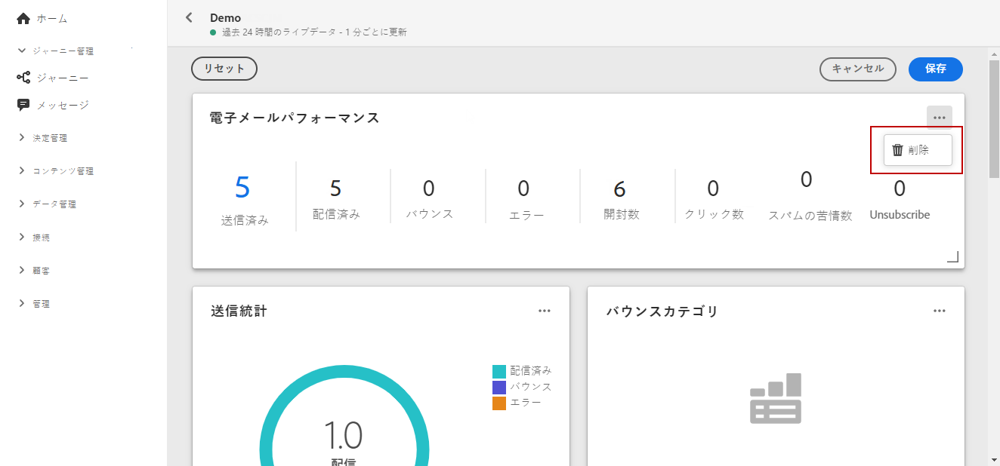

# ライブレポートの概要 {#live-report}

**[!UICONTROL ライブレポート]**&#x200B;を使用し、組み込みのダッシュボードでジャーニーとメッセージの影響とパフォーマンスをリアルタイムで測定および視覚化します。配信が送信されるか、ジャーニーが実行されるとすぐに、**[!UICONTROL ライブレポート]**&#x200B;でデータを入手できます。

* ジャーニーまたはジャーニー内の配信をターゲットする場合は、**[!UICONTROL ジャーニー]**&#x200B;メニューからジャーニーにアクセスし、「**[!UICONTROL ライブレポート]**」アイコンをクリックします。そうすれば、ジャーニー、メールおよびプッシュの各ライブレポートが見つかります。

   

* 特定の配信をターゲットする場合は、メッセージの「**[!UICONTROL 実行]**」タブの&#x200B;**[!UICONTROL ライブ表示]**&#x200B;で、選択した配信の詳細設定メニューから「**[!UICONTROL ライブレポート]**」を選択します。

   

## ダッシュボードのカスタマイズ {#modify-dashboard}

各レポートダッシュボードは、ウィジェットをサイズ変更したり削除したりして変更できます。ウィジェットを変更して影響を受けるのは、現在のユーザーのダッシュボードのみです。他のユーザーには、各自のダッシュボードまたはデフォルトで設定されたダッシュボードが表示されます。

1. ライブレポートで、「**[!UICONTROL 変更]**」をクリックします。

   

1. ウィジェットの右下隅をドラッグして、ウィジェットのサイズを調整します。

   

1. バウンスを追跡する必要のない他のウィジェットを削除するには、「**[!UICONTROL 削除]**」をクリックします。

   

1. ウィジェットの表示順とサイズが定まったら、「**[!UICONTROL 保存]**」をクリックします。

ダッシュボードが保存されました。様々な変更は、後でライブレポートを使用する際にも再度適用されます。必要に応じて、「**[!UICONTROL リセット]**」オプションを使用して、デフォルトのウィジェットとそれらのデフォルト順序に戻します。
