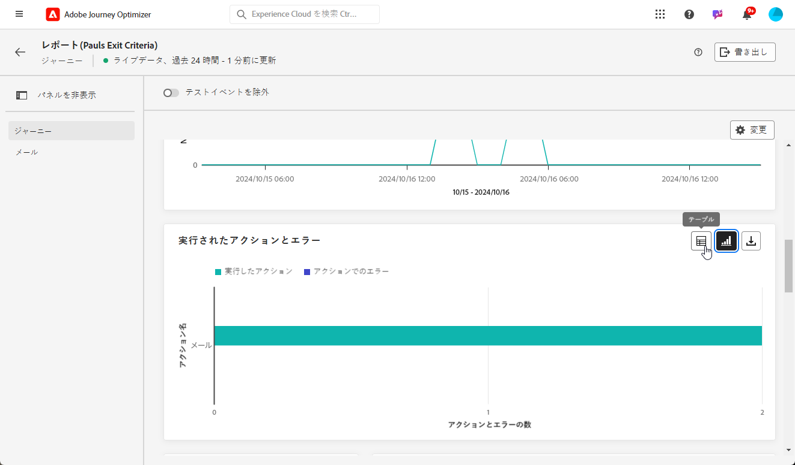
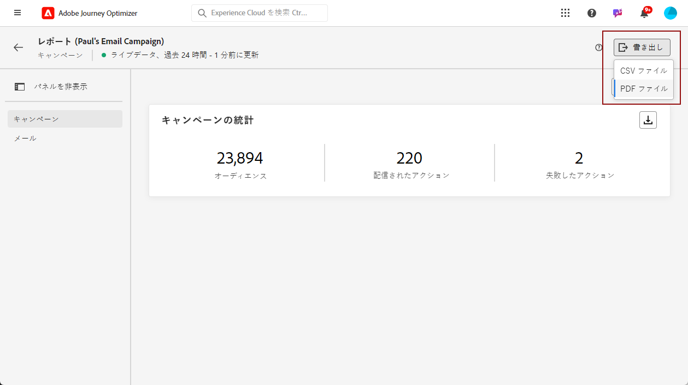
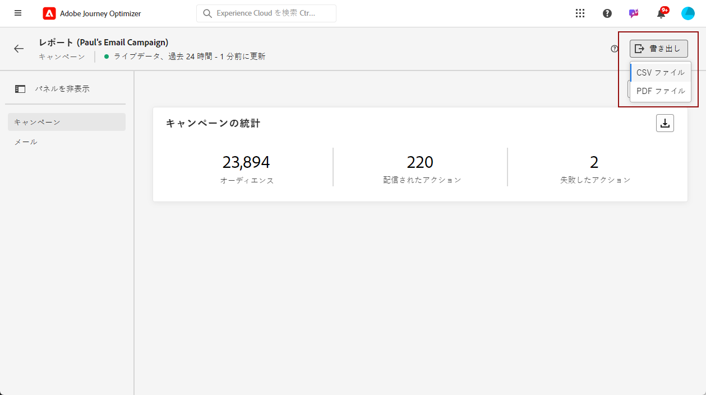
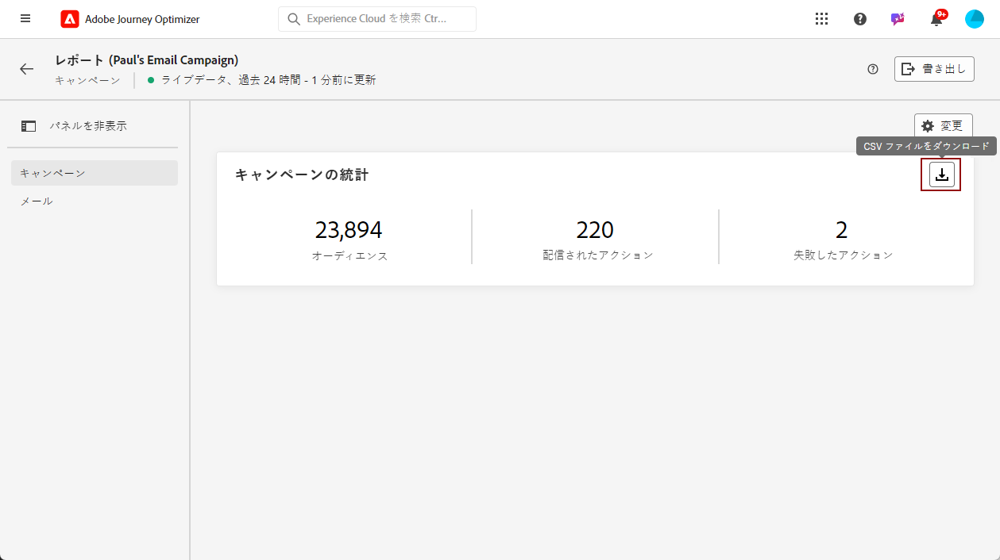

# ライブレポートの概要 {#live-report}

**[!UICONTROL ライブレポート]**を使用し、ビルトインダッシュボードで、ジャーニーとメッセージの影響とパフォーマンスをリアルタイムで測定および視覚化します。
配信が送信されるか、「**[!UICONTROL 過去 24 時間]**」タブからジャーニーが実行されるとすぐに、**[!UICONTROL ライブレポート]**&#x200B;でデータを入手できます。

* ジャーニーのコンテキストでジャーニーをターゲットにする場合は、**[!UICONTROL ジャーニー]**&#x200B;メニューからジャーニーの&#x200B;**[!UICONTROL その他のアクション]**&#x200B;メニューにアクセスし、「**[!UICONTROL 過去 24 時間のレポートを表示]**」ボタンをクリックします。

  

* キャンペーンをターゲットにする場合は、**[!UICONTROL キャンペーン]**&#x200B;メニューからキャンペーンにアクセスし、「**[!UICONTROL レポート]**」ボタン、「**[!UICONTROL 過去 24 時間のレポートを表示]**」の順にクリックします。

  

Adobe Journey Optimizer で使用可能なすべての指標の詳細なリストについては、[このページ](#list-of-components-live)を参照してください。

## ダッシュボードのカスタマイズ {#modify-dashboard}

各レポートダッシュボードは、ウィジェットのサイズ変更や削除を行うことで変更できます。ウィジェットを変更して影響を受けるのは、現在のユーザーのダッシュボードのみです。他のユーザーには、各自のダッシュボードまたはデフォルトで設定されたダッシュボードが表示されます。

1. **[!UICONTROL アクション]**&#x200B;ドロップダウンから、ジャーニーのある特定のアクションについてレポートするかどうかを選択します。

1. 切り替えバーを使用して、レポートからテストイベントを除外する場合に選択します。テストイベントについて詳しくは、[このページ](../building-journeys/testing-the-journey.md)を参照してください。

   「**[!UICONTROL テストイベントの除外]**」オプションは、ジャーニーレポートでしか使用できません。

   

1. ウィジェットのサイズを変更または削除するには、「**[!UICONTROL 変更]**」をクリックします。

   

1. ウィジェットの右下隅をドラッグして、ウィジェットのサイズを調整します。

   

1. 「**[!UICONTROL 削除]**」をクリックして、不要なウィジェットを削除します。

   

1. ウィジェットの表示順とサイズが定まったら、「**[!UICONTROL 保存]**」をクリックします。

1. データの表示方法をカスタマイズするには、グラフ、テーブル、ドーナツグラフなど、様々なビジュアライゼーションオプションから切り替えます。

   

ダッシュボードが保存されました。様々な変更は、後でライブレポートを使用する際にも再度適用されます。必要に応じて、「**[!UICONTROL リセット]**」オプションを使用して、デフォルトのウィジェットとそれらのデフォルト順序に戻します。

## レポートを書き出し {#export-reports}

様々なレポートを PDF 形式または CSV 形式で簡単に書き出して、共有したり印刷したりできます。

>[!BEGINTABS]

>[!TAB PDF ファイルでレポートを書き出し]

1. レポートから、「**[!UICONTROL 書き出し]**」をクリックし、「**[!UICONTROL PDF ファイル]**」を選択します。

   

1. 印刷ウィンドウで必要に応じてドキュメントを設定します。なお、オプションはブラウザーによって異なる場合があります。

1. PDF としてレポートを印刷するか、保存するかを選択します。

1. ファイルを保存するフォルダを探し、必要に応じて名前を変更して「保存」をクリックします。

これで、レポートを PDF ファイルで表示または共有できるようになりました。

>[!TAB CSV ファイルでレポートを書き出し]

1. レポートで、「**[!UICONTROL 書き出し]**」をクリックし、「**[!UICONTROL CSV ファイル]**」を選択して、全体的なレポートレベルで CSV ファイルを生成します。

   

1. 特定のウィジェットからデータを書き出すこともできます。選択したウィジェットの横にある「**[!UICONTROL CSV ファイルをダウンロード]**」をクリックします。

   

1. ファイルが自動的にダウンロードされ、ローカルファイルに配置できます。

   レポートレベルでファイルを生成した場合は、タイトルやデータなど、各ウィジェットの詳細情報がファイルに含まれています。

   ウィジェットレベルでファイルを生成した場合は、特に、選択したウィジェットのデータがファイルに含まれています。

>[!ENDTABS]
