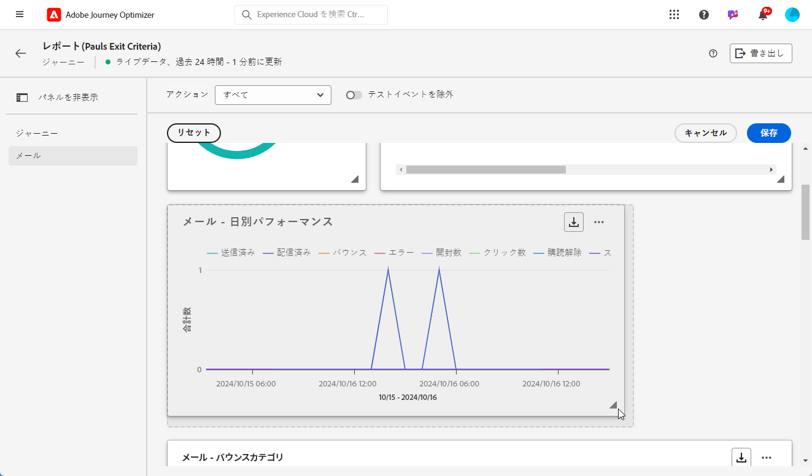

# ライブレポートでの作業の開始 {#live-report}

では、 **[!UICONTROL Live report]** を使用して、journeys とそのメッセージについてのリアルタイムでの影響と効果を、組み込みのダッシュボードで計測し、表示することができます。データは、配信が送信されると同時に、またはタブから **[!UICONTROL Last 24hrs]** 送信が実行されると、 **[!UICONTROL Live report]** すぐに使用可能になります。

* 移動のコンテキストに移動する場合は、メニューから **[!UICONTROL Journeys]** フライトにアクセスし、ボタンをクリック **[!UICONTROL View report]** します。

   

* キャンペーンを対象とする場合は、メニューから **[!UICONTROL Campaigns]** キャンペーンにアクセスし、ボタンをクリック **[!UICONTROL Reports]** します。

   

* から **[!UICONTROL Global report]** **[!UICONTROL Live report]** に切り替える場合は、タブの切り替えをクリック **[!UICONTROL Last 24hrs]** します。

   

アドビシステムズ社のオプティマイザーで利用可能なすべてのメトリックスのリストについては、このページ ](#list-of-components-live) を [ 参照してください。

## ダッシュボードのカスタマイズ {#modify-dashboard}

各レポートダッシュボードは、ウィジェットのサイズ変更や削除によって変更することができます。 変更した widget は、現在のユーザーのダッシュボードに対してのみ適用されます。 他のユーザーには、独自のダッシュボードが表示されるか、デフォルトで設定されたものになります。

1. 切り替えバーを使用して、レポートからテストイベントを除外するかどうかを選択します。 テストイベントについて詳しくは、このページ ](../building-journeys/testing-the-journey.md) を [ 参照してください。

   このオプションは、 **[!UICONTROL Exclude test events]** 旅のレポートにのみ適用されます。

   

1. Widget をサイズ変更または削除するには、をクリック **[!UICONTROL Modify]** します。

   

1. Widget の右下隅をドラッグして、ウィジェットのサイズを調整します。

   

1. クリック **[!UICONTROL Remove]** すると、不要な widget が削除されます。

   

1. 表示順序と widget のサイズに問題がなければ、をクリック **[!UICONTROL Save]** します。

これで、ダッシュボードが保存されます。 ライブレポートを後で使用するために、異なる変更が再適用されます。 必要に応じて、オプションを使用 **[!UICONTROL Reset]** して、初期設定の widget とウィジェットの順序を復元します。

## コンポーネントのリスト {#list-of-components-live}

以下の表では、配信タイプに応じて、レポートとその定義に使用されるメトリックのリストを示します。

### 旅メトリック {#journey-metrics}

<table> 
 <thead> 
  <tr> 
   <th> 指標  </th> 
   <th> 精細  </th> 
</tr>
 </thead> 
 <tbody> 
  <tr> 
   <td>正常に実行された操作  </td> 
   <td> 1つのフライト中に正常に実行された操作の合計数。  </td> 
</tr> 
  <tr> 
   <td> 入力されたプロファイル  </td> 
   <td> この旅の入場イベントに達した人物の総数です。  </td> 
</tr>
  <tr> 
   <td> アクションでエラーが発生します。  </td> 
   <td>アクションについて発生したエラーの合計数。  </td> 
</tr> 
  <tr> 
   <td> 終了したプロファイル  </td> 
   <td> 旅に出た人物の合計数です。  </td> 
</tr> 
  <tr> 
   <td> 個々の旅に失敗  </td> 
   <td> 正常に実行されなかった個々の journeys の合計数。  </td> 
</tr> 
 </tbody> 
</table>

### 電子メールと SMS メトリック {#email-and-sms-metrics}

<table> 
 <thead> 
  <tr> 
   <th> 指標  </th> 
   <th> 精細  </th> 
</tr>
 </thead> 
 <tbody>
  <tr> 
   <td> バウンス  </td> 
   <td> 配信中に発生したエラーの合計数が累積され、戻り処理は自動的に実行されます。  </td> 
</tr> 
  <tr> 
   <td> バウンスレート  </td> 
   <td> 送信された電子メールのうち、送信された電子メールのパーセンテージです。  </td> 
</tr>
  <tr> 
   <td> が  </td> 
   <td> 電子メールのコンテンツがクリックされた回数です。  </td> 
</tr> 
  <tr> 
   <td> 有益   </td> 
   <td> 正常に送信されたメッセージの数を指定します。 </td> 
</tr> 
  <tr> 
   <td> 配信レート  </td> 
   <td> 送信が成功したメッセージの割合。  </td> 
</tr>
  <tr> 
   <td> 誤り  </td> 
   <td> 配布中に発生したエラーのうち、プロファイルに送信されていないエラーの合計数です。  </td> 
</tr> 
  <tr> 
   <td> エラーレート  </td> 
   <td> 配信中に発生したエラーのうち、送信された電子メールと比較して送信されたものを防ぐことができます。  </td> 
</tr>
  <tr> 
   <td> 対象  </td> 
   <td> Adobe の旅オプティマイザーによって除外されたプロファイルの数です。  </td> 
</tr>
  <tr> 
   <td> ハードバウンス  </td> 
   <td> 電子メールアドレスが間違っているなどの永続的なエラーの合計数です。 これには、不明なユーザーなど、アドレスが無効であることを示すエラーメッセージが表示されます。  </td>
</tr>
  <tr> 
   <td> れる  </td> 
   <td> 不在時のような一時的な合計数、または送信者の種類がポストマスターである場合などの技術的なエラー。  </td> 
</tr>
   <tr> 
   <td>クリックレートを提供  </td> 
   <td>このオファーを使用して相互に連携した場合のユーザー数。  </td> 
</tr>
   <tr> 
   <td>インプレッションレートの提供  </td> 
   <td>「送信されたキャンペーンの数」と比較した場合の、オープンな割引率。  </td> 
</tr>
   <tr> 
   <td>オファー名  </td> 
   <td> 出荷に追加された申し出の名前。 配置について詳しくは、この <a href="../offers/offer-library/creating-personalized-offers.md"> ページ </a> を参照してください。  </td> 
</tr>
   <tr> 
   <td>送信された申し出  </td> 
   <td>申し出の合計数。  </td> 
</tr> 
  <tr>
   <td>開い  </td> 
   <td> メッセージが開かれた回数を指定します。  </td> 
</tr> 
  <tr> 
   <td> オープンレート  </td> 
   <td> 配信された電子メールの数と比較して開かれた電子メールの合計数。  </td> 
</tr>
  <tr> 
   <td>配置名  </td> 
   <td> 申し出を表示するために使用した位置の名前を指定します。 配置について詳しくは、この <a href="../offers/offer-library/creating-placements.md"> ページ </a> を参照してください。 </td> 
</tr> 
  <tr> 
   <td> 再送  </td> 
   <td> 再生待ちのキューにある電子メールの数です。  </td> 
</tr> 
  <tr> 
   <td> 送り  </td> 
   <td> 配信に使用された送信の合計数です。  </td> 
</tr>
  <tr> 
   <td> ソフトバウンス  </td> 
   <td> 完全な受信ボックスなど、一時的なエラーの合計数です。  </td> 
</tr>
  <tr> 
   <td> スパムの苦情  </td> 
   <td> メッセージがスパムまたは迷惑メールとして宣言された回数を指定します。  </td> 
</tr>
  <tr> 
   <td> 絞り  </td> 
   <td> 配信分析中に処理されたメッセージの合計数。  </td> 
</tr> 
  <tr> 
   <td> ユニークなクリック回数  </td> 
   <td> 電子メールのコンテンツをクリックした受取人の数です。  </td> 
</tr> 
  <tr> 
   <td>一意のクリックレート  </td> 
   <td> 配信によって対話したユーザーの数です。  </td> 
</tr>
  <tr> 
   <td> 一意の開き  </td> 
   <td>配信を開いた受信者の数です。  </td> 
</tr> 
  <tr> 
   <td> 非定期購入  </td> 
   <td> Unsubscription リンクのクリック回数  </td> 
</tr> 
 </tbody> 
</table>

### ランディングページのメトリックス {#landing-page-metrics}

<table> 
 <thead> 
  <tr> 
   <th> 指標  </th> 
   <th> 精細  </th> 
</tr>
 </thead> 
 <tbody>
 <tr> 
  <td>バウンス  </td> 
   <td>着陸ページを操作せず、購読の操作を完了していない人物の人数  </td> 
</tr>
 <tr>
  <tr> 
   <td>が  </td> 
   <td>コンテンツがクリックされたときのランディングページの回数です。  </td> 
</tr>
<tr>
<td>処理  </td> 
   <td>ランディングページを使用して相互に連携していた人数 (例: フォームの購読)  </td> 
</tr>
 <tr> 
   <td>旅  </td> 
   <td>1つの旅に出たジャンプページへの訪問数です。  </td> 
</tr>
 <tr> 
   <td>その他のソース  </td> 
   <td>外部ソースから読み込まれたランディングページにジャンプするのではなく、ジャンプページへの訪問数を指定します。  </td> 
</tr>
 <tr> 
   <td>合計訪問数  </td> 
   <td> Journeys および外部ソースから読み込まれたランディングページへの訪問数の合計です。1つの受信者の複数の訪問が含まれています。  </td> 
</tr>
 <tr> 
   <td>ユニークビジター  </td> 
   <td>待ち受けページを訪問した人物は、1人の受信者に複数回訪問することは考慮されません。  </td> 
</tr>
 <tr> 
   <td>同  </td> 
   <td>1つの受信者に複数の訪問がある場合を含め、ジャンプページへの訪問数です。  </td> 
</tr>
 </tbody> 
</table>

### プッシュ通知メトリック {#push-notification-metrics}

<table> 
 <thead> 
  <tr> 
   <th> 指標  </th> 
   <th> 精細  </th> 
</tr>
 </thead> 
 <tbody>
 <tr> 
   <td>活動  </td> 
   <td> プッシュ通知で配信されたアクションの合計数 (例: ボタンクリック dismissal)。  </td> 
</tr>
  <tr> 
   <td>バウンス  </td> 
   <td> 配信中に発生したエラーの合計数が累積され、戻り処理は自動的に実行されます。  </td> 
</tr> 
  <tr> 
   <td> 有益  </td> 
   <td> 正常に送信されたメッセージの数を指定します。  </td> 
</tr> 
  <tr> 
   <td>幅広く  </td> 
   <td> このプッシュ通知のオープン数とアクション数の合計。つまり、プロファイルがプッシュを開いたか、ボタンがクリックされた場合に表示されます。  </td> 
</tr> 
  <tr> 
   <td> 誤り  </td> 
   <td> 配布中に発生したエラーのうち、プロファイルに送信されていないエラーの合計数です。  </td> 
</tr>
  <tr> 
   <td> 対象  </td> 
   <td> Adobe の旅オプティマイザーによって除外されたプロファイルの数です。  </td> 
</tr>
  <tr> 
   <td> 開い  </td> 
   <td> デバイスに配信され、ユーザーによって選択されたプッシュ通知の合計数です。これにより、アプリケーションが開かれます。 これは、通知が閉じられたときにプッシュが実行されることはありませんが、プッシュクリックと似ています。  </td> 
</tr> 
  <tr> 
   <td> 送り  </td> 
   <td> 配信に使用された送信の合計数です。  </td> 
</tr> 
  <tr> 
   <td> 絞り  </td> 
   <td> 配信分析中に処理されたプッシュメッセージ数の合計です。  </td> 
</tr>  
 </tbody> 
</table>

<!--
### In-app metrics {#inapp-metrics}
<table> 
 <thead> 
  <tr> 
   <th> Metric  </th> 
   <th> Definition  </th> 
</tr>
 </thead> 
 <tbody>
 <tr> 
   <td>Clicks  </td> 
   <td>Total number of recipients who interacted with the buttons included in the In-app message.  </td> 
</tr>
  <tr> 
   <td>Impressions  </td> 
   <td> Total number of In-app messages delivered to all users.  </td>
</tr>
  <tr> 
   <td>Unique impressions  </td> 
   <td>Number of unique users to whom the In-app message was delivered.  </td>
</tr>
 </tbody> 
</table>
-->