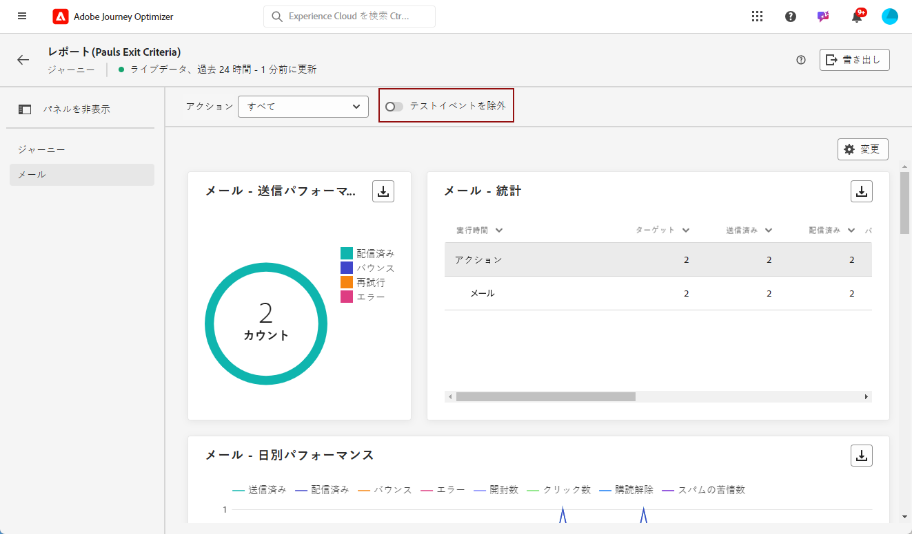
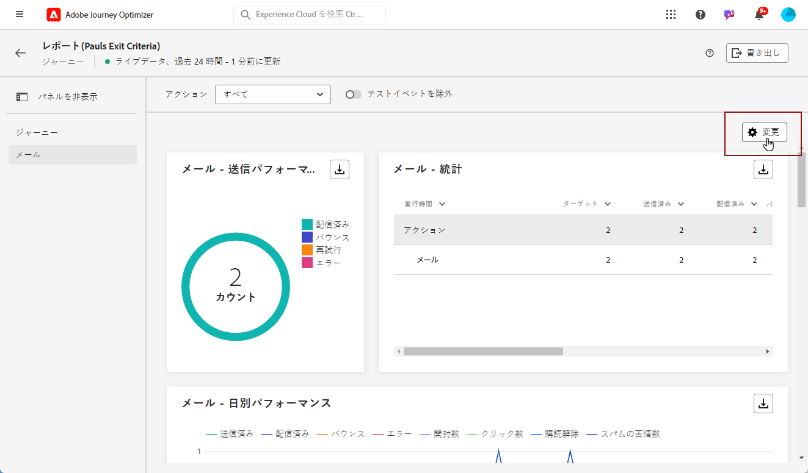

# ライブレポートの概要 {#live-report}

**[!UICONTROL ライブレポート]**&#x200B;を使用し、ビルトインダッシュボードで、ジャーニーとメッセージの影響とパフォーマンスをリアルタイムで測定および視覚化します。配信が送信されるか、「**[!UICONTROL 過去 24 時間]**」タブからジャーニーが実行されるとすぐに、**[!UICONTROL ライブレポート]**&#x200B;でデータを入手できます。

* ジャーニーのコンテキストでジャーニーをターゲットにする場合は、**[!UICONTROL ジャーニー]**&#x200B;メニューからジャーニーにアクセスし、「**[!UICONTROL レポートを表示]**」ボタンをクリックします。

   

* キャンペーンをターゲットにする場合は、**[!UICONTROL キャンペーン]**&#x200B;メニューからキャンペーンにアクセスし、「**[!UICONTROL レポート]**」ボタンをクリックします。

   

* 配信を&#x200B;**[!UICONTROL グローバルレポート]**&#x200B;から&#x200B;**[!UICONTROL ライブレポート]**&#x200B;に切り替える場合は、タブ切り替えボタンで「**[!UICONTROL 過去 24 時間]**」をクリックします。

   

Adobe Journey Optimizer で使用可能なすべての指標の詳細なリストについては、[このページ](#list-of-components-live)を参照してください。

## ダッシュボードのカスタマイズ {#modify-dashboard}

各レポートダッシュボードは、ウィジェットをサイズ変更したり削除したりして変更できます。ウィジェットを変更して影響を受けるのは、現在のユーザーのダッシュボードのみです。他のユーザーには、各自のダッシュボードまたはデフォルトで設定されたダッシュボードが表示されます。

1. 切り替えバーを使用して、レポートからテストイベントを除外する場合に選択します。テストイベントについて詳しくは、[このページ](../building-journeys/testing-the-journey.md)を参照してください。

   「**[!UICONTROL テストイベントの除外]**」オプションは、ジャーニーレポートでしか使用できません。

   

1. ウィジェットのサイズを変更または削除するには、「**[!UICONTROL 変更]**」をクリックします。

   

1. ウィジェットの右下隅をドラッグして、ウィジェットのサイズを調整します。

   

1. 「**[!UICONTROL 削除]**」をクリックして、不要なウィジェットを削除します。

   

1. ウィジェットの表示順とサイズが定まったら、「**[!UICONTROL 保存]**」をクリックします。

ダッシュボードが保存されました。様々な変更は、後でライブレポートを使用する際にも再度適用されます。必要に応じて、「**[!UICONTROL リセット]**」オプションを使用して、デフォルトのウィジェットとそれらのデフォルト順序に戻します。

## コンポーネントのリスト {#list-of-components-live}

次の表に、レポートで使用される指標のリストと、配信タイプに応じた定義を示します。

### ジャーニー指標 {#journey-metrics}

<table> 
 <thead> 
  <tr> 
   <th> 指標  </th> 
   <th> 定義  </th> 
</tr>
 </thead> 
 <tbody> 
  <tr> 
   <td>正常に実行されたアクション  </td> 
   <td> ジャーニーで正常に実行されたアクションの合計数。  </td> 
</tr> 
  <tr> 
   <td> エントリしたプロファイル  </td> 
   <td> ジャーニーのエントリイベントに到達した個人の合計数。  </td> 
</tr>
  <tr> 
   <td> アクションのエラー  </td> 
   <td>アクションで発生したエラーの合計数。  </td> 
</tr> 
  <tr> 
   <td> 退出したプロファイル  </td> 
   <td> ジャーニーから退出した個人の合計数。  </td> 
</tr> 
  <tr> 
   <td> 失敗した個人のジャーニー  </td> 
   <td> 正常に実行されなかった個人のジャーニーの合計数。  </td> 
</tr> 
 </tbody> 
</table>

### メールと SMS の指標 {#email-and-sms-metrics}

<table> 
 <thead> 
  <tr> 
   <th> 指標  </th> 
   <th> 定義  </th> 
</tr>
 </thead> 
 <tbody>
  <tr> 
   <td> バウンス  </td> 
   <td> 配信中および自動返信処理中のエラーの累計。  </td> 
</tr> 
  <tr> 
   <td> バウンス率  </td> 
   <td> 送信メールに対するバウンスメールの割合。  </td> 
</tr>
  <tr> 
   <td> クリック数  </td> 
   <td> メールのコンテンツがクリックされた回数。  </td> 
</tr> 
  <tr> 
   <td> 配信済み   </td> 
   <td> 正常に送信されたメッセージ数。 </td> 
</tr> 
  <tr> 
   <td> 配信率  </td> 
   <td> 正常に送信されたメッセージの割合。  </td> 
</tr>
  <tr> 
   <td> エラー  </td> 
   <td> 配信中に発生し、プロファイルに送信できなかったエラーの合計数。  </td> 
</tr> 
  <tr> 
   <td> エラー率  </td> 
   <td> 送信されたメールに対して、配信中にエラーが発生して送信できなかったメールの割合。  </td> 
</tr>
  <tr> 
   <td> 除外済み  </td> 
   <td> Adobe Journey Optimizer によって除外されたプロファイルの数。  </td> 
</tr>
  <tr> 
   <td> ハードバウンス  </td> 
   <td> 永続的なエラー（メールアドレスの間違いなど）の合計数。このエラーは、アドレスが無効であることを明示的に示すエラーメッセージ（例：「不明なユーザー」）を伴います。  </td>
</tr>
  <tr> 
   <td> 無視  </td> 
   <td> 一時的なエラー（不在など）や技術的なエラー（送信者のタイプが postmaster の場合など）の合計数。  </td> 
</tr>
   <tr> 
   <td>オファークリック率  </td> 
   <td>オファーに対してインタラクションを行ったユーザーの割合。  </td> 
</tr>
   <tr> 
   <td>オファーのインプレッション率  </td> 
   <td>送信されたオファーの数に対する、開封されたオファーの割合。  </td> 
</tr>
   <tr> 
   <td>オファー名  </td> 
   <td> 配信に追加されたオファーの名前。プレースメントについて詳しくは、この<a href="../offers/offer-library/creating-personalized-offers.md">ページ</a>を参照してください。  </td> 
</tr>
   <tr> 
   <td>送信されたオファー  </td> 
   <td>オファーの送信の総数。  </td> 
</tr> 
  <tr>
   <td>開封数  </td> 
   <td> メッセージが開封された回数。  </td> 
</tr> 
  <tr> 
   <td> 開封率  </td> 
   <td> 配信されたメール数に対する、開封されたメールの総数の割合。  </td> 
</tr>
  <tr> 
   <td>プレースメント名  </td> 
   <td> オファーの表示に使用するプレースメントの名前。プレースメントについて詳しくは、この<a href="../offers/offer-library/creating-placements.md">ページ</a>を参照してください。 </td> 
</tr> 
  <tr> 
   <td> 再試行  </td> 
   <td> 再試行のキュー内のメール数。  </td> 
</tr> 
  <tr> 
   <td> 送信済み  </td> 
   <td> 配信の送信の合計数。  </td> 
</tr>
  <tr> 
   <td> ソフトバウンス  </td> 
   <td> 一時的なエラー（インボックスがいっぱいであるなど）の合計数。  </td> 
</tr>
  <tr> 
   <td> スパムの苦情数  </td> 
   <td> メッセージがスパムまたはジャンクとして宣言された回数。  </td> 
</tr>
  <tr> 
   <td> ターゲット  </td> 
   <td> 配信の分析中に処理されたメッセージの合計数。  </td> 
</tr> 
  <tr> 
   <td> ユニーククリック数  </td> 
   <td> メールのコンテンツをクリックした受信者の数。  </td> 
</tr> 
  <tr> 
   <td>ユニーククリック率  </td> 
   <td> 配信とインタラクションを行ったユーザーの割合。  </td> 
</tr>
  <tr> 
   <td> ユニーク開封数  </td> 
   <td>配信を開いた受信者の数。  </td> 
</tr> 
  <tr> 
   <td> 購読解除  </td> 
   <td> 購読解除リンクのクリック数。  </td> 
</tr> 
 </tbody> 
</table>

### ランディングページの指標 {#landing-page-metrics}

<table> 
 <thead> 
  <tr> 
   <th> 指標  </th> 
   <th> 定義  </th> 
</tr>
 </thead> 
 <tbody>
 <tr> 
  <td>バウンス  </td> 
   <td>ランディングページでインタラクションを行わず、購読のアクションを完了しなかったユーザーの数。  </td> 
</tr>
 <tr> 
   <td>バウンス率  </td> 
   <td>ランディングページでインタラクションを行わず、購読のアクションを完了しなかったユーザーの数。  </td> 
</tr>
 <tr>
  <tr> 
   <td>クリック数  </td> 
   <td>ランディングページでコンテンツがクリックされた回数。  </td> 
</tr>
 <tr> 
   <td>クリック率  </td> 
   <td>ランディングページでのクリック率。  </td>
</tr>
<tr>
<td>コンバージョン  </td> 
   <td>ランディングページでインタラクション（フォームの購読など）を行ったユーザーの数。  </td> 
</tr>
<tr>
   <td>コンバージョン率  </td> 
   <td>ランディングページでインタラクション（フォームの購読など）を行ったユーザーの数。  </td> 
</tr>
 <tr> 
   <td>ジャーニー  </td> 
   <td>ジャーニーからのランディングページへの訪問回数。  </td> 
</tr>
 <tr> 
   <td>その他のソース  </td> 
   <td>ジャーニーではなく外部ソースからのランディングページへの訪問回数。  </td> 
</tr>
 <tr> 
   <td>合計訪問回数  </td> 
   <td> ジャーニーまたは外部ソースからのランディングページに訪問した合計回数（1 人の受信者が複数回訪問した場合を含みます）。  </td> 
</tr>
 <tr> 
   <td>ユニーク訪問者  </td> 
   <td>ランディングページを訪問した人数。1 人の受信者が複数回訪問しても、それは考慮されません。  </td> 
</tr>
 <tr> 
   <td>訪問回数  </td> 
   <td>ランディングページへの訪問回数（1 人の受信者による複数回の訪問を含みます）。  </td> 
</tr>
 </tbody> 
</table>

