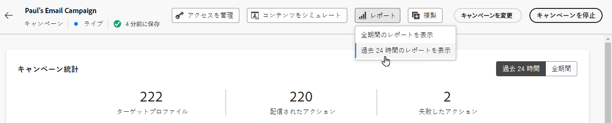
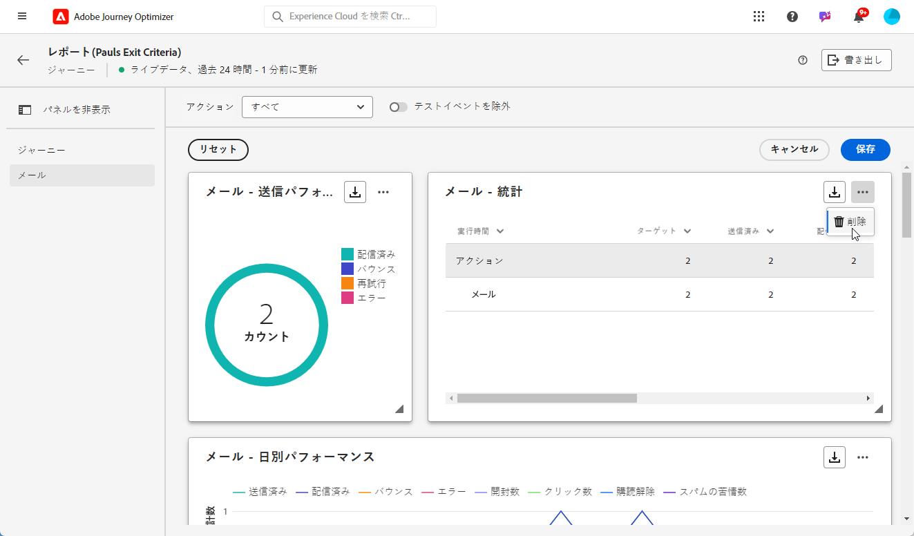

# ライブレポートの概要 {#live-report}

**[!UICONTROL ライブレポート]**&#x200B;を使用し、ビルトインダッシュボードで、ジャーニーとメッセージの影響とパフォーマンスをリアルタイムで測定および視覚化します。データは **[!UICONTROL ライブレポート]** 配信が送信されるとすぐ、またはジャーニーが **[!UICONTROL 過去 24 時間]** タブをクリックします。

* ジャーニーのコンテキストでジャーニーのターゲットを設定する場合は、 **[!UICONTROL ジャーニー]** メニューで、ジャーニーにアクセスして、 **[!UICONTROL レポートを表示]** 」ボタンをクリックします。

   

* キャンペーンのターゲットを設定する場合は、 **[!UICONTROL キャンペーン]** メニューからキャンペーンにアクセスし、 **[!UICONTROL レポート]** 」ボタンをクリックします。

   

* を **[!UICONTROL グローバルレポート]** から **[!UICONTROL ライブレポート]** 配信の場合は、「 **[!UICONTROL 過去 24 時間]** 」をクリックします。

   

Adobe Journey Optimizerで使用可能なすべての指標の詳細なリストについては、 [このページ](#list-of-components-live).

## ダッシュボードのカスタマイズ {#modify-dashboard}

各レポートダッシュボードは、ウィジェットをサイズ変更したり削除したりして変更できます。ウィジェットを変更して影響を受けるのは、現在のユーザーのダッシュボードのみです。他のユーザーには、各自のダッシュボードまたはデフォルトで設定されたダッシュボードが表示されます。

1. 切り替えバーを使用して、レポートからテストイベントを除外する場合に選択します。テストイベントについて詳しくは、[このページ](../building-journeys/testing-the-journey.md)を参照してください。

   「**[!UICONTROL テストイベントの除外]**」オプションは、ジャーニーレポートでしか使用できません。

   

1. ウィジェットのサイズを変更または削除するには、「**[!UICONTROL 変更]**」をクリックします。

   

1. ウィジェットの右下隅をドラッグして、ウィジェットのサイズを調整します。

   

1. 「**[!UICONTROL 削除]**」をクリックして、不要なウィジェットを削除します。

   

1. ウィジェットの表示順とサイズが定まったら、「**[!UICONTROL 保存]**」をクリックします。

ダッシュボードが保存されました。様々な変更は、後でライブレポートを使用する際にも再度適用されます。必要に応じて、「**[!UICONTROL リセット]**」オプションを使用して、デフォルトのウィジェットとそれらのデフォルト順序に戻します。

## コンポーネントのリスト {#list-of-components-live}

次の表に、レポートで使用される指標のリストと、配信タイプに応じた定義を示します。

### ジャーニー指標 {#journey-metrics}

<table> 
 <thead> 
  <tr> 
   <th> 指標  </th> 
   <th> 定義  </th> 
</tr>
 </thead> 
 <tbody> 
  <tr> 
   <td>アクションが正常に実行されました  </td> 
   <td> ジャーニーで正常に実行されたアクションの合計数。  </td> 
</tr> 
  <tr> 
   <td> 入力されたプロファイル  </td> 
   <td> ジャーニーのエントリイベントに到達した個人の合計数。  </td> 
</tr>
  <tr> 
   <td> アクションのエラー  </td> 
   <td>アクションで発生したエラーの合計数。  </td> 
</tr> 
  <tr> 
   <td> 離脱したプロファイル  </td> 
   <td> ジャーニーを離脱した個人の合計数。  </td> 
</tr> 
  <tr> 
   <td> 失敗した個々のジャーニー  </td> 
   <td> 正常に実行されなかった個々のジャーニーの合計数。  </td> 
</tr> 
 </tbody> 
</table>

### E メールと SMS 指標 {#email-and-sms-metrics}

<table> 
 <thead> 
  <tr> 
   <th> 指標  </th> 
   <th> 定義  </th> 
</tr>
 </thead> 
 <tbody>
  <tr> 
   <td> バウンス  </td> 
   <td> 配信と自動返品処理の間に累積したエラーの合計。  </td> 
</tr> 
  <tr> 
   <td> バウンス率  </td> 
   <td> 送信された E メールに対する、バウンスした E メールの割合。  </td> 
</tr>
  <tr> 
   <td> クリック数  </td> 
   <td> E メールでコンテンツがクリックされた回数。  </td> 
</tr> 
  <tr> 
   <td> 配信済み   </td> 
   <td> 正常に送信されたメッセージ数。 </td> 
</tr> 
  <tr> 
   <td> 配信率  </td> 
   <td> 正常に送信されたメッセージの割合。  </td> 
</tr>
  <tr> 
   <td> エラー  </td> 
   <td> 配信中に発生し、プロファイルに送信できなかったエラーの合計数。  </td> 
</tr> 
  <tr> 
   <td> エラー率  </td> 
   <td> 配信中に発生し、送信された E メールと比較して、送信できなかったエラーの割合。  </td> 
</tr>
  <tr> 
   <td> 除外済み  </td> 
   <td> Adobe Journey Optimizerによって除外されたプロファイルの数。  </td> 
</tr>
  <tr> 
   <td> ハードバウンス  </td> 
   <td> 誤った E メールアドレスなどの永続的なエラーの合計数。 このエラーは、アドレスが無効であることを明示的に示すエラーメッセージ（例：「不明なユーザー」）を伴います。  </td>
</tr>
  <tr> 
   <td> 無視  </td> 
   <td> 一時的な（不在など）または技術的なエラー（送信者のタイプが postmaster の場合など）の合計数。  </td> 
</tr>
   <tr> 
   <td>オファークリック率  </td> 
   <td>オファーでインタラクションをおこなったユーザーの割合。  </td> 
</tr>
   <tr> 
   <td>オファーインプレッション率  </td> 
   <td>送信されたオファーの数に対する、開封されたオファーの割合。  </td> 
</tr>
   <tr> 
   <td>オファー名  </td> 
   <td> 配信に追加されたオファーの名前。 プレースメントについて詳しくは、この<a href="../offers/offer-library/creating-personalized-offers.md">ページ</a>を参照してください。  </td> 
</tr>
   <tr> 
   <td>送信されたオファー  </td> 
   <td>オファーの送信の合計数。  </td> 
</tr> 
  <tr>
   <td>開封数  </td> 
   <td> メッセージが開かれた回数。  </td> 
</tr> 
  <tr> 
   <td> 開封率  </td> 
   <td> 配信された E メールの数に対する、開封された E メールの合計数。  </td> 
</tr>
  <tr> 
   <td>プレースメント名  </td> 
   <td> オファーの表示に使用する配置の名前。 プレースメントについて詳しくは、この<a href="../offers/offer-library/creating-placements.md">ページ</a>を参照してください。 </td> 
</tr> 
  <tr> 
   <td> 再試行  </td> 
   <td> 再試行のキュー内の電子メール数。  </td> 
</tr> 
  <tr> 
   <td> 送信済み  </td> 
   <td> 配信の送信の合計数。  </td> 
</tr>
  <tr> 
   <td> ソフトバウンス  </td> 
   <td> 一時的なエラーの合計数（メールボックス容量超過など）。  </td> 
</tr>
  <tr> 
   <td> スパム通報  </td> 
   <td> メッセージがスパムまたは迷惑メールとして宣言された回数。  </td> 
</tr>
  <tr> 
   <td> ターゲット  </td> 
   <td> 配信の分析中に処理されたメッセージの合計数。  </td> 
</tr> 
  <tr> 
   <td> ユニーククリック  </td> 
   <td> E メールのコンテンツをクリックした受信者の数。  </td> 
</tr> 
  <tr> 
   <td>ユニーククリック率  </td> 
   <td> 配信で操作したユーザーの割合。  </td> 
</tr>
  <tr> 
   <td> ユニーク開封  </td> 
   <td>配信を開封した受信者の数。  </td> 
</tr> 
  <tr> 
   <td> 購読解除  </td> 
   <td> 購読解除リンクのクリック数。  </td> 
</tr> 
 </tbody> 
</table>

### ランディングページ指標 {#landing-page-metrics}

<table> 
 <thead> 
  <tr> 
   <th> 指標  </th> 
   <th> 定義  </th> 
</tr>
 </thead> 
 <tbody>
 <tr> 
  <td>バウンス  </td> 
   <td>ランディングページとやり取りせず、購読のアクションを完了していない人の数。  </td> 
</tr>
 <tr> 
   <td>バウンス率  </td> 
   <td>ランディングページとやり取りせず、購読のアクションを完了していない人の数。  </td> 
</tr>
 <tr>
  <tr> 
   <td>クリック数  </td> 
   <td>ランディングページでコンテンツがクリックされた回数。  </td> 
</tr>
 <tr> 
   <td>クリック率  </td> 
   <td>ランディングページでのクリック率。  </td>
</tr>
<tr>
<td>コンバージョン  </td> 
   <td>ランディングページでインタラクションを起こしたユーザーの数（フォームの購読など）。  </td> 
</tr>
<tr>
   <td>コンバージョン率  </td> 
   <td>ランディングページでインタラクションを起こしたユーザーの数（フォームの購読など）。  </td> 
</tr>
 <tr> 
   <td>ジャーニー  </td> 
   <td>ジャーニーからのランディングページへの訪問数。  </td> 
</tr>
 <tr> 
   <td>その他のソース  </td> 
   <td>ジャーニーではなく外部ソースからのランディングページへの訪問数。  </td> 
</tr>
 <tr> 
   <td>合計訪問回数  </td> 
   <td> 1 人の受信者の複数回の訪問を含む、ジャーニーおよび外部ソースからのランディングページへの訪問の合計数。  </td> 
</tr>
 <tr> 
   <td>ユニーク訪問者  </td> 
   <td>ランディングページを訪問した人の数。1 人の受信者の複数回の訪問は考慮されません。  </td> 
</tr>
 <tr> 
   <td>訪問回数  </td> 
   <td>1 人の受信者の複数回の訪問を含む、ランディングページへの訪問数。  </td> 
</tr>
 </tbody> 
</table>

