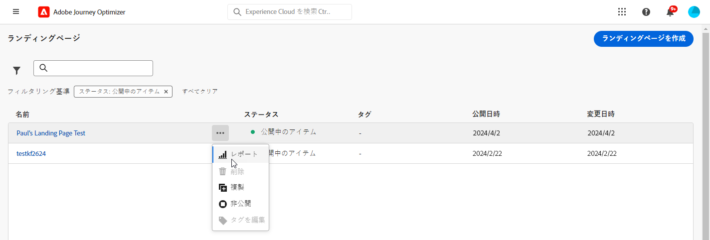
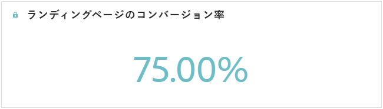
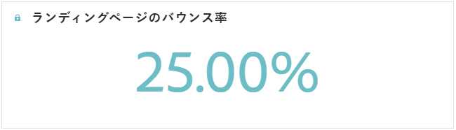
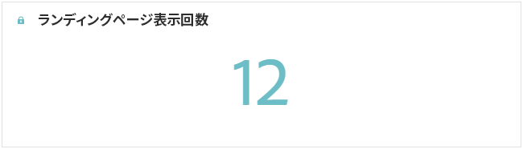
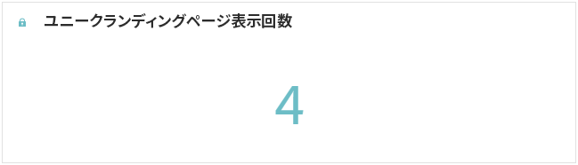
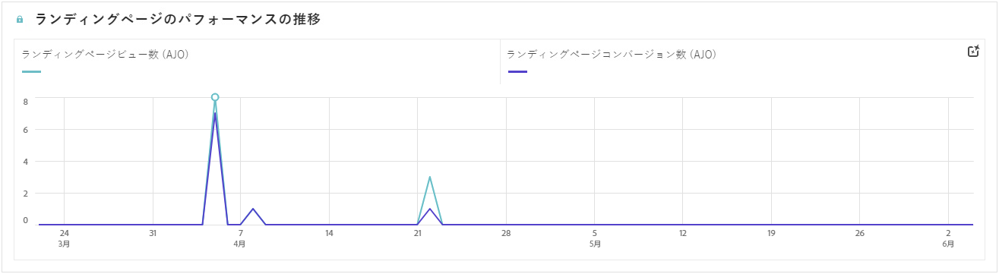
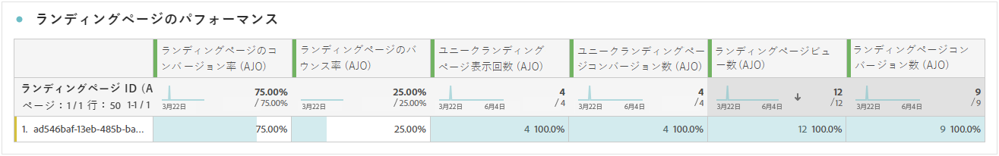

# ランディングページのレポート {#lp-report-global-cja}

**ランディングページ**&#x200B;のレポートでは、ユーザーの行動、エンゲージメントパターン、コンバージョン率、その他の主要指標に関する貴重なインサイトが提供され、情報に基づいた意思決定を行い、ランディングページのパフォーマンスを効果的に最適化できます。

レポートにアクセスするには、選択したランディングページの詳細メニューから「**[!UICONTROL レポート]**」を選択します。

Customer Journey Analytics ワークスペースの詳細と、データのフィルタリングおよび分析方法については、[このページ](https://experienceleague.adobe.com/ja/docs/analytics-platform/using/cja-workspace/home)を参照してください。

## ランディングページのコンバージョン率 {#lp-conversion}

**[!UICONTROL ランディングページのコンバージョン率]**&#x200B;の KPI を使用すると、訪問数とインタラクション数に基づいてランディングページの効果を評価できます。

* **[!UICONTROL ランディングページのコンバージョン率]**：訪問の合計回数に対する、ランディングページで何らかのインタラクション（フォームの購読など）を行ったユーザー数の割合。

## ランディングページのバウンス率 {#lp-bounce-rate}

**[!UICONTROL ランディングページのバウンス率]**&#x200B;の KPI では、要素を操作したりクリックしたりせずに、ランディングページを表示したプロファイルに関する情報を提供します。

* **[!UICONTROL ランディングページのバウンス率]**：訪問の合計回数に対する、ランディングページでインタラクションを起こさず、購読のアクションを完了していない人数の割合。

## ランディングページの表示回数 {#lp-views}

**[!UICONTROL ランディングページの表示回数]**&#x200B;の KPI を使用すると、ランディングページの影響を確認できます。

* **[!UICONTROL ランディングページの表示回数]**：ジャーニーや外部ソースからユーザーがランディングページを訪問した合計回数（1 つのプロファイルによる複数回の訪問を含む）。

## ユニークランディングページの表示回数 {#lp-unique-views}

**[!UICONTROL ユニークランディングページの表示回数]**&#x200B;の KPI を使用すると、同じプロファイルによる複数回の表示を除外することで、ランディングページの影響を測定できます。

* **[!UICONTROL ユニークランディングページの表示回数]**：ランディングページを訪問した人数。1 つのプロファイルによる複数回の訪問は考慮されません。

## ランディングページのパフォーマンスの推移 {#lp-performance-overtime}

**[!UICONTROL ランディングページのパフォーマンスの推移]**&#x200B;のグラフでは、ランディングページの成功とターゲットオーディエンスへの影響を測定します。

* **[!UICONTROL ランディングページの表示回数]**：ジャーニーや外部ソースからユーザーがランディングページを訪問した合計回数（1 つのプロファイルによる複数回の訪問を含む）。

* **[!UICONTROL ランディングページのコンバージョン率]**：訪問の合計回数に対する、ランディングページで何らかのインタラクション（フォームの購読など）を行ったユーザー数の割合。

## ランディングページのパフォーマンス {#lp-performance}

**[!UICONTROL ランディングページのパフォーマンス]**&#x200B;のテーブルは、ランディングページに関連する主要指標の詳細な分類が表示される、包括的なダッシュボードとして機能します。

* **[!UICONTROL ランディングページのコンバージョン率]**：訪問の合計回数に対する、ランディングページで何らかのインタラクション（フォームの購読など）を行ったユーザー数の割合。

* **[!UICONTROL ランディングページのバウンス率]**：訪問の合計回数に対する、ランディングページでインタラクションを起こさず、購読のアクションを完了していない人数の割合。

* **[!UICONTROL ユニークランディングページの表示回数]**：ランディングページを訪問した人数。1 つのプロファイルによる複数回の訪問は考慮されません。

* **[!UICONTROL ユニークランディングページのコンバージョン率]**：ランディングページで何らかのインタラクション（フォームの購読など）を行ったユーザーの数。1 つのプロファイルによる複数回のインタラクションは考慮されません。

* **[!UICONTROL ランディングページの表示回数]**：ジャーニーや外部ソースからユーザーがランディングページを訪問した合計回数（1 つのプロファイルによる複数回の訪問を含む）。

* **[!UICONTROL ランディングページのコンバージョン]**：ランディングページで何らかのインタラクション（フォームの購読など）を行ったユーザーの数。

## ジャーニー {#lp-journeys}

**[!UICONTROL ジャーニー]**&#x200B;のテーブルでは、ユーザーのジャーニーのコンテキスト内でのランディングページへのアクセス頻度の詳細を示す、包括的な概要を提供します。この表示域では多くのインサイトを得ることができるのに加え、ユーザーインタラクションに関する貴重なデータを提供、訪問者がサイト内をどのように移動、コンテンツとどのようにエンゲージしているかを理解できます。

* **[!UICONTROL ランディングページの表示回数]**：ジャーニーや外部ソースからユーザーがランディングページを訪問した合計回数（1 つのプロファイルによる複数回の訪問を含む）。

* **[!UICONTROL ランディングページのコンバージョン]**：ランディングページで何らかのインタラクション（フォームの購読など）を行ったユーザーの数。

## キャンペーン {#lp-campaigns}

**[!UICONTROL キャンペーン]**&#x200B;のテーブルでは、特定のキャンペーンの結果としてランディングページを訪問した回数に関するインサイトを提供し、キャンペーンの効果とランディングページのコンテンツに対するエンゲージメントを包括的に示します。

* **[!UICONTROL ランディングページの表示回数]**：ジャーニーや外部ソースからユーザーがランディングページを訪問した合計回数（1 つのプロファイルによる複数回の訪問を含む）。

* **[!UICONTROL ランディングページのコンバージョン]**：ランディングページで何らかのインタラクション（フォームの購読など）を行ったユーザーの数。

## チャネル {#lp-channels}

**[!UICONTROL チャネル]**&#x200B;のテーブルでは、各チャネルで分類されたランディングページへの訪問回数が表示されます。

* **[!UICONTROL ランディングページの表示回数]**：ジャーニーや外部ソースからユーザーがランディングページを訪問した合計回数（1 つのプロファイルによる複数回の訪問を含む）。

* **[!UICONTROL ランディングページのコンバージョン]**：ランディングページで何らかのインタラクション（フォームの購読など）を行ったユーザーの数。

## クリック数上位のリンク {#lp-top-clicked}

**[!UICONTROL クリック数上位のリンク]**&#x200B;のテーブルでは、オーディエンスから最もエンゲージメントと注目を集めるリンクがハイライト表示され、訪問者が配信とやり取りする方法に関するインサイトを得ることができます。

* **[!UICONTROL ランディングページのクリック数]**：ランディングページでコンテンツがクリックされた回数。
