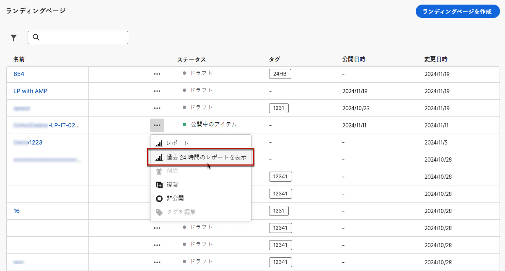

# ランディングページのグローバルレポート {#lp-report-global}

>[!CONTEXTUALHELP]
>id="ajo_landing_page_global_report"
>title="ランディングページのグローバルレポート"
>abstract="ランディングページグローバルレポートでは、選択した期間におけるランディングページの影響を測定できます。レポートは、ランディングページの成功とエラーの詳細を示す様々なウィジェットに分かれています。 各レポートダッシュボードは、ウィジェットのサイズ変更や削除を行うことで変更できます。"

>[!AVAILABILITY]
>
>現在のレポートエクスペリエンスは、2025年1月の時点で廃止されます。この日以降、新しいレポートエクスペリエンスが標準となります。スムーズに移行できるように、新機能を理解しておくことをお勧めします。[Journey Optimizer の新しいレポートインターフェイスの基本を学ぶ。](report-gs-cja.md)

「全期間」タブからアクセスできるグローバルレポートには、少なくとも 2 時間前に発生したイベントと、選択した期間のイベントが表示されます。これに対し、ライブレポートには、過去 24 時間以内に発生したイベントが焦点となり、イベント発生から最小 2 分の時間間隔で表示されます。

レポートにアクセスするには、選択したランディングページの詳細メニューから「**[!UICONTROL レポート]**」を選択します。

ランディングページの&#x200B;**[!UICONTROL グローバルレポート]**&#x200B;は、配信の成功とエラーの詳細を示す様々なウィジェットに分かれています。必要に応じて、各ウィジェットのサイズを変更したり削除したりできます。この機能について詳しくは、この[節](global-report.md)を参照してください。

+++ランディングページのグローバルレポートで使用できる様々な指標およびウィジェットの詳細を説明します。

**[!UICONTROL 訪問回数]**&#x200B;および&#x200B;**[!UICONTROL 訪問回数の推移]**&#x200B;ウィジェットを使用すると、次の指標を含むグラフおよび KPI を使用して、選択した期間におけるランディングページの影響を確認できます。

* **[!UICONTROL 合計訪問回数]**：ジャーニーまたは他のソースからランディングページを訪問した合計回数（1 人の受信者による複数回の訪問を含む）。

* **[!UICONTROL ユニーク訪問者]**：ランディングページを訪問した人数。1 人の受信者による複数回の訪問は考慮されません。

**[!UICONTROL ランディングページのパフォーマンス]**&#x200B;ウィジェットは、メッセージに関する主な情報の詳細を KPI を通じて示します。

* **[!UICONTROL コンバージョン率]**：訪問の合計回数に対する、ランディングページでインタラクション（フォームの購読など）を起こした人数のパーセンテージ。

* **[!UICONTROL バウンス率]**：訪問の合計回数に対する、ランディングページでインタラクションを起こさず、購読のアクションを完了していない人数のパーセンテージ。

**[!UICONTROL 訪問ソース]**&#x200B;ウィジェットは、訪問者がランディングページにアクセスした方法を表します。

* **[!UICONTROL ジャーニー]**：ジャーニーからのランディングページへの訪問回数。

* **[!UICONTROL その他のソース]**：ジャーニーではなく外部ソースからランディングページへの訪問回数。

**[!UICONTROL クリック数上位のリンク]**&#x200B;は、訪問者の配信とのインタラクションを識別します。

* **[!UICONTROL クリック数]**：ランディングページでコンテンツがクリックされた回数。

* **[!UICONTROL クリック率]**：ランディングページでのクリック率。

**[!UICONTROL ジャーニー]**&#x200B;ウィジェットは、ジャーニーからランディングページへの訪問回数を表します。

* **[!UICONTROL 訪問回数]**：ランディングページへの訪問回数（1 人の受信者による複数回の訪問を含む）。

**[!UICONTROL その他のソース]**&#x200B;ウィジェットは、ジャーニーではなく外部ソースからランディングページへの訪問回数を表します。

**[!UICONTROL メッセージ別の訪問回数]**／**[!UICONTROL メッセージ別のコンバージョン数]**&#x200B;のグラフは、送信されたメッセージに応じて、該当する期間中にランディングページで正常にインタラクションを起こした訪問回数とユーザーの合計数を表します。

**[!UICONTROL チャネル別の訪問回数]**／**[!UICONTROL チャネル別のコンバージョン数]**のグラフは、チャネルに応じて、該当する期間中にランディングページで正常にインタラクションを起こした訪問回数とユーザーの合計数を表します。
+++

Adobe Journey Optimizer で使用可能なすべての指標の詳細なリストについては、[このページ](global-report.md#list-of-components-global)を参照してください。
