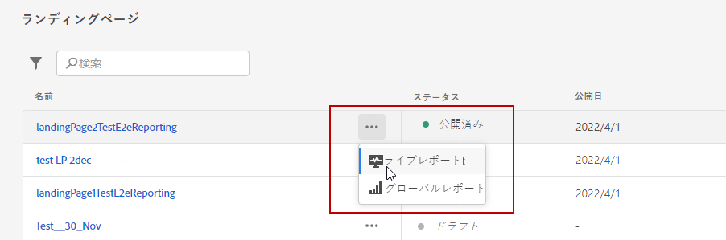
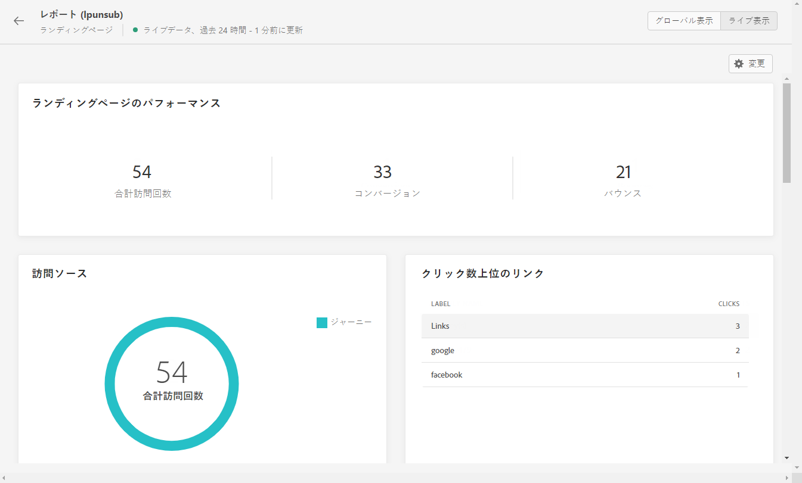
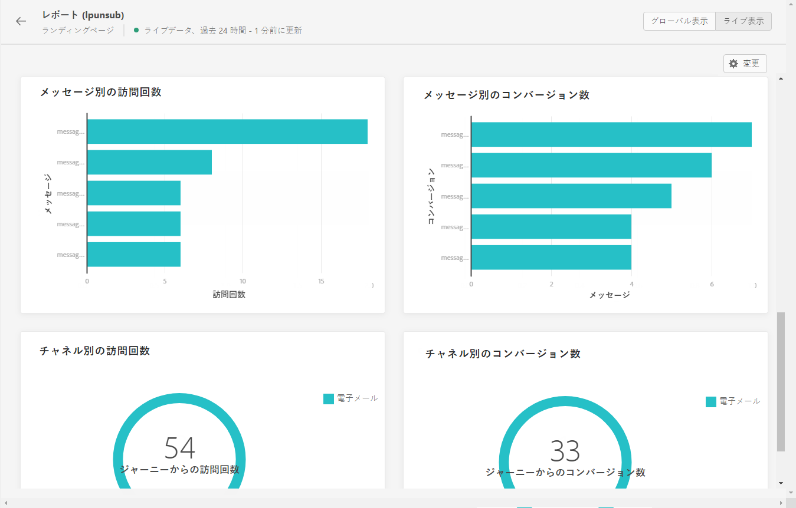

# ランディングページのライブレポート {#lp-report-live}

ランディングページ **[!UICONTROL ライブレポート]** レポートには、過去 24 時間のランディングページの影響に関する詳細のみが表示されます。 選択した期間でランディングページデータを測定するには、 [ランディングページのグローバルレポート](lp-report-global.md).

レポートにアクセスするには、 **[!UICONTROL ライブレポート]** を選択します。

ランディングページ **[!UICONTROL ライブレポート]** は、配信の成功とエラーを示す様々なウィジェットに分割されます。 必要に応じて、各ウィジェットのサイズを変更したり削除したりできます。この機能について詳しくは、この[節](live-report.md)を参照してください。

**[!UICONTROL ランディングページのパフォーマンス]**&#x200B;ウィジェットは、過去 24 時間のメッセージに関する主な情報の詳細を、KPI を通じて示します。

* **[!UICONTROL 合計訪問回数]**：ジャーニーまたは他のソースからランディングページを訪問した合計回数（1 人の受信者による複数回の訪問を含む）。

* **[!UICONTROL コンバージョン]**：ランディングページでインタラクションを行っていないユーザーの数（フォームの購読など）。

* **[!UICONTROL バウンス]**：ランディングページでインタラクションを起こさず、購読のアクションを完了していないユーザーの数。

**[!UICONTROL 訪問ソース]**&#x200B;ウィジェットは、訪問者がランディングページにアクセスした方法を表します。

* **[!UICONTROL ジャーニー]**：ジャーニーからのランディングページへの訪問回数。

* **[!UICONTROL その他のソース]**：ジャーニーではなく外部ソースからのランディングページへの訪問回数。

**[!UICONTROL クリック数上位のリンク]**&#x200B;は、訪問者のランディングページでのインタラクションを識別します。

* **[!UICONTROL クリック数]**：ランディングページでコンテンツがクリックされた回数。

**[!UICONTROL ジャーニー]**&#x200B;ウィジェットは、ジャーニーからランディングページへの訪問回数を表します。

**[!UICONTROL その他のソース]**&#x200B;ウィジェットは、ジャーニーではなく外部ソースからランディングページへの訪問回数を表します。

**[!UICONTROL メッセージ別の訪問回数]**／**[!UICONTROL メッセージ別のコンバージョン数]**&#x200B;のグラフは、過去 24 時間に、送信されたメッセージに応じてランディングページで正常にインタラクションを起こした訪問回数とユーザー数の合計を表します。

**[!UICONTROL チャネル別の訪問回数]**／**[!UICONTROL チャネル別のコンバージョン数]**&#x200B;のグラフは、チャネルに応じて過去 24 時間にランディングページで正常にインタラクションを起こした訪問回数とユーザー数の合計を表します。
