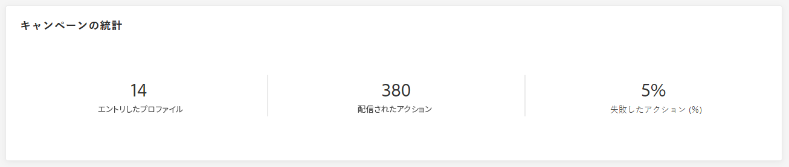
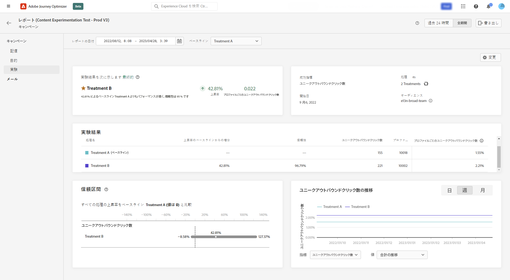

# キャンペーンのグローバルレポート {#objective-report}

キャンペーンのグローバルレポートへは、「**[!UICONTROL レポートを表示]**」ボタンを使用して、キャンペーンから直接アクセスできます。

キャンペーンの&#x200B;**[!UICONTROL グローバルレポート]**&#x200B;は、キャンペーンの成功とエラーの詳細を示す様々なウィジェットに分かれています。必要に応じて、各ウィジェットのサイズを変更したり削除したりできます。詳しくは、この[節](../reports/global-report.md#modify-dashboard)を参照してください。

Adobe Journey Optimizerで使用可能なすべての指標の詳細なリストについては、[このページ](global-report.md#list-of-components-global.md)を参照してください。

## 「キャンペーン」タブ {#campaign-global-objectives}

### 配信 {#delivery-global-objectives}

**[!UICONTROL キャンペーンの統計]**&#x200B;ウィジェットには、キャンペーンに関連する主な情報の詳細が表示されます。

* **[!UICONTROL エントリしたプロファイル]**：ジャーニーを開始したプロファイルの数。

* **[!UICONTROL 配信されたアクション]**：ジャーニー内のアクションが配信されたユニーク回数の合計。

* **[!UICONTROL アクションが % で失敗しました]**：アクションが配信されたユニーク回数の合計に対する、ジャーニーでアクションが失敗したユニーク回数の合計。

### 目標レポート {#objective-global}

>[!AVAILABILITY]
>
>**目標レポート**&#x200B;機能は現在、一連の組織でのみ使用できます（使用制限あり）。詳しくは、アドビ担当者にお問い合わせください。

「**[!UICONTROL 目標]**」タブを使用すると、1 つの特定の指標をターゲティングすることで、配信のレポートをより細かく調整できます。

一覧表示された&#x200B;**[!UICONTROL 目標]**&#x200B;は、追加情報を取得するためのシステムへの接続を定義する&#x200B;**[!UICONTROL データセット]**&#x200B;にリンクされています。ビルトインの&#x200B;**[!UICONTROL 目標]**&#x200B;リストが用意されていますが、新しい&#x200B;**[!UICONTROL データセット]**&#x200B;を追加することで独自の目標を追加できます。詳細な手順については、こちらの[節](../reports/reporting-configuration.md)を参照してください。

ターゲットにする目標を選択した後、2 つの&#x200B;**[!UICONTROL パフォーマンスの概要]**&#x200B;および&#x200B;**[!UICONTROL キャンペーン目標]**&#x200B;ウィジェットには、配信パフォーマンスの詳細な概要が表示されます。

**[!UICONTROL キャンペーン目標]**&#x200B;ウィジェットを使用して、主な目標を別の指標と比較することもできます。

### 実験レポート {#experimentation-global-objectives}

「**[!UICONTROL 実験]**」タブには、各バリアントのパフォーマンスに関する主要なインサイトが表示され、最も成功したものを特定します。

最もパフォーマンスの高い処理の判定には時間がかかる場合があり、このアイコン  が表示されます。

+++実験レポートで使用できる様々な指標およびウィジェットの詳細を説明します。

**[!UICONTROL 実験結果]**&#x200B;ウィジェットは、各バリアントのパフォーマンスの詳細を説明します。ベースラインを変更するには、**[!UICONTROL ベースライン]**&#x200B;ドロップダウンから処理の 1 つを選択します。最も優れた処理には、星のアイコンが表示されます。

このテーブルは、次の指標を表しています。

* **[!UICONTROL ベースライン上の上昇率]**：ベースラインに対する特定の処理のコンバージョン率の向上率を測定します。

* **[!UICONTROL 信頼性]**：ある処理がベースライン処理と同じであることを示す証拠。[詳細情報](../content-management/experiment-calculations.md#understand-confidence)

* **[!UICONTROL ユニークアウトバウンドクリック数]**：アウトバウンドチャネルでのクリック総数。

* **[!UICONTROL プロファイル]**：この処理の対象となるプロファイルの数。

* **[!UICONTROL ユニークアウトバウンドクリック数／プロファイル数]**：実験の作成時に以前に選択した成功指標の合計値を、プロファイル数で割った値です。

**[!UICONTROL 信頼区間]**&#x200B;グラフは、改善に関する不確実性を測定します。ベースラインと最もパフォーマンスの高い処理との間のパフォーマンス差の割合を詳細に示します。[詳細情報](../content-management/experiment-calculations.md#confidence-intervals)
+++

これらの結果の詳細と解釈について詳しくは、[このページ](../content-management/get-started-experiment.md#interpret-results)を参照してください。
