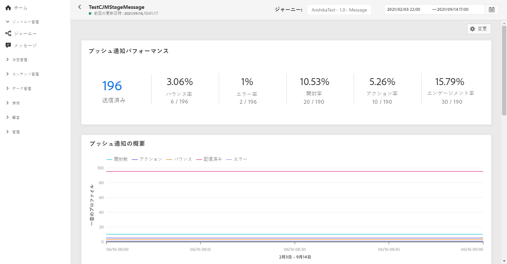
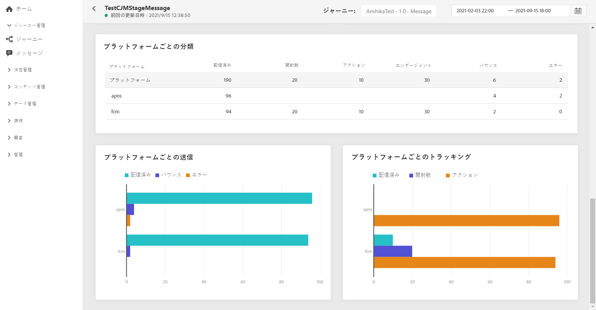

# プッシュグローバルレポート {#push-global-report}

プッシュの&#x200B;**[!UICONTROL グローバルレポート]**&#x200B;は、1 つの特定プッシュ配信のみをターゲットにします。

**[!UICONTROL メッセージ]**&#x200B;メニューの「**[!UICONTROL 実行]**」タブで、「**[!UICONTROL グローバル表示]**」をクリックしてから、選択した配信の詳細メニューで「**[!UICONTROL グローバルレポート]**」を選択します。

プッシュの&#x200B;**[!UICONTROL グローバルレポート]**&#x200B;は、配信の成功とエラーを示す様々なウィジェットに分かれています。必要に応じて、各ウィジェットのサイズを変更したり削除したりできます。この機能について詳しくは、この[節](global-report.md#modify-dashboard)を参照してください。

**[!UICONTROL プッシュ通知のパフォーマンス]**&#x200B;ウィジェットは、KPI を使用して、プッシュ通知に関する主な情報の詳細を示します。

* **[!UICONTROL 送信済み]**：配信に対する送信の合計数。

* **[!UICONTROL バウンス率]**：送信済みのプッシュ通知に対する、バウンスしたプッシュ通知の割合。

* **[!UICONTROL エラー率]**：送信済みのプッシュ通知に対する、配信中に発生して送信の妨げとなったエラーの割合。

* **[!UICONTROL アクション率]**：配信されたプッシュ通知に対するアクション（ボタンのクリックや解除など）の割合。

* **[!UICONTROL エンゲージメント率]**：このプッシュ通知の開封とアクションの割合（プロファイルによるプッシュの開封や、ボタンのクリックなど）。

「**[!UICONTROL プッシュ通知の概要]**」グラフには、次のような送信済みプッシュ通知に使用できるデータが含まれています。

* **[!UICONTROL 開封数]**：配信でメッセージが開封された回数。

* **[!UICONTROL アクション]**：配信されたプッシュ通知に対するアクション（ボタンのクリックや解除など）の合計数。

* **[!UICONTROL バウンス]**：送信されたメッセージの総数に対して、配信と自動返信の処理中に発生したエラーの累計。

* **[!UICONTROL 配信済み]**：送信されたメッセージの合計数に対して、正常に配達できたメッセージの数。

* **[!UICONTROL エラー]**：配信中に発生し、プロファイルへの送信の妨げとなったエラーの合計数。

「**[!UICONTROL エラー理由]**」グラフと表を使用すると、配信中に発生したエラーを確認できます。

**[!UICONTROL プラットフォーム別トラッキング]**、**[!UICONTROL プラットフォーム別送信]**、**[!UICONTROL プラットフォーム別分類]**&#x200B;のグラフとテーブルには、プッシュ通知の成功の詳細がオペレーティングシステムに応じて表示されます。
