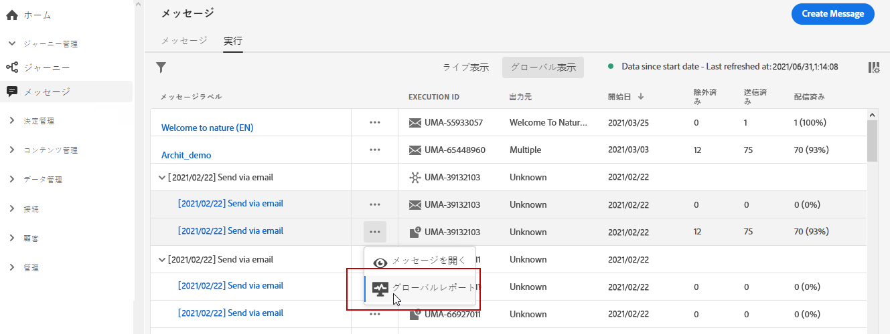

# グローバルレポートをプッシュ{#push-global-report}

プッシュ&#x200B;**[!UICONTROL グローバルレポート]**&#x200B;は、1つの特定のプッシュ配信のみをターゲットします。

**[!UICONTROL メッセージ]**&#x200B;メニューの「**[!UICONTROL 実行]**」タブで、「**[!UICONTROL グローバル表示]**」を選択し、選択した配信の詳細メニューで「**[!UICONTROL グローバルレポート]**」を選択します。

プッシュ&#x200B;**[!UICONTROL グローバルレポート]**&#x200B;は、配信の成功とエラーを示す様々なウィジェットに分かれています。 必要に応じて、各ウィジェットのサイズを変更したり削除したりできます。 この点について詳しくは、を参照してください。
