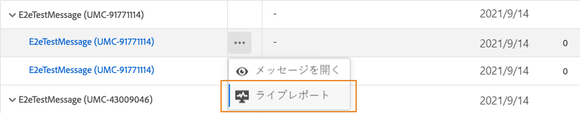
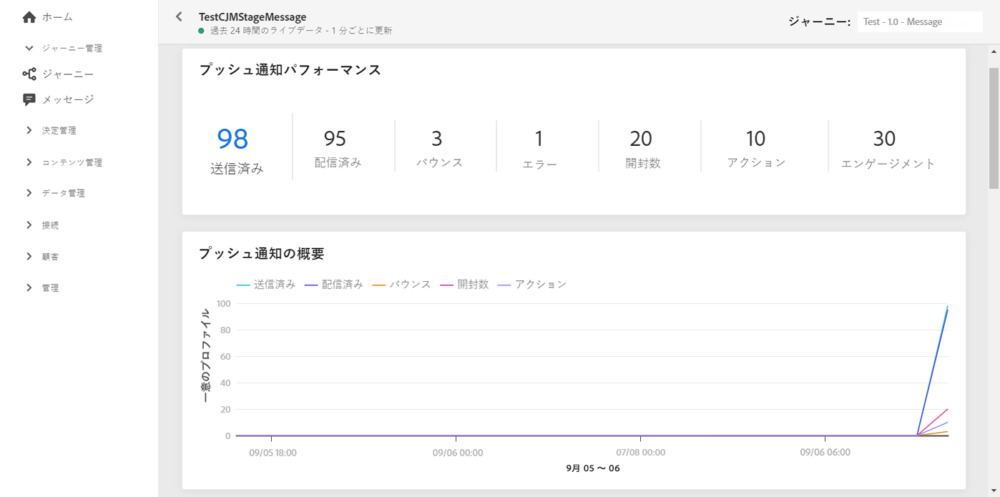
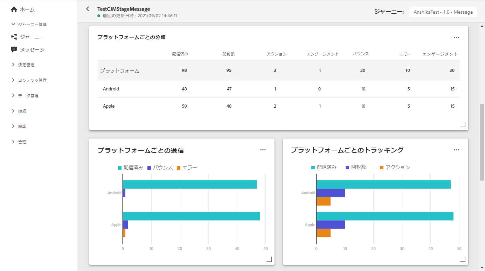

# プッシュ通知のライブレポート {#push-live-report}

プッシュ&#x200B;**[!UICONTROL ライブレポート]**&#x200B;は、特定のプッシュ配信を 1 つだけターゲットにします。

**[!UICONTROL メッセージ]**&#x200B;メニューの「**[!UICONTROL 実行]**」タブで、「**[!UICONTROL ライブ表示]**」を選択し、選択した配信の詳細メニューで「**[!UICONTROL ライブレポート]**」を選択します。

プッシュ&#x200B;**[!UICONTROL ライブレポート]**&#x200B;は、配信の成功とエラーを示す様々なウィジェットに分かれています。必要に応じて、各ウィジェットのサイズを変更したり削除したりできます。この機能について詳しくは、この[節](live-report.md#modify-dashboard)を参照してください。

「**[!UICONTROL プッシュ通知のパフォーマンス]**」および「**[!UICONTROL プッシュ通知の概要]**」ウィジェットは、グラフと KPI を含むメッセージに関する主な情報を詳細に示します。

* **[!UICONTROL 送信済み]**：配信に対する送信の合計数。

* **[!UICONTROL 配信済み]**：送信されたメッセージの合計数に対して、正常に配達できたメッセージの数。

* **[!UICONTROL バウンス]**：送信されたメッセージの総数に対して、配信と自動返信の処理中に発生したエラーの累計。

* **[!UICONTROL エラー]**：配信中に発生し、プロファイルへの送信の妨げとなったエラーの合計数。

* **[!UICONTROL 開封数]**：配信でメッセージが開封された回数。

* **[!UICONTROL アクション]**：配信されたプッシュ通知に対するアクション（ボタンのクリックや解除など）の合計数。

* **[!UICONTROL エンゲージメント]**：このプッシュ通知に対する開封数とアクション数（「プロファイルがプッシュを開封した」、「ボタンがクリックされた」など）の合計。

**[!UICONTROL 送信指標 — プッシュによる]**&#x200B;テーブルでは、配信の成功の詳細を説明しています。

* **[!UICONTROL ターゲット]**:この配信のターゲットプロファイルとして認定されるユーザープロファイルの数。

* **[!UICONTROL 除外済み]**:メッセージを受信しなかった、ターゲットプロファイルから除外されたユーザープロファイルの数。

* **[!UICONTROL 送信済み]**：配信に対する送信の合計数。

* **[!UICONTROL 配信済み]**：送信されたメッセージの合計数に対して、正常に配達できたメッセージの数。

* **[!UICONTROL バウンス]**：送信されたメッセージの総数に対して、配信と自動返信の処理中に発生したエラーの累計。

* **[!UICONTROL エラー]**：配信中に発生し、プロファイルへの送信の妨げとなったエラーの合計数。

* **[!UICONTROL 開封数]**：配信でメッセージが開封された回数。

**[!UICONTROL プラットフォーム別トラッキング]**、**[!UICONTROL プラットフォーム別送信]**、**[!UICONTROL プラットフォーム別分類]**&#x200B;のグラフとテーブルには、プッシュ通知の成功の詳細がオペレーティングシステムに応じて表示されます。

**[!UICONTROL 送信の統計 - 失敗]**&#x200B;ウィジェットには、発生したエラーとバウンスの数が表示されます。

「**[!UICONTROL エラー理由]**」グラフと表を使用すると、配信中に発生したエラーを確認できます。
