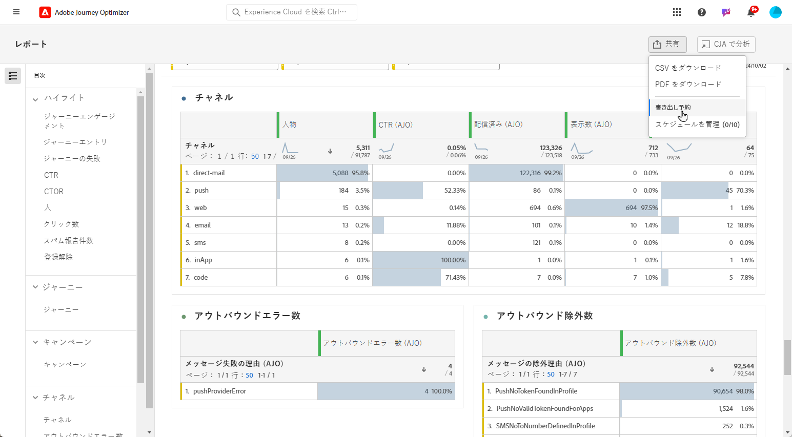
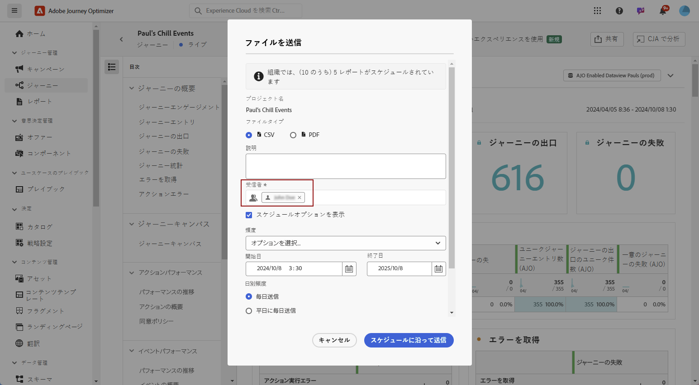
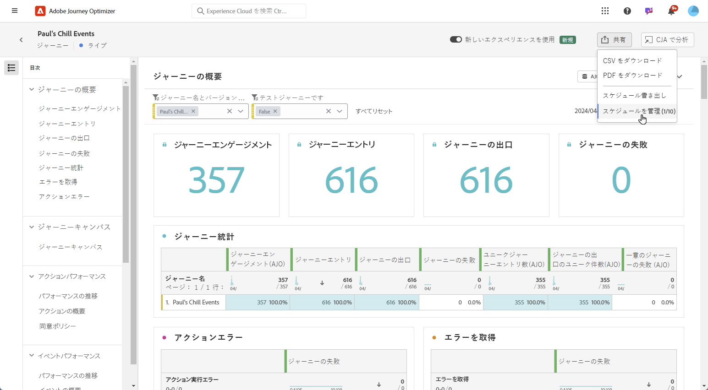
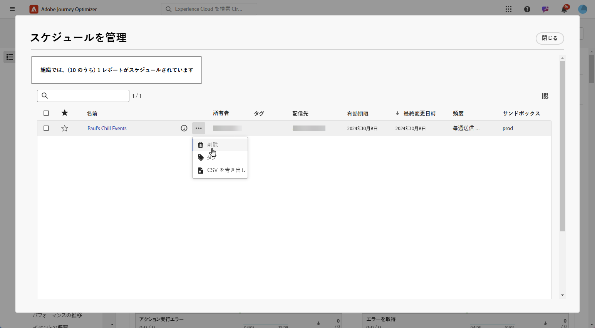

# レポートの管理 {#channel-cja-manage}

## Customer Journey Analytics での分析 {#analyze}

すべてのレポートで利用できる **[!UICONTROL CJA での分析]**&#x200B;を活用することで、**[!DNL Customer Journey Analytics]** ライセンスを使用したデータ分析エクスペリエンスを強化します。

この強力なオプションにより、**[!DNL Customer Journey Analytics]** 環境にシームレスにリダイレクトされ、レポートを幅広くカスタマイズできるようになります。専用の Customer Journey Analytics 指標を使用してウィジェットを強化し、まったく新しいレベルのインサイトを得ることができます。

[詳しくは、Customer Journey Analytics インターフェイスを参照してください。](https://experienceleague.adobe.com/ja/docs/analytics-platform/using/cja-overview/cja-getting-started)

## レポート期間の定義 {#report-period}

レポートにアクセスする際に、レポートの右上隅にある期間フィルターを適用できます。

デフォルトでは、キャンペーンまたはジャーニーのフィルター期間は、開始日と終了日に設定されています。終了日がない場合、フィルターはデフォルトで現在の日付になります。

フィルターを変更するには、カスタムの開始日と期間を選択するか、先週または 2 か月前などのプリセットオプションから選択します。

フィルターが適用または変更されると、レポートは自動的に更新されます。

## レポートを書き出し {#export-reports}

様々なレポートを PDF 形式または CSV 形式で簡単に書き出して、共有したり印刷したりできます。レポートの書き出し手順について詳しくは、次のタブを参照してください。

>[!BEGINTABS]

>[!TAB CSV ファイルでのレポートの書き出し]

1. レポートから「**[!UICONTROL 共有]**」をクリックし、「**[!UICONTROL CSV をダウンロード]**」を選択して、レポートレベル全体で CSV ファイルを生成します。

   

1. ファイルが自動的にダウンロードされ、ローカルファイルに配置できます。

   レポートレベルでファイルを生成した場合は、タイトルやデータなど、各ウィジェットの詳細情報がファイルに含まれています。

>[!TAB PDF ファイルでのレポートの書き出し]

1. レポートで「**[!UICONTROL 共有]**」をクリックし、「**[!UICONTROL ダウンロードPDF]**」を選択します。

   

1. ダウンロードがリクエストされたら、「**[!UICONTROL ダウンロード]**」をクリックします。

   

1. ファイルはブラウザーで自動的に開きます。

これで、レポートを PDF ファイルで表示、ダウンロードまたは共有できるようになりました。

>[!ENDTABS]

<!--
## Schedule exports {#schedule-export}

The **Schedule export** lets you automate the delivery of up to 10 reports at weekly, monthly or yearly intervals. You can also easily manage your scheduled reports, with options to update, edit, cancel, or delete any of your scheduled exports.

1. From your report, click **[!UICONTROL Share]** and select **[!UICONTROL Schedule export]**.

   

1. Choose your **[!UICONTROL File type]** between CSV and PDF.

1. If needed, you can add a **[!UICONTROL Description]** to your export.

1. Enter the name of the recipients who will receive this automated delivery.

   

1. Choose the **[!UICONTROL Frequency]**.

1. Based on the selected frequency, provide the relevant scheduling details, such as:

   * Start and end dates
   
   * Interval (e.g., every few weeks)

   * Specific day of the week
   
   * Week within the month

   * Day within the month
   
   * Month of the year

1. Click **[!UICONTROL Send on schedule]**.

1. To edit previously created scheduled export, click **[!UICONTROL Share]** and select **[!UICONTROL Manage schedules]**.

   

1. From the list of scheduled exports, choose the one you want to update and make the necessary changes.

1. To delete a scheduled report, select one from the managed schedules list and click **[!UICONTROL Delete]**.

   
-->

## シンプルな指標の作成 {#create-simple-metric}

カスタム計算指標をレポート内に直接作成できます。特定のレポートニーズに合わせて 2 つの既存の指標を組み合わせることで、よりカスタマイズされたインサイトを生成し、データをより適切に分析できます。

1. まず、新しい指標を追加するレポートにアクセスします。

1. レポート内のテーブルで、`Shift` キーまたは `CTRL/CMD` キーを押しながらクリックして、必要な指標を選択します。次に、右クリックして「**[!UICONTROL 選択から指標を作成]**」を選択します。

   2 つ以上の指標を選択した場合、指標ビルダーでは最初の 2 つのみが使用されます。

   

1. 計算指標ビルダーから、「**[!UICONTROL タイトル]**」フィールドに入力して、新しい指標に名前を付けます。また、**[!UICONTROL 説明]**&#x200B;を追加することもできます。

   >[!NOTE]
   >
   >Customer Journey Analytics を所有する場合は、追加オプションを使用して、指標をさらにパーソナライズできます。[詳細情報](https://experienceleague.adobe.com/ja/docs/analytics-platform/using/cja-components/cja-calcmetrics/cm-workflow/cm-build-metrics#areas-of-the-calculated-metrics-builder)

1. 適切な&#x200B;**[!UICONTROL 小数点以下の桁数]**&#x200B;を選択し、目的の指標の表示方法に応じて、**[!UICONTROL 形式]**（小数、時間、割合、通貨）を選択します。

1. 指標の計算方法を決定する加算、減算、乗算、除算などの演算子を選択します。

   

1. 必要に応じて、コンポーネントを並べ替えることができます。

1. 設定に問題がなければ、「**[!UICONTROL 適用]**」をクリックして、新しい指標を確定します。

1. 新しい指標は、レポートの元の指標の横に表示されます。

   

新しく作成した指標は、レポートを PDF または CSV として書き出す際に含まれます。ただし、終了すると、レポートから削除されます。

## 探索的分析によるデータの探索 {#exploratory}

探索的分析ツールを使用すると、選択した&#x200B;**[!UICONTROL ディメンション]**&#x200B;と&#x200B;**[!UICONTROL 指標]**&#x200B;からテーブルとビジュアライゼーションを簡単に作成できます。このツールは、データの探索を効率化し、情報を自動的にカスタマイズして、簡単に分析できるようにします。詳しくは、[このドキュメント](https://experienceleague.adobe.com/ja/docs/analytics/analyze/analysis-workspace/panels/quickinsight)を参照してください。

1. まず、探索的分析を使用するレポートにアクセスします。

1. 左側のパネルメニューから探索的分析メニューを選択します。

   

1. ドロップダウンメニューを使用して&#x200B;**[!UICONTROL ディメンション]**&#x200B;と&#x200B;**[!UICONTROL 指標]**&#x200B;を選択して、クエリを作成します。必要に応じて、**[!UICONTROL セグメント]**&#x200B;を選択することもできます。

   

1. 分析の日付範囲を定義して、焦点を当てる期間を指定します。デフォルトでは、日付範囲はレポートパネルで使用される範囲に設定されます。

1. 「**[!UICONTROL 分類を追加]**」オプションまたは「**[!UICONTROL 指標を追加]**」オプションを使用して追加のディメンションを含めると、より詳細なデータの分類ができるようになります。

   追加できる&#x200B;**[!UICONTROL ディメンション]**、**[!UICONTROL 指標]**、**[!UICONTROL セグメント]**&#x200B;は最大 3 つまでです。

カスタマイズされたテーブルとビジュアライゼーションツールを使用してデータを分析できるようになりました。

<!--## Create a down-funnel metric {#down-funnel}

1. Create a new journey or open an existing one. [Learn more on journey creation](../building-journeys/journey-gs.md)

1. On the canvas editor, select the option to "add a metric".

c. In the metric selector, choose whichever conversion metric seems appropriate and publish your journey

d. Open the report for the journey that you added the metric to and ensure that the metric has been added to the table alongside all the other pre-configured metrics.
-->

## レポートデータからのオーディエンスの作成 {#create-audience}

>[!IMPORTANT]
>
>各組織では、オーディエンスの公開が 25 個に制限されています。さらに、ユーザーは、1 時間あたり最大 5 人のオーディエンス、1 日あたり最大 20 人のオーディエンスを公開できます。
> 1 回限りのオーディエンスの有効期間は 48 時間です。 したがって、その期間内に 25 個のオーディエンスが公開された場合、追加のオーディエンスは、48 時間が経過した後でのみ公開できます。

テーブル内の特定のデータを選択し、これらの選択からオーディエンスを直接作成できるので、オーディエンス作成プロセスが効率化および簡素化されました。

1. まず、オーディエンスに変換するデータを含むレポートテーブルに移動します。

1. 目的のセルを右クリックし、「**[!UICONTROL オーディエンスを作成]**」を選択します。

   または、ノードを選択して右クリックし、**[!UICONTROL ジャーニーキャンバス]**&#x200B;ウィジェットからオーディエンスの作成を開始することもできます。

1. **[!UICONTROL オーディエンスを作成]**&#x200B;ウィンドウで、公開する予定のオーディエンスの&#x200B;**[!UICONTROL 名前]**&#x200B;を入力し、**[!UICONTROL 1 回限りの日付範囲]**&#x200B;を設定します。

   >[!NOTE]
   >
   >Customer Journey Analytics を所有する場合は、追加オプションを使用して、指標をさらにパーソナライズできます。[詳細情報](https://experienceleague.adobe.com/ja/docs/analytics-platform/using/cja-components/audiences/publish)

   

1. 「**[!UICONTROL 作成]**」ボタンをクリックして、オーディエンスの作成を完了します。このプロセスは、完了するまでに時間がかかる場合があります。

新しく作成したオーディエンスをジャーニーまたはキャンペーンで使用できるようになりました。

