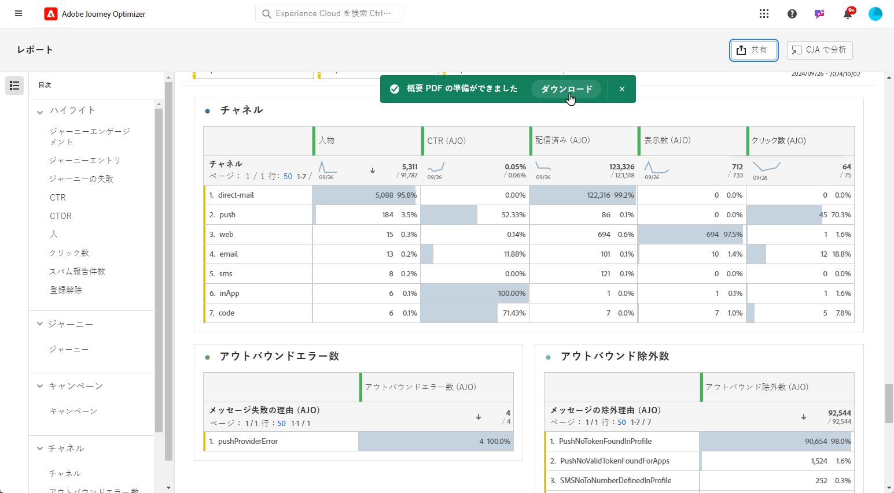

# レポートの管理 {#channel-cja-manage}

## Customer Journey Analyticsで分析 {#analyze}

を使用したデータ分析エクスペリエンスの向上 **[!DNL Customer Journey Analytics]** を利用したライセンス **[!UICONTROL CJA での分析]** すべてのレポートで使用できる機能。

この強力なオプションにより、にシームレスにリダイレクトされます **[!DNL Customer Journey Analytics]** 環境。レポートを幅広くパーソナライズできます。 専用のCustomer Journey Analytics指標を使用してウィジェットを強化し、インサイトをまったく新しいレベルに引き上げることができます。

[Customer Journey Analyticsインターフェイスの詳細情報。](https://experienceleague.adobe.com/en/docs/analytics-platform/using/cja-overview/cja-getting-started)

## レポート期間の定義 {#report-period}

レポートにアクセスする際に、レポートの右上隅にある期間フィルターを適用できます。

デフォルトでは、キャンペーンまたはジャーニーのフィルター期間は、開始日と終了日に設定されています。 終了日がない場合、フィルターはデフォルトで現在の日付になります。

フィルターを変更するには、カスタムの開始日と期間を選択するか、先週または 2 か月前などのプリセットオプションから選択します。

フィルターが適用または変更されると、レポートは自動的に更新されます。

## レポートを書き出し {#export-reports}

様々なレポートを PDF 形式または CSV 形式で簡単に書き出して、共有したり印刷したりできます。レポートの書き出し手順について詳しくは、次のタブを参照してください。

>[!BEGINTABS]

>[!TAB CSV ファイルでのレポートの書き出し]

1. レポートで、「**[!UICONTROL 書き出し]**」をクリックし、「**[!UICONTROL CSV ファイル]**」を選択して、全体的なレポートレベルで CSV ファイルを生成します。

   

1. ファイルが自動的にダウンロードされ、ローカルファイルに配置できます。

   レポートレベルでファイルを生成した場合は、タイトルやデータなど、各ウィジェットの詳細情報がファイルに含まれています。

>[!TAB PDF ファイルでのレポートの書き出し]

1. レポートから、「**[!UICONTROL 書き出し]**」をクリックし、「**[!UICONTROL PDF ファイル]**」を選択します。

   

1. ダウンロードが要求されたら、 **[!UICONTROL Download]**.

   

1. ファイルはブラウザーで自動的に開きます。

これで、レポートを PDF ファイルで表示、ダウンロード、共有できるようになりました。

>[!ENDTABS]

