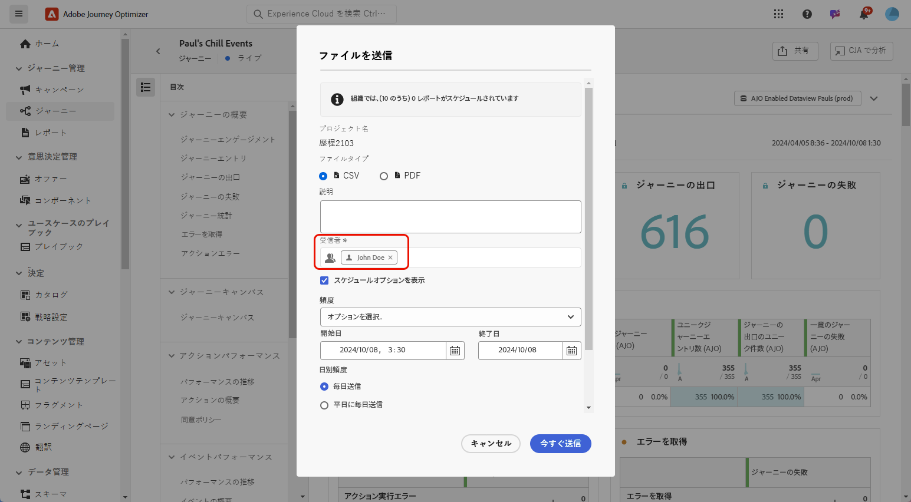
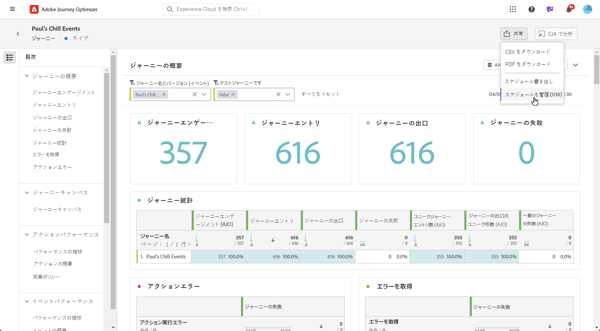
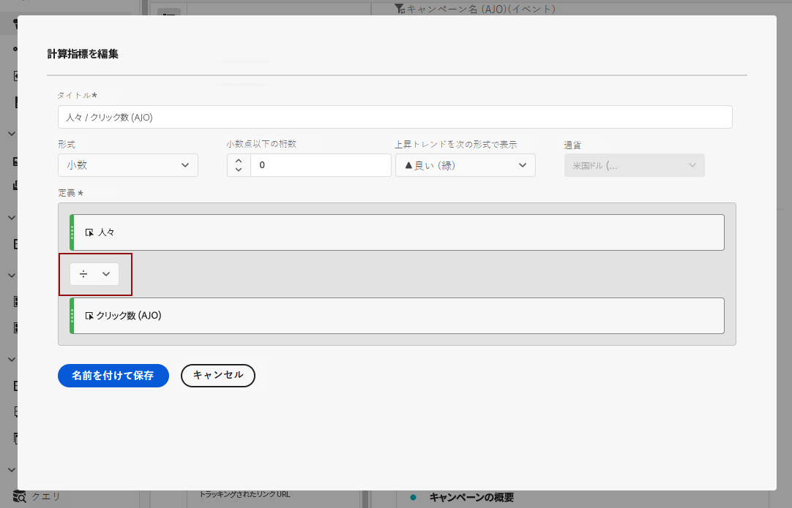
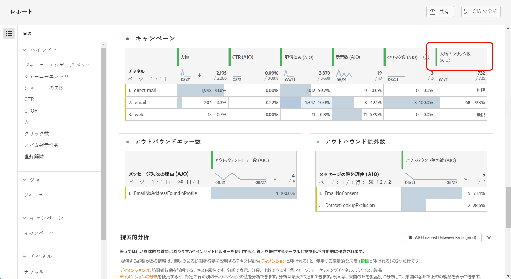
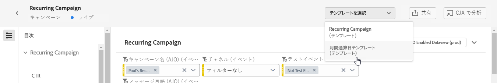
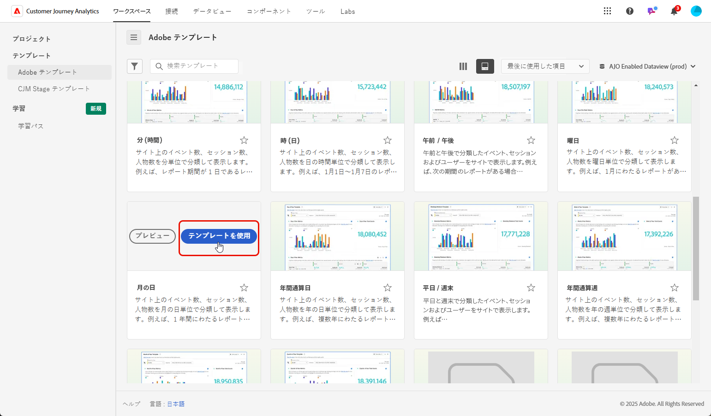
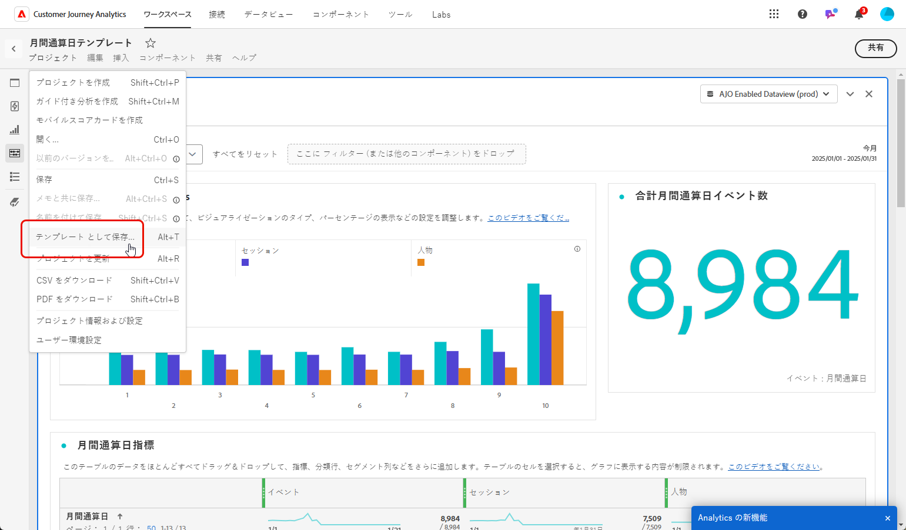
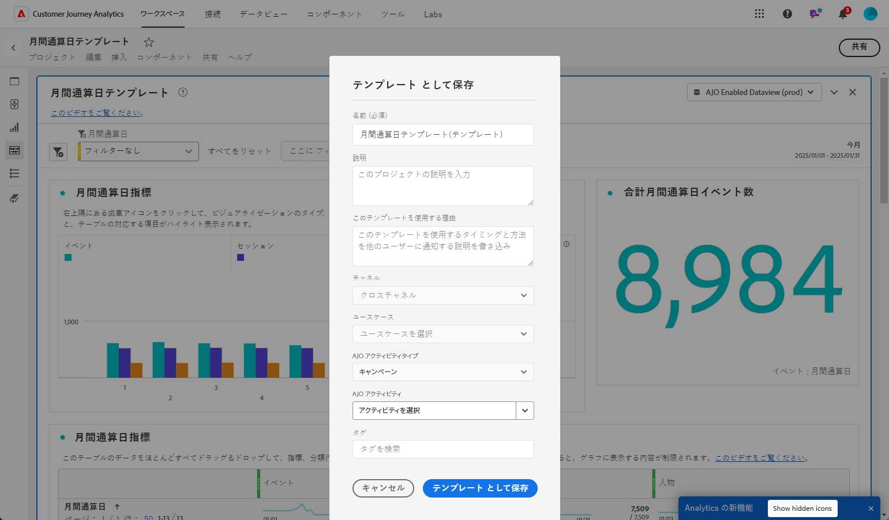
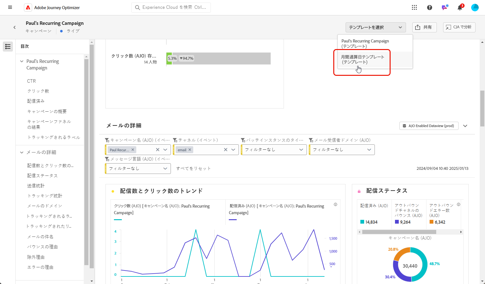

# レポートの管理 {#channel-cja-manage}

## Customer Journey Analytics での分析 {#analyze}

>[!AVAILABILITY]
>
> **CJA での分析**&#x200B;機能は、[!DNL Customer Journey Analytics] ライセンスを持つユーザーのみが使用できます。

すべてのレポートで利用できる **[!UICONTROL CJA での分析]**&#x200B;を活用することで、**[!DNL Customer Journey Analytics]** ライセンスを使用したデータ分析エクスペリエンスを強化します。

この強力なオプションにより、**[!DNL Customer Journey Analytics]** 環境にシームレスにリダイレクトされ、レポートを幅広くカスタマイズできるようになります。専用の Customer Journey Analytics 指標を使用してウィジェットを強化し、まったく新しいレベルのインサイトを得ることができます。

[詳しくは、Customer Journey Analytics インターフェイスを参照してください。](https://experienceleague.adobe.com/ja/docs/analytics-platform/using/cja-overview/cja-getting-started)

## レポート期間の定義 {#report-period}

レポートにアクセスする際に、レポートの右上隅にある期間フィルターを適用できます。

デフォルトでは、キャンペーンまたはジャーニーのフィルター期間は、開始日と終了日に設定されています。終了日がない場合、フィルターはデフォルトで現在の日付になります。

フィルターを変更するには、カスタムの開始日と期間を選択するか、先週または 2 か月前などのプリセットオプションから選択します。

フィルターが適用または変更されると、レポートは自動的に更新されます。

## レポートをエクスポート {#export-reports}

様々なレポートを PDF 形式または CSV 形式で簡単にエクスポートして、共有したり印刷したりできます。レポートのエクスポート手順について詳しくは、次のタブを参照してください。

>[!BEGINTABS]

>[!TAB CSV ファイルでのレポートのエクスポート]

1. レポートで、「**[!UICONTROL 共有]**」をクリックし、「**[!UICONTROL CSV をダウンロード]**」を選択して、全体的なレポートレベルで CSV ファイルを生成します。

   

1. ファイルが自動的にダウンロードされ、ローカルファイルに配置できます。

   レポートレベルでファイルを生成した場合は、タイトルやデータなど、各ウィジェットの詳細情報がファイルに含まれています。

>[!TAB PDF ファイルでのレポートのエクスポート]

1. レポートで、「**[!UICONTROL 共有]**」をクリックし、「**[!UICONTROL PDF をダウンロード]**」を選択します。

   

1. ダウンロードがリクエストされたら、「**[!UICONTROL ダウンロード]**」をクリックします。

   

1. ファイルはブラウザーで自動的に開きます。

これで、レポートを PDF ファイルで表示、ダウンロードまたは共有できるようになりました。

>[!ENDTABS]

## エクスポートのスケジュール {#schedule-export}

**エクスポートのスケジュール**&#x200B;を使用すると、最大 10 件のレポートを毎週、毎月、毎年の間隔で自動配信できます。また、スケジュール済みエクスポートを更新、編集、キャンセル、削除するオプションを使用して、エクスポートのスケジュールを簡単に管理することもできます。

1. レポートで、「**[!UICONTROL 共有]**」をクリックし、「**[!UICONTROL エクスポートのスケジュール]**」を選択します。

   

1. CSV と PDF で「**[!UICONTROL ファイルタイプ]**」を選択します。

1. 必要に応じて、エクスポートに&#x200B;**[!UICONTROL 説明]**&#x200B;を追加できます。

1. この自動配信を受信する受信者の名前を入力します。

   

1. 「**[!UICONTROL 頻度]**」を選択します。

1. 選択した頻度に基づいて、次のような関連するスケジュールの詳細を指定します。

   * 開始日と終了日

   * 間隔（例：数週間ごと）

   * 特定の曜日

   * 月内の週

   * 月内の日

   * 月

1. 「**[!UICONTROL スケジュールに従って送信]**」をクリックします。

1. 以前に作成したスケジュール済みエクスポートを編集するには、「**[!UICONTROL 共有]**」をクリックし、「**[!UICONTROL スケジュールを管理]**」を選択します。

   

1. スケジュール済みエクスポートのリストから、更新するエクスポートを選択し、必要な変更を行います。

1. スケジュール済みレポートを削除するには、管理スケジュールリストからレポートを 1 つ選択し、「**[!UICONTROL 削除]**」をクリックします。

   

## シンプルな指標の作成 {#create-simple-metric}

カスタム計算指標をレポート内に直接作成できます。特定のレポートニーズに合わせて 2 つの既存の指標を組み合わせることで、よりカスタマイズされたインサイトを生成し、データをより適切に分析できます。

1. まず、新しい指標を追加するレポートにアクセスします。

1. レポート内のテーブルで、`Shift` キーまたは `CTRL/CMD` キーを押しながらクリックして、必要な指標を選択します。次に、右クリックして「**[!UICONTROL 選択から指標を作成]**」を選択します。

   2 つ以上の指標を選択した場合、指標ビルダーでは最初の 2 つのみが使用されます。

   

1. 計算指標ビルダーから、「**[!UICONTROL タイトル]**」フィールドに入力して、新しい指標に名前を付けます。また、**[!UICONTROL 説明]**&#x200B;を追加することもできます。

   >[!NOTE]
   >
   >Customer Journey Analytics を所有する場合は、追加オプションを使用して、指標をさらにパーソナライズできます。[詳細情報](https://experienceleague.adobe.com/ja/docs/analytics-platform/using/cja-components/cja-calcmetrics/cm-workflow/cm-build-metrics#areas-of-the-calculated-metrics-builder)

1. 適切な&#x200B;**[!UICONTROL 小数点以下の桁数]**&#x200B;を選択し、目的の指標の表示方法に応じて、**[!UICONTROL 形式]**（小数、時間、割合、通貨）を選択します。

1. 指標の計算方法を決定する加算、減算、乗算、除算などの演算子を選択します。

   

1. 必要に応じて、コンポーネントを並べ替えることができます。

1. 設定に問題がなければ、「**[!UICONTROL 適用]**」をクリックして、新しい指標を確定します。

1. 新しい指標は、レポートの元の指標の横に表示されます。

   

新しく作成した指標は、レポートを PDF または CSV としてエクスポートする際に含まれます。ただし、終了すると、レポートから削除されます。

## 探索的分析によるデータの探索 {#exploratory}

探索的分析ツールを使用すると、選択した&#x200B;**[!UICONTROL ディメンション]**&#x200B;と&#x200B;**[!UICONTROL 指標]**&#x200B;からテーブルとビジュアライゼーションを簡単に作成できます。このツールは、データの探索を効率化し、情報を自動的にカスタマイズして、簡単に分析できるようにします。詳しくは、[このドキュメント](https://experienceleague.adobe.com/ja/docs/analytics/analyze/analysis-workspace/panels/quickinsight)を参照してください。

1. まず、探索的分析を使用するレポートにアクセスします。

1. 左側のパネルメニューから探索的分析メニューを選択します。

   

1. ドロップダウンメニューを使用して&#x200B;**[!UICONTROL ディメンション]**&#x200B;と&#x200B;**[!UICONTROL 指標]**&#x200B;を選択して、クエリを作成します。必要に応じて、**[!UICONTROL セグメント]**&#x200B;を選択することもできます。

   

1. 分析の日付範囲を定義して、焦点を当てる期間を指定します。デフォルトでは、日付範囲はレポートパネルで使用される範囲に設定されます。

1. 「**[!UICONTROL 分類を追加]**」オプションまたは「**[!UICONTROL 指標を追加]**」オプションを使用して追加のディメンションを含めると、より詳細なデータの分類ができるようになります。

   追加できる&#x200B;**[!UICONTROL ディメンション]**、**[!UICONTROL 指標]**、**[!UICONTROL セグメント]**&#x200B;は最大 3 つまでです。

カスタマイズされたテーブルとビジュアライゼーションツールを使用してデータを分析できるようになりました。

<!--## Create a down-funnel metric {#down-funnel}

1. Create a new journey or open an existing one. [Learn more about journey creation](../building-journeys/journey-gs.md)

1. On the canvas editor, select the option to "add a metric".

c. In the metric selector, choose whichever conversion metric seems appropriate and publish your journey

d. Open the report for the journey that you added the metric to and ensure that the metric has been added to the table alongside all the other pre-configured metrics.
-->

## レポートデータからのオーディエンスの作成 {#create-audience}

>[!IMPORTANT]
>
>各組織では、オーディエンスの公開が 25 個に制限されています。また、ユーザーは 1 時間あたり最大 5 個、1 日あたり最大 20 個のオーディエンスを公開できます。
>> 1 回限りのオーディエンスの有効期間は 48 時間です。したがって、その期間内に 25 個のオーディエンスが公開された場合、追加のオーディエンスは、48 時間が経過した後でのみ公開できます。

テーブル内の特定のデータを選択し、これらの選択からオーディエンスを直接作成できるので、オーディエンス作成プロセスが効率化および簡素化されました。

1. まず、オーディエンスに変換するデータを含むレポートテーブルに移動します。

1. 目的のセルを右クリックし、「**[!UICONTROL オーディエンスを作成]**」を選択します。

   または、ノードを選択して右クリックし、**[!UICONTROL ジャーニーキャンバス]**&#x200B;ウィジェットからオーディエンスの作成を開始することもできます。

1. **[!UICONTROL オーディエンスを作成]**&#x200B;ウィンドウで、公開する予定のオーディエンスの&#x200B;**[!UICONTROL 名前]**&#x200B;を入力し、**[!UICONTROL 1 回限りの日付範囲]**&#x200B;を設定します。

   >[!NOTE]
   >
   >Customer Journey Analytics を所有する場合は、追加オプションを使用して、指標をさらにパーソナライズできます。[詳細情報](https://experienceleague.adobe.com/ja/docs/analytics-platform/using/cja-components/audiences/publish)

   

1. 「**[!UICONTROL 作成]**」ボタンをクリックして、オーディエンスの作成を完了します。このプロセスは、完了するまでに時間がかかる場合があります。

新しく作成したオーディエンスをジャーニーまたはキャンペーンで使用できるようになりました。

## テンプレートの管理 {#cja-template}

>[!AVAILABILITY]
>
> **テンプレート**&#x200B;機能は段階的にロールアウト中で、1月末までに完全な一般公開が予定されています。[!DNL Customer Journey Analytics] ライセンスを持つユーザーのみが使用できます。

Customer Journey Analytics テンプレートを活用して Journey Optimizer レポートを強化するオプションが追加されました。[Customer Journey Analytics テンプレートについての詳細情報](https://experienceleague.adobe.com/ja/docs/analytics-platform/using/cja-workspace/templates/use-templates#use-reports)

レポートにアクセスする際は、**[!UICONTROL テンプレートを選択]**&#x200B;ドロップダウンから次の 2 つのテンプレートタイプを選択できます。

* アドビが提供するデフォルトのテンプレート
* 顧客が生成したテンプレート

テンプレートを作成していない場合、レポートインターフェイスに&#x200B;**[!UICONTROL テンプレートを選択]**&#x200B;ドロップダウンは表示されません。

テンプレートを作成するには、次の手順に従います。

1. [!DNL Customer Journey Analytics] で、**[!UICONTROL ワークスペース]**&#x200B;メニューに移動し、「**[!UICONTROL Adobe テンプレート]**」を選択します。[詳しくは、使用可能なテンプレートを参照してください](https://experienceleague.adobe.com/ja/docs/analytics-platform/using/cja-workspace/templates/use-templates#available-templates)

1. 使用可能な事前定義済みテンプレートを参照し、「**[!UICONTROL テンプレートを使用]**」をクリックして選択します。

   

1. ニーズに合わせてレポートを調整します。[Customer Journey Analytics ドキュメント](https://experienceleague.adobe.com/ja/docs/analytics-platform/using/cja-workspace/home)を参照してください。

1. カスタムテンプレートが完成したら、**[!UICONTROL プロジェクト]**&#x200B;メニューにアクセスし、「**[!UICONTROL テンプレートとして保存]**」を選択します。

   

1. テンプレートに必要な詳細を入力します。詳しくは、[Customer Journey Analytics ドキュメント](https://experienceleague.adobe.com/ja/docs/analytics-platform/using/cja-workspace/templates/create-templates#edit-or-delete-a-template)を参照してください。

   >[!IMPORTANT]
   >
   > 必ず、**[!UICONTROL ユースケース]**&#x200B;の下で「**Journey Optimizer**」を選択し、対応する **Journey Optimizer アクティビティタイプ**&#x200B;と&#x200B;**アクティビティ**&#x200B;を指定してください。これにより、Journey Optimizer でレポートを表示できます。

   

1. [!DNL Journey Optimizer] で、レポートにアクセスし、**[!UICONTROL テンプレートを選択]**&#x200B;ドロップダウンから以前に作成したテンプレートを選択します。

   

Journey Optimizer レポートからテンプレートを直接作成するには、キャンペーンまたはジャーニーレポートにアクセスし、「**[!UICONTROL CJA での分析]**」を選択して、上記の手順に従ってデフォルトのテンプレートをカスタマイズするだけです。
