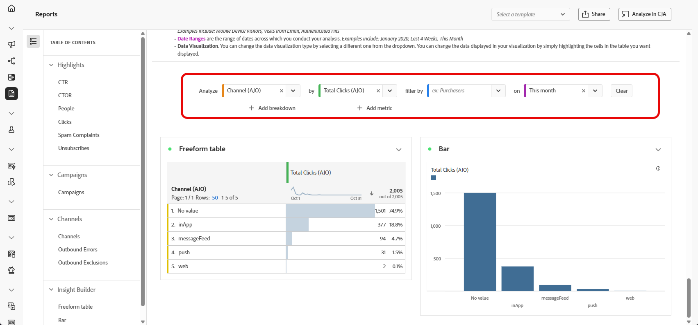

# レポートの管理 {#channel-cja-manage}

## Customer Journey Analytics での分析 {#analyze}

すべてのレポートで利用できる **[!UICONTROL CJA での分析]**&#x200B;を活用することで、**[!DNL Customer Journey Analytics]** ライセンスを使用したデータ分析エクスペリエンスを強化します。

この強力なオプションにより、**[!DNL Customer Journey Analytics]** 環境にシームレスにリダイレクトされ、レポートを幅広くカスタマイズできるようになります。専用の Customer Journey Analytics 指標を使用してウィジェットを強化し、まったく新しいレベルのインサイトを得ることができます。

[詳しくは、Customer Journey Analytics インターフェイスを参照してください。](https://experienceleague.adobe.com/ja/docs/analytics-platform/using/cja-overview/cja-getting-started)

## レポート期間の定義 {#report-period}

レポートにアクセスする際に、レポートの右上隅にある期間フィルターを適用できます。

デフォルトでは、キャンペーンまたはジャーニーのフィルター期間は、開始日と終了日に設定されています。終了日がない場合、フィルターはデフォルトで現在の日付になります。

フィルターを変更するには、カスタムの開始日と期間を選択するか、先週または 2 か月前などのプリセットオプションから選択します。

フィルターが適用または変更されると、レポートは自動的に更新されます。

## レポートを書き出し {#export-reports}

様々なレポートを PDF 形式または CSV 形式で簡単に書き出して、共有したり印刷したりできます。レポートの書き出し手順について詳しくは、次のタブを参照してください。

>[!BEGINTABS]

>[!TAB CSV ファイルでのレポートの書き出し]

1. レポートで、「**[!UICONTROL 書き出し]**」をクリックし、「**[!UICONTROL CSV ファイル]**」を選択して、全体的なレポートレベルで CSV ファイルを生成します。

   

1. ファイルが自動的にダウンロードされ、ローカルファイルに配置できます。

   レポートレベルでファイルを生成した場合は、タイトルやデータなど、各ウィジェットの詳細情報がファイルに含まれています。

>[!TAB PDF ファイルでのレポートの書き出し]

1. レポートから、「**[!UICONTROL 書き出し]**」をクリックし、「**[!UICONTROL PDF ファイル]**」を選択します。

   

1. ダウンロードがリクエストされたら、「**[!UICONTROL ダウンロード]**」をクリックします。

   

1. ファイルはブラウザーで自動的に開きます。

これで、レポートを PDF ファイルで表示、ダウンロードまたは共有できるようになりました。

>[!ENDTABS]

## シンプルな指標の作成 {#create-simple-metric}

カスタム計算指標をレポート内に直接作成できます。 特定のレポートニーズに合わせて 2 つの既存の指標を組み合わせることで、よりカスタマイズされたインサイトを生成し、データをより適切に分析できます。

1. まず、新しい指標を追加するレポートにアクセスします。

1. レポート内のテーブルで、`Shift` キーまたは `CTRL/CMD` キーを押しながらクリックすることで、目的の指標を選択します。 次に、右クリックして「**[!UICONTROL 選択から指標を作成]**」を選択します。

   2 つ以上の指標を選択した場合、最初の 2 つのみが指標ビルダーで使用されます。

   

1. 計算指標ビルダーで、「**[!UICONTROL タイトル]** フィールドにと入力して、新しい指標に名前を付けます。 **[!UICONTROL 説明]** を追加することもできます。

   >[!NOTE]
   >
   >Customer Journey Analyticsを所有している場合は、さらにオプションを追加して、指標をパーソナライズできます。 [詳細情報](https://experienceleague.adobe.com/en/docs/analytics-platform/using/cja-components/cja-calcmetrics/cm-workflow/cm-build-metrics#areas-of-the-calculated-metrics-builder)

1. 適切な **[!UICONTROL 小数点以下の桁数]** を選択し、指標の表示方法に基づいて **[!UICONTROL 形式]** （小数、時間、パーセント、通貨）を選択します。

1. 指標の計算方法を決定する演算子（加算、減算、乗算、除算など）を選択します。

   

1. 必要に応じて、コンポーネントを並べ替えることができます。

1. 設定に問題がなければ、「**[!UICONTROL 適用]**」をクリックして新しい指標を最終決定します。

1. 新しい指標は、レポートの元の指標の横に表示されます。

   

新しく作成した指標は、レポートをPDFまたは CSV として書き出す際に含まれます。 ただし、終了するとレポートから削除されます。

## 探索的分析によるデータの調査 {#exploratory}

探索的分析ツールを使用すると、選択した **[!UICONTROL Dimension]** および **[!UICONTROL 指標]** からテーブルやビジュアライゼーションを簡単に作成できます。 このツールは、データの調査を合理化し、情報を自動的にカスタマイズして簡単に分析できるようにします。 詳しくは、[このドキュメント](https://experienceleague.adobe.com/en/docs/analytics/analyze/analysis-workspace/panels/quickinsight)を参照してください。

1. まず、探索的分析を使用するレポートにアクセスします。

1. 左側のパネルメニューから「探索的分析」メニューを選択します。

   

1. ドロップダウンメニューを使用して **[!UICONTROL Dimension]** および **[!UICONTROL 指標]** を選択して、クエリを作成します。 必要に応じて、「**[!UICONTROL セグメント]** を選択することもできます。

   

1. 分析の日付範囲を定義して、フォーカスする期間を指定します。 デフォルトでは、日付範囲はレポートパネルで使用される日付範囲に設定されます。

1. 追加のディメンションを含めるには **[!UICONTROL 分類を追加]** または **[!UICONTROL 指標を追加]** オプションを使用し、より詳細なデータ分類を行うことができます。

   追加できる **[!UICONTROL 指標、]** Dimension ]**および**[!UICONTROL  セグメント ]**は最大 3 つまでであることに注意して**[!UICONTROL  ださい。

カスタマイズされたテーブルとビジュアライゼーションツールを使用して、データを分析できるようになりました。

<!--## Create a down-funnel metric {#down-funnel}

1. Create a new journey or open an existing one. [Learn more on journey creation](../building-journeys/journey-gs.md)

1. On the canvas editor, select the option to "add a metric".

c. In the metric selector, choose whichever conversion metric seems appropriate and publish your journey

d. Open the report for the journey that you added the metric to and ensure that the metric has been added to the table alongside all the other pre-configured metrics.
-->

## レポートデータからのオーディエンスの作成 {#create-audience}

テーブル内の特定のデータを選択し、これらの選択からオーディエンスを直接作成できるので、オーディエンス作成プロセスを合理化および簡素化できます。

1. まず、オーディエンスに変換するデータを含むレポートテーブルに移動します。

1. 目的のセルを右クリックし、「**[!UICONTROL オーディエンスを作成]**」を選択します。

   または、**[!UICONTROL ジャーニーキャンバス]** ウィジェットからノードを選択して右クリックし、オーディエンスの作成を開始できます。

1. **[!UICONTROL オーディエンスを作成]** ウィンドウで、**[!UICONTROL 名前]** を入力し、公開するオーディエンスの **[!UICONTROL 1 回限りの日付範囲]** を設定します。

   >[!NOTE]
   >
   >Customer Journey Analyticsを所有している場合は、さらにオプションを追加して、指標をパーソナライズできます。 [詳細情報](https://experienceleague.adobe.com/en/docs/analytics-platform/using/cja-components/audiences/publish)

   

1. **[!UICONTROL 作成]** ボタンをクリックして、オーディエンスの作成を最終決定します。 このプロセスは、完了するまでに時間がかかる場合があります。

これで、新しく作成したオーディエンスをジャーニーまたはキャンペーンで使用できます。

