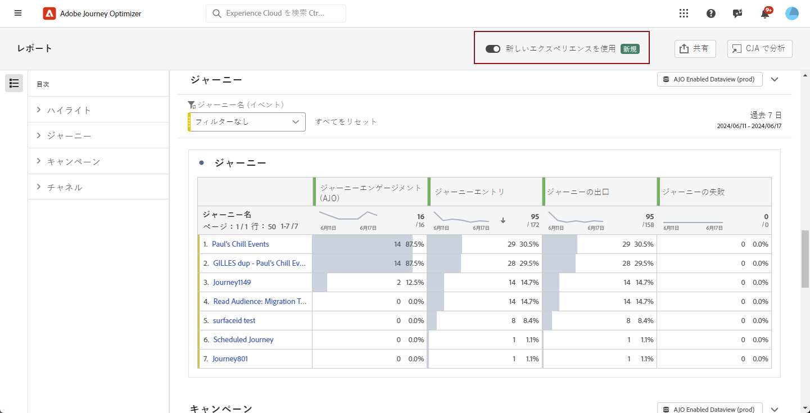

# 新しいレポートインターフェイスの基本を学ぶ {#channel-report-gs-cja}

>[!IMPORTANT]
>
>Adobe Journey Optimizerのレポートは現在、UTC に標準化されています。 レポートタイムゾーンをカスタマイズする機能は、今後のリリースで導入される予定です。

Journey Optimizer レポートでは、Customer Journey Analytics 機能との相互運用性が改善され、両方のプラットフォーム間でレポートが標準化され、データの一貫性と信頼性が向上します。Journey Optimizer と Customer Journey Analytics のシームレスな統合により、パフォーマンス指標をより明確に把握でき、より十分な情報に基づいた意思決定が可能になります。

* ジャーニー、またはジャーニーのコンテキストの配信をターゲットに設定する場合は、**[!UICONTROL ジャーニー]**&#x200B;メニューからジャーニーにアクセスし、「**[!UICONTROL レポートを表示]**」ボタンをクリックします。

  既存のジャーニーのリストから、選択したジャーニーの詳細メニューの「**[!UICONTROL レポート]**」を選択することもできます。[ジャーニーレポートの詳細情報](journey-global-report-cja.md)

  

* キャンペーンをターゲットにする場合は、**[!UICONTROL キャンペーン]**&#x200B;メニューからキャンペーンにアクセスし、「**[!UICONTROL レポート]**」ボタンをクリックします。

  既存のキャンペーンのリストから、選択したキャンペーンの詳細メニューの「**[!UICONTROL レポート]**」を選択することもできます。[キャンペーンレポートの詳細情報](campaign-global-report-cja.md)

  

* 環境内のすべてのキャンペーンとジャーニーの指標をターゲットにする場合は、「**[!UICONTROL ジャーニー管理]**」セクション内の&#x200B;**[!UICONTROL レポート]**&#x200B;メニューに移動して、**概要**&#x200B;レポートにアクセスします。[概要レポートの詳細情報](channel-report-cja.md)

  

>[!NOTE]
>
> Journey Optimizer の従来のレポートに戻すには、「**[!UICONTROL 新しいエクスペリエンスを使用]**」オプションを切り替えるだけです。

## 前提条件 {#prerequisites}

* Customer Journey Analytics を所有して&#x200B;**いない**&#x200B;場合、または所有しているが Customer Journey Analytics 製品プロファイルにアクセス&#x200B;**できない**&#x200B;場合、Journey Optimizer で権限が管理されています。この場合、次が必要です。

   * **[!UICONTROL チャネルレポート]** 権限または関連する役割の表示 [詳細情報](../administration/permissions.md)

* Customer Journey Analyticsを **所有** し、Customer Journey Analyticsの製品プロファイルにアクセスできる場合は、次のものが必要になります。

   * Customer Journey Analyticsの **[!UICONTROL オーディエンスの作成]** 権限および **[!UICONTROL オーディエンスビュー]** 権限。 [詳細情報](https://experienceleague.adobe.com/ja/docs/analytics-platform/using/technotes/access-control)

   * Adobe Journey Optimizerの **[!UICONTROL プロファイルの管理]** 権限。 [詳細情報](../administration/permissions.md)

* Customer Journey Analytics データビューは、次の設定（**Adobe Journey Optimizer のデフォルトデータビューとして設定**）で行う必要があります。[データビューの詳細情報](https://experienceleague.adobe.com/ja/docs/analytics-platform/using/cja-dataviews/create-dataview)

* Journey Optimizer 内で Customer Journey Analytics ダッシュボードにアクセスするには、レポートの&#x200B;**[!UICONTROL 新しいエクスペリエンスを使用]**&#x200B;トグルを有効にするだけです。

  

## チュートリアルビデオ{#video}

次のビデオでは、強化された Journey Optimizer レポートを Customer Journey Analytics で使用する方法について説明します。

>[!VIDEO](https://video.tv.adobe.com/v/3430413)