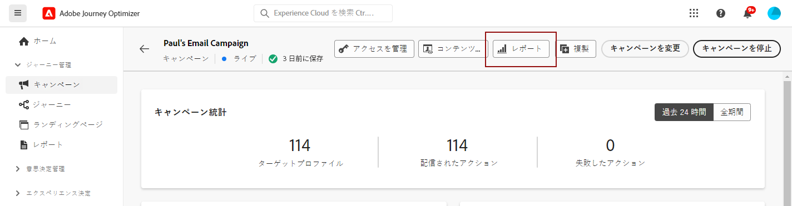

# 更新されたレポートエクスペリエンスの概要 {#channel-report-gs-cja}

>[!IMPORTANT]
>
>Adobe Journey Optimizer のレポートは現在、UTC に標準化されています。レポーティングのタイムゾーンをカスタマイズする機能は、今後のリリースで導入される予定です。

Journey Optimizer レポートでは、Customer Journey Analytics 機能との相互運用性が改善され、両方のプラットフォーム間でレポートが標準化され、データの一貫性と信頼性が向上します。Journey Optimizer と Customer Journey Analytics のシームレスな統合により、パフォーマンス指標をより明確に把握でき、より十分な情報に基づいた意思決定が可能になります。

* ジャーニー、またはジャーニーのコンテキストの配信をターゲットに設定する場合は、**[!UICONTROL ジャーニー]**&#x200B;メニューからジャーニーにアクセスし、「**[!UICONTROL レポートを表示]**」ボタンをクリックします。

  既存のジャーニーのリストから、選択したジャーニーの詳細メニューの「**[!UICONTROL レポート]**」を選択することもできます。[ジャーニーレポートの詳細情報](journey-global-report-cja.md)

  

* キャンペーンをターゲットにする場合は、**[!UICONTROL キャンペーン]** メニューからキャンペーンにアクセスし、「**[!UICONTROL レポート]**」ボタンをクリックしてから、「**[!UICONTROL すべての時間レポートを表示]** をクリックします。

  既存のキャンペーンのリストから、選択したキャンペーンの詳細メニューの「**[!UICONTROL レポート]**」を選択することもできます。[キャンペーンレポートの詳細情報](campaign-global-report-cja.md)

  

* 環境内のすべてのキャンペーンとジャーニーの指標をターゲットにする場合は、「**[!UICONTROL ジャーニー管理]**」セクション内の&#x200B;**[!UICONTROL レポート]**&#x200B;メニューに移動して、**概要**&#x200B;レポートにアクセスします。[概要レポートの詳細情報](channel-report-cja.md)

  

## 前提条件 {#prerequisites}

* Customer Journey Analytics を所有して&#x200B;**いない**&#x200B;場合、または所有しているが Customer Journey Analytics 製品プロファイルにアクセス&#x200B;**できない**&#x200B;場合、Journey Optimizer で権限が管理されています。この場合、次が必要です。

   * **[!UICONTROL チャネルレポートを表示]**&#x200B;権限または関連する役割。[詳細情報](../administration/permissions.md)

* Customer Journey Analytics を&#x200B;**所有**&#x200B;していて、Customer Journey Analytics 製品プロファイルにアクセスできる場合、次が必要です。

   * Customer Journey Analytics の&#x200B;**[!UICONTROL オーディエンスの作成]**&#x200B;権限および&#x200B;**[!UICONTROL オーディエンスの表示]**&#x200B;権限。[詳細情報](https://experienceleague.adobe.com/ja/docs/analytics-platform/using/technotes/access-control)

   * Adobe Journey Optimizer の&#x200B;**[!UICONTROL プロファイルの管理]**&#x200B;権限。[詳細情報](../administration/permissions.md)

* Customer Journey Analytics データビューは、次の設定（**Adobe Journey Optimizer のデフォルトデータビューとして設定**）で行う必要があります。[データビューの詳細情報](https://experienceleague.adobe.com/ja/docs/analytics-platform/using/cja-dataviews/create-dataview)

## チュートリアルビデオ{#video}

次のビデオでは、強化された Journey Optimizer レポートを Customer Journey Analytics で使用する方法について説明します。

>[!VIDEO](https://video.tv.adobe.com/v/3430413)