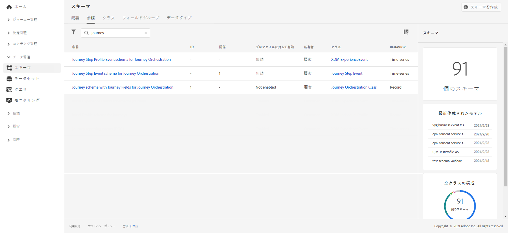
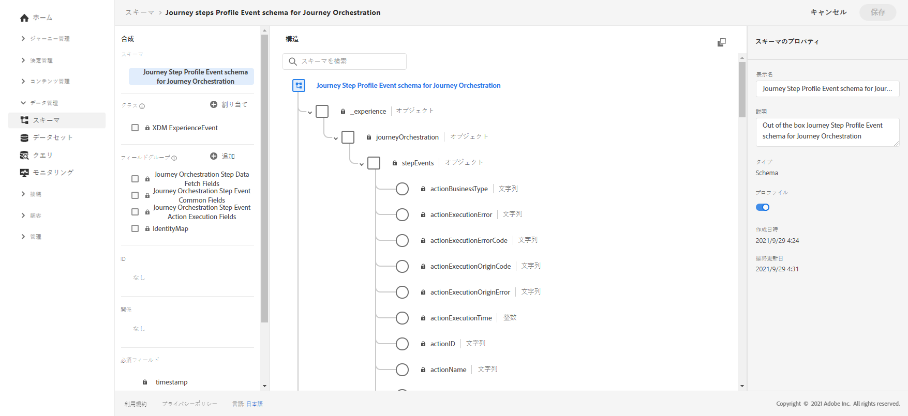
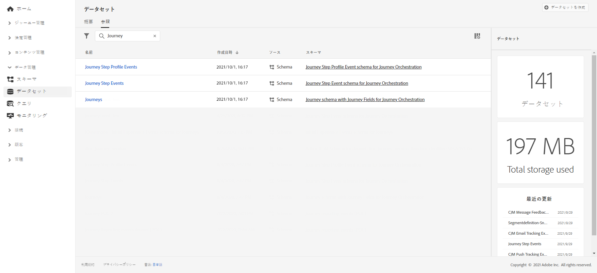

# ジャーニーレポートの作成 {#design-jo-reports}

[!DNL Journey Optimizer] を使用すると、[リアルタイムレポート](live-report.md)やビルトインの[グローバルなレポート機能](global-report.md)に加え、ジャーニーのパフォーマンスデータを Adobe Experience Platform に自動的に送信し、他のデータと組み合わせて分析できるようになります。

>[!NOTE]
>
>この機能は、ジャーニーステップのイベントの場合、すべてのインスタンスにおいてデフォルトで有効になっています。 ジャーニープロファイルステップのイベントの場合は、リクエストに応じて有効化されます。 ステップイベントのプロビジョニング時に作成されたスキーマやデータセットは、変更も更新もできません。デフォルトでは、これらのスキーマとデータセットは読み取り専用モードです。

たとえば、複数の メールを送信するジャーニーを設定したとします。この機能を使用すると、[!DNL Journey Optimizer] のデータをダウンストリームのイベントデータと組み合わせることができます。このようなイベントデータには、発生したコンバージョン数、Web サイトで発生したエンゲージメント、ストアで発生したトランザクション数などがあります。ジャーニー情報を Adobe Experience Platform のデータ（他のデジタルプロパティのデータまたはオフラインプロパティのデータ）と組み合わせて、パフォーマンスをより包括的に把握することができます。

[!DNL Journey Optimizer] は、個人がジャーニーで実行するステップごとに、必要なスキーマとデータセットへのストリームを Adobe Experience Platform に対して自動的に作成します。ステップイベントは、ジャーニーのあるノードから別のノードに移動する個人に対応します。例えば、イベント、条件およびアクションを備えたジャーニーでは、3 つのステップイベントが Adobe Experience Platform に送信されます。

渡される XDM フィールドのリストは多岐にわたります。システムで生成されたコードを含むものもあれば、人間が理解できるわかりやすい名前を持つものもあります。例えば、ジャーニーアクティビティやステップステータスのラベルがあります。アクションがタイムアウトした回数や、エラーで終了した回数などです。

>[!CAUTION]
>
>リアルタイムプロファイルサービスの場合は、データセットを有効にできません。**[!UICONTROL プロファイル]**&#x200B;の切り替えがオフになっていることを確認してください。

ジャーニーは、発生時にストリーミング方式でデータを送信します。このデータは、クエリサービスを使用してクエリできます。Customer Journey Analytics またはその他の BI ツールに接続して、これらのステップに関連するデータを表示できます。

次のスキーマが作成されます。

* [!DNL Journey Orchestration] のジャーニーステッププロファイルイベントスキーマ：ジャーニーで実行されるステップのエクスペリエンスイベントと、個々のジャーニー参加者へのマッピングに使用される ID マップ。
* [!DNL Journey Orchestration] のジャーニーステップイベントスキーマ：ジャーニーメタデータに関連付けられているジャーニーステップイベント。
* [!DNL Journey Orchestration] のジャーニーフィールドを含むジャーニースキーマ：ジャーニーを記述するジャーニーメタデータ。

次のデータセットが渡されます。

* [!DNL Journey Orchestration] のジャーニーステッププロファイルイベントスキーマ
* ジャーニーステップイベント
* ジャーニー

Adobe Experience Platform に渡される XDM フィールドのリストについて詳しくは、以下を参照してください。

* [ステップイベントフィールドの一覧](../reports/sharing-field-list.md)
* [従来のステップイベントフィールド](../reports/sharing-legacy-fields.md)

Adobe Experience Platform に通知されるステップイベントについて詳しくは、この[チュートリアルビデオ](https://experienceleague.adobe.com/docs/journey-orchestration-learn/tutorials/reporting-step-events-to-adobe-experience-platform.html?lang=ja){target=&quot;_blank&quot;}をご覧ください。

## Customer Journey Analytics との統合 {#integration-cja}

Journey Optimizer のステップイベントは、[Adobe Customer Journey Analytics](https://experienceleague.adobe.com/docs/analytics-platform/using/cja-overview/cja-overview.html?lang=ja) の他のデータセットにリンクできます。次に一般的なワークフローを示します。

* Customer Journey Analytics は、「ジャーニーステップイベント」データセットを取り込みます。
* 関連する「Journey Orchestration のジャーニーステップイベントスキーマ」の **profileID** フィールドは、ID フィールドとして定義されています。 Customer Journey Analytics では、このデータセットを、ユーザーベースの識別子と同じ値を持つ他のデータセットにリンクできます。
* Customer Journey Analytics でこのデータセットを使用する場合、クロスチャネルジャーニー分析については、この[ドキュメント](https://experienceleague.adobe.com/docs/analytics-platform/using/cja-usecases/cross-channel.html?lang=ja)を参照してください。

