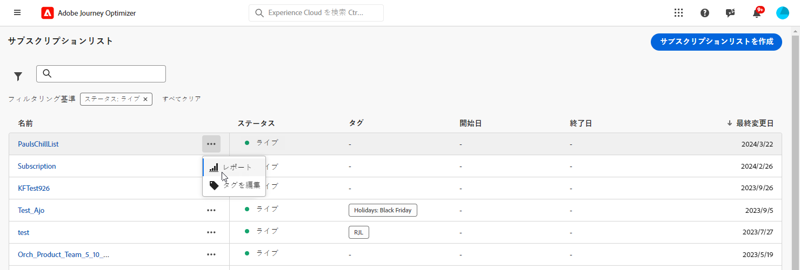
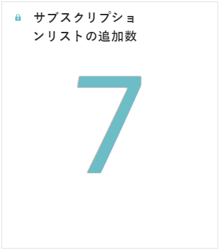
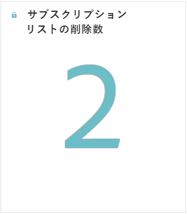
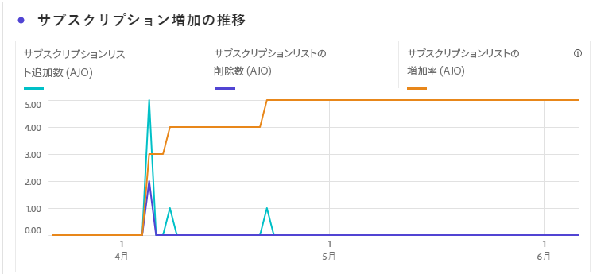
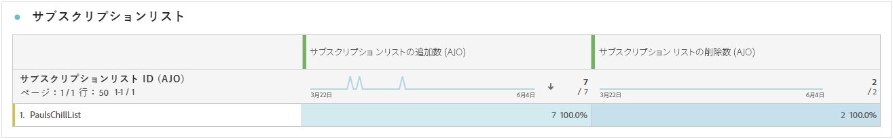
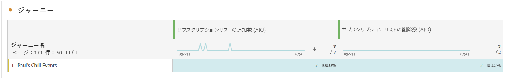
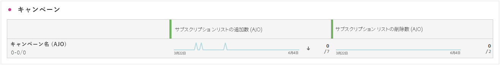
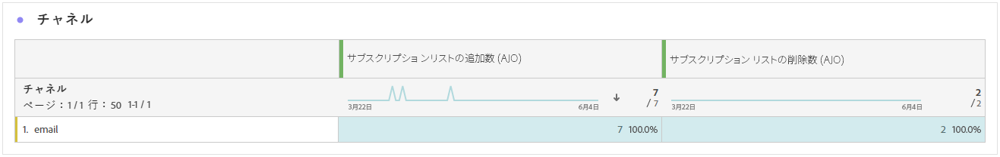

# 購読レポート {#subscription-report-global-cja}

**購読**&#x200B;レポートは、特定のリストに関連付けられたプロファイルの購読と登録解除に関する重要なインサイトを提供し、エンゲージメントとコンバージョンを促進する様々な購読キャンペーンとイニシアチブの効果を理解するのに役立ちます。

レポートにアクセスするには、詳細メニューから選択した購読リストの&#x200B;**[!UICONTROL レポート]**&#x200B;アイコンをクリックします。

Customer Journey Analytics ワークスペースと、データのフィルタリングおよび分析方法について詳しくは、[このページ](https://experienceleague.adobe.com/ja/docs/analytics-platform/using/cja-workspace/home)を参照してください。

## 購読リストの追加

**[!UICONTROL 購読リストの追加]**&#x200B;の KPI では、指定した期間中に取得された購読の合計数の包括的な概要を提供します。この指標には、新規購読者の増加と獲得がハイライト表示され、購読キャンペーンやイニシアチブの効果に関する貴重なインサイトを提供します。

## 購読リストの削除

**[!UICONTROL 購読リストの削除]**&#x200B;の KPI では、指定した期間中に発生した登録解除の合計数の分類を提供します。この指標では、購読者のディスエンゲージメントに関する貴重なインサイトが得られます。

## 購読の増加の推移

**[!UICONTROL 購読の増加の推移]**&#x200B;のグラフでは、指定した期間の購読の進行状況が視覚的に表示され、購読者ベースがどのように進化したかを明確に理解できます。

* **[!UICONTROL 購読リストの追加]**：該当する期間中の購読の合計数。

* **[!UICONTROL 購読リストの削除]**：該当する期間中の登録解除の合計数。

* **[!UICONTROL 購読リストの増加]**：購読者リストが特定の期間に増加している割合。

## サブスクリプションリスト

**[!UICONTROL 購読リスト]**&#x200B;のテーブルでは、特定の購読リストに関連付けられているプロファイルの購読と登録解除に関する重要なインサイトを提供します。この情報は、エンゲージメントとコンバージョンを促進する様々な購読リストの効果を理解するのに役立ちます。

* **[!UICONTROL 購読リストの追加]**：該当する期間中の購読の合計数。

* **[!UICONTROL 購読リストの削除]**：該当する期間中の登録解除の合計数。

## ジャーニー

**[!UICONTROL ジャーニー]**&#x200B;のテーブルでは、広範なビューを提供し、ユーザージャーニーの一部として訪問者の購読の複雑な情報が表示されます。

* **[!UICONTROL 購読リストの追加]**：該当する期間中の購読の合計数。

* **[!UICONTROL 購読リストの削除]**：該当する期間中の登録解除の合計数。

## キャンペーン

**[!UICONTROL キャンペーン]**&#x200B;のテーブルでは、特定のキャンペーンによってトリガーされたプロファイルの購読と登録解除に関する貴重なインサイトを提供します。この包括的なビューにより、キャンペーンの効果を測定し、ランディングページのコンテンツに対するエンゲージメントを効果的に追跡できます。

* **[!UICONTROL 購読リストの追加]**：該当する期間中の購読の合計数。

* **[!UICONTROL 購読リストの削除]**：該当する期間中の登録解除の合計数。

## チャネル

**[!UICONTROL チャネル]**&#x200B;のテーブルでは、各チャネル別に分類されたプロファイルの購読と登録解除の数を表示します。

* **[!UICONTROL 購読リストの追加]**：該当する期間中の購読の合計数。

* **[!UICONTROL 購読リストの削除]**：該当する期間中の登録解除の合計数。
