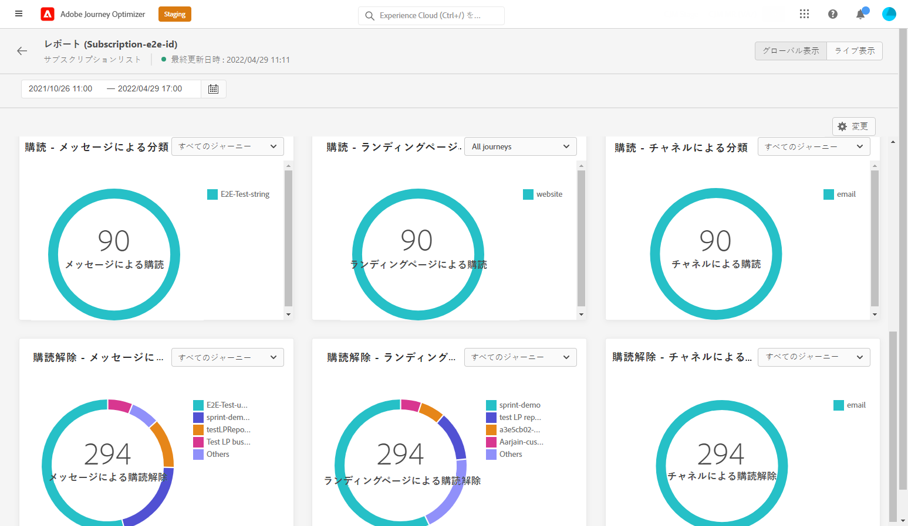

# 購読グローバルレポート {#subscription-report-global}

>[!CONTEXTUALHELP]
>id="ajo_subscription_global_report"
>title="購読グローバルレポート"
>abstract="購読グローバルレポートでは、選択した期間における購読者のアクティビティを測定および視覚化できます。レポートは、購読と購読解除の詳細を示す様々なウィジェットに分割されています。各レポートダッシュボードは、ウィジェットのサイズ変更や削除を行うことで変更できます。"

>[!AVAILABILITY]
>
>現在のレポートエクスペリエンスは、10 月リリースの時点で廃止されます。この日以降、新しいレポートエクスペリエンスが標準となります。スムーズに移行できるように、新機能を理解しておくことをお勧めします。[Journey Optimizer の新しいレポートインターフェイスの基本を学ぶ。](report-gs-cja.md)

「全期間」タブからアクセスできるグローバルレポートには、少なくとも 2 時間前に発生したイベントと、選択した期間のイベントが表示されます。これに対し、ライブレポートには、過去 24 時間以内に発生したイベントが焦点となり、イベント発生から最小 2 分の時間間隔で表示されます。

レポートにアクセスするには、選択したサブスクリプションリストの「**[!UICONTROL レポート]**」アイコンをクリックします。

購読&#x200B;**[!UICONTROL グローバルレポート]**&#x200B;は、購読と購読解除の詳細を示す様々なウィジェットに分かれています。必要に応じて、各ウィジェットのサイズを変更したり削除したりできます。この機能について詳しくは、この[節](global-report.md)を参照してください。

**[!UICONTROL 購読パフォーマンス]** KPI と&#x200B;**[!UICONTROL ジャーニー別の購読]**/**[!UICONTROL ジャーニー別の購読解除]**&#x200B;テーブルには、ランディングページに対する訪問者のエンゲージメントに関する主な情報の詳細が示されます。テーブルと KPI には、次のように、ランディングページに関連して使用できるデータが含まれています。

* **[!UICONTROL 購読]**：該当する期間中の購読の合計数。

* **[!UICONTROL 購読解除]**：該当する期間中の購読解除の合計数。

**[!UICONTROL 購読パフォーマンス]**&#x200B;グラフには、該当する期間中の購読の推移が表示されます。

**購読 - 分類**&#x200B;および&#x200B;**購読解除 - 分類**&#x200B;は、メッセージ、ランディングページおよびチャネルに応じて、選択した期間に購読または購読解除したユーザーの合計数を表します。
